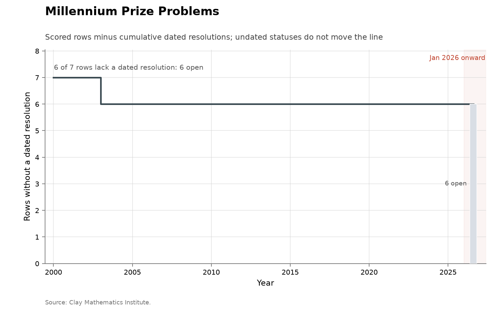
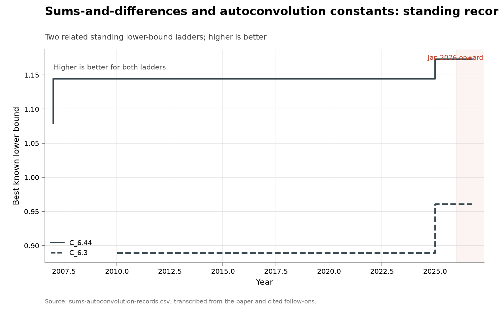
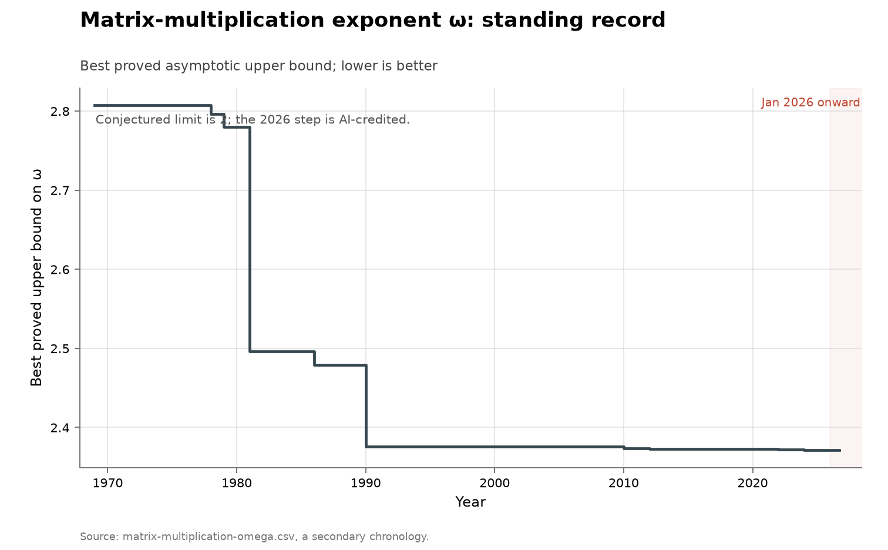

# Cumulative progress

Every series in the collection, redrawn in one format: a single step function
of progress to date. Rising lines are cumulative counts of events —
disclosures, resolutions, record steps, submissions. Where a series has a known
denominator, the line instead counts what remains and declines toward zero:
open problems on a fixed list, unproven instances in a fixed cohort. Where a
series tracks a standing record, the staircase is the record's own value, and
the panel says which direction is better.

The format trades information for comparability. The [README](README.md) index
keeps each series' native view — attribution splits, severity cuts, partial-year
markers; these panels are one slate line each, so that a difference between two
of them is a difference in the data rather than in how it was plotted. Each
chart is drawn by its own folder's `figure.py` from the same vendored CSVs, and
the tables below are regenerated by `make index` alongside the README's.

<!-- BEGIN GENERATED: cumulative-index -->
### Vulnerabilities

| Series | Chart |
|---|---|
| <b><a href="problems/cyber-curl/">curl vulnerability disclosures</a></b> <b>Metric:</b> vulnerabilities disclosed per quarter, split by finder credit <b>Coverage:</b> 2000–2026, partial through 2026-06-24 <b>Acceleration?</b> 📈 accelerating <a href="problems/cyber-curl/">Discussion</a> · <a href="problems/cyber-curl/curl-vulnerabilities.csv">Data</a> · <a href="https://curl.se/docs/vuln.json">Source</a> · <a href="https://tecunningham.github.io/ai-discovery-data/cyber-curl.html">Interactive</a> |  |
| <b><a href="problems/cyber-firefox/">Firefox vulnerability disclosures</a></b> <b>Metric:</b> distinct CVEs per quarter, split by whether the reporter credit names an AI method, an AI-security employer, a fuzzer, or none of these; advisory–CVE mentions retained as a sensitivity count <b>Coverage:</b> 2016–2026, partial through the latest advisory on 4 August 2026 <b>Acceleration?</b> 📈 accelerating — though distinct CVEs rose 44% from 2021 to 2025 with essentially no AI credit <a href="problems/cyber-firefox/">Discussion</a> · <a href="problems/cyber-firefox/firefox-cves.csv">Data</a> · <a href="https://github.com/mozilla/foundation-security-advisories">Source</a> · <a href="https://tecunningham.github.io/ai-discovery-data/cyber-firefox.html">Interactive</a> |  |
| <b><a href="problems/cyber-kev-exploited/">All software: vulnerabilities known exploited</a></b> <b>Metric:</b> CVEs added per quarter to CISA's Known Exploited Vulnerabilities catalogue <b>Coverage:</b> 2021–2026, from the catalogue's November 2021 launch, partial through 2026-08-10 <b>Acceleration?</b> ➡️ no acceleration — additions annualize to about +19% in 2026 against +64% for disclosures <a href="problems/cyber-kev-exploited/">Discussion</a> · <a href="problems/cyber-kev-exploited/kev-by-quarter.csv">Data</a> · <a href="https://www.cisa.gov/known-exploited-vulnerabilities-catalog">Source</a> · <a href="https://tecunningham.github.io/ai-discovery-data/cyber-kev-exploited.html">Interactive</a> |  |
| <b><a href="problems/cyber-microsoft/">Microsoft security-update CVEs</a></b> <b>Metric:</b> CVEs issued by Microsoft's own CNA per month, dated by first publication in the Security Update Guide, split by whether an acknowledgment credit names an AI method, an AI-security employer, a fuzzer, or none of these <b>Coverage:</b> 2016–2026, partial through 2026-07-31; no February or March 2016 document exists upstream, so the first year is ten months <b>Acceleration?</b> 📈 accelerating — the 2026 part year annualizes to about 2.1 times 2025, and at most 1.5% of it carries any AI marker <a href="problems/cyber-microsoft/">Discussion</a> · <a href="problems/cyber-microsoft/msrc-cves.csv">Data</a> · <a href="https://api.msrc.microsoft.com/cvrf/v3.0/updates">Source</a> · <a href="https://tecunningham.github.io/ai-discovery-data/cyber-microsoft.html">Interactive</a> |  |
| <b><a href="problems/cyber-nvd-disclosed/">All software: vulnerabilities disclosed</a></b> <b>Metric:</b> CVEs published per quarter in the US National Vulnerability Database <b>Coverage:</b> 2016–2026, partial through 2026-08-10 <b>Acceleration?</b> 📈 accelerating — but growth was already +32% and +23% in 2024 and 2025, and no disclosure here is attributed to anyone <a href="problems/cyber-nvd-disclosed/">Discussion</a> · <a href="problems/cyber-nvd-disclosed/nvd-by-quarter.csv">Data</a> · <a href="https://services.nvd.nist.gov/rest/json/cves/2.0">Source</a> · <a href="https://tecunningham.github.io/ai-discovery-data/cyber-nvd-disclosed.html">Interactive</a> |  |
| <b><a href="problems/cyber-openssl/">OpenSSL vulnerability disclosures</a></b> <b>Metric:</b> vulnerabilities disclosed per quarter, split by finder provenance <b>Coverage:</b> 2002–2026, partial through 5 August 2026 <b>Acceleration?</b> 📈 accelerating — a record 2026 surge, with provenance and release-batching caveats <a href="problems/cyber-openssl/">Discussion</a> · <a href="problems/cyber-openssl/openssl-cves.csv">Data</a> · <a href="https://github.com/openssl/release-metadata/tree/main/secjson">Source</a> · <a href="https://tecunningham.github.io/ai-discovery-data/cyber-openssl.html">Interactive</a> |  |
| <b><a href="problems/cyber-oss-fuzz/">OSS-Fuzz vulnerability discoveries</a></b> <b>Metric:</b> vulnerability records published per quarter by an automated fuzzing programme <b>Coverage:</b> 2020–2026, partial through 10 August 2026 <b>Acceleration?</b> 📉 declining <a href="problems/cyber-oss-fuzz/">Discussion</a> · <a href="problems/cyber-oss-fuzz/ossfuzz-by-quarter.csv">Data</a> · <a href="https://osv-vulnerabilities.storage.googleapis.com/OSS-Fuzz/all.zip">Source</a> · <a href="https://tecunningham.github.io/ai-discovery-data/cyber-oss-fuzz.html">Interactive</a> |  |
| <b><a href="problems/cyber-osv-cves/">Open-source CVEs represented in OSV</a></b> <b>Metric:</b> distinct CVE IDs linked to at least one active affected-package record in OSV, per quarter by earliest OSV publication date <b>Coverage:</b> 2016–2026, partial through 2026-08-10 <b>Acceleration?</b> 📈 accelerating — 2026 annualizes to about 2.3 times 2025, though source growth and disclosure processes can also bend this aggregate <a href="problems/cyber-osv-cves/">Discussion</a> · <a href="problems/cyber-osv-cves/osv-cves-by-quarter.csv">Data</a> · <a href="https://storage.googleapis.com/osv-vulnerabilities/all.zip">Source</a> · <a href="https://tecunningham.github.io/ai-discovery-data/cyber-osv-cves.html">Interactive</a> |  |

### Open problems

| Series | Chart |
|---|---|
| <b><a href="problems/math-erdos/">Erdős problems catalogue</a></b> <b>Metric:</b> problems catalogued, statuses marked solved, and statements formalized in Lean, at monthly site snapshots; plus an imputed solution year per solved problem <b>Coverage:</b> 2025-08-31 to 2026-08-10, thirteen snapshots; imputed solution years 1940–2026 <b>Acceleration?</b> ❓ inconclusive — the imputed years show a real 2024–2026 surge, but the catalogue was assembled while it happened, and it selects for exactly these problems <a href="problems/math-erdos/">Discussion</a> · <a href="problems/math-erdos/erdos-database-history.csv">Data</a> · <a href="https://www.erdosproblems.com/">Source</a> · <a href="https://tecunningham.github.io/ai-discovery-data/math-erdos.html">Interactive</a> |  |
| <b><a href="problems/math-hilbert/">Hilbert's problems</a></b> <b>Metric:</b> dated resolutions per year across 28 scored rows <b>Coverage:</b> 1900–2026, with dated resolutions running 1900–1998 <b>Acceleration?</b> ➡️ no acceleration <a href="problems/math-hilbert/">Discussion</a> · <a href="problems/math-hilbert/hilbert-problems.csv">Data</a> · <a href="https://en.wikipedia.org/wiki/Hilbert%27s_problems">Source</a> · <a href="https://tecunningham.github.io/ai-discovery-data/math-hilbert.html">Interactive</a> |  |
| <b><a href="problems/math-landau/">Landau's problems</a></b> <b>Metric:</b> dated resolutions per year across 4 scored rows <b>Coverage:</b> 1912–2026, with no dated resolution anywhere in that span <b>Acceleration?</b> ➡️ no acceleration <a href="problems/math-landau/">Discussion</a> · <a href="problems/math-landau/landau-problems.csv">Data</a> · <a href="https://en.wikipedia.org/wiki/Landau%27s_problems">Source</a> · <a href="https://tecunningham.github.io/ai-discovery-data/math-landau.html">Interactive</a> |  |
| <b><a href="problems/math-millennium/">Millennium Prize Problems</a></b> <b>Metric:</b> dated resolutions per year across 7 scored rows <b>Coverage:</b> 2000–2026, with one dated resolution in 2003 <b>Acceleration?</b> ➡️ no acceleration <a href="problems/math-millennium/">Discussion</a> · <a href="problems/math-millennium/millennium-problems.csv">Data</a> · <a href="https://www.claymath.org/millennium-problems/">Source</a> · <a href="https://tecunningham.github.io/ai-discovery-data/math-millennium.html">Interactive</a> |  |
| <b><a href="problems/math-smale/">Smale's problems</a></b> <b>Metric:</b> dated resolutions per year across 19 scored rows <b>Coverage:</b> 1998–2026, with dated resolutions running 2002–2026 <b>Acceleration?</b> ❓ inconclusive — one AI- attributed fall in 2026, and a single event cannot set a slope <a href="problems/math-smale/">Discussion</a> · <a href="problems/math-smale/smale-problems.csv">Data</a> · <a href="https://en.wikipedia.org/wiki/Smale%27s_problems">Source</a> · <a href="https://tecunningham.github.io/ai-discovery-data/math-smale.html">Interactive</a> |  |
| <b><a href="problems/math-thurston/">Thurston's 24 questions</a></b> <b>Metric:</b> dated resolutions per year across 24 scored rows <b>Coverage:</b> 1982–2026, with dated resolutions running 1993–2013 <b>Acceleration?</b> ➡️ no acceleration <a href="problems/math-thurston/">Discussion</a> · <a href="problems/math-thurston/thurston-questions.csv">Data</a> · <a href="https://en.wikipedia.org/wiki/Thurston%27s_24_questions">Source</a> · <a href="https://tecunningham.github.io/ai-discovery-data/math-thurston.html">Interactive</a> |  |
| <b><a href="problems/math-topp/">The Open Problems Project</a></b> <b>Metric:</b> dated resolutions per year across 78 scored rows <b>Coverage:</b> 2001–2026, with dated resolutions running 2000–2024 <b>Acceleration?</b> ➡️ no acceleration <a href="problems/math-topp/">Discussion</a> · <a href="problems/math-topp/topp-problems.csv">Data</a> · <a href="https://topp.openproblem.net/">Source</a> · <a href="https://tecunningham.github.io/ai-discovery-data/math-topp.html">Interactive</a> |  |

### Mathematical bounds and records

| Series | Chart |
|---|---|
| <b><a href="problems/math-alphaevolve-inventory/">Inventory of the AlphaEvolve problem set</a></b> <b>Metric:</b> per problem, whether it has a live numeric record and how many dated prior works the paper cites <b>Coverage:</b> the 65 problems the paper numbers 6.1 to 6.65; cited works span 1852–2025; built 2026-07-26 <b>Acceleration?</b> ⚪ baseline <a href="problems/math-alphaevolve-inventory/">Discussion</a> · <a href="problems/math-alphaevolve-inventory/alphaevolve-inventory.csv">Data</a> · <a href="https://arxiv.org/abs/2511.02864">Source</a> · <a href="https://tecunningham.github.io/ai-discovery-data/math-alphaevolve-inventory.html">Interactive</a> | <em>no cumulative view: not a time series</em> |
| <b><a href="problems/math-alphaevolve-records/">Finite construction records around AlphaEvolve</a></b> <b>Metric:</b> cumulative record steps in five groups of finite construction and packing problems <b>Coverage:</b> 1949–2026, 22 record steps across the five groups <b>Acceleration?</b> ❓ inconclusive — the 2025 cluster is real, but these five groups were selected because an AI system worked on them <a href="problems/math-alphaevolve-records/">Discussion</a> · <a href="problems/math-alphaevolve-records/alphaevolve-records.csv">Data</a> · <a href="https://github.com/google-deepmind/alphaevolve_repository_of_problems">Source</a> · <a href="https://tecunningham.github.io/ai-discovery-data/math-alphaevolve-records.html">Interactive</a> |  |
| <b><a href="problems/math-antedb/">ANTEDB analytic-number-theory exponents</a></b> <b>Metric:</b> cumulative slice-level record changes across 58 exponent slices in the three families $\mu$, $A$ and $\beta$ <b>Coverage:</b> 1920–2024 in the underlying literature; extracted from the database as of 2026-07-26 <b>Acceleration?</b> ➡️ no acceleration <a href="problems/math-antedb/">Discussion</a> · <a href="problems/math-antedb/antedb-sweep.csv">Data</a> · <a href="https://github.com/teorth/expdb">Source</a> · <a href="https://tecunningham.github.io/ai-discovery-data/math-antedb.html">Interactive</a> |  |
| <b><a href="problems/math-sphere-packing/">Sphere-packing lower-bound ladder</a></b> <b>Metric:</b> cumulative improvements to the asymptotic lower bound on sphere-packing density in high dimension <b>Coverage:</b> 1905–2025, eight recorded steps <b>Acceleration?</b> 📈 accelerating — and every step is human, which is what this series is here to show <a href="problems/math-sphere-packing/">Discussion</a> · <a href="problems/math-sphere-packing/sphere-packing-lower-bound-records.csv">Data</a> · <a href="https://arxiv.org/abs/2606.13313">Source</a> · <a href="https://tecunningham.github.io/ai-discovery-data/math-sphere-packing.html">Interactive</a> |  |
| <b><a href="problems/math-sums-autoconvolution/">Sums-and-differences and autoconvolution constants</a></b> <b>Metric:</b> best known lower bounds on two additive-combinatorics constants, $C_{6.44}$ and $C_{6.3}$ in the AlphaEvolve numbering <b>Coverage:</b> 2007–2025, twelve record steps across the two ladders <b>Acceleration?</b> ❓ inconclusive — AI steps are visible in 2025, and a human retook one of the two ladders within months <a href="problems/math-sums-autoconvolution/">Discussion</a> · <a href="problems/math-sums-autoconvolution/sums-autoconvolution-records.csv">Data</a> · <a href="https://arxiv.org/abs/2511.02864">Source</a> · <a href="https://tecunningham.github.io/ai-discovery-data/math-sums-autoconvolution.html">Interactive</a> |  |
| <b><a href="problems/matrix-omega/">Matrix-multiplication exponent ω</a></b> <b>Metric:</b> best proved upper bound on the asymptotic exponent ω of n×n matrix multiplication; lower is better <b>Coverage:</b> 1969 to 2024, fifteen recorded steps <b>Acceleration?</b> 📉 declining — the asymptotic record is slowing, and no step in it is AI- attributed <a href="problems/matrix-omega/">Discussion</a> · <a href="problems/matrix-omega/matrix-multiplication-omega.csv">Data</a> · <a href="https://en.wikipedia.org/wiki/Matrix_multiplication_algorithm#Sub-cubic_algorithms">Source</a> · <a href="https://tecunningham.github.io/ai-discovery-data/matrix-omega.html">Interactive</a> |  |

### Algorithms

| Series | Chart |
|---|---|
| <b><a href="problems/algorithms-cifar10/">CIFAR-10 speedrun</a></b> <b>Metric:</b> seconds to 94% test accuracy on CIFAR-10 on a single A100 <b>Coverage:</b> 2018–2026; the plotted series starts 2022-12-29 and ends with a claim of 2026-07-09 <b>Acceleration?</b> 📉 declining — the yearly improvement factor falls from 2.9 to a claimed 1.09 <a href="problems/algorithms-cifar10/">Discussion</a> · <a href="problems/algorithms-cifar10/cifar-speedrun-records.csv">Data</a> · <a href="https://github.com/KellerJordan/cifar10-airbench">Source</a> · <a href="https://tecunningham.github.io/ai-discovery-data/algorithms-cifar10.html">Interactive</a> |  |
| <b><a href="problems/algorithms-cvrplib/">CVRPLIB X-instance record frontier</a></b> <b>Metric:</b> better best-known objectives and later optimality proofs recorded for a fixed cohort of 100 CVRP X instances <b>Coverage:</b> 2015–2026, 289 event rows posted through 2026-07-04 <b>Acceleration?</b> 📉 declining — objective improvements are concentrated in 2015–2021; later activity is mostly proof <a href="problems/algorithms-cvrplib/">Discussion</a> · <a href="problems/algorithms-cvrplib/cvrplib-x-frontier.csv">Data</a> · <a href="https://galgos.inf.puc-rio.br/cvrplib/index.php/en/updates/">Source</a> · <a href="https://tecunningham.github.io/ai-discovery-data/algorithms-cvrplib.html">Interactive</a> |  |
| <b><a href="problems/algorithms-ecdsa-circuit/">ECDSA.fail secp256k1 point-addition circuit</a></b> <b>Metric:</b> best validated score (average executed Toffoli count × peak qubit width) for a reversible secp256k1 point-addition circuit; lower is better <b>Coverage:</b> 2026-05-30 to 2026-08-10, 433 accepted records <b>Acceleration?</b> ⏳ too early — a single ten-week optimization sprint with no pre-agent-era baseline to compare against <a href="problems/algorithms-ecdsa-circuit/">Discussion</a> · <a href="problems/algorithms-ecdsa-circuit/ecdsa-circuit-records.csv">Data</a> · <a href="https://ecdsa.fail/">Source</a> · <a href="https://tecunningham.github.io/ai-discovery-data/algorithms-ecdsa-circuit.html">Interactive</a> |  |
| <b><a href="problems/algorithms-enwik9/">Hutter Prize compression: enwik9</a></b> <b>Metric:</b> total size in bytes of decompressor plus archive for a fixed 1 GB text corpus, under a CPU-time and memory cap <b>Coverage:</b> 2019 baseline to 2026; the prize moved to enwik9 on 2020-02-21, and the uncapped comparator runs 2019 to 2023 <b>Acceleration?</b> ➡️ no acceleration <a href="problems/algorithms-enwik9/">Discussion</a> · <a href="problems/algorithms-enwik9/enwik9-records.csv">Data</a> · <a href="http://prize.hutter1.net/">Source</a> · <a href="https://tecunningham.github.io/ai-discovery-data/algorithms-enwik9.html">Interactive</a> |  |
| <b><a href="problems/algorithms-gurobi/">Gurobi mixed-integer programming speed</a></b> <b>Metric:</b> cumulative vendor-reported MILP speedup across releases, every version rerun on one machine <b>Coverage:</b> releases 10 through 13, announced 2022-11-14 to 2025-11-18, baselined at version 9.5 <b>Acceleration?</b> ➡️ no acceleration <a href="problems/algorithms-gurobi/">Discussion</a> · <a href="problems/algorithms-gurobi/gurobi-milp-speedups.csv">Data</a> · <a href="https://www.gurobi.com/misc/lp/all/unmatched-performance">Source</a> · <a href="https://tecunningham.github.io/ai-discovery-data/algorithms-gurobi.html">Interactive</a> |  |
| <b><a href="problems/algorithms-miplib/">MIPLIB 2017 solution frontier</a></b> <b>Metric:</b> better feasible incumbents, first feasible solutions and optimality updates announced in MIPLIB 2017 solufile releases <b>Coverage:</b> 2019-08-26 through 2026-01-26, 28 releases with explicit solution counts <b>Acceleration?</b> ➡️ no acceleration — dense but batch-driven, with no sustained post-2020 rise <a href="problems/algorithms-miplib/">Discussion</a> · <a href="problems/algorithms-miplib/miplib-solution-releases.csv">Data</a> · <a href="https://miplib.zib.de/news.html">Source</a> · <a href="https://tecunningham.github.io/ai-discovery-data/algorithms-miplib.html">Interactive</a> |  |
| <b><a href="problems/algorithms-nanogpt/">modded-nanogpt training speedrun</a></b> <b>Metric:</b> minutes of training to a fixed target validation loss, per accepted record <b>Coverage:</b> 2024-05-28 to 2026-07-17, all 89 records listed in the repository README <b>Acceleration?</b> ➡️ no acceleration <a href="problems/algorithms-nanogpt/">Discussion</a> · <a href="problems/algorithms-nanogpt/nanogpt-records.csv">Data</a> · <a href="https://github.com/KellerJordan/modded-nanogpt">Source</a> · <a href="https://tecunningham.github.io/ai-discovery-data/algorithms-nanogpt.html">Interactive</a> |  |
| <b><a href="problems/algorithms-stockfish/">Stockfish development builds on fixed hardware</a></b> <b>Metric:</b> Elo relative to Stockfish 15, from 20,000 games per build on one fixed machine and time control <b>Coverage:</b> 2013-04-30 to 2026-07-26, 2,542 tested development builds <b>Acceleration?</b> ➡️ no acceleration <a href="problems/algorithms-stockfish/">Discussion</a> · <a href="problems/algorithms-stockfish/stockfish-ncm-elo.csv">Data</a> · <a href="https://nextchessmove.com/dev-builds">Source</a> · <a href="https://tecunningham.github.io/ai-discovery-data/algorithms-stockfish.html">Interactive</a> |  |

### Outside the three domains

| Series | Chart |
|---|---|
| <b><a href="problems/integer-factorization/">Integer factorization records</a></b> <b>Metric:</b> cryptanalysis; decimal digits in the largest hard semiprime factored, as a running maximum <b>Coverage:</b> 1991-04 to 2020-02, confirmed unmoved as of 2026-08-10 <b>Acceleration?</b> ➡️ no acceleration — no record since February 2020, and the fourfold slowdown before that predates AI entirely <a href="problems/integer-factorization/">Discussion</a> · <a href="problems/integer-factorization/factoring-records.csv">Data</a> · <a href="https://en.wikipedia.org/wiki/RSA_numbers">Source</a> · <a href="https://tecunningham.github.io/ai-discovery-data/integer-factorization.html">Interactive</a> |  |
| <b><a href="problems/output-arxiv/">arXiv submissions</a></b> <b>Metric:</b> research output; preprints submitted to arXiv per month <b>Coverage:</b> 1991-07 to 2026-08, monthly, the last month partial <b>Acceleration?</b> 📈 accelerating — on volume, which is not discovery <a href="problems/output-arxiv/">Discussion</a> · <a href="problems/output-arxiv/arxiv-monthly.csv">Data</a> · <a href="https://arxiv.org/stats/monthly_submissions">Source</a> · <a href="https://tecunningham.github.io/ai-discovery-data/output-arxiv.html">Interactive</a> |  |
| <b><a href="problems/output-crossref/">DOI records deposited with Crossref</a></b> <b>Metric:</b> formal publishing volume; DOI records deposited with Crossref per year, by created date <b>Coverage:</b> 2010 to 2026, annual, the last year partial <b>Acceleration?</b> ➡️ no acceleration <a href="problems/output-crossref/">Discussion</a> · <a href="problems/output-crossref/crossref-dois-by-year.csv">Data</a> · <a href="https://api.crossref.org/works">Source</a> · <a href="https://tecunningham.github.io/ai-discovery-data/output-crossref.html">Interactive</a> |  |
| <b><a href="problems/output-github-pushes/">Git pushes to GitHub</a></b> <b>Metric:</b> code output; git pushes to GitHub per quarter, summed over economies <b>Coverage:</b> 2020-Q1 to 2026-Q1, quarterly <b>Acceleration?</b> 📈 accelerating — on volume, which is not discovery <a href="problems/output-github-pushes/">Discussion</a> · <a href="problems/output-github-pushes/github-innovationgraph-global.csv">Data</a> · <a href="https://github.com/github/innovationgraph">Source</a> · <a href="https://tecunningham.github.io/ai-discovery-data/output-github-pushes.html">Interactive</a> |  |
<!-- END GENERATED: cumulative-index -->
