# ai-discovery-data

This repository vendors the data, figures, and documentation behind [LLMs' Contribution to Discovery](https://tecunningham.github.io/posts/2026-08-08-llm-contribution-to-discoveries.html).
Each chart links to public sources and is rebuildable; inclusion requires a
consistent rule and a usable time axis, not attribution of each event to AI.

## Series

<!-- BEGIN GENERATED: series-index -->
### Vulnerabilities

| Series | Chart |
|---|---|
| <b><a href="problems/cyber-curl/">curl vulnerability disclosures</a></b><br><b>Metric:</b> vulnerabilities disclosed per year,<br>split by finder credit<br><b>Coverage:</b> 2000–2026, partial through<br>2026-06-24<br><b>Acceleration?</b> 📈 accelerating | <a href="problems/cyber-curl/">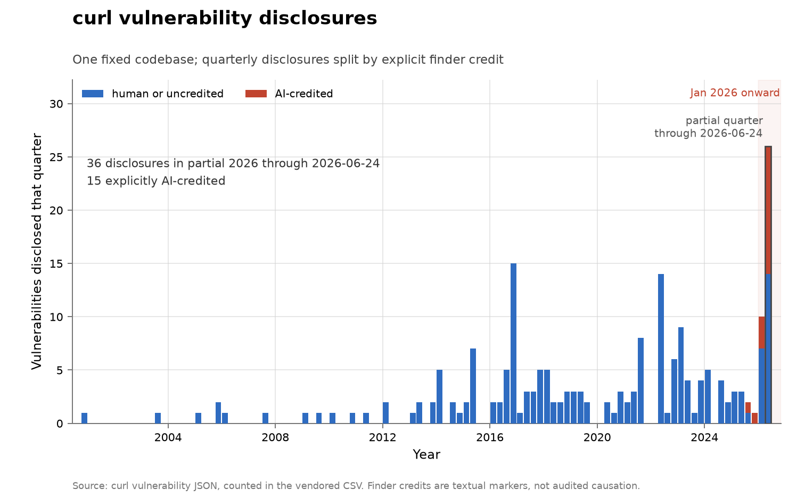</a> |
| <b><a href="problems/cyber-firefox/">Firefox vulnerability disclosures</a></b><br><b>Metric:</b> advisory–CVE mentions per year, split<br>by AI, fuzzer, or other reporter credit;<br>unique CVE IDs retained as a sensitivity count<br><b>Coverage:</b> 2016–2026, partial through the<br>latest advisory on 4 August 2026<br><b>Acceleration?</b> 📈 accelerating — though<br>disclosures roughly doubled from 2021 to 2025<br>with essentially no AI credit | <a href="problems/cyber-firefox/">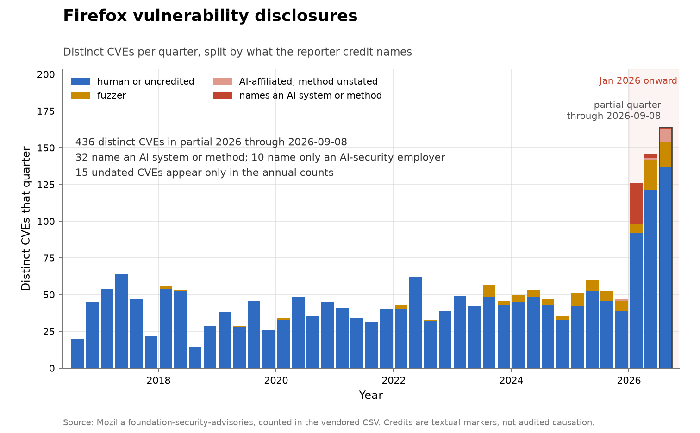</a> |
| <b><a href="problems/cyber-kev-exploited/">All software: vulnerabilities known exploited</a></b><br><b>Metric:</b> CVEs added per year to CISA's Known<br>Exploited Vulnerabilities catalogue<br><b>Coverage:</b> 2021–2026, from the catalogue's<br>November 2021 launch, partial through<br>2026-08-10<br><b>Acceleration?</b> ➡️ no acceleration — additions<br>annualize to about +20% in 2026 against +64%<br>for disclosures | <a href="problems/cyber-kev-exploited/">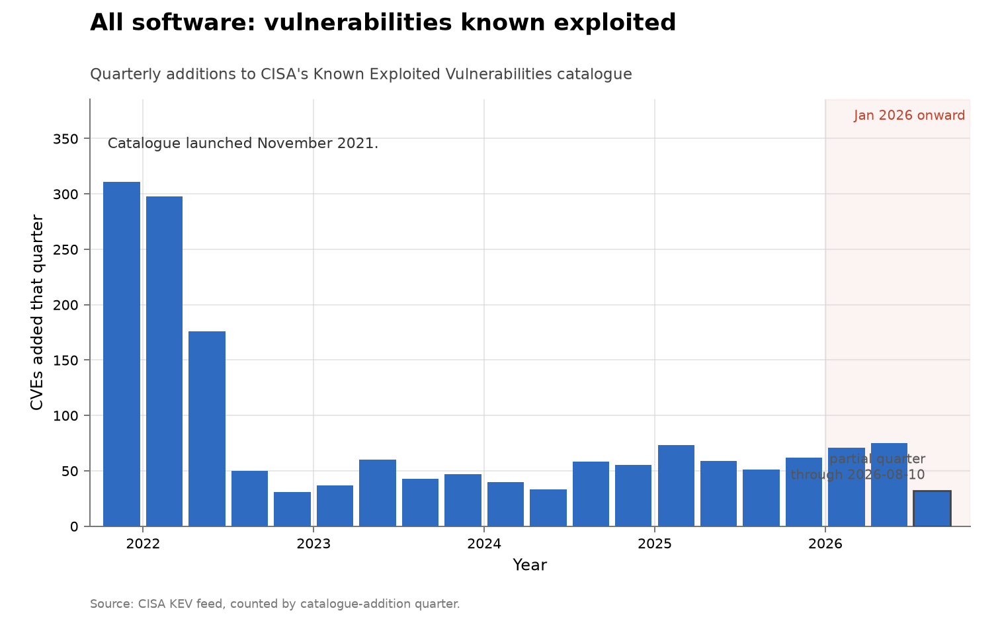</a> |
| <b><a href="problems/cyber-nvd-disclosed/">All software: vulnerabilities disclosed</a></b><br><b>Metric:</b> CVEs published per year in the US<br>National Vulnerability Database<br><b>Coverage:</b> 2016–2026, partial through<br>2026-08-10<br><b>Acceleration?</b> 📈 accelerating — but growth was<br>already +32% and +23% in 2024 and 2025, and no<br>disclosure here is attributed to anyone | <a href="problems/cyber-nvd-disclosed/">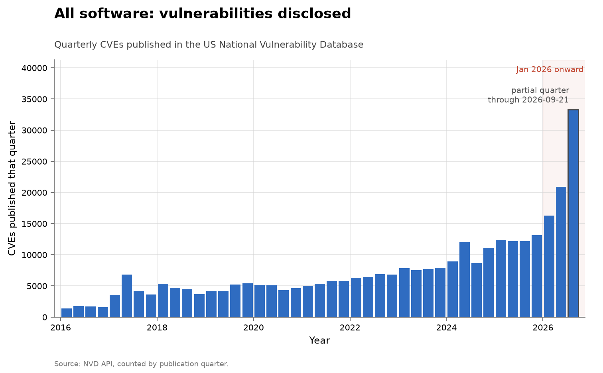</a> |
| <b><a href="problems/cyber-openssl/">OpenSSL vulnerability disclosures</a></b><br><b>Metric:</b> vulnerabilities disclosed per year,<br>split by finder credit<br><b>Coverage:</b> 2002–2026, partial through 5 August<br>2026<br><b>Acceleration?</b> 📈 accelerating — but the same<br>shape appeared in 2015–2016 from a purely<br>human cause | <a href="problems/cyber-openssl/">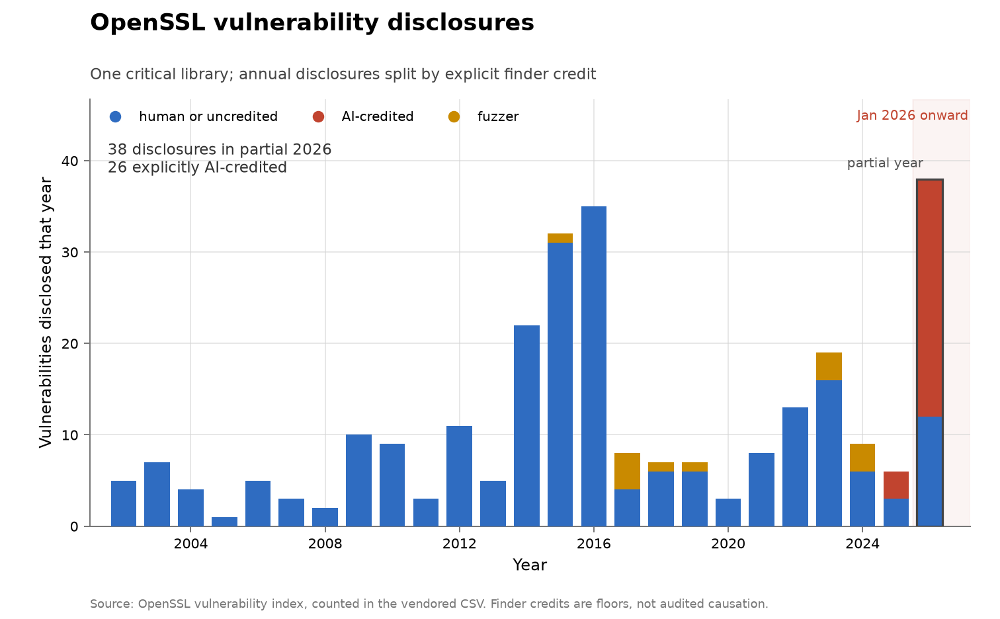</a> |
| <b><a href="problems/cyber-oss-fuzz/">OSS-Fuzz vulnerability discoveries</a></b><br><b>Metric:</b> vulnerability records published per<br>year by an automated fuzzing programme<br><b>Coverage:</b> 2020–2026, partial through 10 August<br>2026<br><b>Acceleration?</b> 📉 declining | <a href="problems/cyber-oss-fuzz/">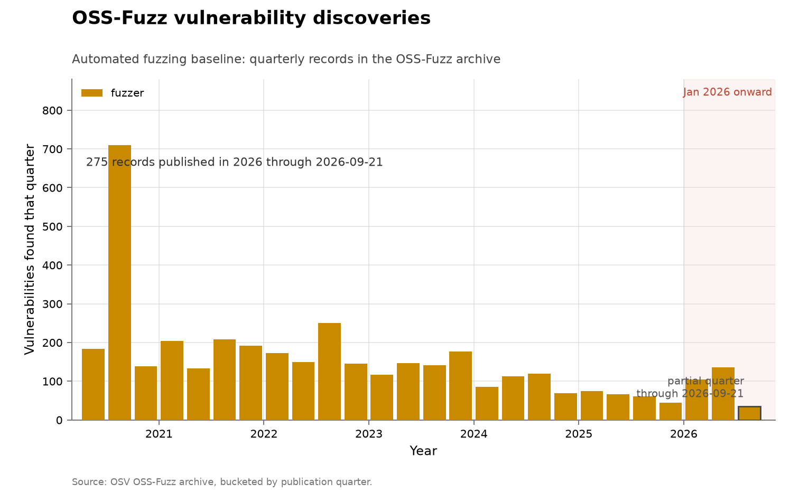</a> |

### Open problems

| Series | Chart |
|---|---|
| <b><a href="problems/math-erdos/">Erdős problems catalogue</a></b><br><b>Metric:</b> problems catalogued, statuses marked<br>solved, and statements formalized in Lean, at<br>monthly site snapshots<br><b>Coverage:</b> 2025-08-31 to 2026-08-08, thirteen<br>snapshots<br><b>Acceleration?</b> ❓ inconclusive — the comparable<br>window is about eleven months, and a status<br>edit is not a solution | <a href="problems/math-erdos/">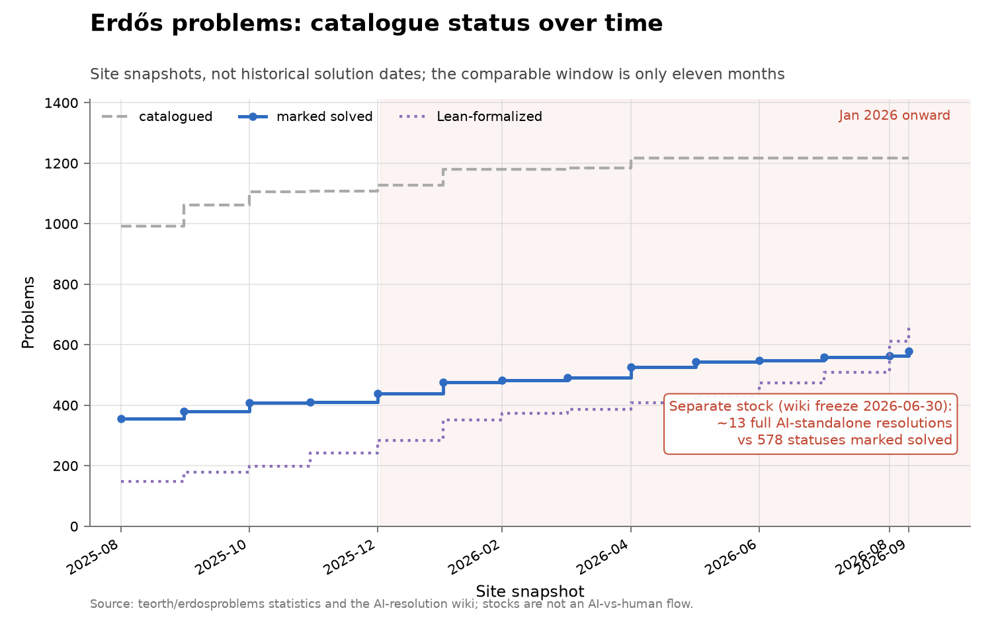</a> |
| <b><a href="problems/math-hilbert/">Hilbert's problems</a></b><br><b>Metric:</b> unresolved scored rows remaining, out<br>of 28 scored rows<br><b>Coverage:</b> 1900–2026, with dated resolutions<br>running 1900–1998<br><b>Acceleration?</b> ➡️ no acceleration | <a href="problems/math-hilbert/">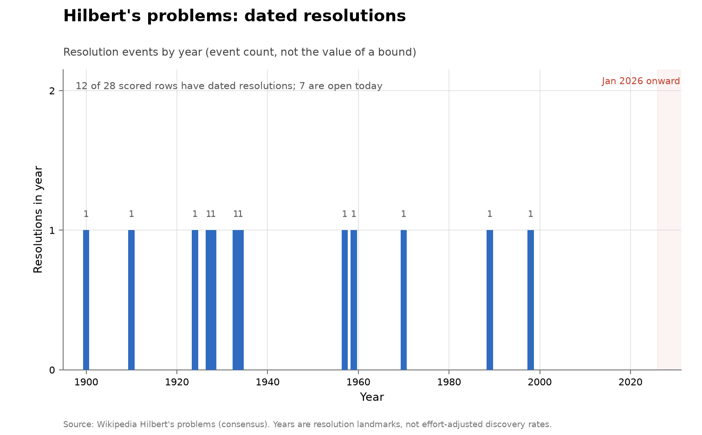</a> |
| <b><a href="problems/math-landau/">Landau's problems</a></b><br><b>Metric:</b> unresolved scored rows remaining, out<br>of 4 scored rows<br><b>Coverage:</b> 1912–2026, with no dated resolution<br>anywhere in that span<br><b>Acceleration?</b> ➡️ no acceleration | <a href="problems/math-landau/">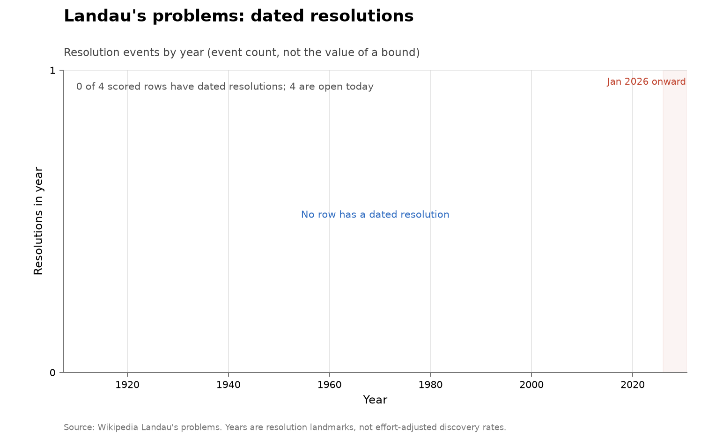</a> |
| <b><a href="problems/math-millennium/">Millennium Prize Problems</a></b><br><b>Metric:</b> unresolved scored rows remaining, out<br>of 7<br><b>Coverage:</b> 2000–2026, with one dated resolution<br>in 2003<br><b>Acceleration?</b> ➡️ no acceleration | <a href="problems/math-millennium/">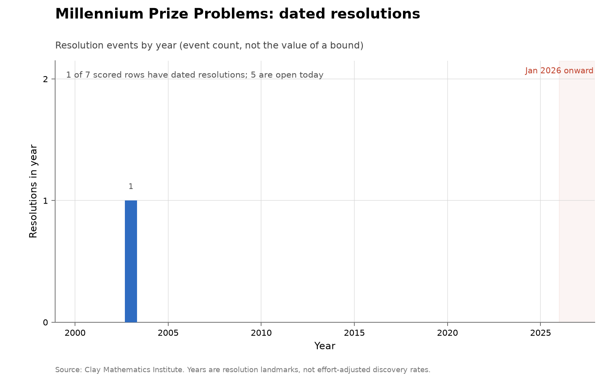</a> |
| <b><a href="problems/math-smale/">Smale's problems</a></b><br><b>Metric:</b> unresolved scored rows remaining, out<br>of 19 scored rows<br><b>Coverage:</b> 1998–2026, with dated resolutions<br>running 2002–2026<br><b>Acceleration?</b> ❓ inconclusive — one AI-<br>attributed fall in 2026, and a single event<br>cannot set a slope | <a href="problems/math-smale/">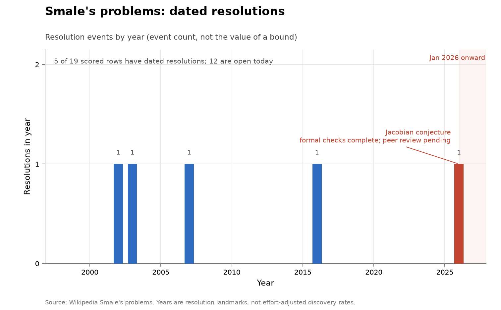</a> |
| <b><a href="problems/math-thurston/">Thurston's 24 questions</a></b><br><b>Metric:</b> unresolved scored rows remaining, out<br>of 24 scored rows<br><b>Coverage:</b> 1982–2026, with dated resolutions<br>running 1993–2013<br><b>Acceleration?</b> ➡️ no acceleration | <a href="problems/math-thurston/">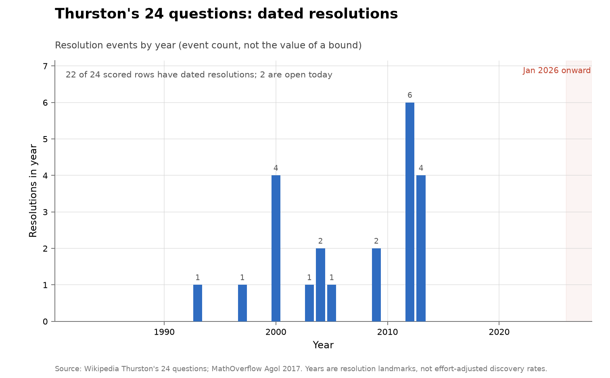</a> |
| <b><a href="problems/math-topp/">The Open Problems Project</a></b><br><b>Metric:</b> unresolved scored rows remaining, out<br>of 78<br><b>Coverage:</b> 2001–2026, with dated resolutions<br>running 2000–2024<br><b>Acceleration?</b> ➡️ no acceleration | <a href="problems/math-topp/">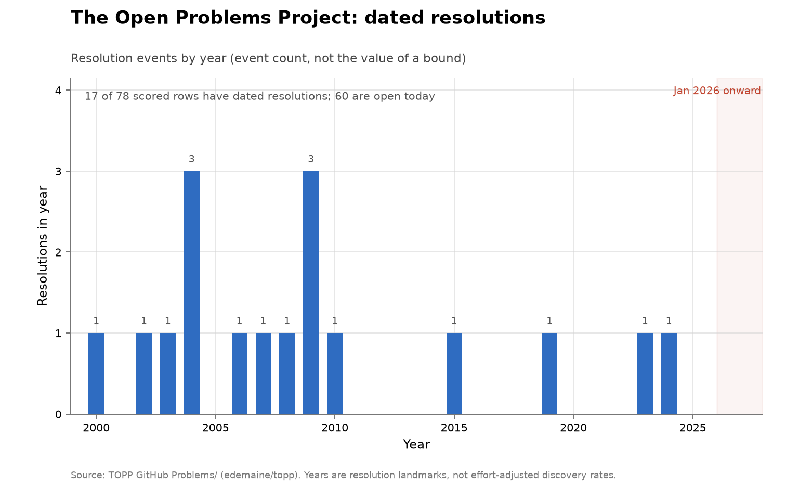</a> |

### Mathematical bounds and records

| Series | Chart |
|---|---|
| <b><a href="problems/math-alphaevolve-inventory/">Inventory of the AlphaEvolve problem set</a></b><br><b>Metric:</b> per problem, whether it has a live<br>numeric record and how many dated prior works<br>the paper cites<br><b>Coverage:</b> the 65 problems the paper numbers<br>6.1 to 6.65; cited works span 1898–2025; built<br>2026-07-26<br><b>Acceleration?</b> ⚪ baseline | <a href="problems/math-alphaevolve-inventory/">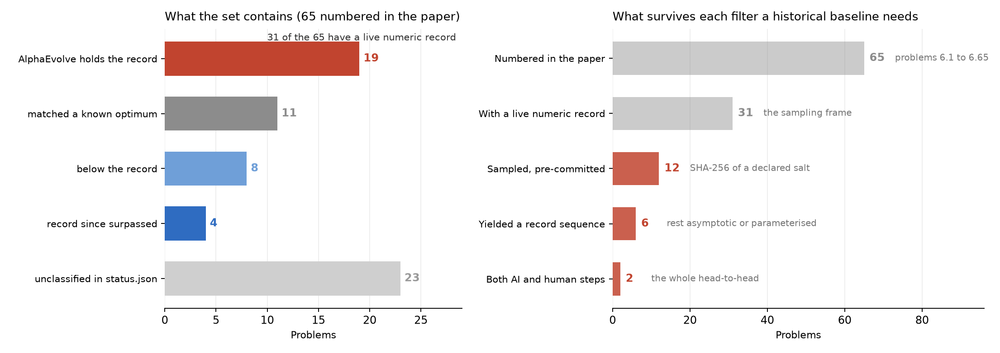</a> |
| <b><a href="problems/math-alphaevolve-records/">Finite construction records around AlphaEvolve</a></b><br><b>Metric:</b> cumulative record steps in five groups<br>of finite construction and packing problems<br><b>Coverage:</b> 1949–2026, 22 record steps across<br>the five groups<br><b>Acceleration?</b> ❓ inconclusive — the 2025<br>cluster is real, but these five groups were<br>selected because an AI system worked on them | <a href="problems/math-alphaevolve-records/">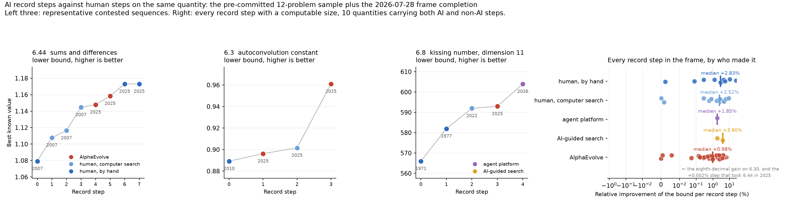</a><br><a href="problems/math-alphaevolve-records/">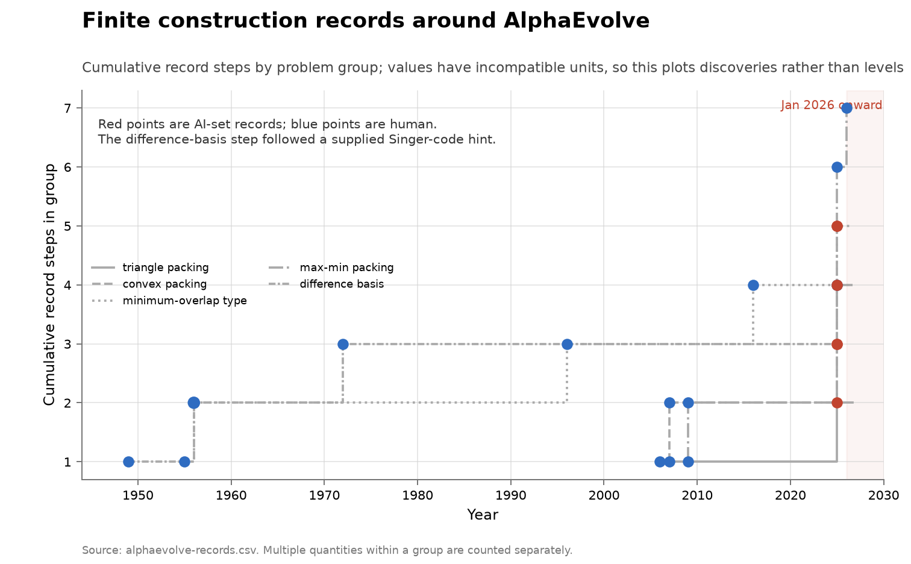</a> |
| <b><a href="problems/math-antedb/">ANTEDB analytic-number-theory exponents</a></b><br><b>Metric:</b> cumulative slice-level record changes<br>across 58 exponent slices in the three<br>families $\mu$, $A$ and $\beta$<br><b>Coverage:</b> 1920–2024 in the underlying<br>literature; extracted from the database as of<br>2026-07-26<br><b>Acceleration?</b> ➡️ no acceleration | <a href="problems/math-antedb/">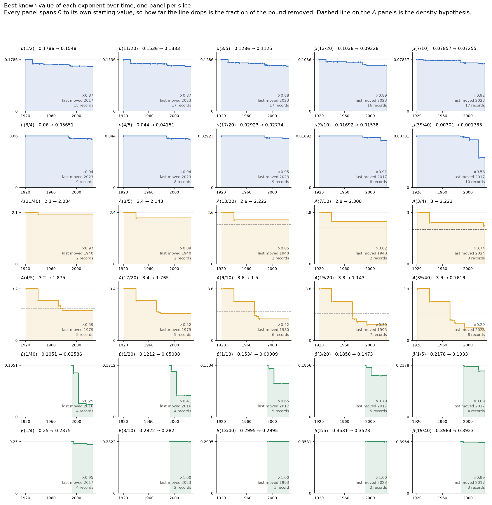</a><br><a href="problems/math-antedb/">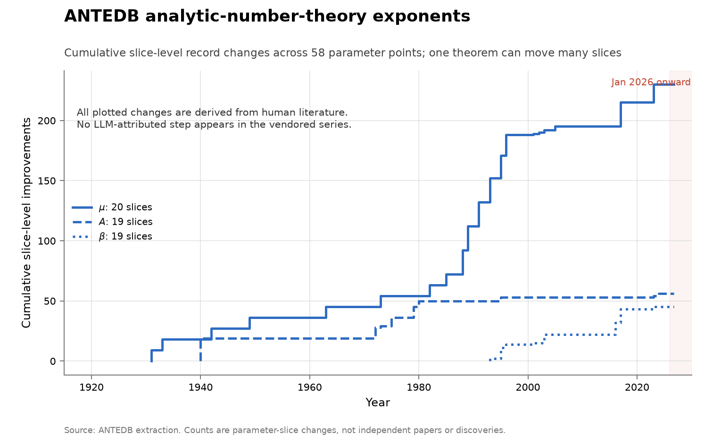</a> |
| <b><a href="problems/math-sphere-packing/">Sphere-packing lower-bound ladder</a></b><br><b>Metric:</b> cumulative improvements to the<br>asymptotic lower bound on sphere-packing<br>density in high dimension<br><b>Coverage:</b> 1905–2025, eight recorded steps<br><b>Acceleration?</b> 📈 accelerating — and every step<br>is human, which is what this series is here to<br>show | <a href="problems/math-sphere-packing/">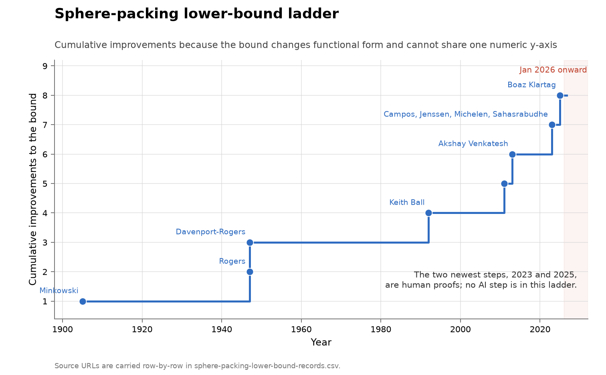</a> |
| <b><a href="problems/math-sums-autoconvolution/">Sums-and-differences and autoconvolution constants</a></b><br><b>Metric:</b> best known lower bounds on two<br>additive-combinatorics constants, $C_{6.44}$<br>and $C_{6.3}$ in the AlphaEvolve numbering<br><b>Coverage:</b> 2007–2025, twelve record steps<br>across the two ladders<br><b>Acceleration?</b> ❓ inconclusive — AI steps are<br>visible in 2025, and a human retook one of the<br>two ladders within months | <a href="problems/math-sums-autoconvolution/">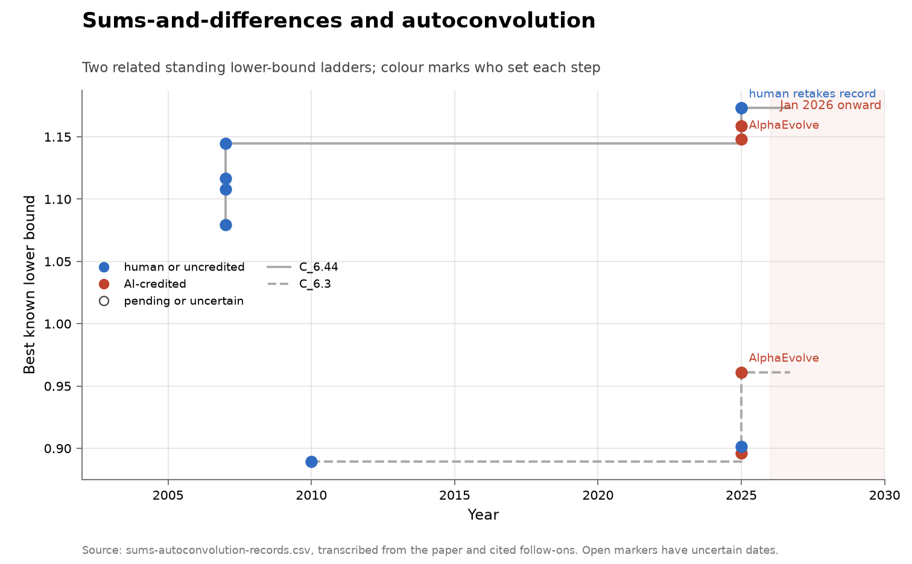</a> |
| <b><a href="problems/matrix-omega/">Matrix-multiplication exponent ω</a></b><br><b>Metric:</b> best proved upper bound on the<br>asymptotic exponent ω of n×n matrix<br>multiplication; lower is better<br><b>Coverage:</b> 1969 to 2024, fifteen recorded steps<br><b>Acceleration?</b> 📉 declining — the asymptotic<br>record is slowing, and no step in it is AI-<br>attributed | <a href="problems/matrix-omega/">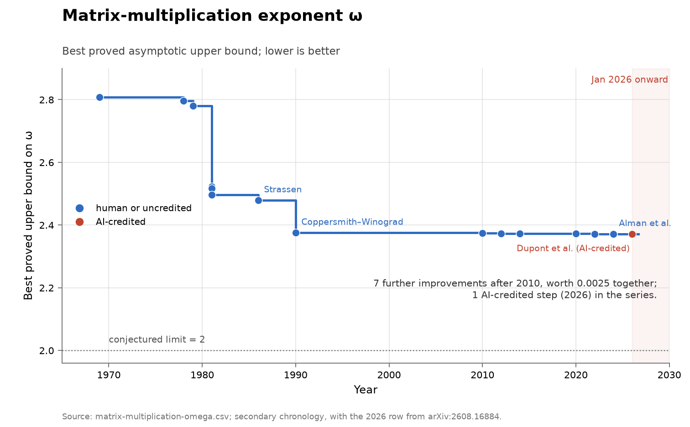</a> |

### Algorithms

| Series | Chart |
|---|---|
| <b><a href="problems/algorithms-cifar10/">CIFAR-10 speedrun</a></b><br><b>Metric:</b> seconds to 94% test accuracy on<br>CIFAR-10 on a single A100<br><b>Coverage:</b> 2018–2026; the plotted series starts<br>2022-12-29 and ends with a claim of 2026-07-09<br><b>Acceleration?</b> 📉 declining — the yearly<br>improvement factor falls from 2.9 to a claimed<br>1.09 | <a href="problems/algorithms-cifar10/">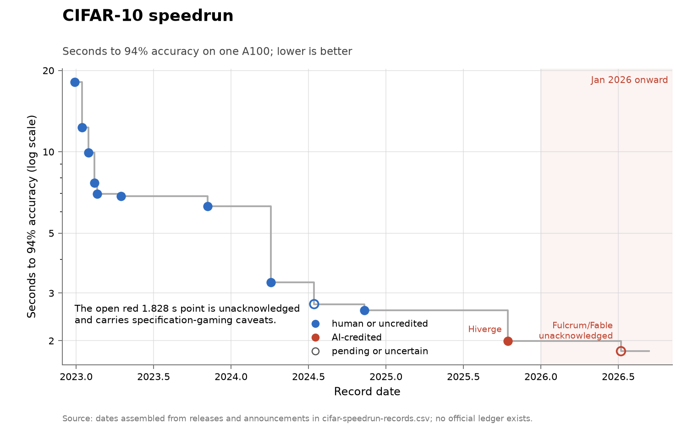</a> |
| <b><a href="problems/algorithms-enwik9/">Hutter Prize compression: enwik9</a></b><br><b>Metric:</b> total size in bytes of decompressor<br>plus archive for a fixed 1 GB text corpus,<br>under a CPU-time and memory cap<br><b>Coverage:</b> 2019 baseline to 2026; the prize<br>moved to enwik9 on 2020-02-21, and the<br>uncapped comparator runs 2019 to 2023<br><b>Acceleration?</b> ➡️ no acceleration | <a href="problems/algorithms-enwik9/">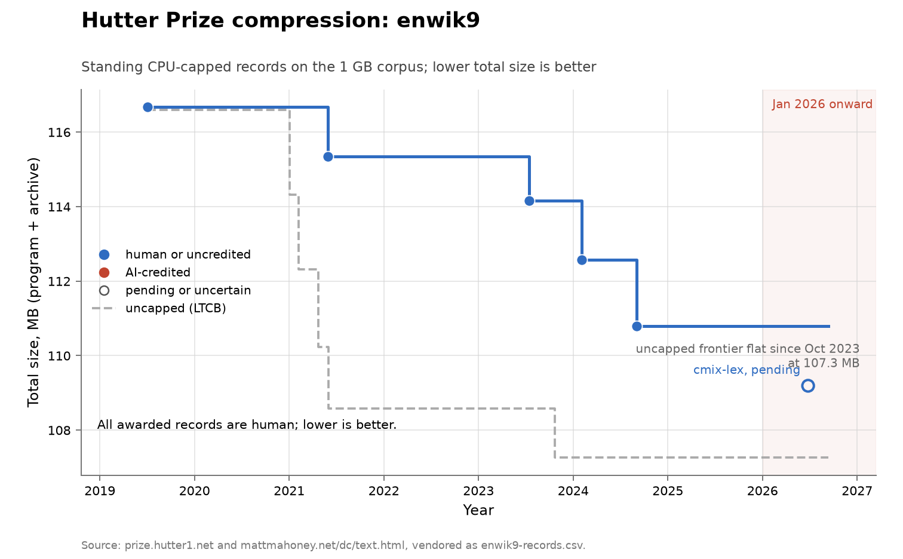</a> |
| <b><a href="problems/algorithms-gurobi/">Gurobi mixed-integer programming speed</a></b><br><b>Metric:</b> cumulative vendor-reported MILP<br>speedup across releases, every version rerun<br>on one machine<br><b>Coverage:</b> releases 10 through 13, announced<br>2022-11-14 to 2025-11-18, baselined at version<br>9.5<br><b>Acceleration?</b> ➡️ no acceleration | <a href="problems/algorithms-gurobi/">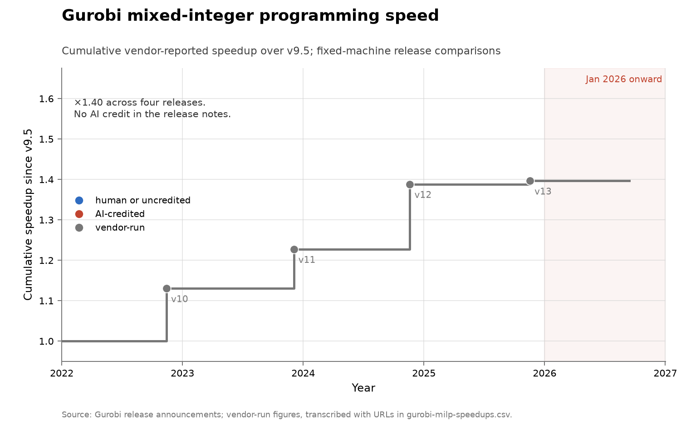</a> |
| <b><a href="problems/algorithms-nanogpt/">modded-nanogpt training speedrun</a></b><br><b>Metric:</b> minutes of training to a fixed target<br>validation loss, per accepted record<br><b>Coverage:</b> 2024-05-28 to 2026-05-27, all 86<br>records listed in the repository README<br><b>Acceleration?</b> ➡️ no acceleration | <a href="problems/algorithms-nanogpt/">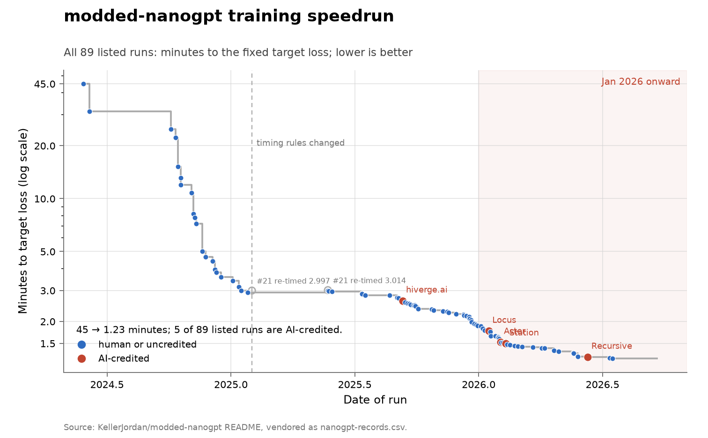</a> |
| <b><a href="problems/algorithms-stockfish/">Stockfish development builds on fixed hardware</a></b><br><b>Metric:</b> Elo relative to Stockfish 15, from<br>20,000 games per build on one fixed machine<br>and time control<br><b>Coverage:</b> 2013-04-30 to 2026-07-26, 2,542<br>tested development builds<br><b>Acceleration?</b> ➡️ no acceleration | <a href="problems/algorithms-stockfish/">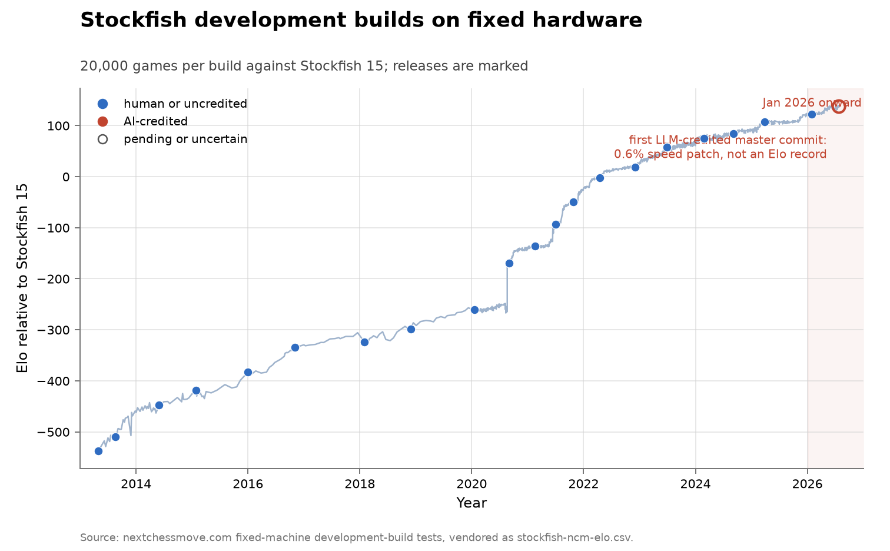</a> |

### Outside the three domains

| Series | Chart |
|---|---|
| <b><a href="problems/integer-factorization/">Integer factorization records</a></b><br><b>Metric:</b> cryptanalysis; decimal digits in the<br>largest hard semiprime factored, as a running<br>maximum<br><b>Coverage:</b> 1991-04 to 2020-02, confirmed<br>unmoved as of 2026-08-10<br><b>Acceleration?</b> ➡️ no acceleration — no record<br>since February 2020, and the fourfold slowdown<br>before that predates AI entirely | <a href="problems/integer-factorization/">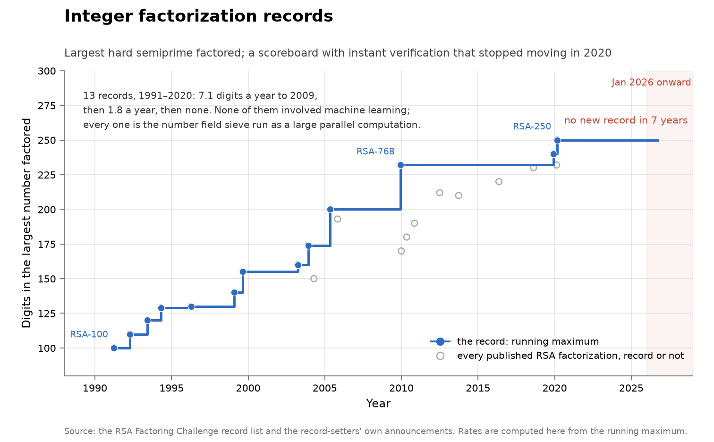</a> |
| <b><a href="problems/output-arxiv/">arXiv submissions</a></b><br><b>Metric:</b> research output; preprints submitted<br>to arXiv per month<br><b>Coverage:</b> 1991-07 to 2026-08, monthly, the<br>last month partial<br><b>Acceleration?</b> 📈 accelerating — on volume,<br>which is not discovery | <a href="problems/output-arxiv/">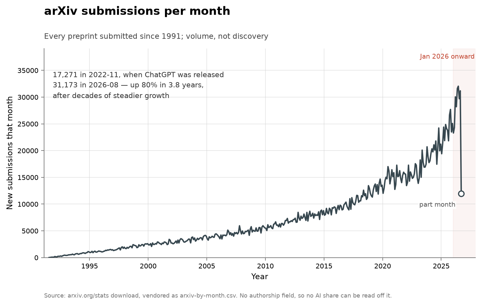</a> |
| <b><a href="problems/output-crossref/">DOI records deposited with Crossref</a></b><br><b>Metric:</b> formal publishing volume; DOI records<br>deposited with Crossref per year, by created<br>date<br><b>Coverage:</b> 2010 to 2026, annual, the last year<br>partial<br><b>Acceleration?</b> ➡️ no acceleration | <a href="problems/output-crossref/">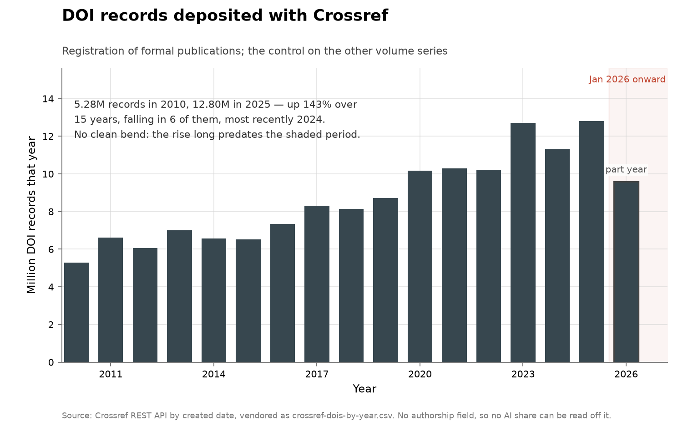</a> |
| <b><a href="problems/output-github-pushes/">Git pushes to GitHub</a></b><br><b>Metric:</b> code output; git pushes to GitHub per<br>quarter, summed over economies<br><b>Coverage:</b> 2020-Q1 to 2026-Q1, quarterly<br><b>Acceleration?</b> 📈 accelerating — on volume,<br>which is not discovery | <a href="problems/output-github-pushes/">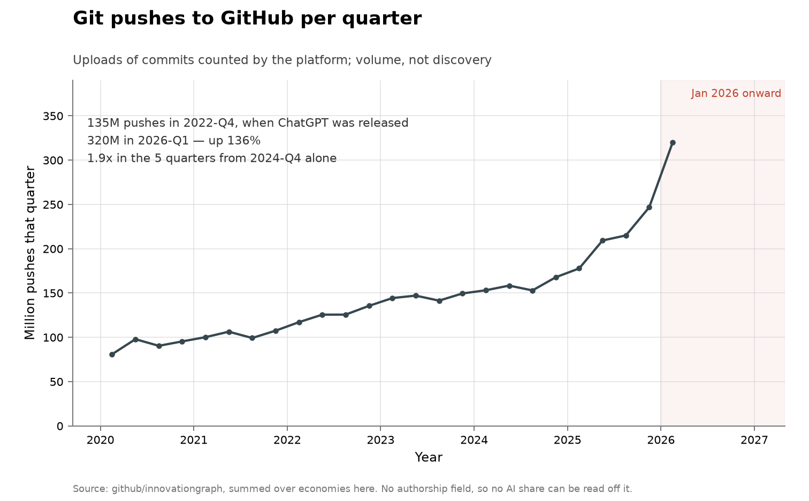</a> |
| <b><a href="problems/output-stackoverflow/">Stack Overflow questions</a></b><br><b>Metric:</b> demand for human answers; questions<br>created on Stack Overflow per month<br><b>Coverage:</b> 2019-01 to 2026-07, monthly,<br>complete months only<br><b>Acceleration?</b> 📉 declining — on demand for<br>human answers, not on discovery | <a href="problems/output-stackoverflow/">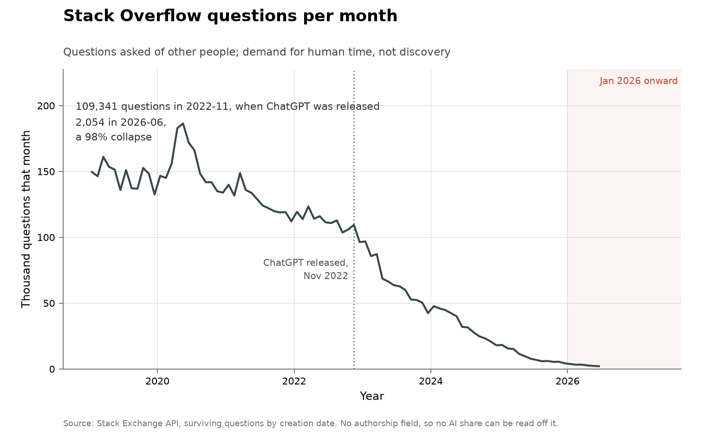</a> |
<!-- END GENERATED: series-index -->

## Validation

<!-- BEGIN GENERATED: checks-table -->
| Problem | Document | Data | Figure | Literature | Refetch | Reproduces |
|---|---|---|---|---|---|---|
| [curl vulnerability disclosures](problems/cyber-curl/) | ✅ | ✅ | ✅ | ✅ | ✅ | ✅ |
| [Firefox vulnerability disclosures](problems/cyber-firefox/) | ✅ | ✅ | ✅ | ✅ | ✅ | ✅ |
| [All software: vulnerabilities known exploited](problems/cyber-kev-exploited/) | ✅ | ✅ | ✅ | ✅ | ✅ | ✅ |
| [All software: vulnerabilities disclosed](problems/cyber-nvd-disclosed/) | ✅ | ✅ | ✅ | ✅ | ✅ | ✅ |
| [OpenSSL vulnerability disclosures](problems/cyber-openssl/) | ✅ | ✅ | ✅ | ✅ | ✅ | ✅ |
| [OSS-Fuzz vulnerability discoveries](problems/cyber-oss-fuzz/) | ✅ | ✅ | ✅ | ✅ | ✅ | ✅ |
| [Erdős problems catalogue](problems/math-erdos/) | ✅ | ✅ | ✅ | ✅ | ✅ | ✅ |
| [Hilbert's problems](problems/math-hilbert/) | ✅ | ✅ | ✅ | ✅ | ✍️ | ✅ |
| [Landau's problems](problems/math-landau/) | ✅ | ✅ | ✅ | ✅ | ✍️ | ✅ |
| [Millennium Prize Problems](problems/math-millennium/) | ✅ | ✅ | ✅ | ✅ | ✍️ | ✅ |
| [Smale's problems](problems/math-smale/) | ✅ | ✅ | ✅ | ✅ | ✍️ | ✅ |
| [Thurston's 24 questions](problems/math-thurston/) | ✅ | ✅ | ✅ | ✅ | ✍️ | ✅ |
| [The Open Problems Project](problems/math-topp/) | ✅ | ✅ | ✅ | ✅ | ✍️ | ✅ |
| [Inventory of the AlphaEvolve problem set](problems/math-alphaevolve-inventory/) | ✅ | ✅ | ✅ | ✅ | ✅ | ✅ |
| [Finite construction records around AlphaEvolve](problems/math-alphaevolve-records/) | ✅ | ✅ | ✅ | ✅ | ✅ | ✅ |
| [ANTEDB analytic-number-theory exponents](problems/math-antedb/) | ✅ | ✅ | ✅ | ✅ | ✅ | ✅ |
| [Sphere-packing lower-bound ladder](problems/math-sphere-packing/) | ✅ | ✅ | ✅ | ✅ | ✍️ | ✅ |
| [Sums-and-differences and autoconvolution constants](problems/math-sums-autoconvolution/) | ✅ | ✅ | ✅ | ✅ | ✍️ | ✅ |
| [Matrix-multiplication exponent ω](problems/matrix-omega/) | ✅ | ✅ | ✅ | ✅ | ✍️ | ✅ |
| [CIFAR-10 speedrun](problems/algorithms-cifar10/) | ✅ | ✅ | ✅ | ✅ | ✍️ | ✅ |
| [Hutter Prize compression: enwik9](problems/algorithms-enwik9/) | ✅ | ✅ | ✅ | ✅ | ✅ | ✅ |
| [Gurobi mixed-integer programming speed](problems/algorithms-gurobi/) | ✅ | ✅ | ✅ | ✅ | ✍️ | ✅ |
| [modded-nanogpt training speedrun](problems/algorithms-nanogpt/) | ✅ | ✅ | ✅ | ✅ | ✅ | ✅ |
| [Stockfish development builds on fixed hardware](problems/algorithms-stockfish/) | ✅ | ✅ | ✅ | ✅ | ✅ | ✅ |
| [Integer factorization records](problems/integer-factorization/) | ✅ | ✅ | ✅ | ✅ | ✍️ | ✅ |
| [arXiv submissions](problems/output-arxiv/) | ✅ | ✅ | ✅ | ✅ | ✅ | ✅ |
| [DOI records deposited with Crossref](problems/output-crossref/) | ✅ | ✅ | ✅ | ✅ | ✅ | ✅ |
| [Git pushes to GitHub](problems/output-github-pushes/) | ✅ | ✅ | ✅ | ✅ | ✅ | ✅ |
| [Stack Overflow questions](problems/output-stackoverflow/) | ✅ | ✅ | ✅ | ✅ | ✅ | ✅ |

29 problems holding 31 figures and 36 data files. 17 refetch from upstream and 12 are maintained by hand and say so. No failing cells.
<!-- END GENERATED: checks-table -->

## How to read the series

Each chart links to the folder that draws it, where the full-size figure sits
beside its data and documentation. The verdict asks only whether the series
shows an acceleration in the rate of discovery, not whether AI contributed:

📈 accelerating  ·  📉 declining  ·  ➡️ no acceleration  ·  ❓ inconclusive  ·  ⏳ too early  ·  ⚪ baseline

Attribution is deliberately not an admission test. The first-stage question is
whether output under a stable inclusion rule bends upward in the agent era.
Finder credits, where they exist, help investigate a mechanism; where they do
not, the time series still supplies evidence about the claimed acceleration.
Neither case identifies causation by itself.

Open-problem ledgers are separated from mathematical bounds and records because
their instruments differ. The former show current status plus dated resolution
events; the latter track changes in numerical quantities.

The final group sits outside the three worked domains. Integer factorization is
a cheap-verification control, while the output-volume series are contrast cases
whose curves can bend without measuring discovery.

## What validation checks

The repository checks that every chart can be traced to a public source and
rebuilt from it. Each validation column is one kind of thing that can go missing:

| Column | Fails when |
|---|---|
| Document | A `**Field:**` line or required section is missing, a verdict is invalid, `**Upstream:**` names no URL, a sibling link fails, or an optional folder `check.py` finds stale prose arithmetic. |
| Data | The folder holds no CSV, vendors one its document never links, links one that is not there, or reuses a filename another folder already has. |
| Figure | There is no `figure.py`, or no PNG, or a PNG the document does not embed, or a PNG that nothing regenerates. |
| Literature | A `[@citekey]` in the document has no entry in `references.bib`. |
| Refetch | There is no `fetch.py`, and the document does not say how the data is maintained instead. |
| Reproduces | Redrawing the figure from the CSVs beside it does not give back the committed PNG, byte for byte. |

✅ passes  ·  ❌ fails  ·  ✍️ maintained by hand, and the document says so  ·  ➖ not run

Reproduction runs every `figure.py` and compares the result with what is
committed. It restores the original bytes afterwards, so a stale figure is
reported rather than quietly staged. `make check` skips this slower step;
`make check-figures` runs it, and `make index` runs it before regenerating the
two tables above.

## What the numbers are and are not

Four conventions run through every series here, and reading a chart without
them will mislead you.

**Attribution is optional, and acceleration is not attribution.** A series is
included when its events are selected consistently enough to compare over time.
An upward bend is a signal to investigate alongside external evidence, not an
estimate of AI's causal share. Conversely, a series does not become informative
merely because a few events name a model.

**A finder credit is a floor, not a measurement.** Where a project records who
found a vulnerability, this data classifies a report as AI-credited only when
the credit string explicitly names an AI system, an AI-security firm, or an
agent. A researcher who used a model and did not say so counts as human. So
every AI share here is a lower bound by an unknown margin.

**A disclosure is not a discovery, and a status change is not a solution.**
Vulnerability series count what got published, on the date it got published.
The Erdős catalogue records the date a status was edited, which is not the date
a problem was solved.

**Records are lumpy with no AI in them.** Half of all algorithm families never
improve at all [@sherry2021fast], solver records jump every few years, and a
century-scale exponent can sit still for eighty years and then move by hand. A
staircase inside the agent era is not by itself an AI signature, and a flat
stretch is not by itself an exhausted frontier.

## Layout

One folder holds everything about each problem:

```
problems/cyber-curl/
  README.md                  what the problem is and what the chart supports
  curl-vulnerabilities.csv   the series, vendored from a public source
  curl-finders.csv           who was credited with each find
  fetch.py                   rebuilds those CSVs from curl's vuln.json
  figure.py                  draws the PNG from the adjacent CSVs
  discovery-cyber-curl.png   committed, never hand-edited
```

| Path | What is in it |
|---|---|
| `problems/<slug>/` | One folder per problem, as above. |
| `lib/chart.py` | Shared colours, axis styling, and figure saving. |
| `lib/families.py` | Chart shapes used by more than one problem. |
| `lib/credits.py` | Classification of vulnerability finder credits. |
| `lib/table.py`, `lib/web.py` | CSV and upstream-fetching helpers. |
| `tools/check.py` | Cross-folder consistency and reproduction checks. |
| `tools/sync_to_blog.py` | Copies figures into the blog checkout. |
| `references.bib` | Bibliography for the problem documents. |

A folder is self-contained except for generic helpers. Cross-series comparison
happens in the prose rather than in a composite chart.

## Reproducing

Figures need Python 3.12, the exact versions in `requirements.txt`, and
matplotlib's bundled DejaVu Sans font, but no network:

```bash
python3 -m pip install -r requirements.txt
make figures                    # redraw every PNG
make figure PROBLEM=cyber-curl  # redraw one folder
make check                      # check data, documents, and sources
make check-figures              # also verify PNG bytes
```

The figures are byte-for-byte reproducible under that pinned environment, not
under arbitrary matplotlib or FreeType installations. Each PNG's `Software`
metadata records the Python, matplotlib, and FreeType versions plus its generator
path, and CI checks the committed bytes from a clean pinned install.

Rebuilding data is a separate networked step:

```bash
make fetch                          # run every automatable fetcher
make fetch-one PROBLEM=cyber-curl   # run one folder's fetcher
```

Some sources are prose pages rather than feeds, so their rows are transcribed by
hand with source URLs recorded in the CSV. The Hilbert, Landau, Thurston, Smale,
Millennium, and TOPP status ledgers are hand-scored from the secondary accounts
their documents name.

`problems/math-alphaevolve-records/fetch.py` also writes the
sums-and-differences slice into its sibling folder so those datasets cannot
drift apart.

## Who reads this

The blog at [tecunningham.github.io](https://tecunningham.github.io) renders the
argument these series support. It reads the CSVs here directly rather than
holding copies, so a number that goes stale in its prose fails its audit rather
than quietly disagreeing with the data. It looks a CSV up by filename, which is
why filenames are unique across folders and `tools/check.py` enforces it. Its
only copies are the PNGs, which Quarto has to find inside its own tree to
publish; `make sync` puts them there and `python3 tools/sync_to_blog.py --check`
says whether they are current.

## Provenance and licence

Every CSV records where its rows came from, either in a per-row source column
or in the header of the fetch script that built it. The underlying facts belong
to their publishers — the curl project, Mozilla, OpenSSL, NIST, CISA, OSV,
Google OSS-Fuzz, the Erdős problems community, ANTEDB, Google DeepMind, the
Hutter Prize, nextchessmove.com, and the speedrun leaderboards — and are collected
here under the terms each publisher offers. The aggregation, classification,
and arithmetic are this repository's, and are the part that can be wrong.
