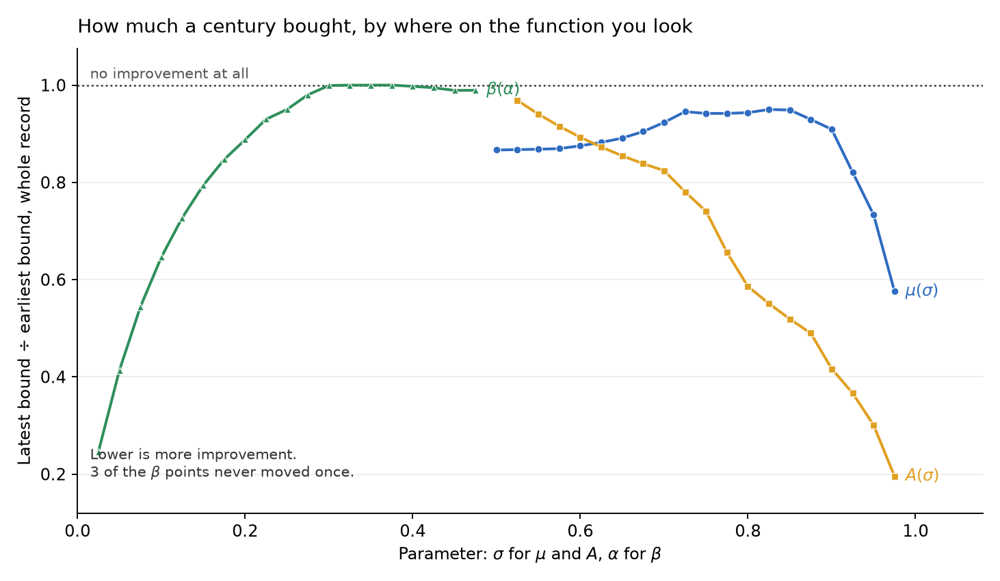
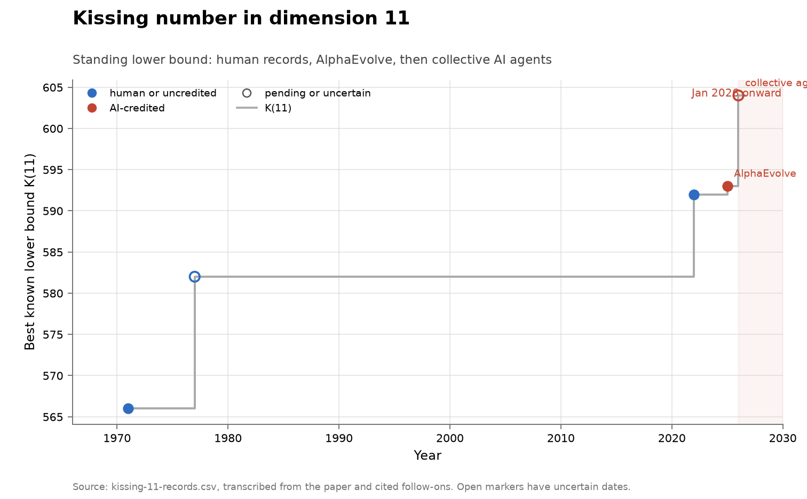
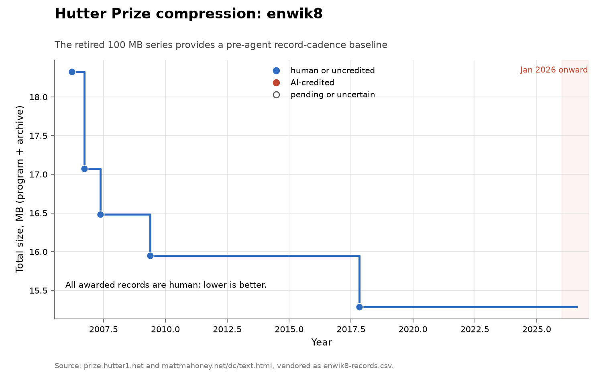
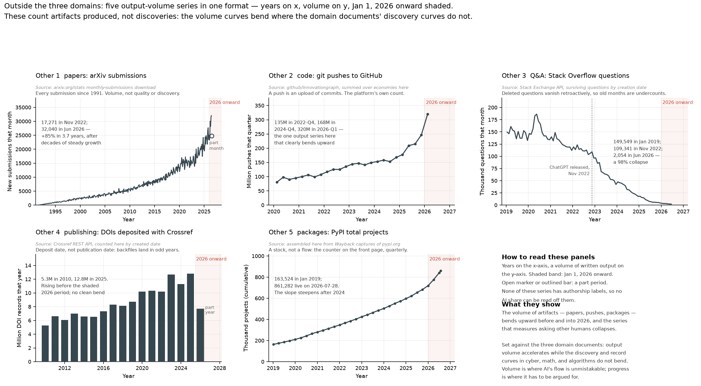
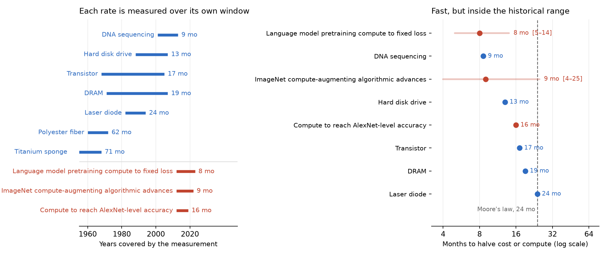
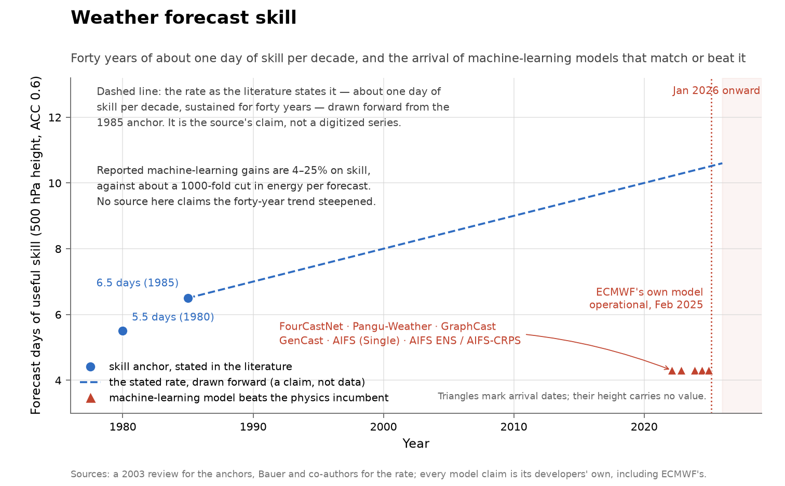

# ai-discovery-data

Vendored datasets, figure code and documentation behind measurements of how much LLMs have
contributed to discovery, in the three domains where somebody keeps a public,
dated, finder-attributed score: **software vulnerabilities**, **mathematics**,
and **algorithms**.

This repository is the canonical home for that data. It exists so the charts in
[LLMs' Contribution to Discovery](https://tecunningham.github.io/posts/2026-08-08-llm-contribution-to-discoveries.html)
can be checked and rebuilt from public sources by someone who did not write them.

## Layout

One folder per problem, holding everything about that problem:

```
problems/cyber-curl/
  README.md                  what the problem is, what the chart shows, what it
                             cannot support, and the literature
  curl-vulnerabilities.csv   the series, vendored from a public source
  curl-finders.csv           who was credited with each find
  fetch.py                   rebuilds those CSVs from curl's own vuln.json
  figure.py                  draws the PNG from the CSVs beside it
  discovery-cyber-curl.png   committed, never hand-edited
```

A folder is self-contained: to check a number, read one directory. Nothing is
shared except generic helpers.

| Path | What is in it |
|---|---|
| `problems/<slug>/` | One folder per problem, as above. |
| `lib/chart.py` | The visual language: colours, the shaded agent era, axis styling, saving. |
| `lib/families.py` | Chart shapes drawn by more than one problem, parameterised by CSV path. |
| `lib/credits.py` | Deciding whether a vulnerability credit names an AI system. |
| `lib/table.py`, `lib/web.py` | Reading and writing CSVs; fetching upstream, with a daily cache. |
| `tools/check.py` | Consistency checks: every folder accounts for its own data, figure and sources. |
| `tools/sync_to_blog.py` | Copies the figures into the blog checkout that renders them. |
| `references.bib` | Bibliography for the problem documents. |

There is no central generator and no shared `data/` directory. Both existed
until August 2026 and were removed: a figure five hundred lines away from the
CSV it plots is a figure nobody checks, and a shared data directory made it
impossible to see which series a file belonged to. The cost of the split is that
a chart shape used by several problems has to live in `lib/families.py` rather
than next to its data, and that a figure comparing several problems has nowhere
to live at all — which is why there are none. Cross-series comparison happens in
the prose that reads these folders, not in a composite chart.

## Reproducing

Figures need only Python and matplotlib, and no network:

```bash
make figures                    # every folder redraws its own PNG
make figure PROBLEM=cyber-curl  # or just one
make check                      # every folder accounts for its data and sources
```

Figures are byte-for-byte reproducible: run `make figures` twice and git should
report nothing. If it does report something, that is a bug in the generator, not
noise to be committed.

Rebuilding the data itself needs the network, and is deliberately a separate
step because several upstream sources rate-limit, change shape, or require
judgment to transcribe:

```bash
make fetch                          # every folder that can refetch, does
make fetch-one PROBLEM=cyber-curl   # or just one
```

`make fetch` does not cover everything. Series whose upstream is a prose page
rather than a feed — the Hutter Prize table, the AlphaEvolve problem write-ups,
the Gurobi release notes, the matrix-multiplication record chronology — are
transcribed by hand, with the source URL recorded per row in the CSV. The
per-problem document says which category each series is in.

The prestige problem lists are the extreme case: the Hilbert, Landau, Thurston,
Smale, Millennium and TOPP status ledgers are hand-scored, one CSV per list in
its own folder, from the secondary accounts each document names.

Two folders write a sibling's CSV rather than leaving it to be maintained twice.
`problems/math-alphaevolve-records/fetch.py` holds the hand transcription of the
AlphaEvolve record table and writes the kissing-number and
sums-and-differences slices into their folders, so those slices cannot drift
from it. Each affected document says so.

## What the numbers are and are not

Three conventions run through every series here, and reading a chart without
them will mislead you.

**A finder credit is a floor, not a measurement.** Where a project records who
found a vulnerability, this data classifies a report as AI-credited only when
the credit string explicitly names an AI system, an AI-security firm, or an
agent. A researcher who used a model and did not say so counts as human. So
every AI share here is a lower bound by an unknown margin.

**A disclosure is not a discovery, and a status change is not a solution.**
Vulnerability series count what got published, on the date it got published.
The Erdős catalogue records the date a status was edited, which is not the date
a problem was solved.

**Records are lumpy with no AI in them.** Half of all algorithm families never
improve at all [@sherry2021fast], solver records jump every few years, and a
century-scale exponent can sit still for eighty years and then move by hand. A
staircase inside the agent era is not by itself an AI signature, and a flat
stretch is not by itself an exhausted frontier.

## Series

Each chart links to the folder that draws it, where the same figure sits beside
its data and its document. The verdict column asks only whether the series shows
an acceleration in the rate of discovery, not whether AI contributed anything.

A fourth group sits outside the three domains, tracked because the three barely
vary in the thing that most plausibly explains the differences between them:
how cheap it is to check a candidate answer. Weather is verified against reality
within days, a factorization instantly, a technology cost curve only in
retrospect over decades. Output volume is in that group for a different reason —
it is the contrast case, a set of curves that bend where the discovery curves do
not.

<!-- BEGIN GENERATED: series-index -->
### Vulnerabilities

| Chart | Series | Metric | Coverage | Acceleration? |
|---|---|---|---|---|
| <a href="problems/cyber-curl/"></a> | [curl vulnerability disclosures](problems/cyber-curl/) | vulnerabilities disclosed per year, split by finder credit | 2000–2026, partial through 2026-06-24 | accelerating |
| <a href="problems/cyber-firefox/"></a> | [Firefox vulnerability disclosures](problems/cyber-firefox/) | advisory CVEs per year, split by AI, fuzzer, or other reporter credit | 2016–2026, partial through late July 2026 | accelerating — though disclosures roughly doubled from 2021 to 2025 with essentially no AI credit |
| <a href="problems/cyber-kev-exploited/"></a> | [All software: vulnerabilities known exploited](problems/cyber-kev-exploited/) | CVEs added per year to CISA's Known Exploited Vulnerabilities catalogue | 2021–2026, from the catalogue's November 2021 launch, partial through 2026-07-28 | no acceleration — additions annualize to about +22% in 2026 against +59% for disclosures |
| <a href="problems/cyber-nvd-disclosed/"></a> | [All software: vulnerabilities disclosed](problems/cyber-nvd-disclosed/) | CVEs published per year in the US National Vulnerability Database | 2016–2026, partial through 2026-07-28 | accelerating — but growth was already +32% and +23% in 2024 and 2025, and no disclosure here is attributed to anyone |
| <a href="problems/cyber-openssl/"></a> | [OpenSSL vulnerability disclosures](problems/cyber-openssl/) | vulnerabilities disclosed per year, split by finder credit | 2002–2026, partial through 9 June 2026 | accelerating — but the same shape appeared in 2015–2016 from a purely human cause |
| <a href="problems/cyber-oss-fuzz/"></a> | [OSS-Fuzz vulnerability discoveries](problems/cyber-oss-fuzz/) | vulnerability records published per year by an automated fuzzing programme | 2020–2026, partial through late July 2026 | declining |

### Mathematics

| Chart | Series | Metric | Coverage | Acceleration? |
|---|---|---|---|---|
| <a href="problems/math-alphaevolve-inventory/"></a> | [Inventory of the AlphaEvolve problem set](problems/math-alphaevolve-inventory/) | per problem, whether it has a live numeric record and how many dated prior works the paper cites | the 65 problems the paper numbers 6.1 to 6.65; cited works span 1898–2025; built 2026-07-26 | baseline |
| <a href="problems/math-alphaevolve-records/"></a><br><a href="problems/math-alphaevolve-records/"></a> | [Finite construction records around AlphaEvolve](problems/math-alphaevolve-records/) | cumulative record steps in five groups of finite construction and packing problems | 1949–2026, 22 record steps across the five groups | inconclusive — the 2025 cluster is real, but these five groups were selected because an AI system worked on them |
| <a href="problems/math-antedb/"></a><br><a href="problems/math-antedb/"></a><br><a href="problems/math-antedb/"></a> | [ANTEDB analytic-number-theory exponents](problems/math-antedb/) | cumulative slice-level record changes across 58 exponent slices in the three families $\mu$, $A$ and $\beta$ | 1920–2024 in the underlying literature; extracted from the database as of 2026-07-26 | no acceleration |
| <a href="problems/math-erdos/"></a> | [Erdős problems catalogue](problems/math-erdos/) | problems catalogued, statuses marked solved, and statements formalized in Lean, at monthly site snapshots | 2025-08-31 to 2026-08-08, thirteen snapshots | inconclusive — the comparable window is about eleven months, and a status edit is not a solution |
| <a href="problems/math-hilbert/"></a> | [Hilbert's problems](problems/math-hilbert/) | cumulative ledger rows scored resolved, out of 28 scored rows | 1900–2026, with dated resolutions running 1900–1998 | no acceleration |
| <a href="problems/math-kissing-11/"></a> | [Kissing number in dimension 11](problems/math-kissing-11/) | best known lower bound on the kissing number $K(11)$ | 1971–2026, five record steps | accelerating — a burst on one dimension of one problem, not a field-wide rate |
| <a href="problems/math-landau/"></a> | [Landau's problems](problems/math-landau/) | cumulative ledger rows scored resolved, out of 4 scored rows | 1912–2026, with no dated resolution anywhere in that span | no acceleration |
| <a href="problems/math-millennium/"></a> | [Millennium Prize Problems](problems/math-millennium/) | cumulative prize problems scored resolved, out of 7 | 2000–2026, with one dated resolution in 2003 | no acceleration |
| <a href="problems/math-smale/"></a> | [Smale's problems](problems/math-smale/) | cumulative ledger rows scored resolved, out of 19 scored rows | 1998–2026, with dated resolutions running 2002–2026 | inconclusive — one AI-attributed fall in 2026, and a single event cannot set a slope |
| <a href="problems/math-sphere-packing/"></a> | [Sphere-packing lower-bound ladder](problems/math-sphere-packing/) | cumulative improvements to the asymptotic lower bound on sphere-packing density in high dimension | 1905–2025, eight recorded steps | accelerating — and every step is human, which is what this series is here to show |
| <a href="problems/math-sums-autoconvolution/"></a> | [Sums-and-differences and autoconvolution constants](problems/math-sums-autoconvolution/) | best known lower bounds on two additive-combinatorics constants, $C_{6.44}$ and $C_{6.3}$ in the AlphaEvolve numbering | 2007–2025, twelve record steps across the two ladders | inconclusive — AI steps are visible in 2025, and a human retook one of the two ladders within months |
| <a href="problems/math-thurston/"></a> | [Thurston's 24 questions](problems/math-thurston/) | cumulative ledger rows scored resolved, out of 24 scored rows | 1982–2026, with dated resolutions running 1993–2013 | no acceleration |
| <a href="problems/math-topp/"></a> | [The Open Problems Project](problems/math-topp/) | cumulative entries whose own status line says solved, settled, or closed, out of 78 | 2001–2026, with dated resolutions running 2000–2024 | no acceleration |

### Algorithms

| Chart | Series | Metric | Coverage | Acceleration? |
|---|---|---|---|---|
| <a href="problems/algorithms-cifar10/"></a> | [CIFAR-10 speedrun](problems/algorithms-cifar10/) | seconds to 94% test accuracy on CIFAR-10 on a single A100 | 2018–2026; the plotted series starts 2022-12-29 and ends with a claim of 2026-07-09 | declining — the yearly improvement factor falls from 2.9 to a claimed 1.09 |
| <a href="problems/algorithms-enwik8/"></a> | [Hutter Prize compression: enwik8](problems/algorithms-enwik8/) | total size in bytes of decompressor plus archive for a fixed 100 MB text corpus, under a CPU-time and memory cap | 2006-03-24 baseline to the last awarded record on 2017-11-04; retired when the prize moved to enwik9 in February 2020 | baseline — a pre-agent record cadence for comparison, not a test of recent acceleration |
| <a href="problems/algorithms-enwik9/"></a> | [Hutter Prize compression: enwik9](problems/algorithms-enwik9/) | total size in bytes of decompressor plus archive for a fixed 1 GB text corpus, under a CPU-time and memory cap | 2019 baseline to 2026; the prize moved to enwik9 on 2020-02-21, and the uncapped comparator runs 2019 to 2023 | no acceleration |
| <a href="problems/algorithms-gurobi/"></a> | [Gurobi mixed-integer programming speed](problems/algorithms-gurobi/) | cumulative vendor-reported MILP speedup across releases, every version rerun on one machine | releases 10 through 13, announced 2022-11-14 to 2025-11-18, baselined at version 9.5 | no acceleration |
| <a href="problems/algorithms-nanogpt/"></a> | [modded-nanogpt training speedrun](problems/algorithms-nanogpt/) | minutes of training to a fixed target validation loss, per accepted record | 2024-05-28 to 2026-05-27, all 86 records listed in the repository README | no acceleration |
| <a href="problems/algorithms-stockfish/"></a> | [Stockfish development builds on fixed hardware](problems/algorithms-stockfish/) | Elo relative to Stockfish 15, from 20,000 games per build on one fixed machine and time control | 2013-04-30 to 2026-07-26, 2,542 tested development builds | no acceleration |
| <a href="problems/matrix-omega/"></a> | [Matrix-multiplication exponent ω](problems/matrix-omega/) | best proved upper bound on the asymptotic exponent ω of n×n matrix multiplication; lower is better | 1969 to 2024, fifteen recorded steps | declining — the asymptotic record is slowing, and no step in it is AI-attributed |

### Outside the three domains

| Chart | Series | Metric | Coverage | Acceleration? |
|---|---|---|---|---|
| <a href="problems/integer-factorization/"></a> | [Integer factorization records](problems/integer-factorization/) | cryptanalysis; decimal digits in the largest hard semiprime factored, as a running maximum | 1991-04 to 2020-02, confirmed unmoved as of 2026-07-29 | no acceleration — no record since February 2020, and the fourfold slowdown before that predates AI entirely |
| <a href="problems/output-volume/"></a> | [Output volume: papers, code, packages, DOIs, questions](problems/output-volume/) | research and code output; five indicators of how much gets produced — arXiv submissions a month, git pushes a quarter, Stack Overflow questions a month, DOIs deposited a year, PyPI projects registered | 1991–2026 (arXiv), 2010–2026 (Crossref), 2019–2026 (Stack Overflow, PyPI), 2020-Q1–2026-Q1 (GitHub) | accelerating — on volume, which is not discovery |
| <a href="problems/technology-cost-curves/"></a> | [Technology cost curves: the pre-AI efficiency baseline](problems/technology-cost-curves/) | 66 industrial and scientific technologies; months to halve unit cost, fitted log-linearly per technology, set against the halving times quoted for AI algorithmic progress | 1929–2013 for the cost curves; 2012–2023 for the three AI estimates they are compared with | baseline |
| <a href="problems/weather-forecasting/"></a> | [Weather forecasting](problems/weather-forecasting/) | numerical weather prediction; forecast days of useful skill on 500 hPa geopotential height, plus the dated arrival of machine-learning models that beat the physics incumbent | skill anchors 1980 and 1985, rate claim published 2015; model arrivals 2022-02 to 2025-02 | no acceleration — the skill trend did not bend; the cost of producing a forecast fell by about three orders of magnitude |
<!-- END GENERATED: series-index -->

## Checks

The only claim this repository makes is that every chart can be traced to a
public source and rebuilt from it. So what `make check` looks for is a file that
arrived without the apparatus that makes it checkable — a figure nobody
documents, a CSV nobody plots, a series whose provenance is stated nowhere. Each
column below is one kind of thing that can go missing.

| Column | Fails when |
|---|---|
| Document | A `**Field:**` line or a required section is missing, the verdict is not one of the six allowed values, `**Upstream:**` names no URL, or a link to a sibling folder does not resolve. |
| Data | The folder holds no CSV, vendors one its document never links, links one that is not there, or reuses a filename another folder already has. |
| Figure | There is no `figure.py`, or no PNG, or a PNG the document does not embed, or a PNG that nothing regenerates. |
| Literature | A `[@citekey]` in the document has no entry in `references.bib`. |
| Refetch | There is no `fetch.py`, and the document does not say how the data is maintained instead. |
| Reproduces | Redrawing the figure from the CSVs beside it does not give back the committed PNG, byte for byte. |

✅ passes  ·  ❌ fails  ·  ✍️ maintained by hand, and the document says so  ·  ➖ not run

Reproduction is the check worth having and the one that costs something: it runs
every `figure.py` and compares the result with what is committed, which catches a
figure edited after generation or left behind when its data was refetched —
invisible to every other check here. It restores the original bytes afterwards,
so a stale figure is reported rather than quietly staged. `make check` skips it,
since it is ten seconds rather than one; `make check-figures` runs it, and so
does `make index`, which regenerates the table below.

<!-- BEGIN GENERATED: checks-table -->
| Problem | Document | Data | Figure | Literature | Refetch | Reproduces |
|---|---|---|---|---|---|---|
| [curl vulnerability disclosures](problems/cyber-curl/) | ✅ | ✅ | ✅ | ✅ | ✅ | ✅ |
| [Firefox vulnerability disclosures](problems/cyber-firefox/) | ✅ | ✅ | ✅ | ✅ | ✅ | ✅ |
| [All software: vulnerabilities known exploited](problems/cyber-kev-exploited/) | ✅ | ✅ | ✅ | ✅ | ✅ | ✅ |
| [All software: vulnerabilities disclosed](problems/cyber-nvd-disclosed/) | ✅ | ✅ | ✅ | ✅ | ✅ | ✅ |
| [OpenSSL vulnerability disclosures](problems/cyber-openssl/) | ✅ | ✅ | ✅ | ✅ | ✅ | ✅ |
| [OSS-Fuzz vulnerability discoveries](problems/cyber-oss-fuzz/) | ✅ | ✅ | ✅ | ✅ | ✅ | ✅ |
| [Inventory of the AlphaEvolve problem set](problems/math-alphaevolve-inventory/) | ✅ | ✅ | ✅ | ✅ | ✅ | ✅ |
| [Finite construction records around AlphaEvolve](problems/math-alphaevolve-records/) | ✅ | ✅ | ✅ | ✅ | ✅ | ✅ |
| [ANTEDB analytic-number-theory exponents](problems/math-antedb/) | ✅ | ✅ | ✅ | ✅ | ✅ | ✅ |
| [Erdős problems catalogue](problems/math-erdos/) | ✅ | ✅ | ✅ | ✅ | ✅ | ✅ |
| [Hilbert's problems](problems/math-hilbert/) | ✅ | ✅ | ✅ | ✅ | ✍️ | ✅ |
| [Kissing number in dimension 11](problems/math-kissing-11/) | ✅ | ✅ | ✅ | ✅ | ✍️ | ✅ |
| [Landau's problems](problems/math-landau/) | ✅ | ✅ | ✅ | ✅ | ✍️ | ✅ |
| [Millennium Prize Problems](problems/math-millennium/) | ✅ | ✅ | ✅ | ✅ | ✍️ | ✅ |
| [Smale's problems](problems/math-smale/) | ✅ | ✅ | ✅ | ✅ | ✍️ | ✅ |
| [Sphere-packing lower-bound ladder](problems/math-sphere-packing/) | ✅ | ✅ | ✅ | ✅ | ✍️ | ✅ |
| [Sums-and-differences and autoconvolution constants](problems/math-sums-autoconvolution/) | ✅ | ✅ | ✅ | ✅ | ✍️ | ✅ |
| [Thurston's 24 questions](problems/math-thurston/) | ✅ | ✅ | ✅ | ✅ | ✍️ | ✅ |
| [The Open Problems Project](problems/math-topp/) | ✅ | ✅ | ✅ | ✅ | ✍️ | ✅ |
| [CIFAR-10 speedrun](problems/algorithms-cifar10/) | ✅ | ✅ | ✅ | ✅ | ✍️ | ✅ |
| [Hutter Prize compression: enwik8](problems/algorithms-enwik8/) | ✅ | ✅ | ✅ | ✅ | ✍️ | ✅ |
| [Hutter Prize compression: enwik9](problems/algorithms-enwik9/) | ✅ | ✅ | ✅ | ✅ | ✅ | ✅ |
| [Gurobi mixed-integer programming speed](problems/algorithms-gurobi/) | ✅ | ✅ | ✅ | ✅ | ✍️ | ✅ |
| [modded-nanogpt training speedrun](problems/algorithms-nanogpt/) | ✅ | ✅ | ✅ | ✅ | ✅ | ✅ |
| [Stockfish development builds on fixed hardware](problems/algorithms-stockfish/) | ✅ | ✅ | ✅ | ✅ | ✅ | ✅ |
| [Matrix-multiplication exponent ω](problems/matrix-omega/) | ✅ | ✅ | ✅ | ✅ | ✍️ | ✅ |
| [Integer factorization records](problems/integer-factorization/) | ✅ | ✅ | ✅ | ✅ | ✍️ | ✅ |
| [Output volume: papers, code, packages, DOIs, questions](problems/output-volume/) | ✅ | ✅ | ✅ | ✅ | ✅ | ✅ |
| [Technology cost curves: the pre-AI efficiency baseline](problems/technology-cost-curves/) | ✅ | ✅ | ✅ | ✅ | ✍️ | ✅ |
| [Weather forecasting](problems/weather-forecasting/) | ✅ | ✅ | ✅ | ✅ | ✍️ | ✅ |

30 problems holding 33 figures and 43 data files. 14 refetch from upstream and 16 are maintained by hand and say so. No failing cells.
<!-- END GENERATED: checks-table -->

## Who reads this

The blog at [tecunningham.github.io](https://tecunningham.github.io) renders the
argument these series support. It reads the CSVs here directly rather than
holding copies, so a number that goes stale in its prose fails its audit rather
than quietly disagreeing with the data. It looks a CSV up by filename, which is
why filenames are unique across folders and `tools/check.py` enforces it. Its
only copies are the PNGs, which Quarto has to find inside its own tree to
publish; `make sync` puts them there and `python3 tools/sync_to_blog.py --check`
says whether they are current.

## Provenance and licence

Every CSV records where its rows came from, either in a per-row source column
or in the header of the fetch script that built it. The underlying facts belong
to their publishers — the curl project, Mozilla, OpenSSL, NIST, CISA, Google
OSS-Fuzz, the Erdős problems community, ANTEDB, Google DeepMind, the Hutter
Prize, nextchessmove.com, and the speedrun leaderboards — and are collected
here under the terms each publisher offers. The aggregation, classification,
and arithmetic are this repository's, and are the part that can be wrong.
