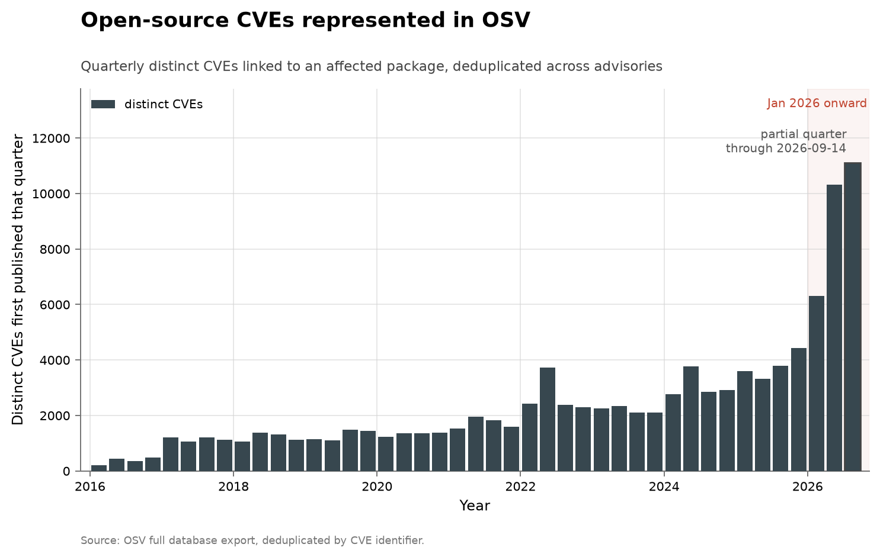
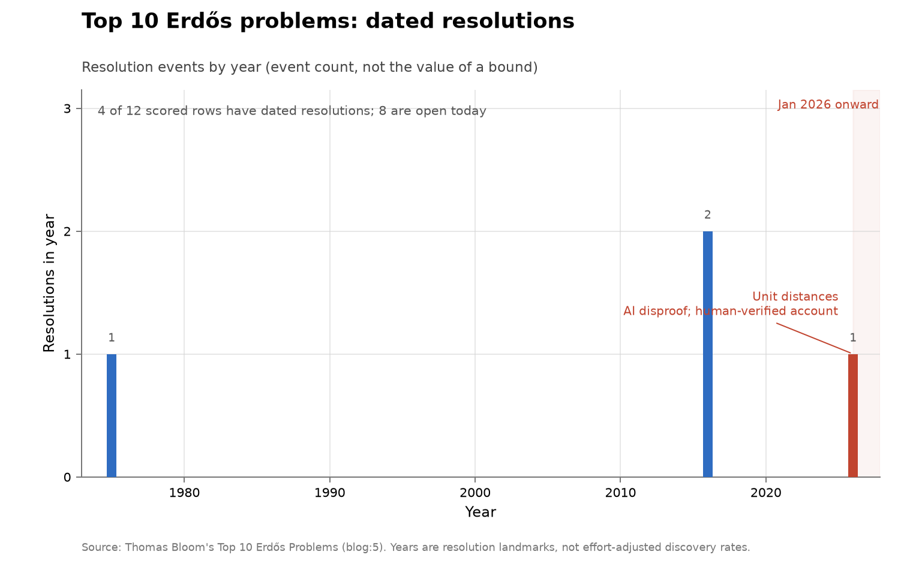
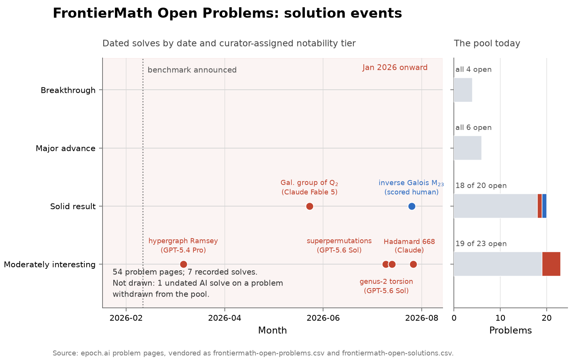
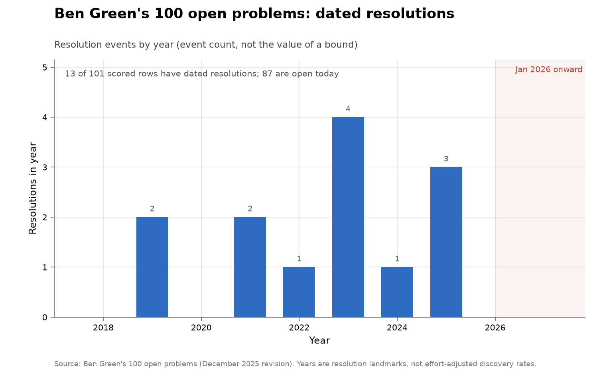
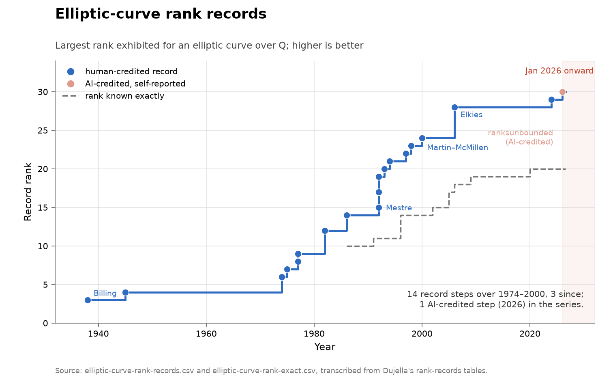
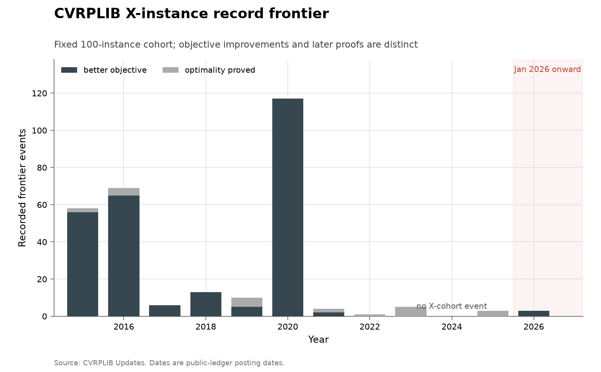
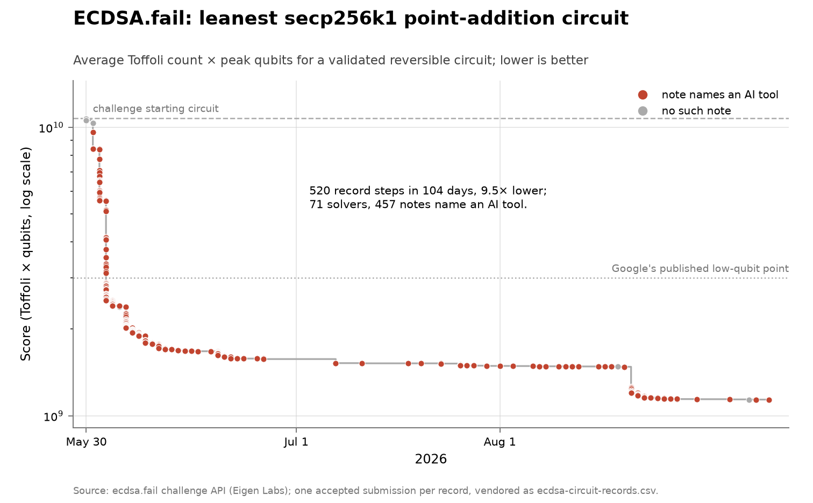
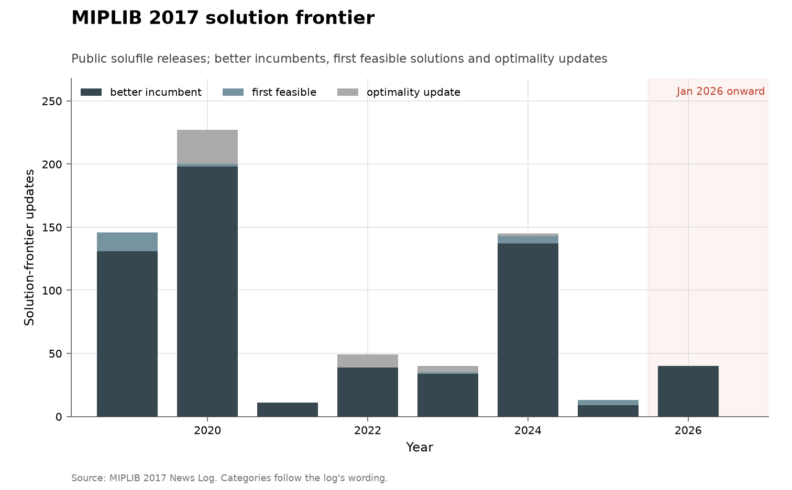
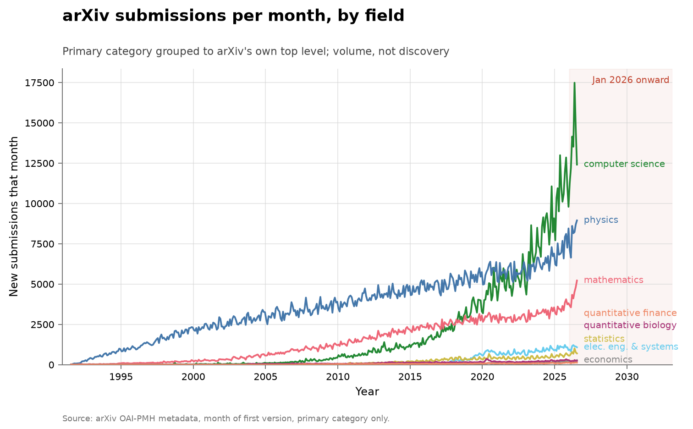

# ai-discovery-data

The goal is to track rates of discovery over time across many domains and see
whether there has been a recent acceleration; the collection supports [LLMs'
Contribution to Discovery](https://tecunningham.github.io/posts/2026-08-08-llm-contribution-to-discoveries.html).
A series is included when it has a consistent definition, a usable time axis,
and public, rebuildable data. Evidence about AI usage is useful context, but is
not required.

Potential future series and cross-domain causal designs are tracked in the
[appendix of additional candidates](ADDITIONAL-CANDIDATES.md).

The collection is browsable at
[tecunningham.github.io/ai-discovery-data](https://tecunningham.github.io/ai-discovery-data/),
where each series page renders its folder's full write-up with the interactive
chart inline — hover any mark for the underlying record, and on several charts
click through to the original reference. The pages are built from the same
vendored CSVs and documents by [`tools/build_docs.py`](tools/build_docs.py);
the PNGs in the table below remain the static record.

A companion [cumulative index](CUMULATIVE.md) redraws every series in one
shared format — a single step function of progress to date, declining toward
zero where the series has a known denominator.

## Series

<!-- BEGIN GENERATED: series-index -->
### Vulnerabilities

| Series | Chart |
|---|---|
| <b><a href="problems/cyber-curl/">curl vulnerability disclosures</a></b><br><b>Metric:</b> vulnerabilities disclosed per quarter,<br>split by whether the finder credit carries an<br>AI marker<br><b>Coverage:</b> 2000–2026, partial through<br>2026-06-24<br><b>Acceleration?</b> 📈 accelerating — 36 disclosures<br>through 2026-06-24 annualize to roughly 75<br>against 9 in 2025 and a 13.1/year mean over<br>2014–2023<br><a href="problems/cyber-curl/">Discussion</a> · <a href="problems/cyber-curl/curl-vulnerabilities.csv">Data</a> · <a href="https://curl.se/docs/vuln.json">Source</a> · <a href="https://tecunningham.github.io/ai-discovery-data/cyber-curl.html">Interactive</a> | <a href="problems/cyber-curl/"></a> |
| <b><a href="problems/cyber-firefox/">Firefox vulnerability disclosures</a></b><br><b>Metric:</b> distinct CVEs per quarter, split by<br>whether the reporter credit names an AI<br>method, an AI-security employer, a fuzzer, or<br>none of these; advisory–CVE mentions retained<br>as a sensitivity count<br><b>Coverage:</b> 2016–2026, partial through<br>2026-08-04, the latest advisory in the<br>snapshot<br><b>Acceleration?</b> 📈 accelerating — 342 distinct<br>CVEs through 2026-08-04 against 210 in 2025;<br>the part year alone is 1.6 times the 2025 full<br>year<br><a href="problems/cyber-firefox/">Discussion</a> · <a href="problems/cyber-firefox/firefox-cves.csv">Data</a> · <a href="https://github.com/mozilla/foundation-security-advisories">Source</a> · <a href="https://tecunningham.github.io/ai-discovery-data/cyber-firefox.html">Interactive</a> | <a href="problems/cyber-firefox/"></a> |
| <b><a href="problems/cyber-kev-exploited/">All software: vulnerabilities known exploited</a></b><br><b>Metric:</b> CVEs added per quarter to CISA's Known<br>Exploited Vulnerabilities catalogue<br><b>Coverage:</b> 2021–2026, from the catalogue's<br>November 2021 launch, partial through<br>2026-08-10<br><b>Acceleration?</b> ➡️ no acceleration — 178<br>additions through 2026-08-10 annualize to<br>about 293 against 245 in 2025 and a 206/year<br>mean over 2023–2025<br><a href="problems/cyber-kev-exploited/">Discussion</a> · <a href="problems/cyber-kev-exploited/kev-by-quarter.csv">Data</a> · <a href="https://www.cisa.gov/known-exploited-vulnerabilities-catalog">Source</a> · <a href="https://tecunningham.github.io/ai-discovery-data/cyber-kev-exploited.html">Interactive</a> | <a href="problems/cyber-kev-exploited/"></a> |
| <b><a href="problems/cyber-microsoft/">Microsoft security-update CVEs</a></b><br><b>Metric:</b> CVEs issued by Microsoft's own CNA per<br>month, dated by first publication in the<br>Security Update Guide, split by whether an<br>acknowledgment credit names an AI method, an<br>AI-security employer, a fuzzer, or none of<br>these<br><b>Coverage:</b> 2016–2026, partial through<br>2026-08-11; no February or March 2016 document<br>exists upstream, so the first year is ten<br>months<br><b>Acceleration?</b> 📈 accelerating — 1,927 CVEs<br>through 2026-08-11 against 1,243 in 2025; the<br>part year annualizes to about 2.5 times 2025<br><a href="problems/cyber-microsoft/">Discussion</a> · <a href="problems/cyber-microsoft/msrc-cves.csv">Data</a> · <a href="https://api.msrc.microsoft.com/cvrf/v3.0/updates">Source</a> · <a href="https://tecunningham.github.io/ai-discovery-data/cyber-microsoft.html">Interactive</a> | <a href="problems/cyber-microsoft/"></a> |
| <b><a href="problems/cyber-nvd-disclosed/">All software: vulnerabilities disclosed</a></b><br><b>Metric:</b> CVEs published per quarter in the US<br>National Vulnerability Database<br><b>Coverage:</b> 2016–2026, partial through<br>2026-08-10<br><b>Acceleration?</b> 📈 accelerating — 49,838 CVEs<br>through 2026-08-10 annualize to about 82,000,<br>roughly 1.6 times 2025's 49,972, after +32%<br>growth into 2024 and +23% into 2025<br><a href="problems/cyber-nvd-disclosed/">Discussion</a> · <a href="problems/cyber-nvd-disclosed/nvd-by-quarter.csv">Data</a> · <a href="https://services.nvd.nist.gov/rest/json/cves/2.0">Source</a> · <a href="https://tecunningham.github.io/ai-discovery-data/cyber-nvd-disclosed.html">Interactive</a> | <a href="problems/cyber-nvd-disclosed/"></a> |
| <b><a href="problems/cyber-openssl/">OpenSSL vulnerability disclosures</a></b><br><b>Metric:</b> vulnerabilities disclosed per quarter,<br>split by finder provenance: corroborated AI<br>method, AI affiliation with method unverified,<br>conventional or fuzzing credit, or no reporter<br>credit<br><b>Coverage:</b> 2002–2026, partial through<br>2026-08-05<br><b>Acceleration?</b> 📈 accelerating — 39 CVEs by<br>2026-08-05 against 6 in all of 2025; the<br>largest prior full years were 35 in 2016 and<br>32 in 2015<br><a href="problems/cyber-openssl/">Discussion</a> · <a href="problems/cyber-openssl/openssl-cves.csv">Data</a> · <a href="https://github.com/openssl/release-metadata/tree/main/secjson">Source</a> · <a href="https://tecunningham.github.io/ai-discovery-data/cyber-openssl.html">Interactive</a> | <a href="problems/cyber-openssl/"></a> |
| <b><a href="problems/cyber-oss-fuzz/">OSS-Fuzz vulnerability discoveries</a></b><br><b>Metric:</b> vulnerability records published per<br>quarter by an automated fuzzing programme<br><b>Coverage:</b> 2020–2026, partial through<br>2026-08-10<br><b>Acceleration?</b> 📉 declining — 1,041 records in<br>2020 to 244 in 2025; 2026 annualizes to<br>roughly 396<br><a href="problems/cyber-oss-fuzz/">Discussion</a> · <a href="problems/cyber-oss-fuzz/ossfuzz-by-quarter.csv">Data</a> · <a href="https://osv-vulnerabilities.storage.googleapis.com/OSS-Fuzz/all.zip">Source</a> · <a href="https://tecunningham.github.io/ai-discovery-data/cyber-oss-fuzz.html">Interactive</a> | <a href="problems/cyber-oss-fuzz/"></a> |
| <b><a href="problems/cyber-osv-cves/">Open-source CVEs represented in OSV</a></b><br><b>Metric:</b> distinct CVE IDs linked to at least<br>one active affected-package record in OSV, per<br>quarter by earliest OSV publication date<br><b>Coverage:</b> 2016–2026, partial through<br>2026-08-10<br><b>Acceleration?</b> 📈 accelerating — 21,321 distinct<br>CVEs through 2026-08-10 annualize to about<br>35,100, 2.3 times 2025's 15,146<br><a href="problems/cyber-osv-cves/">Discussion</a> · <a href="problems/cyber-osv-cves/osv-cves-by-quarter.csv">Data</a> · <a href="https://storage.googleapis.com/osv-vulnerabilities/all.zip">Source</a> · <a href="https://tecunningham.github.io/ai-discovery-data/cyber-osv-cves.html">Interactive</a> | <a href="problems/cyber-osv-cves/"></a> |

### Open problems

| Series | Chart |
|---|---|
| <b><a href="problems/math-erdos/">Erdős problems catalogue</a></b><br><b>Metric:</b> problems catalogued, statuses marked<br>solved, and statements formalized in Lean, at<br>monthly site snapshots; plus an imputed<br>solution year per solved problem<br><b>Coverage:</b> thirteen monthly snapshots,<br>2025-08-31 to 2026-08-10; imputed solution<br>years 1940–2026<br><b>Acceleration?</b> ❓ inconclusive — 55 imputed<br>resolutions in 2026 through 2026-08-10,<br>against 33 in 2025 and a 5.9/year mean over<br>2000–2023<br><a href="problems/math-erdos/">Discussion</a> · <a href="problems/math-erdos/erdos-database-history.csv">Data</a> · <a href="https://www.erdosproblems.com/">Source</a> · <a href="https://tecunningham.github.io/ai-discovery-data/math-erdos.html">Interactive</a> | <a href="problems/math-erdos/"></a> |
| <b><a href="problems/math-erdos-top10/">Top 10 Erdős problems</a></b><br><b>Metric:</b> dated resolutions per year across 12<br>scored rows<br><b>Coverage:</b> list posed 2026-04-16; dated<br>resolutions 1975–2026; statuses read<br>2026-08-14<br><b>Acceleration?</b> ❓ inconclusive — 1 resolution in<br>2026 against 3 in the 90 years since 1936; a<br>series this small sets no rate<br><a href="problems/math-erdos-top10/">Discussion</a> · <a href="problems/math-erdos-top10/erdos-top10-problems.csv">Data</a> · <a href="https://www.erdosproblems.com/forum/thread/blog:5">Source</a> · <a href="https://tecunningham.github.io/ai-discovery-data/math-erdos-top10.html">Interactive</a> | <a href="problems/math-erdos-top10/"></a> |
| <b><a href="problems/math-frontiermath-open/">FrontierMath Open Problems</a></b><br><b>Metric:</b> dated solution events on Epoch AI's<br>pool of open research problems, placed by<br>curator-assigned notability tier<br><b>Coverage:</b> benchmark announced 2026-02-26;<br>pages read 2026-08-14, with recorded solves<br>from 2026-03-23 to 2026-08-12<br><b>Acceleration?</b> ⏳ too early — 6 dated solves<br>between 2026-03-23 and 2026-08-12; the pool<br>was announced 2026-02-26 and no prior-year<br>rate exists<br><a href="problems/math-frontiermath-open/">Discussion</a> · <a href="problems/math-frontiermath-open/frontiermath-open-problems.csv">Data</a> · <a href="https://epoch.ai/frontiermath/open-problems">Source</a> · <a href="https://tecunningham.github.io/ai-discovery-data/math-frontiermath-open.html">Interactive</a> | <a href="problems/math-frontiermath-open/"></a> |
| <b><a href="problems/math-green/">Ben Green's 100 open problems</a></b><br><b>Metric:</b> dated resolutions per year across 101<br>scored rows<br><b>Coverage:</b> 2018–2026; statuses as the December<br>2025 revision records them, read 2026-08-13;<br>dated resolutions 2019–2025<br><b>Acceleration?</b> ➡️ no acceleration — 0 dated<br>resolutions in 2026 against 3 in 2025 and a<br>1.9/year mean over 2019–2025<br><a href="problems/math-green/">Discussion</a> · <a href="problems/math-green/green-problems.csv">Data</a> · <a href="https://people.maths.ox.ac.uk/greenbj/papers/open-problems.pdf">Source</a> · <a href="https://tecunningham.github.io/ai-discovery-data/math-green.html">Interactive</a> | <a href="problems/math-green/"></a> |
| <b><a href="problems/math-hilbert/">Hilbert's problems</a></b><br><b>Metric:</b> dated resolutions per year across 28<br>scored rows<br><b>Coverage:</b> list posed 1900; dated resolutions<br>1900–1998; statuses read 2026-08-14<br><b>Acceleration?</b> ➡️ no acceleration — 0<br>resolutions in 2026 and 0 since 1998; 12 dated<br>resolutions over 1900–1998<br><a href="problems/math-hilbert/">Discussion</a> · <a href="problems/math-hilbert/hilbert-problems.csv">Data</a> · <a href="https://en.wikipedia.org/wiki/Hilbert%27s_problems">Source</a> · <a href="https://tecunningham.github.io/ai-discovery-data/math-hilbert.html">Interactive</a> | <a href="problems/math-hilbert/"></a> |
| <b><a href="problems/math-landau/">Landau's problems</a></b><br><b>Metric:</b> dated resolutions per year across 4<br>scored rows<br><b>Coverage:</b> list posed 1912; no dated resolution<br>1912–2026; statuses read 2026-08-14<br><b>Acceleration?</b> ➡️ no acceleration — 0<br>resolutions in 2026; 0 dated resolutions over<br>1912–2025<br><a href="problems/math-landau/">Discussion</a> · <a href="problems/math-landau/landau-problems.csv">Data</a> · <a href="https://en.wikipedia.org/wiki/Landau%27s_problems">Source</a> · <a href="https://tecunningham.github.io/ai-discovery-data/math-landau.html">Interactive</a> | <a href="problems/math-landau/"></a> |
| <b><a href="problems/math-millennium/">Millennium Prize Problems</a></b><br><b>Metric:</b> dated resolutions per year across 7<br>scored rows<br><b>Coverage:</b> list posed 2000; one dated<br>resolution, 2003; statuses read 2026-08-14<br><b>Acceleration?</b> ➡️ no acceleration — 0<br>resolutions in 2026; 1 dated resolution (2003)<br>over 2000–2025<br><a href="problems/math-millennium/">Discussion</a> · <a href="problems/math-millennium/millennium-problems.csv">Data</a> · <a href="https://www.claymath.org/millennium-problems/">Source</a> · <a href="https://tecunningham.github.io/ai-discovery-data/math-millennium.html">Interactive</a> | <a href="problems/math-millennium/"></a> |
| <b><a href="problems/math-smale/">Smale's problems</a></b><br><b>Metric:</b> dated resolutions per year across 19<br>scored rows<br><b>Coverage:</b> list posed 1998; dated resolutions<br>2002–2026; statuses read 2026-08-14<br><b>Acceleration?</b> ❓ inconclusive — 1 resolution in<br>2026 against 4 over 2002–2016; a series of 5<br>events sets no rate<br><a href="problems/math-smale/">Discussion</a> · <a href="problems/math-smale/smale-problems.csv">Data</a> · <a href="https://en.wikipedia.org/wiki/Smale%27s_problems">Source</a> · <a href="https://tecunningham.github.io/ai-discovery-data/math-smale.html">Interactive</a> | <a href="problems/math-smale/"></a> |
| <b><a href="problems/math-thurston/">Thurston's 24 questions</a></b><br><b>Metric:</b> dated resolutions per year across 24<br>scored rows<br><b>Coverage:</b> list posed 1982; dated resolutions<br>1993–2013; statuses read 2026-08-14<br><b>Acceleration?</b> ➡️ no acceleration — 0<br>resolutions in 2026 and 0 since 2013; 22 dated<br>resolutions over 1993–2013<br><a href="problems/math-thurston/">Discussion</a> · <a href="problems/math-thurston/thurston-questions.csv">Data</a> · <a href="https://en.wikipedia.org/wiki/Thurston%27s_24_questions">Source</a> · <a href="https://tecunningham.github.io/ai-discovery-data/math-thurston.html">Interactive</a> | <a href="problems/math-thurston/"></a> |
| <b><a href="problems/math-topp/">The Open Problems Project</a></b><br><b>Metric:</b> dated resolutions per year across 78<br>scored rows<br><b>Coverage:</b> list begun 2001; dated resolutions<br>2000–2024; statuses read 2026-08-14<br><b>Acceleration?</b> ➡️ no acceleration — 0<br>resolutions in 2026 and 0 since 2024; 17 dated<br>resolutions over 2000–2024<br><a href="problems/math-topp/">Discussion</a> · <a href="problems/math-topp/topp-problems.csv">Data</a> · <a href="https://topp.openproblem.net/">Source</a> · <a href="https://tecunningham.github.io/ai-discovery-data/math-topp.html">Interactive</a> | <a href="problems/math-topp/"></a> |

### Mathematical bounds and records

| Series | Chart |
|---|---|
| <b><a href="problems/math-alphaevolve-inventory/">Inventory of the AlphaEvolve problem set</a></b><br><b>Metric:</b> per problem, whether it has a live<br>numeric record and how many dated prior works<br>the paper cites<br><b>Coverage:</b> the 65 problems the paper numbers<br>6.1 to 6.65; cited works span 1852–2025; built<br>2026-07-26<br><b>Acceleration?</b> ⚪ baseline — 65 problems<br>inventoried, 31 with a live numeric record;<br>built 2026-07-26<br><a href="problems/math-alphaevolve-inventory/">Discussion</a> · <a href="problems/math-alphaevolve-inventory/alphaevolve-inventory.csv">Data</a> · <a href="https://arxiv.org/abs/2511.02864">Source</a> · <a href="https://tecunningham.github.io/ai-discovery-data/math-alphaevolve-inventory.html">Interactive</a> | <a href="problems/math-alphaevolve-inventory/"></a> |
| <b><a href="problems/math-alphaevolve-records/">Finite construction records around AlphaEvolve</a></b><br><b>Metric:</b> cumulative record steps in five groups<br>of finite construction and packing problems<br><b>Coverage:</b> 1949–2026, 22 record steps across<br>the five groups<br><b>Acceleration?</b> ❓ inconclusive — 1 record step<br>in 2026 against 9 in 2025 and a 0.2/year mean<br>over 1949–2024<br><a href="problems/math-alphaevolve-records/">Discussion</a> · <a href="problems/math-alphaevolve-records/alphaevolve-records.csv">Data</a> · <a href="https://github.com/google-deepmind/alphaevolve_repository_of_problems">Source</a> · <a href="https://tecunningham.github.io/ai-discovery-data/math-alphaevolve-records.html">Interactive</a> | <a href="problems/math-alphaevolve-records/"></a> |
| <b><a href="problems/math-antedb/">ANTEDB analytic-number-theory exponents</a></b><br><b>Metric:</b> cumulative slice-level record changes<br>across 58 exponent slices in the three<br>families $\mu$, $A$ and $\beta$<br><b>Coverage:</b> 1920–2024 in the underlying<br>literature; extracted from the database as of<br>2026-07-26<br><b>Acceleration?</b> ➡️ no acceleration — 0 slice<br>changes in 2025 or 2026 against 2 in 2024 and<br>a 3.5/year mean over 1931–2024<br><a href="problems/math-antedb/">Discussion</a> · <a href="problems/math-antedb/antedb-sweep.csv">Data</a> · <a href="https://github.com/teorth/expdb">Source</a> · <a href="https://tecunningham.github.io/ai-discovery-data/math-antedb.html">Interactive</a> | <a href="problems/math-antedb/"></a> |
| <b><a href="problems/math-elliptic-rank/">Elliptic-curve rank records</a></b><br><b>Metric:</b> the largest rank exhibited for an<br>elliptic curve over Q,<br><b>Coverage:</b> nineteen record steps, 1938 to 2026,<br>dated by year; the<br><b>Acceleration?</b> ❓ inconclusive — 1 record step<br>in 2026 against 0 in 2025 and 1 in<br><a href="problems/math-elliptic-rank/">Discussion</a> · <a href="problems/math-elliptic-rank/elliptic-curve-rank-records.csv">Data</a> · <a href="https://web.math.pmf.unizg.hr/~duje/tors/rankhist.html">Source</a> · <a href="https://tecunningham.github.io/ai-discovery-data/math-elliptic-rank.html">Interactive</a> | <a href="problems/math-elliptic-rank/"></a> |
| <b><a href="problems/math-sphere-packing/">Sphere-packing lower-bound ladder</a></b><br><b>Metric:</b> cumulative improvements to the<br>asymptotic lower bound on sphere-packing<br>density in high dimension<br><b>Coverage:</b> 1905–2025, eight recorded steps<br><b>Acceleration?</b> 📈 accelerating — 4 steps over<br>2011–2025 (2.7/decade) against 4 over<br>1905–2010 (0.4/decade); 0 steps dated 2026<br><a href="problems/math-sphere-packing/">Discussion</a> · <a href="problems/math-sphere-packing/sphere-packing-lower-bound-records.csv">Data</a> · <a href="https://arxiv.org/abs/2606.13313">Source</a> · <a href="https://tecunningham.github.io/ai-discovery-data/math-sphere-packing.html">Interactive</a> | <a href="problems/math-sphere-packing/"></a> |
| <b><a href="problems/math-sums-autoconvolution/">Sums-and-differences and autoconvolution constants</a></b><br><b>Metric:</b> best known lower bounds on two<br>additive-combinatorics constants, $C_{6.44}$<br>and $C_{6.3}$ in the AlphaEvolve numbering<br><b>Coverage:</b> 2007–2025, twelve record steps<br>across the two ladders<br><b>Acceleration?</b> ❓ inconclusive — 0 record steps<br>in 2026 against 7 in 2025; the other 5 fall in<br>2007 and 2010<br><a href="problems/math-sums-autoconvolution/">Discussion</a> · <a href="problems/math-sums-autoconvolution/sums-autoconvolution-records.csv">Data</a> · <a href="https://arxiv.org/abs/2511.02864">Source</a> · <a href="https://tecunningham.github.io/ai-discovery-data/math-sums-autoconvolution.html">Interactive</a> | <a href="problems/math-sums-autoconvolution/"></a> |
| <b><a href="problems/matrix-omega/">Matrix-multiplication exponent ω</a></b><br><b>Metric:</b> best proved upper bound on the<br>asymptotic exponent ω of n×n<br><b>Coverage:</b> 1969 to 2026, sixteen recorded<br>steps; transcription current<br><b>Acceleration?</b> ❓ inconclusive — 1 new bound in<br>2026 against 0 in 2025 and 2 in<br><a href="problems/matrix-omega/">Discussion</a> · <a href="problems/matrix-omega/matrix-multiplication-omega.csv">Data</a> · <a href="https://en.wikipedia.org/wiki/Matrix_multiplication_algorithm#Sub-cubic_algorithms">Source</a> · <a href="https://tecunningham.github.io/ai-discovery-data/matrix-omega.html">Interactive</a> | <a href="problems/matrix-omega/"></a> |

### Algorithms

| Series | Chart |
|---|---|
| <b><a href="problems/algorithms-cifar10/">CIFAR-10 speedrun</a></b><br><b>Metric:</b> seconds of training to 94% test<br>accuracy on CIFAR-10 on a single<br><b>Coverage:</b> 2018–2026; the plotted series runs<br>2022-12-29 to a claim of<br><b>Acceleration?</b> 📉 declining — yearly improvement<br>factor 1.09 in 2026 (through<br><a href="problems/algorithms-cifar10/">Discussion</a> · <a href="problems/algorithms-cifar10/cifar-speedrun-records.csv">Data</a> · <a href="https://github.com/KellerJordan/cifar10-airbench">Source</a> · <a href="https://tecunningham.github.io/ai-discovery-data/algorithms-cifar10.html">Interactive</a> | <a href="problems/algorithms-cifar10/"></a> |
| <b><a href="problems/algorithms-cvrplib/">CVRPLIB X-instance record frontier</a></b><br><b>Metric:</b> better best-known objectives and later<br>optimality proofs recorded<br><b>Coverage:</b> 2015–2026, 289 event rows posted<br>through 2026-07-04<br><b>Acceleration?</b> 📉 declining — 3 events in 2026<br>against 3 in 2025; 264 of the 267<br><a href="problems/algorithms-cvrplib/">Discussion</a> · <a href="problems/algorithms-cvrplib/cvrplib-x-frontier.csv">Data</a> · <a href="https://galgos.inf.puc-rio.br/cvrplib/index.php/en/updates/">Source</a> · <a href="https://tecunningham.github.io/ai-discovery-data/algorithms-cvrplib.html">Interactive</a> | <a href="problems/algorithms-cvrplib/"></a> |
| <b><a href="problems/algorithms-ecdsa-circuit/">ECDSA.fail secp256k1 point-addition circuit</a></b><br><b>Metric:</b> best validated score (average executed<br>Toffoli count × peak qubit<br><b>Coverage:</b> 2026-05-30 to 2026-08-10, 433<br>accepted records<br><b>Acceleration?</b> ⏳ too early — first record<br>2026-05-30, so no prior-year rate<br><a href="problems/algorithms-ecdsa-circuit/">Discussion</a> · <a href="problems/algorithms-ecdsa-circuit/ecdsa-circuit-records.csv">Data</a> · <a href="https://ecdsa.fail/">Source</a> · <a href="https://tecunningham.github.io/ai-discovery-data/algorithms-ecdsa-circuit.html">Interactive</a> | <a href="problems/algorithms-ecdsa-circuit/"></a> |
| <b><a href="problems/algorithms-enwik9/">Hutter Prize compression: enwik9</a></b><br><b>Metric:</b> total size in bytes of decompressor<br>plus archive for a fixed 1 GB<br><b>Coverage:</b> 2019 baseline to 2026; the prize<br>moved to enwik9 on 2020-02-21;<br><b>Acceleration?</b> ➡️ no acceleration — 0 awarded<br>records in 2026 (one pending claim<br><a href="problems/algorithms-enwik9/">Discussion</a> · <a href="problems/algorithms-enwik9/enwik9-records.csv">Data</a> · <a href="http://prize.hutter1.net/">Source</a> · <a href="https://tecunningham.github.io/ai-discovery-data/algorithms-enwik9.html">Interactive</a> | <a href="problems/algorithms-enwik9/"></a> |
| <b><a href="problems/algorithms-gurobi/">Gurobi mixed-integer programming speed</a></b><br><b>Metric:</b> cumulative vendor-reported MILP<br>speedup across releases, every<br><b>Coverage:</b> releases 10 through 13, announced<br>2022-11-14 to 2025-11-18,<br><b>Acceleration?</b> ➡️ no acceleration — no 2026<br>release exists (series ends<br><a href="problems/algorithms-gurobi/">Discussion</a> · <a href="problems/algorithms-gurobi/gurobi-milp-speedups.csv">Data</a> · <a href="https://www.gurobi.com/misc/lp/all/unmatched-performance">Source</a> · <a href="https://tecunningham.github.io/ai-discovery-data/algorithms-gurobi.html">Interactive</a> | <a href="problems/algorithms-gurobi/"></a> |
| <b><a href="problems/algorithms-miplib/">MIPLIB 2017 solution frontier</a></b><br><b>Metric:</b> better feasible incumbents, first<br>feasible solutions and<br><b>Coverage:</b> 2019-08-26 through 2026-01-26, 28<br>releases with explicit<br><b>Acceleration?</b> ➡️ no acceleration — 40<br>announced updates in the single 2026<br><a href="problems/algorithms-miplib/">Discussion</a> · <a href="problems/algorithms-miplib/miplib-solution-releases.csv">Data</a> · <a href="https://miplib.zib.de/news.html">Source</a> · <a href="https://tecunningham.github.io/ai-discovery-data/algorithms-miplib.html">Interactive</a> | <a href="problems/algorithms-miplib/"></a> |
| <b><a href="problems/algorithms-nanogpt/">modded-nanogpt training speedrun</a></b><br><b>Metric:</b> minutes of training to a fixed target<br>validation loss, per<br><b>Coverage:</b> 2024-05-28 to 2026-07-17, all 89<br>records listed in the<br><b>Acceleration?</b> ➡️ no acceleration — the<br>standing record fell 1.5× in 2026 (33<br><a href="problems/algorithms-nanogpt/">Discussion</a> · <a href="problems/algorithms-nanogpt/nanogpt-records.csv">Data</a> · <a href="https://github.com/KellerJordan/modded-nanogpt">Source</a> · <a href="https://tecunningham.github.io/ai-discovery-data/algorithms-nanogpt.html">Interactive</a> | <a href="problems/algorithms-nanogpt/"></a> |
| <b><a href="problems/algorithms-stockfish/">Stockfish development builds on fixed hardware</a></b><br><b>Metric:</b> Elo relative to Stockfish 15, from<br>20,000 games per build on one<br><b>Coverage:</b> 2013-04-30 to 2026-07-26, 2,542<br>tested development builds<br><b>Acceleration?</b> ➡️ no acceleration — 14 Elo<br>through 2026-07-26 (annualizing to<br><a href="problems/algorithms-stockfish/">Discussion</a> · <a href="problems/algorithms-stockfish/stockfish-ncm-elo.csv">Data</a> · <a href="https://nextchessmove.com/dev-builds">Source</a> · <a href="https://tecunningham.github.io/ai-discovery-data/algorithms-stockfish.html">Interactive</a> | <a href="problems/algorithms-stockfish/"></a> |

### Outside the three domains

| Series | Chart |
|---|---|
| <b><a href="problems/integer-factorization/">Integer factorization records</a></b><br><b>Metric:</b> cryptanalysis; decimal digits in the<br>largest hard semiprime factored, as a running<br>maximum over dated records<br><b>Coverage:</b> 1991-04 to 2020-02, confirmed<br>unmoved as of 2026-08-10<br><b>Acceleration?</b> ➡️ no acceleration — 0 records<br>in 2026 against 0 in 2025 and a 0.4/year mean<br>over 1991–2025; the standing record is 250<br>digits, set 2020-02-28<br><a href="problems/integer-factorization/">Discussion</a> · <a href="problems/integer-factorization/factoring-records.csv">Data</a> · <a href="https://en.wikipedia.org/wiki/RSA_numbers">Source</a> · <a href="https://tecunningham.github.io/ai-discovery-data/integer-factorization.html">Interactive</a> | <a href="problems/integer-factorization/"></a> |
| <b><a href="problems/output-arxiv/">arXiv submissions</a></b><br><b>Metric:</b> research output; preprints submitted<br>to arXiv per month<br><b>Coverage:</b> 1991-07 to 2026-08, monthly, the<br>last month partial<br><b>Acceleration?</b> 📈 accelerating — a 28,450<br>submissions/month mean over 2026-01 to 2026-07<br>against monthly means of 23,707 in 2025 and<br>20,336 in 2024<br><a href="problems/output-arxiv/">Discussion</a> · <a href="problems/output-arxiv/arxiv-monthly.csv">Data</a> · <a href="https://arxiv.org/stats/monthly_submissions">Source</a> · <a href="https://tecunningham.github.io/ai-discovery-data/output-arxiv.html">Interactive</a> | <a href="problems/output-arxiv/"></a> |
| <b><a href="problems/output-crossref/">DOI records deposited with Crossref</a></b><br><b>Metric:</b> formal publishing volume; DOI records<br>deposited with Crossref per year, by created<br>date<br><b>Coverage:</b> 2010 to 2026, annual, the last year<br>partial through 2026-08-10<br><b>Acceleration?</b> ➡️ no acceleration — 2026<br>annualizes to roughly 13.3 million records<br>against 12.80 million in 2025 and an 8.63<br>million/year mean over 2010–2025<br><a href="problems/output-crossref/">Discussion</a> · <a href="problems/output-crossref/crossref-dois-by-year.csv">Data</a> · <a href="https://api.crossref.org/works">Source</a> · <a href="https://tecunningham.github.io/ai-discovery-data/output-crossref.html">Interactive</a> | <a href="problems/output-crossref/"></a> |
| <b><a href="problems/output-github-pushes/">Git pushes to GitHub</a></b><br><b>Metric:</b> code output; git pushes to GitHub per<br>quarter, summed over economies<br><b>Coverage:</b> 2020-Q1 to 2026-Q1, quarterly<br><b>Acceleration?</b> 📈 accelerating — 319.8 million<br>pushes in 2026-Q1 against 246.8 million in<br>2025-Q4 and a 2025 quarterly mean of 212.2<br>million<br><a href="problems/output-github-pushes/">Discussion</a> · <a href="problems/output-github-pushes/github-innovationgraph-global.csv">Data</a> · <a href="https://github.com/github/innovationgraph">Source</a> · <a href="https://tecunningham.github.io/ai-discovery-data/output-github-pushes.html">Interactive</a> | <a href="problems/output-github-pushes/"></a> |
<!-- END GENERATED: series-index -->

## Validation

<!-- BEGIN GENERATED: checks-table -->
| Problem | Document | Data | Figure | Literature | Arithmetic | Refetch | Reproduces |
|---|---|---|---|---|---|---|---|
| [curl vulnerability disclosures](problems/cyber-curl/) | ✅ | ✅ | ✅ | ✅ | ✅ | ✅ | ✅ |
| [Firefox vulnerability disclosures](problems/cyber-firefox/) | ✅ | ✅ | ✅ | ✅ | ✅ | ✅ | ✅ |
| [All software: vulnerabilities known exploited](problems/cyber-kev-exploited/) | ✅ | ✅ | ✅ | ✅ | ✅ | ✅ | ✅ |
| [Microsoft security-update CVEs](problems/cyber-microsoft/) | ✅ | ✅ | ✅ | ✅ | ✅ | ✅ | ✅ |
| [All software: vulnerabilities disclosed](problems/cyber-nvd-disclosed/) | ✅ | ✅ | ✅ | ✅ | ✅ | ✅ | ✅ |
| [OpenSSL vulnerability disclosures](problems/cyber-openssl/) | ✅ | ✅ | ✅ | ✅ | ✅ | ✅ | ✅ |
| [OSS-Fuzz vulnerability discoveries](problems/cyber-oss-fuzz/) | ✅ | ✅ | ✅ | ✅ | ✅ | ✅ | ✅ |
| [Open-source CVEs represented in OSV](problems/cyber-osv-cves/) | ✅ | ✅ | ✅ | ✅ | ✅ | ✅ | ✅ |
| [Erdős problems catalogue](problems/math-erdos/) | ✅ | ✅ | ✅ | ✅ | ✅ | ✅ | ✅ |
| [Top 10 Erdős problems](problems/math-erdos-top10/) | ✅ | ✅ | ✅ | ✅ | ✅ | ✍️ | ✅ |
| [FrontierMath Open Problems](problems/math-frontiermath-open/) | ✅ | ✅ | ✅ | ✅ | ✅ | ✅ | ✅ |
| [Ben Green's 100 open problems](problems/math-green/) | ✅ | ✅ | ✅ | ✅ | ✅ | ✍️ | ✅ |
| [Hilbert's problems](problems/math-hilbert/) | ✅ | ✅ | ✅ | ✅ | ✅ | ✍️ | ✅ |
| [Landau's problems](problems/math-landau/) | ✅ | ✅ | ✅ | ✅ | ✅ | ✍️ | ✅ |
| [Millennium Prize Problems](problems/math-millennium/) | ✅ | ✅ | ✅ | ✅ | ✅ | ✍️ | ✅ |
| [Smale's problems](problems/math-smale/) | ✅ | ✅ | ✅ | ✅ | ✅ | ✍️ | ✅ |
| [Thurston's 24 questions](problems/math-thurston/) | ✅ | ✅ | ✅ | ✅ | ✅ | ✍️ | ✅ |
| [The Open Problems Project](problems/math-topp/) | ✅ | ✅ | ✅ | ✅ | ✅ | ✍️ | ✅ |
| [Inventory of the AlphaEvolve problem set](problems/math-alphaevolve-inventory/) | ✅ | ✅ | ✅ | ✅ | ✅ | ✅ | ✅ |
| [Finite construction records around AlphaEvolve](problems/math-alphaevolve-records/) | ✅ | ✅ | ✅ | ✅ | ✅ | ✅ | ✅ |
| [ANTEDB analytic-number-theory exponents](problems/math-antedb/) | ✅ | ✅ | ✅ | ✅ | ✅ | ✅ | ✅ |
| [Elliptic-curve rank records](problems/math-elliptic-rank/) | ✅ | ✅ | ✅ | ✅ | ✅ | ✅ | ✅ |
| [Sphere-packing lower-bound ladder](problems/math-sphere-packing/) | ✅ | ✅ | ✅ | ✅ | ✅ | ✍️ | ✅ |
| [Sums-and-differences and autoconvolution constants](problems/math-sums-autoconvolution/) | ✅ | ✅ | ✅ | ✅ | ✅ | ✍️ | ✅ |
| [Matrix-multiplication exponent ω](problems/matrix-omega/) | ✅ | ✅ | ✅ | ✅ | ✅ | ✍️ | ✅ |
| [CIFAR-10 speedrun](problems/algorithms-cifar10/) | ✅ | ✅ | ✅ | ✅ | ✅ | ✍️ | ✅ |
| [CVRPLIB X-instance record frontier](problems/algorithms-cvrplib/) | ✅ | ✅ | ✅ | ✅ | ✅ | ✅ | ✅ |
| [ECDSA.fail secp256k1 point-addition circuit](problems/algorithms-ecdsa-circuit/) | ✅ | ✅ | ✅ | ✅ | ✅ | ✅ | ✅ |
| [Hutter Prize compression: enwik9](problems/algorithms-enwik9/) | ✅ | ✅ | ✅ | ✅ | ✅ | ✅ | ✅ |
| [Gurobi mixed-integer programming speed](problems/algorithms-gurobi/) | ✅ | ✅ | ✅ | ✅ | ✅ | ✍️ | ✅ |
| [MIPLIB 2017 solution frontier](problems/algorithms-miplib/) | ✅ | ✅ | ✅ | ✅ | ✅ | ✅ | ✅ |
| [modded-nanogpt training speedrun](problems/algorithms-nanogpt/) | ✅ | ✅ | ✅ | ✅ | ✅ | ✅ | ✅ |
| [Stockfish development builds on fixed hardware](problems/algorithms-stockfish/) | ✅ | ✅ | ✅ | ✅ | ✅ | ✅ | ✅ |
| [Integer factorization records](problems/integer-factorization/) | ✅ | ✅ | ✅ | ✅ | ✅ | ✍️ | ✅ |
| [arXiv submissions](problems/output-arxiv/) | ✅ | ✅ | ✅ | ✅ | ✅ | ✅ | ✅ |
| [DOI records deposited with Crossref](problems/output-crossref/) | ✅ | ✅ | ✅ | ✅ | ✅ | ✅ | ✅ |
| [Git pushes to GitHub](problems/output-github-pushes/) | ✅ | ✅ | ✅ | ✅ | ✅ | ✅ | ✅ |

37 problems holding 87 figures and 63 data files. 23 refetch from upstream and 14 are maintained by hand and say so. 37 recompute their prose arithmetic; the other 0 state numbers no check reads. No failing cells.
<!-- END GENERATED: checks-table -->

## How to read the series

Each row shows at most one primary graph, preferring the time-series view when
one exists. It links to the folder that draws it, where the full-size figure and
any supplementary diagnostics sit beside the data and documentation. The
verdict asks only whether the series shows an acceleration in the rate of
discovery, not whether AI contributed:

📈 accelerating  ·  📉 declining  ·  ➡️ no acceleration  ·  ❓ inconclusive  ·  ⏳ too early  ·  ⚪ baseline

Attribution is deliberately not an admission test. The first-stage question is
whether output under a stable inclusion rule bends upward in the agent era.
Finder credits, where they exist, help investigate a mechanism; where they do
not, the time series still supplies evidence about the claimed acceleration.
Neither case identifies causation by itself.

Open-problem ledgers are separated from mathematical bounds and records because
their instruments differ. The former show dated resolution
events; the latter track changes in numerical quantities.

The final group sits outside the three worked domains. Integer factorization is
a cheap-verification control, while the output-volume series are contrast cases
whose curves can bend without measuring discovery.

## What validation checks

The repository checks that every chart can be traced to a public source and
rebuilt from it. Each validation column is one kind of thing that can go missing:

| Column | Fails when |
|---|---|
| Document | A `**Field:**` line or required section is missing, a verdict is invalid, `**Upstream:**` names no URL, or a sibling link fails. |
| Data | The folder holds no CSV, vendors one its document never links, links one that is not there, or reuses a filename another folder already has. |
| Figure | There is no `figure.py`, or no PNG, or a PNG the document does not embed, or a PNG that nothing regenerates. |
| Literature | A `[@citekey]` in the document has no entry in `references.bib`. |
| Arithmetic | The folder's `check.py` recomputes a number from the CSV and does not find it in the prose. A folder with no `check.py` scores ➖: nothing read its numbers, which is a gap rather than a pass. |
| Refetch | There is no `fetch.py`, and the document does not say how the data is maintained instead. |
| Reproduces | Redrawing the figure from the CSVs beside it does not give back the committed PNG, byte for byte. |

✅ passes  ·  ❌ fails  ·  ✍️ maintained by hand, and the document says so  ·  ➖ not run

The Arithmetic column exists because prose does not move when a CSV does. A
refetch changes a number and leaves the sentence quoting it behind, stating a
figure the data no longer supports, and nothing about the files looks wrong. A
folder `check.py` recomputes each printed figure and asserts the document
contains it, so the document stays the place the number lives while the CSV
stays the thing that decides it. The status table above counts the folders
that do this; the rest print numbers no check reads, and their ➖ says so
rather than claiming a pass.

Reproduction runs every `figure.py` and compares the result with what is
committed. It restores the original bytes afterwards, so a stale figure is
reported rather than quietly staged. `make check` skips this slower step;
`make check-figures` runs it, and `make index` runs it before regenerating the
two tables above.

## What the numbers are and are not

Four conventions run through every series here, and reading a chart without
them will mislead you.

**Attribution is optional, and acceleration is not attribution.** A series is
included when its events are selected consistently enough to compare over time.
An upward bend is a signal to investigate alongside external evidence, not an
estimate of AI's causal share. Conversely, a series does not become informative
merely because a few events name a model.

**A finder credit is a floor, not a measurement.** Where a project records who
found a vulnerability, this data classifies a report as AI-credited only when
the credit string explicitly names an AI system, an AI-security firm, or an
agent. A researcher who used a model and did not say so counts as human. So
every AI share here is a lower bound by an unknown margin.

**A disclosure is not a discovery, and a status change is not a solution.**
Vulnerability series count what got published, on the date it got published.
The Erdős catalogue records the date a status was edited, which is not the date
a problem was solved.

**Records are lumpy with no AI in them.** Half of all algorithm families never
improve at all [@sherry2021fast], solver records jump every few years, and a
century-scale exponent can sit still for eighty years and then move by hand. A
staircase inside the agent era is not by itself an AI signature, and a flat
stretch is not by itself an exhausted frontier.

## Layout

One folder holds everything about each problem:

```
problems/cyber-curl/
  README.md                  what the problem is and what the chart supports
  curl-vulnerabilities.csv   the series, vendored from a public source
  curl-finders.csv           who was credited with each find
  fetch.py                   rebuilds those CSVs from curl's vuln.json
  figure.py                  draws the PNG from the adjacent CSVs
  discovery-cyber-curl.png   committed, never hand-edited
```

| Path | What is in it |
|---|---|
| `problems/<slug>/` | One folder per problem, as above. |
| `lib/chart.py`, `lib/renderer.py` | Shared chart styling, saving, and the canonical renderer contract. |
| `lib/families.py` | Chart shapes used by more than one problem. |
| `lib/credits.py` | Classification of vulnerability finder credits. |
| `lib/table.py`, `lib/web.py` | CSV and upstream-fetching helpers. |
| `tools/check.py` | Cross-folder consistency and reproduction checks. |
| `references.bib` | Bibliography for the problem documents. |

A folder is self-contained except for generic helpers. Cross-series comparison
happens in the prose rather than in a composite chart.

## Reproducing

Figures are built in one digest-pinned Linux/amd64 container, both locally and
in CI. Install Docker Desktop, OrbStack or another Docker-compatible runtime;
the host's Python, matplotlib and fonts are deliberately not used:

```bash
make figure-image               # optional warm-up; later targets build it too
make figures                    # redraw every PNG in the pinned renderer
make figure PROBLEM=cyber-curl  # redraw one folder in the pinned renderer
make check                      # fast host-side data/document/source checks
make check-figures              # containerized redraw and byte comparison
```

Do not run a `figure.py` directly. The shared save helper rejects PNG writes
outside the canonical container and points back to the corresponding Make
command. `make index` is containerized too because it performs the full figure
check before rewriting the generated README tables.

CI runs the same `make check-figures` target on every push and pull request. A
second workflow,
[`freshness.yml`](.github/workflows/freshness.yml), runs weekly, refetches every
automatable series, and fails if any vendored CSV no longer matches its
upstream — the one failure mode that is invisible from inside the repository,
since a stale series passes every other check. It checks the documented URLs in
the same run.

The renderer pins the Python base image by digest, forces `linux/amd64`, and
installs the exact versions in `requirements.txt`. Each PNG's `Software`
metadata records the Python, matplotlib and FreeType versions plus its generator
path. Local checks and CI therefore compare bytes produced by the same rendering
ABI rather than merely similar Python environments.

Rebuilding data is a separate networked step:

```bash
make fetch                          # run every automatable fetcher
make fetch-one PROBLEM=cyber-curl   # run one folder's fetcher
```

Refetching can leave the repository failing its own check, by design. Every
chart is drawn as of one date, `AS_OF_DATE` in
[`lib/chart.py`](lib/chart.py), which is where the shaded era ends and where a
series that stops early is understood to stop. `tools/check.py` fails when any
vendored row is newer than that date, because a figure drawn to an older
horizon than its data is a figure that quietly omits rows. So a successful
`make fetch` that pulls in newer data is followed by bumping `AS_OF_DATE` and
rerunning `make index`. `make fetch` prints a reminder to that effect.

Some sources are prose pages rather than feeds, so their rows are transcribed by
hand with source URLs recorded in the CSV. The Hilbert, Landau, Thurston, Smale,
Millennium, and TOPP status ledgers are hand-scored from the secondary accounts
their documents name.

`problems/math-alphaevolve-records/fetch.py` also writes the
sums-and-differences slice into its sibling folder so those datasets cannot
drift apart.

## Who reads this

The blog at [tecunningham.github.io](https://tecunningham.github.io) renders the
argument these series support. It reads the CSVs here directly rather than
holding copies, so a number that goes stale in its prose fails its audit rather
than quietly disagreeing with the data. It looks a CSV up by filename, which is
why filenames are unique across folders and `tools/check.py` enforces it. Its
figures are the GitHub-hosted PNGs in this repository, embedded by URL, so it
holds no copies of those either: what is committed here is what the blog shows.

## Provenance and licence

Every CSV records where its rows came from, either in a per-row source column
or in the header of the fetch script that built it. The underlying facts belong
to their publishers — the curl project, Mozilla, OpenSSL, NIST, CISA, OSV,
Google OSS-Fuzz, the Erdős problems community, ANTEDB, Google DeepMind, the
Hutter Prize, nextchessmove.com, and the speedrun leaderboards — and are collected
here under the terms each publisher offers. The aggregation, classification,
and arithmetic are this repository's, and are the part that can be wrong.
