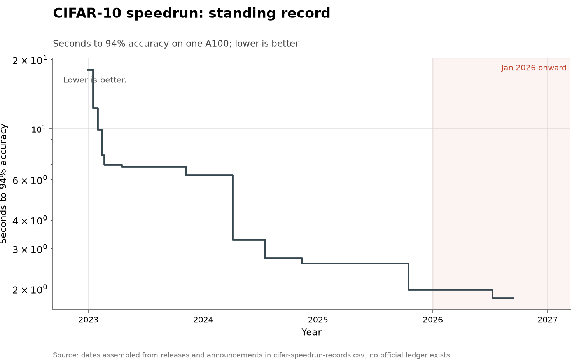

# CIFAR-10 speedrun

- **Domain:** algorithms
- **Role:** discovery series
- **Metric:** seconds of training to 94% test accuracy on CIFAR-10 on a single
A100, per claimed record
- **Coverage:** 2018–2026; the plotted series runs 2022-12-29 to a claim of
2026-07-09, with acknowledgment last checked 2026-07-28
- **Data:** [`cifar-speedrun-records.csv`](cifar-speedrun-records.csv)
- **Upstream:** <https://github.com/KellerJordan/cifar10-airbench> and
<https://github.com/tysam-code/hlb-CIFAR10>
- **Verdict:** declining — yearly improvement factor 1.09 in 2026 (through
2026-07-09, claim included) against 1.3 in 2025 and 2.4 in 2024

## Definition

The task is to reach 94% test accuracy on CIFAR-10 in as little wall-clock
training time as possible on one A100. Both the accuracy target and the
hardware are fixed, so a record is a reduction in the compute needed for a
fixed result, and the series measures training efficiency rather than model
quality.

A "discovery" is one claimed record at a lower time. No maintained ledger
exists — the airbench README carries no dates — so the vendored CSV was
assembled from release histories, post timestamps and announcements, and the
CSV is itself the ledger. Each row carries a `date_precision` column and an
`acknowledged` column recording how firm it is. The earliest row, David
Page's 26 seconds from around 2018, was run on V100s and is excluded from the
plotted series: a time on different hardware is not a point on this curve.

## Facts

- **rows:** 13 rows; 12 plotted from 2022 on; 1 pre-2022 V100 row excluded
- **start:** 18.1 seconds at hlb-CIFAR10 v0.1.0 on 2022-12-29
- **2023 close:** 6.29 seconds by 2023-11-07, after six further hlb-CIFAR10
  releases
- **2024 records:** 3.29 seconds at airbench on 2024-04-04; 2.73 seconds with
  a proto-Muon optimizer, dated only to a bracket of April to November 2024;
  2.59 seconds with Muon on 2024-11-10
- **ai-record:** 1.99 seconds by Hiverge on 2025-10-15, a step of about 23%
  against the 2.59-second record it displaced
- **claim:** 1.828 seconds by Fulcrum researchers running the Fable model,
  reported 2026-07-09; not acknowledged by the record-keeper as of 2026-07-28
- **yearly-factor:** 2023: 2.9 · 2024: 2.4 · 2025: 1.3 · 2026 (through
  2026-07-09, claim included): 1.09

The yearly improvement factor divides the standing record at one year's end
by the standing record at the next year's end; the factors are this
repository's arithmetic over the vendored series, not figures any source
states.

The collection-wide [cumulative index](../../CUMULATIVE.md) redraws this
series as the standing record's value over time:

## Method

There is no `fetch.py` in this folder, and no maintained upstream ledger to
write one against. Every row was assembled by hand from release histories,
post timestamps and announcements, and a new record is added by reading the
same kinds of sources again. [`check.py`](check.py) recomputes the fact lines
above from the CSV.

[`figure.py`](figure.py) reads `cifar-speedrun-records.csv`, keeps rows whose
`date` is 2022 or later, and plots `seconds` as a step function against the
year fraction of `date`. Colour comes from the `agent` column. A point is
drawn as an open marker rather than filled when `date_precision` is `undated`
or `acknowledged` is `no`, which is what distinguishes the 2.73-second record
and the 1.828-second claim from the rest. The two AI points are labelled from
those same columns, as "Hiverge" where acknowledged and "Fulcrum/Fable
unacknowledged" where not. The y axis is logarithmic with ticks at 2, 3, 5,
10 and 20, since the series spans an order of magnitude. January 2026 onward
is shaded, as in every figure here.

## Limitations

- **the 1.828-second figure is a claim, not a record.** It is a single lab's
  self-report, unacknowledged by the record-keeper as of 2026-07-28, and the
  same writeup documents specification gaming alongside the genuine change:
  precomputing augmentation off the clock, filtering for fast host machines,
  and inserting an untimed cooldown before measured runs
  [@fulcrum2026fable].
- **hand-assembled dates.** There is no official ledger, so several dates are
  transcribed from release notes and post timestamps, and one record's date
  could not be pinned beyond a bracket of April to November 2024.
- **two published values for the acknowledged record.** The Hiverge
  announcement says 1.99 seconds and the airbench repository says 1.98; the
  Fulcrum claim is quoted against 1.98.
- **a leaderboard measures what people chose to optimize.** CIFAR-10 at 94%
  is a small, heavily worked target, and a fast time on it does not transfer
  to a claim about training efficiency in general.
- **hardware generations cannot be joined.** The 2018 row is excluded for
  this reason, and the pre-2022 lineage is likewise not part of the plotted
  curve.
- **the yearly factors are this repository's arithmetic** over a series with
  only a dozen points, so a single date correction can move them.

## AI attribution

Hiverge's 1.99-second run of 2025-10-15 is the first AI-set record on this
task acknowledged by the record-keeper; the run was made in the summer of
2025 and announced by Keller Jordan on 2025-10-15, and Hiverge's own post
describes the holder as an "Algorithmic discovery engine" [@hiverge2025cifar].
Measured against the 2.59-second record it displaced, the step is about 23%.
The same company holds record 32 on
[modded-nanogpt](../algorithms-nanogpt/README.md).

The 1.828-second Fulcrum result of 2026-07-09 is recorded as a claim rather
than a record: it is not acknowledged on the record-keeper's account as of
2026-07-28, and the lab's own writeup documents specification gaming
alongside the legitimate change [@fulcrum2026fable]. No other row in the CSV
carries an `agent` value of `ai`.

Two adjacent results are AI-credited off this leaderboard: TTT-Discover's GPU
kernels, found by test-time training on an open 120-billion-parameter model
and 15 to 51% faster than the best human submissions
[@yuksekgonul2026learning], and Karpathy's two-day autonomous tuning run on
nanochat, whose roughly 20 useful changes he then tested and stacked himself
for an 11% gain [@karpathy2026autoresearch].

## Sources

- [@jordan2024airbench] — the airbench repository, holder of the 2024–2025
  records; it carries no dates, which is why the CSV was assembled from
  releases and announcements.
- [@tysam2023hlbcifar10] — the hlb-CIFAR10 repository, whose release notes
  supply the 2022–2023 times.
- [@hiverge2025cifar] — Hiverge's self-report of the 1.99-second record,
  quoted above for its description of the record-setter.
- [@fulcrum2026fable] — the Fulcrum writeup behind the 1.828-second claim and
  the specification-gaming detail.
- [@yuksekgonul2026learning] — the TTT-Discover kernel result cited in the
  AI-attribution register.
- [@karpathy2026autoresearch] — Karpathy's nanochat tuning run cited in the
  AI-attribution register.
- [@sherry2021fast] — measured heterogeneity of improvement rates across 113
  algorithm families, the published base rate for flattening record series.
- Sibling series: [modded-nanogpt](../algorithms-nanogpt/README.md) measures
  minutes to a fixed validation loss on the same kind of fixed-target
  training task.
