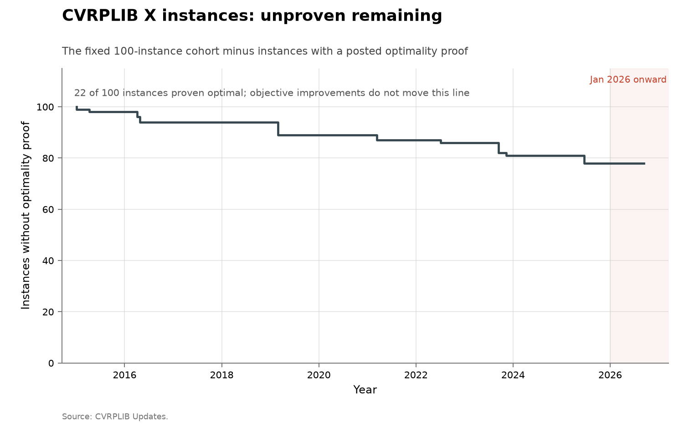

# CVRPLIB X-instance record frontier

- **Domain:** algorithms
- **Role:** discovery series
- **Metric:** better best-known objectives and later optimality proofs recorded
for a fixed cohort of 100 CVRP X instances, one event per posting
- **Coverage:** 2015–2026, 289 event rows posted through 2026-07-04
- **Data:** [`cvrplib-x-frontier.csv`](cvrplib-x-frontier.csv), one
instance–posting-date–objective–event tuple per row
- **Upstream:** <https://galgos.inf.puc-rio.br/cvrplib/index.php/en/updates/>
- **Verdict:** declining — 3 events in 2026 against 3 in 2025; 264 of the 267
better-objective events were posted 2015–2021

## Definition

The capacitated vehicle-routing problem asks for minimum-cost routes that
serve customers without exceeding vehicle capacity. CVRPLIB accepts improved
solutions, checks them, and posts each change to its chronological Updates
ledger.

This series freezes the 100 X instances introduced as one designed cohort. A
"discovery" is either a newly posted lower objective for an X instance or a
later proof that the standing objective is optimal. The two are counted
separately: finding a better route and proving no better route exists are
different algorithmic events. Every row is dated by the public ledger posting
date; receipt, paper and posting dates are not mixed.

## Facts

- **events:** 289 event rows: 267 better-objective events and 22
  optimality-proof events over 2015–2026
- **objectives by-year:** 2015: 56 · 2016: 65 · 2017: 6 · 2018: 13 ·
  2019: 5 · 2020: 117 · 2021: 2 · 2026: 3
- **proofs by-year:** 2015: 2 · 2016: 4 · 2019: 5 · 2021: 2 · 2022: 1 ·
  2023: 5 · 2025: 3
- **2024:** 2024 has no event for an X instance
- **last pre-2026 objective:** the last X-objective change before 2026 was
  posted 2021-06-30
- **2026 posting:** three objective rows in the 2026-07-04 posting: one for
  X-n979-k58 and two successive values for X-n1001-k43
- **proofs:** the 22 optimality-proof events cover 22 distinct instances

The collection-wide [cumulative index](../../CUMULATIVE.md) redraws this
cohort as instances remaining without an optimality proof:

## Method

[`fetch.py`](fetch.py) walks all five pages of the Updates ledger, selects
instance names matching the X convention, normalizes two historical omissions
of the `n`, and writes a row for each objective improvement or proof phrase.
Combined "improved and proven optimal" announcements intentionally create two
rows for an instance. The 2026 announcement reports receipt dates inside a
July 4 posting; the data uses the public ledger date consistently for every
row.

[`figure.py`](figure.py) counts rows by posting year and stacks proofs above
objective changes without treating them as the same event type.
[`check.py`](check.py) recomputes the fact lines above from the CSV.

## Limitations

- **the ledger starts late.** The update ledger begins after the X instances
  were introduced; it is not a reconstruction of their pre-ledger initial
  solutions.
- **batch postings.** A posting can contain work performed over a longer
  interval, so annual counts are publication cadence as well as discovery
  cadence.
- **the parser classifies the page's words.** It does not independently
  verify that every "improved" value beats the previous value, although
  CVRPLIB states that it checks submissions.
- **the frozen cohort excludes later sets.** Freezing X avoids
  benchmark-composition drift but excludes later Loggi, ORTEC, XML and XL
  records, including the 2026 BKS Challenge.
- **unweighted counts.** Event counts do not weight the magnitude or
  difficulty of improvements.

## AI attribution

No AI system or language model is identified in the update text for this
fixed cohort in the entries vendored through 2026-07-04. The 2026 entries are
attributed to named optimization researchers. This is an authorship statement
about the ledger's text, not a claim that no AI component was used anywhere
inside a solver.

## Sources

- [Updates ledger](https://galgos.inf.puc-rio.br/cvrplib/index.php/en/updates/)
  — the chronological posting log every row is fetched from; it states that
  submitted improvements are checked and that an optimality claim requires a
  citable method.
- [New benchmark instances for the Capacitated Vehicle Routing
  Problem](https://doi.org/10.1016/j.ejor.2016.08.012) — Uchoa and
  collaborators' paper introducing the X cohort and its design.
- [BKS Challenge overview](https://galgos.inf.puc-rio.br/cvrplib/index.php/en/bks_challenge/overview)
  — the separate 2026 challenge whose new XL instances are not joined to this
  fixed-cohort series.
- Sibling series: [MIPLIB 2017](../algorithms-miplib/README.md) counts
  announced solution updates for a different fixed instance library.
