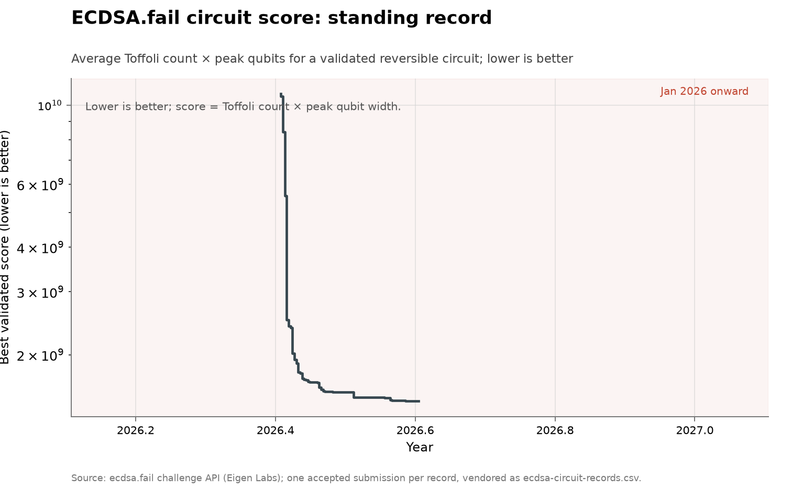

# ECDSA.fail secp256k1 point-addition circuit

**Domain:** algorithms
**Metric:** best validated score (average executed Toffoli count × peak qubit width) for a reversible secp256k1 point-addition circuit; lower is better
**Coverage:** 2026-05-30 to 2026-08-10, 433 accepted records
**Data:** [`ecdsa-circuit-records.csv`](ecdsa-circuit-records.csv)
**Upstream:** <https://ecdsa.fail/>, challenge harness and results at <https://github.com/ecdsafail/ecdsafail-challenge>, record ladder from the challenge API at <https://api.ecdsa.fail/api/benchmarks>
**Verdict:** too early — a single ten-week optimization sprint with no pre-agent-era baseline to compare against

## The problem

ECDSA.fail is an Eigen Labs challenge to build the leanest reversible quantum
circuit that performs one elliptic-curve point addition on secp256k1 — the
curve securing Bitcoin and Ethereum. Point addition is the inner primitive
Shor's algorithm repeats thousands of times to compute a discrete logarithm,
so its cost dominates the quantum resource estimate for breaking the curve.
Each submission is scored as the average executed Toffoli count times the peak
number of live qubits, and is accepted only after simulating correctly on 9024
test points whose inputs are fixed by a Fiat-Shamir hash of the submitted op
stream, so a circuit cannot be tuned against the test set. Lower is better.

This is a genuine discovery-event series by the repository's standard: each
accepted record is a validated improvement to a published performance frontier,
under a fixed and cheaply checkable success rule. It is unusual here in being
born entirely inside the agent era — the challenge opened on 30 May 2026 — and
in being, by the submitters' own notes, overwhelmingly AI-driven.

## What the chart shows

The score fell from the challenge's starting circuit at 1.08 × 10¹⁰ to
1.48 × 10⁹ over 72 days, about 7.3× lower, across 433 accepted records from 63
distinct solvers. The curve has the shape of an optimization sprint rather than
a steady rate: most of the ground is taken in the first few days — the largest
single step, on 31 May, cut the score from 9.59 × 10⁹ to 8.45 × 10⁹ — after
which improvements arrive in ever-smaller increments as the frontier hardens.

The dotted line is the best circuit published before the challenge, Google's
low-qubit Pareto point at roughly 3.0 × 10⁹ (as quoted in the challenge's own
README). The leaderboard passed it in June and the standing record now sits
about 2× below it. That crossing is the substantive claim of this series: an
open, AI-assisted contest improved on the best prior published construction for
this primitive within weeks.

Points are red where the submission's free-text note names an AI tool and grey
where it does not. 389 of the 433 notes name one; the model lines that
submitters volunteered are dominated by Claude Opus 4.8 (150), GPT-5 Codex
(77), and GPT-5 (64), with a long tail of Gemini, DeepSeek, Devin, and others.

The collection-wide [cumulative index](../../CUMULATIVE.md) redraws this series
as the standing record's value over time:

## How the chart was built

[`fetch.py`](fetch.py) reads the challenge API's list of accepted submissions
for the live `gpsanant/ecdsafail-challenge` benchmark. The API only accepts a
submission that beats the standing record, so the accepted submissions already
are the record ladder — one row per record, carrying its date, official score,
the Toffoli and qubit metrics behind it, the solver's username, and whether the
submission's note names an AI tool. Submissions dated after `lib/chart.py`'s
`AS_OF_DATE` are dropped so a refetch cannot push the vendored CSV past the
repository's committed snapshot date.

[`figure.py`](figure.py) plots score on a log axis against calendar day. The
whole series sits inside 2026, so the usual year axis would compress it to a
sliver; this uses month ticks on a day count instead. The two reference lines —
the starting circuit and Google's published point — are the anchors quoted in
the challenge README.

## What it cannot support

- **No pre-era baseline exists.** The challenge is ten weeks old and opened in
  the agent era, so this series cannot compare an agent-era rate against a human
  one. It shows that a burst happened, not that the burst is faster than some
  earlier norm — hence the "too early" verdict.
- **A record ladder is not a discovery rate.** The API stores only improving
  submissions, so the 433 rows are the winners, not the attempts; the many
  rejected and failed submissions behind them are not counted here. The
  front-loaded shape is what any bounded optimization contest produces.
- **The AI-tool flag is a lower bound from free text.** It is a regex over
  submitter-written notes, blank where no note was left (12 rows) and "no"
  where a note exists but names no tool (32 rows). It records what solvers
  chose to disclose, not an audited provenance.
- **The score is a benchmark metric, not a broken cipher.** A leaner point-
  addition circuit lowers the resource estimate for a future fault-tolerant
  attack on secp256k1; it does not threaten any deployed system today, and no
  quantum computer can run these circuits at scale.
- **One vendor's frontier is the comparison.** The "best prior" line is
  Google's Pareto point as quoted by the challenge organizers, not an
  independent recount of the cryptographic-engineering literature.

## LLM contributions

This is one of the few series in the collection where the discovery process is
openly and predominantly AI-driven, and the submitters say so themselves. Of
433 accepted records, 389 carry notes naming an AI tool, and 374 include an
explicit `Model:` line: Claude Opus 4.8 leads at 150, followed by GPT-5 Codex
(77) and GPT-5 (64), with Claude Opus 5, Devin, Gemini, DeepSeek V4 Pro, and
Grok among the rest. Notes describe the agents doing the actual cryptographic-
engineering work — merging Kaliski binary-GCD inverse steps across iteration
boundaries, tightening Solinas reductions, swapping in measurement-uncomputed
Cuccaro adders — with the human role often reduced to running the harness and
submitting. The result is a concrete, dated instance of AI systems improving a
published quantum-resource-estimation frontier through hundreds of small
verified optimizations, which is exactly the kind of contribution the wider
[cryptographic-weaknesses discussion](https://www.anthropic.com/research/discovering-cryptographic-weaknesses)
anticipates, on a narrow benchmark where every step is machine-checked.

## Related literature

The primitive and its resource cost are Litinski's, whose construction is the
reference point behind the challenge's frontier
[@litinski2023ellipticcurve]. The prior best circuits and the scoring metric
come from the challenge itself [@ecdsafail2026challenge]. The nearest series in
this collection are the other agent-era optimization ladders —
[modded-nanogpt](../algorithms-nanogpt/README.md) and the
[CIFAR-10 speedrun](../algorithms-cifar10/README.md) — which share the sprint
shape and the difficulty of separating a real capability gain from the
front-loading any fresh benchmark shows.
