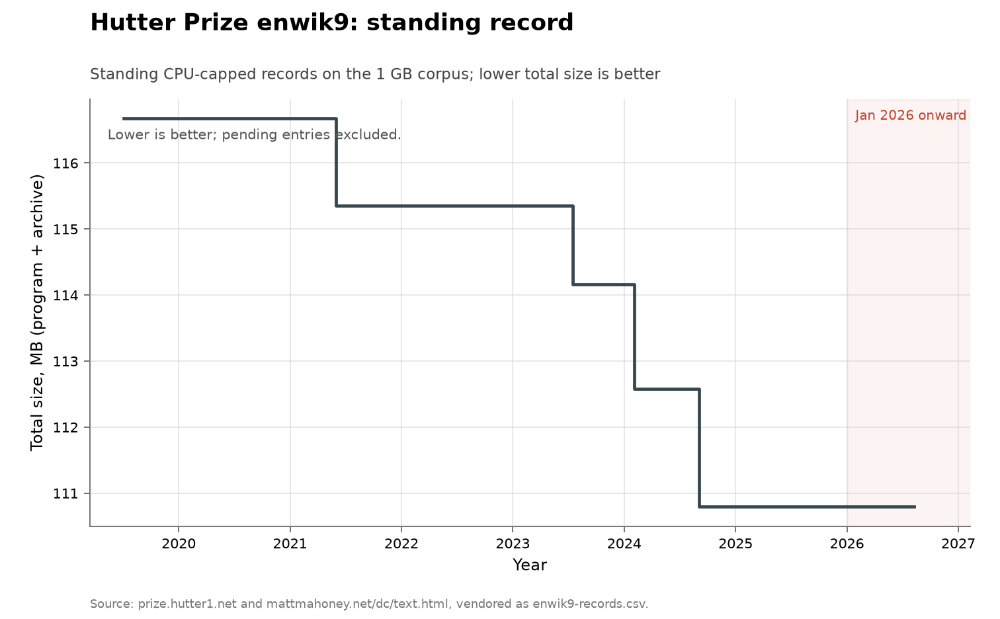

# Hutter Prize compression: enwik9

**Domain:** algorithms
**Metric:** total size in bytes of decompressor plus archive for a fixed 1 GB text corpus, under a CPU-time and memory cap
**Coverage:** 2019 baseline to 2026; the prize moved to enwik9 on 2020-02-21, and the uncapped comparator runs 2019 to 2023
**Data:** [`enwik9-records.csv`](enwik9-records.csv), holding both the `hutter_enwik9` and `ltcb_enwik9` series
**Upstream:** <http://prize.hutter1.net/> and <http://mattmahoney.net/dc/text.html>
**Verdict:** no acceleration

## The problem

Compress the first 10^9 bytes of a fixed XML dump of English Wikipedia, and be
scored on the compressed size including the size of the decompression program.
The corpus was frozen in 2006, so the task has no benchmark drift by
construction, and counting the decompressor closes the obvious loophole of
hiding the model in the program.

The prize also caps resources. Entries "must run in ≲50 hours using a single CPU
core and <10GB RAM and <100GB HDD on our test machine", which excludes GPUs.
That cap is why two series are plotted here rather than one: the prize is the
constrained series and Matt Mahoney's Large Text Compression Benchmark is the
same corpus with no cap, admitting GPU and TPU compressors. Holding the corpus
and the rules fixed for two decades is what turns a list of programs into an
efficiency curve.

A "discovery" is an awarded record. The prize pays only for improvements of at
least 1% over the standing record, so the ledger is a record of steps that
cleared a hurdle, not of every improvement made.

## What the chart shows

116,673,681 bytes at the 2019 phda9v1.8 baseline, then four awarded records:
starlit by Artemiy Margaritov on 2021-05-31, fast cmix by Saurabh Kumar on
2023-07-16, fx-cmix by Kaido Orav on 2024-02-02, and fx2-cmix by Kaido Orav and
Byron Knoll on 2024-09-03 at 110,793,128 bytes. Computed over the vendored
series, those steps are 1.13%, 1.04%, 1.38% and 1.59%: the 1.0 to 1.6% cadence
the prize's hurdle implies, held steady straight through the arrival of frontier
models. Together the four awarded records take the total down 5.0% from the 2019
baseline in five years.

One further entry is open rather than filled. cmix-lex, by Ibrahim Marcouch, was
announced on the benchmark page on 2026-06-26 at 109,190,109 bytes, a further
1.45% and inside the 109,685,196 needed to clear the 1% hurdle, but it was not an
awarded record on the prize site as read.

The dashed line is the sharper fact. The uncapped leaderboard, which permits
GPUs and neural compressors, has not moved since nncp v3.2 reached 107,261,318
bytes on 2023-10-23, despite active submissions below it through 2024 to 2026.
Three years of stall on an uncapped, cash-adjacent, fixed-corpus task spans
exactly the period of fastest growth in model capability.

Every record on both series is human. No entry on either page claims that a
language model or an agent wrote the compressor.

The retired 100 MB enwik8 prize supplies historical context but is not joined to
the curve because it is a different corpus. Its complete five-row chronology was:

| Date | Program | Total bytes | Status |
|---|---|---:|---|
| 2006-03-24 | paq8f -7 | 18,324,887 | pre-prize baseline |
| 2006-09-25 | paq8hp5 -7 | 17,073,018 | first award |
| 2007-05-14 | paq8hp12 -7 | 16,481,655 | second award |
| 2009-05-23 | decomp8 | 15,949,688 | third award |
| 2017-11-04 | phda9 | 15,284,944 | fourth award |

Alexander Rhatushnyak set all four awards, including the eight-and-a-half-year
gap before the last. The prize moved to enwik9 in February 2020. This context
shows that a long flat interval was normal before language-model agents, without
presenting incomparable byte levels as one time series.

The collection-wide [cumulative index](../../CUMULATIVE.md) redraws this series
as the standing record's value over time:

## How the chart was built

[`figure.py`](figure.py) calls the shared `compression_chart()` in
[`../../lib/families.py`](../../lib/families.py), which reads
`enwik9-records.csv`, keeps the rows whose `series` column matches, and
plots `total_bytes` divided by 10^6 against the year fraction of `date` as a step
function. Rows whose `award` column is anything other than `pending` are drawn
filled and joined by the solid line, which therefore includes the unawarded 2019
baseline; the pending row is drawn as an open marker labelled from its `program`
column, "cmix-lex, pending".

The second dashed series is specific to this figure. When the series is
`hutter_enwik9`, the function additionally selects the `ltcb_enwik9` rows and
draws them in grey dashes, with a corner note reporting the uncapped frontier as
flat since October 2023 at 107.3 MB. The axis is linear and in megabytes, since
the whole series moves by single-digit percentages and a log axis would flatten
the only structure there is. January 2026 onward is shaded.

The rows are transcribed by hand, so there is no fetcher that rebuilds them.
[`fetch.py`](fetch.py) is a staleness probe instead: it reads the prize page and
reports if the standing awarded record has been displaced, leaving the CSV and
this document to be updated by hand.

## What it cannot support

- **A hurdle censors the small steps.** The prize pays only above 1%, so
  improvements below that threshold are invisible here whether or not they
  happened, and the observed 1.0–1.6% cadence is partly an artefact of the rule.
- **Neural is not AI-authored.** The uncapped leader nncp uses a transformer
  architecture and cmix has carried an LSTM since 2016, but a hand-written
  neural compressor is not a model-written one. The distinction, and the search
  for any authorship claim, are the source log's.
- **The two pages do not agree on every byte count.** fx2-cmix is 110,793,128 on
  the prize site and 110,351,665 on the benchmark, because the archives and
  measurement conventions differ, and the benchmark's nncp v2 row prints a total
  equal to its archive-only size, apparently omitting a 99,671-byte
  decompressor. Quote whichever page you are using.
- **The rows were transcribed by hand from prose pages.** Neither upstream is a
  feed; both are HTML tables read and typed into the CSV, and the prize site was
  read over plain HTTP because its TLS certificate has expired.
- **The capped and uncapped series are not comparable in level.** They are
  different rules on the same corpus, which is why they share an axis but not a
  line style, and their difference is a statement about the cap rather than
  about progress.
- **A flat frontier is not a measured absence of effort.** Submissions continued
  below the leader, but nothing in the data counts how much search went into
  them.

## LLM contributions

None. No record on either the capped or the uncapped series credits a language
model or an agent, on a task that is fixed, publicly scored, cash-rewarded, and
verifiable by anyone who can run a decompressor. That absence is the point of
including the series: text compression is the closest thing in this collection to
a pure prediction task, which is what language models are trained to do, and it
is a series they have not entered.

The only nearby AI results are in different corners of the same domain: the
23% GPU kernel speedup in the AlphaEvolve paper [@novikov2025alphaevolve], and
kernels found by test-time training that beat the best human submissions by 15 to
51% [@yuksekgonul2026learning]. Neither is a compression record.

## Related literature

The two upstream ledgers are the prize itself [@hutter2026prize] and the
Large Text Compression Benchmark [@mahoney2026ltcb]. For the base rate against
which a three-year stall should be read, about half of all algorithm families
show little or no improvement over decades and improvements arrive at
roughly 1.44 per family since 1940 [@sherry2021fast]. The retired enwik8
chronology above is the same prize's own pre-agent cadence, where a single gap
between records ran eight and a half years.
