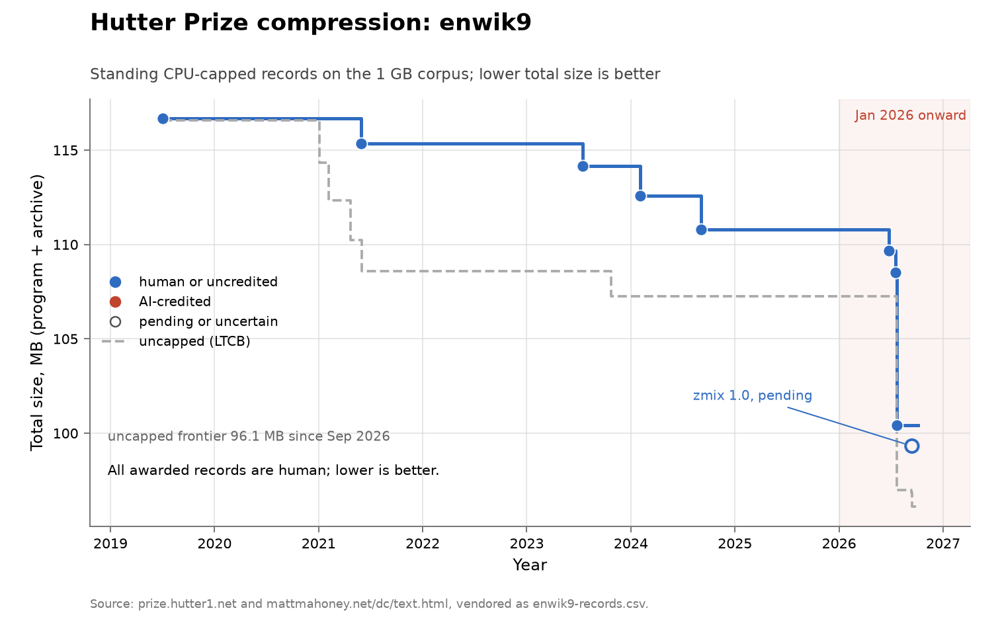
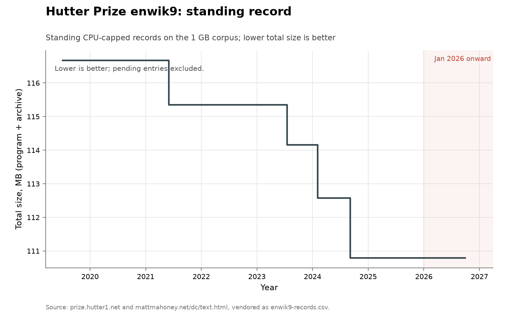

# Hutter Prize compression: enwik9

- **Domain:** algorithms
- **Role:** discovery series
- **Metric:** total size in bytes of decompressor plus archive for a fixed 1 GB
text corpus, under a CPU-time and memory cap, per awarded record
- **Coverage:** 2019 baseline to 2026; the prize moved to enwik9 on 2020-02-21;
prize site read 2026-10-03, benchmark page's own update dated 2026-09-30;
rows through the 2026-09-21 snapshot date
- **Data:** [`enwik9-records.csv`](enwik9-records.csv), holding both the
`hutter_enwik9` and `ltcb_enwik9` series
- **Upstream:** <http://prize.hutter1.net/> and
<http://mattmahoney.net/dc/text.html>
- **Verdict:** accelerating — 3 awarded records in 2026 against 0 in 2025 and
4 over 2021–2024; the 2026 awards cut the record 9.4% against 5.0% over
2019–2024

## Definition

The task is to compress the first 10^9 bytes of a fixed XML dump of English
Wikipedia, scored on the compressed size including the size of the
decompression program. The corpus was frozen in 2006, so the task has no
benchmark drift by construction, and counting the decompressor closes the
loophole of hiding the model in the program.

The prize caps resources:

> "must run in ≲50 hours using a single CPU core and <10GB RAM and <100GB
> HDD on our test machine"
> — Hutter Prize rules, prize.hutter1.net, read 2026 [@hutter2026prize]

The cap excludes GPUs at run time, so two series are plotted rather than one:
the prize is the constrained series, and Matt Mahoney's Large Text
Compression Benchmark is the same corpus with no cap, admitting GPU and TPU
compressors [@mahoney2026ltcb].

A "discovery" is an awarded record, dated by the date the prize site's record
table gives it, which is the submission date; the award itself can come
months later. The prize pays only for improvements of at least 1% over the
standing record, so the ledger records steps that cleared a hurdle, not every
improvement made.

## Facts

- **baseline:** 116,673,681 bytes at the 2019 phda9v1.8 baseline
- **awards to 2024:** starlit by Artemiy Margaritov on 2021-05-31 · fast cmix
  by Saurabh Kumar on 2023-07-16 · fx-cmix by Kaido Orav on 2024-02-02 ·
  fx2-cmix by Kaido Orav & Byron Knoll on 2024-09-03 at 110,793,128 bytes
- **awards of 2026:** cmix-lex by Ibrahim Marcouch & Kaido Orav on
  2026-06-26 · cmix-obias by David Freelan on 2026-07-19 ·
  fx2-cmix-transformer by Vladimir Ivanov on 2026-07-24 at 100,424,672
  bytes; all three awarded together on 2026-09-30
- **steps:** measured against the record each displaced, the steps are 1.13%,
  1.04%, 1.38%, 1.59%, 1.01%, 1.05% and 7.46%; the four awards of 2021–2024
  take the total down 5.0% from the 2019 baseline, the three awards of 2026
  take it down a further 9.4%, and the standing record is 13.9% below the
  2019 baseline
- **pending:** zmix 1.0 by James Byrne, listed on the benchmark page on
  2026-09-14 at 99,312,424 bytes of archive plus compressor, a further 1.11%
  and inside the 99,420,425 needed to clear the 1% hurdle; undergoing prize
  testing as of the benchmark page's 2026-09-30 update
- **uncapped:** nncp v3.2 reached 107,261,318 bytes on 2023-10-23 and stood
  until 2026-07-24; zmix 1.0 reached 96,096,261 bytes on 2026-09-14, the
  lowest uncapped entry dated on or before the 2026-09-21 snapshot

The 2026-07-24 step replaced a hand-built model with a small pretrained one:

> "It is derived from fx2-cmix by replacing the LSTM model with a transformer
> with 6M parameters pre-trained on enwik9 on 8 RTX 5090 GPUs for 26 hours,
> adding 2.9 MB to the compressor and decompressor. It does not need a GPU to
> run."
> — Large Text Compression Benchmark, fx2-cmix-transformer entry, read 2026-10-03 [@mahoney2026ltcb]

The award announcement:

> "Ibrahim Marcouch & Kaido Orav are the ninth Winners! David Freelan is the
> tenth Winner! Vladimir Ivanov is the eleventh Winner!"
> — Hutter Prize, prize.hutter1.net, news banner, read 2026-10-03 [@hutter2026prize]

The retired 100 MB enwik8 prize is a different corpus and is not joined to
the curve. Its complete five-row chronology:

| Date | Program | Total bytes | Status |
|---|---|---:|---|
| 2006-03-24 | paq8f -7 | 18,324,887 | pre-prize baseline |
| 2006-09-25 | paq8hp5 -7 | 17,073,018 | first award |
| 2007-05-14 | paq8hp12 -7 | 16,481,655 | second award |
| 2009-05-23 | decomp8 | 15,949,688 | third award |
| 2017-11-04 | phda9 | 15,284,944 | fourth award |

Alexander Rhatushnyak set all four enwik8 awards; the gap before the last
runs eight and a half years. The prize moved to enwik9 in February 2020.

The collection-wide [cumulative index](../../CUMULATIVE.md) redraws this
series as the standing record's value over time:

## Method

The rows are transcribed by hand from the two upstream pages, so there is no
fetcher that rebuilds them. [`fetch.py`](fetch.py) is a staleness probe
instead: it reads the prize page's record table and reports if its top
awarded row is smaller than the CSV's standing record, leaving the CSV and
this document to be updated by hand. [`check.py`](check.py) recomputes the
fact lines above from the CSV.

Prize rows carry the totals the prize site scores, which add the compressor
to the self-extracting archive; the pending row carries the same sum as the
benchmark page lists it. Benchmark rows carry the benchmark's own total and
keep only entries that set a new uncapped low.

[`figure.py`](figure.py) calls the shared `compression_chart()` in
[`../../lib/families.py`](../../lib/families.py), which reads
`enwik9-records.csv`, keeps the rows whose `series` column matches, and plots
`total_bytes` divided by 10^6 against the year fraction of `date` as a step
function. Rows whose `award` column is anything other than `pending` are
drawn filled and joined by the solid line, which therefore includes the
unawarded 2019 baseline; the pending row is drawn as an open marker labelled
from its `program` column, "zmix 1.0, pending". When the series is
`hutter_enwik9`, the function additionally selects the `ltcb_enwik9` rows and
draws them in grey dashes, with a corner note reporting the last uncapped
row's size and month. The axis is linear and in megabytes; January 2026
onward is shaded, as in every figure here.

## Limitations

- **a hurdle censors the small steps.** The prize pays only above 1%, so
  improvements below that threshold are invisible here whether or not they
  happened, and the 1.0–1.6% steps before 2026-07 are partly an artefact of
  the rule.
- **neural is not AI-authored.** fx2-cmix-transformer and the uncapped
  entries below it carry a transformer trained offline, nncp has used a
  transformer since 2021, and cmix has carried an LSTM since 2016; a trained
  model inside a compressor is not a model-written compressor.
- **training compute sits outside the cap.** The cap binds the run on the
  test machine; the 26 GPU-hours on 8 RTX 5090s that trained the
  fx2-cmix-transformer weights are not counted, only the weights' bytes.
- **the snapshot date leaves out a later entry.** The benchmark page lists
  cmix-lex-transformer lexth11c, dated 2026-09-27, below zmix 1.0 at
  95,836,613 bytes; it postdates the 2026-09-21 snapshot and is not in the
  CSV.
- **the two pages do not agree on every byte count.** fx2-cmix is
  110,793,128 on the prize site and 110,351,665 on the benchmark, because the
  prize adds the compressor and the benchmark does not, and the benchmark's
  nncp v2 row prints a total equal to its archive-only size, apparently
  omitting a 99,671-byte decompressor.
- **the rows were transcribed by hand from prose pages.** Neither upstream
  is a feed; both are HTML tables read and typed into the CSV, and the prize
  site was read over plain HTTP because its TLS certificate has expired.
- **the capped and uncapped series are not comparable in level.** They are
  different rules on the same corpus, which is why they share an axis but
  not a line style.
- **the 2026 awards came out together.** The three 2026 records were dated
  by submission across four weeks but awarded on one day, 2026-09-30, after
  a 2025 with no award; the dating rule spreads one announcement across
  three dates.

## AI attribution

No record on either the capped or the uncapped series credits a language
model or an agent as the author of a compressor, as of the prize-site read of
2026-10-03 and the benchmark page's update of 2026-09-30; entry write-ups and
source repositories were not read. The nearby AI-credited results in this
domain are not compression records: the 23% GPU kernel speedup reported in
the AlphaEvolve paper [@novikov2025alphaevolve], and GPU kernels found by
test-time training that beat the best human submissions by 15 to 51%
[@yuksekgonul2026learning].

## Sources

- [@hutter2026prize] — the prize site: the record table and award dates,
  the resource cap quoted above, the 1% improvement hurdle, and the award
  announcement.
- [@mahoney2026ltcb] — the Large Text Compression Benchmark: the uncapped
  rows, the pending zmix 1.0 entry and its compressor size, the
  fx2-cmix-transformer description, the lexth11c entry named in Limitations,
  and the enwik8 chronology.
- [@novikov2025alphaevolve] — the AlphaEvolve kernel speedup cited in the
  AI-attribution register.
- [@yuksekgonul2026learning] — the test-time-training kernel result cited in
  the AI-attribution register.
- [@sherry2021fast] — the published base rate: about half of algorithm
  families show little or no improvement over decades, with improvements
  arriving at roughly 1.44 per family since 1940.
