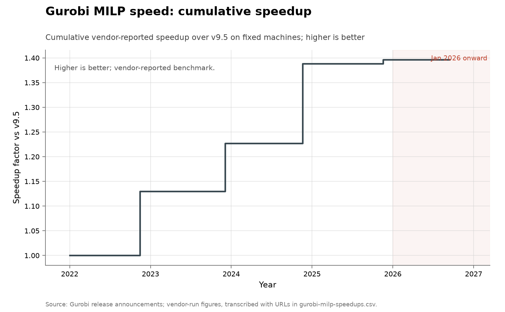

# Gurobi mixed-integer programming speed

**Domain:** algorithms
**Role:** discovery series
**Metric:** cumulative vendor-reported MILP speedup across releases, every
version rerun on one machine
**Coverage:** releases 10 through 13, announced 2022-11-14 to 2025-11-18,
baselined at version 9.5; transcription current to 2026-08-10
**Data:** [`gurobi-milp-speedups.csv`](gurobi-milp-speedups.csv)
**Upstream:** <https://www.gurobi.com/misc/lp/all/unmatched-performance>
(per-release announcement URLs are carried row by row in the CSV, for example
<https://www.gurobi.com/whats-new-gurobi-13-0/>)
**Verdict:** no acceleration — no 2026 release exists (series ends
2025-11-18); the 2025 release gained 0.6% against 13.1% in 2024 and a
cumulative 1.40× over 2022–2025

## Definition

Mixed-integer programming is the workhorse of applied optimization, and
solver speed on it is one of the oldest measured algorithmic-progress series.
Gurobi recompiles and reruns every released version on one bank of identical
machines, so the ratio between versions is machine-independent by
construction. The vendor reports both an overall MILP figure for models
taking over one second and a larger hard-model figure for those taking over
100 seconds; this series uses the overall figure throughout. The vendor
describes a 9,423-model test set, a 10,000-second time limit, and an Intel
Xeon E3-1240 v5 at 3.50 GHz with 4 cores, 8 hyper-threads and 32 GB of RAM
[@gurobi2026performance].

The fixed-hardware rerun design is Robert Bixby's, from the canonical
measurement of solver progress [@bixby2012history], now run by the company he
founded. A "discovery" is a released version that solves the same models
faster, dated by its announcement, so the unit is a release rather than a
paper or a record.

## Facts

- **releases:** v10: 13% on 2022-11-14 · v11: 8.6% on 2023-12-04 · v12:
  13.1% on 2024-11-19 · v13: 0.6% on 2025-11-18
- **cumulative:** a factor of 1.40 since version 9.5 across the four
  releases
- **hard-model bracket:** the 8.2% also reported for version 13 applies only
  to models taking over 100 seconds and is not mixed into this overall
  series
- **vendor-highlighted gains:** version 11's announcement highlights a
  5.8-fold speedup on nonconvex MIQCP
- **historical rates (cited, not vendored):** a 2013 survey recorded MIP
  algorithms as having "roughly doubled in speed each year"
  [@grace2013algorithmic]; Bixby's fixed-hardware test over CPLEX versions
  released 1991–2007 multiplies to a machine-independent factor of over
  29,000 [@bixby2012history]

The vendor's cumulative claim on its performance page moved between release
eras:

> "a more than 75x speedup on MILP since version 1.1"
> — Gurobi Optimization, unmatched-performance page, version-10-era capture (version 10 released 2022-11-14) [@gurobi2026performance]

> "A 92x speed-up over version 1.1"
> — Gurobi Optimization, unmatched-performance page, version-13-era capture (version 13 released 2025-11-18) [@gurobi2026performance]

Independent benchmarking of Gurobi ended during the covered window. Hans
Mittelmann's public benchmark page records that IBM and FICO demanded removal
after 2018, and:

> "In August 2024 Gurobi decided to withdraw from the benchmarks as well"
> — Hans D. Mittelmann, Benchmarks for Optimization Software, plato.asu.edu/bench.html, 2024 [@mittelmann2024benchmarks]

The collection-wide [cumulative index](../../CUMULATIVE.md) redraws this
series as the cumulative speedup factor over time:

## Method

There is no `fetch.py` in this folder. The four percentages are
hand-transcribed from prose release announcements, some of them through
archive captures, and each new release is read and typed in the same way.
Each row carries `credit`, `source` and `source_url`, so the provenance of
every percentage is in the data rather than only in this document.
[`check.py`](check.py) recomputes the fact lines above from the CSV.

[`figure.py`](figure.py) reads `gurobi-milp-speedups.csv` and takes the
running product of the `release_speedup` column in row order, so the plotted
quantity is cumulative rather than per-release. The line starts at 1.0 at the
beginning of 2022, steps at the year fraction of each `date`, and each point
is labelled from the `release` column. The whole series is drawn in the
collection's vendor grey rather than the human blue, because the figures are
the vendor's own and were not independently rerun; the corner note states the
cumulative factor and that no AI credit appears in the release notes. The
axis is linear and January 2026 onward is shaded, as in every figure here.

## Limitations

- **vendor-run figures on a vendor-selected test set.** Nothing here was
  independently rerun, the models are the vendor's choice, and thousands are
  discarded by the vendor's own rules before the ratio is computed.
- **no independent benchmark covers Gurobi after August 2024.** Following
  the withdrawal recorded by Mittelmann, the only MIP series covering
  2025–2026 is the one the vendor runs [@mittelmann2024benchmarks].
- **the series starts at version 9.5.** The per-version charts for versions
  2 through 9 are images that were not transcribed; the doubling-per-year
  and 29,000-fold figures come from the cited literature, not from these
  rows.
- **hand-transcribed point estimates.** The four `release_speedup` values
  are read off release pages, some through archive captures, and a
  cumulative product of four vendor point estimates carries no error bar.
- **the headline percentages are aggregates.** Each plotted value is the
  overall geometric-mean figure for models taking over one second; the same
  release can be quoted at two sizes, and version 13 is 0.6% overall against
  8.2% on hard models.
- **one date upstream is unverified.** Version 1.0's commonly cited 2009
  release is not confirmed on any primary Gurobi page; the vendor's own
  support table starts at version 7.0 in 2016. Nothing in this chart depends
  on it, but the cumulative "since version 1.1" claims do.

## AI attribution

No AI or language-model credit appears in the version 10 to 13 release
announcements as transcribed (announcement URLs carried row by row in the
CSV; transcription current to 2026-08-10) [@gurobi2025release13].

Two adjacent AI results in classical combinatorial optimization sit off this
series. AE-Kissat-MAB, a solver evolved with a language-model loop, won the
2025 SAT Competition's Main Sequential Track, solving 327 of 400 instances
against 321 for the human-written Kissat lineage it descends from
[@satcompetition2025results]; it is not placed on any curve in this
collection because the competition changes its benchmark set every year.
AlphaEvolve's data-centre scheduling heuristic is self-reported to recover
about 0.7% of fleet-wide compute, a production heuristic rather than a
solver record [@novikov2025alphaevolve].

## Sources

- [@gurobi2026performance] — the vendor performance page: the test-set
  description and the cumulative MILP claims quoted above, read from dated
  captures.
- [@gurobi2025release13] — the version 13 announcement: the 0.6% overall and
  8.2% hard-model figures.
- [@bixby2012history] — the fixed-hardware CPLEX measurement, the
  methodological parent and the source of the 29,000-fold historical factor.
- [@grace2013algorithmic] — the 2013 six-domain survey quoted above for the
  doubling-per-year rate; the report states its own optimistic selection
  bias.
- [@mittelmann2024benchmarks] — the independent benchmark page quoted above
  for the 2024 withdrawal.
- [@satcompetition2025results] — the 2025 SAT Competition results behind the
  AE-Kissat-MAB entry in the AI-attribution register.
- [@novikov2025alphaevolve] — the AlphaEvolve scheduling figure in the
  AI-attribution register.
- [@sherry2021fast] — the published base rate: about half of algorithm
  families show little or no improvement over decades.
- [@biere2023satmuseum] — historic SAT solvers rerun on one machine, finding
  progress "mostly rather slow, except for performance jumps in some years".
- Sibling series: [MIPLIB 2017](../algorithms-miplib/README.md) counts
  announced solution updates to a fixed instance library rather than solver
  release speedups.
