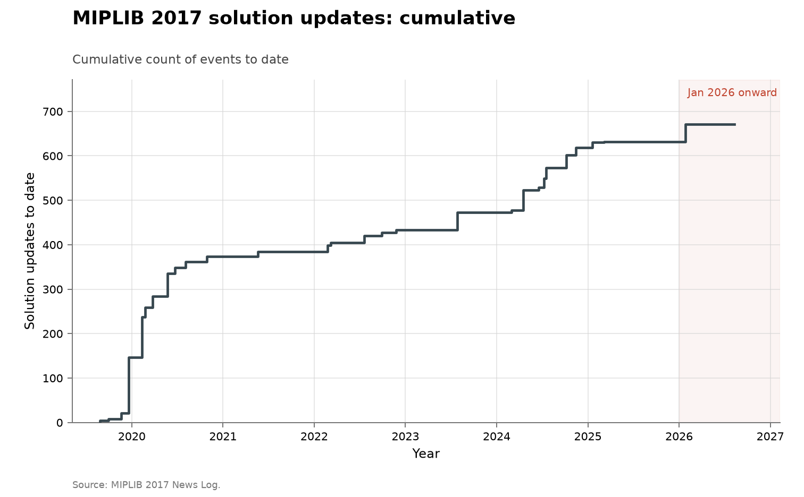

# MIPLIB 2017 solution frontier

**Domain:** algorithms
**Metric:** better feasible incumbents, first feasible solutions and optimality updates announced in MIPLIB 2017 solufile releases
**Coverage:** 2019-08-26 through 2026-01-26, 28 releases with explicit solution counts
**Data:** [`miplib-solution-releases.csv`](miplib-solution-releases.csv), one public solufile release per row
**Upstream:** <https://miplib.zib.de/news.html> and <https://miplib.zib.de/download.html>
**Verdict:** no acceleration — dense but batch-driven, with no sustained post-2020 rise

## The problem

MIPLIB is a standard public library of mixed-integer programs. Its maintainers
accept new solutions to open instances and periodically publish a new solution
file. This series treats the 2017 collection as a maintained frontier: a better
incumbent improves a known feasible objective, a first feasible solution closes
an instance with no prior incumbent, and an optimality update proves or records
that the frontier cannot be improved.

The three kinds are separated because they represent different work. The unit
in this table is the count stated in each release announcement, not a solver run
and not the number of changed lines in a downloaded solution file.

## What the chart shows

Across 28 releases, the log reports 599 better incumbents, 44 optimality updates
and 28 first feasible solutions. The largest waves are in late 2019 and early
2020; later years remain active, including 137 better incumbents during 2024 and
40 in the partial 2026 release, but do not show a rising rate over the full
window.

The counts also make the batch mechanism visible. A year with one large release
does not mean every improvement was found on that release date. The chart is a
history of public frontier updates, not a timestamped lab notebook.

The collection-wide [cumulative index](../../CUMULATIVE.md) redraws this series
as cumulative announced solution updates to date:

## How the chart was built

The News Log was transcribed into [`miplib-solution-releases.csv`](miplib-solution-releases.csv).
For announcements that give a total and say how many were first-known or
optimal, the categories are made disjoint. For example, the 91 improved
incumbents in February 2020 become 86 ordinary improvements, two first feasible
solutions and three optima. Open-to-hard/easy status changes are counted as
first feasible; “marked optimal” entries are kept in `optimal_status_only`.

[`figure.py`](figure.py) aggregates releases by year. [`fetch.py`](fetch.py) is a
staleness probe because the classification depends on prose; it checks whether
the live log has advanced beyond solufile 36. [`check.py`](check.py) recomputes
the totals in this document.

## What it cannot support

- Release dates are publication dates, not necessarily discovery dates.
- The news prose changes vocabulary across releases, so category boundaries
  require the explicit rules above.
- Counts do not measure objective magnitude or instance difficulty.
- The collection is substantially fixed, but corrected instances and status
  tags exist; this is cleaner than annual benchmark scores, not immutable.
- A newly optimal solution can overlap conceptually with an improved incumbent;
  the CSV makes categories disjoint to avoid double-counting.

## LLM contributions

None are stated in the release log. Submitters and solver provenance are not
recorded consistently enough in these aggregate announcements to infer whether
an AI tool contributed, so the absence of an AI label is not evidence of
absence.

## Related literature

The library's [history](https://miplib.zib.de/history.html) explains the sequence
of MIPLIB editions, while the [MIPLIB 2017 paper](https://doi.org/10.1007/s12532-020-00194-3)
documents collection and benchmark selection. The download page preserves old
solution files and fixed collection lists, allowing a future instance-level
reconstruction of objective magnitudes in addition to the public release counts
used here.
