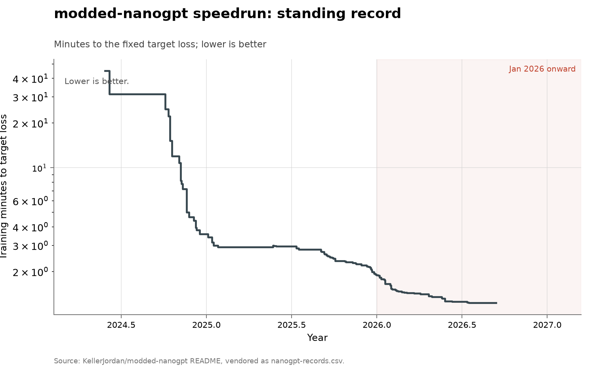

# modded-nanogpt training speedrun

**Domain:** algorithms
**Role:** discovery series
**Metric:** minutes of training to a fixed target validation loss, per
accepted record
**Coverage:** 2024-05-28 to 2026-07-17, all 89 records listed in the
repository README
**Data:** [`nanogpt-records.csv`](nanogpt-records.csv)
**Upstream:** <https://github.com/KellerJordan/modded-nanogpt> (record table
in the README at
<https://github.com/KellerJordan/modded-nanogpt/blob/master/README.md>)
**Verdict:** no acceleration — the standing record fell 1.5× in 2026 (33
records through 2026-07-17) against 1.9× in 2025 (39 records) and 12.6× in
2024 (17 records)

## Definition

modded-nanogpt is a public competition to train a GPT-2-scale language model
to a fixed target validation loss in as little wall-clock time as possible.
The target is fixed by the rules, so a record is the same capability reached
with less compute — an efficiency series rather than a capability series —
and an AI-set record is directly comparable with a human one.

A "discovery" is one record accepted into the README's table, dated and
credited to a named entrant. Every record carries a day-precise date and an
author, which is what allows the AI share to be counted rather than
estimated. The fixed-hardware assumption comes from the leaderboard's own
rules; the vendored CSV carries only the record number, date, minutes, agent,
credited AI system, and a note, so nothing in the data itself pins the
machine.

## Facts

- **span:** 45.0 minutes at the llm.c baseline of 2024-05-28, down to 1.23
  minutes at record 89 on 2026-07-17 — a reduction of about 37 times
- **records per period:** 17 records in 2024, 39 in 2025, and 33 in the
  first seven months of 2026
- **standing-record falls:** over the same three periods the standing record
  fell by a factor of 12.6, then 1.9, then 1.5
- **ai-records:** 5 records out of 89: record 32 to hiverge.ai at 2.625
  minutes (2025-09-11), record 60 to Locus at 1.765 (2026-01-16), record 69
  to Aster at 1.528 (2026-02-02), record 72 to Station at 1.496
  (2026-02-10), and record 87 to Recursive at 1.256 (2026-06-11)
- **ai-step-sizes:** measured against the record each displaced, the five AI
  steps are 1.2%, 0.9%, 0.5%, 1.3% and 0.8% — this repository's arithmetic
  over the vendored series, not figures the README prints
- **deep human steps (README figures):** the Muon optimizer at about 21% and
  U-Net skip connections at about 8%

The collection-wide [cumulative index](../../CUMULATIVE.md) redraws this
series as the standing record's value over time:

## Method

The rows are transcribed by hand, since attributing a record needs judgment
the README states only in prose. [`fetch.py`](fetch.py) is therefore a
staleness probe rather than a fetcher: it reads the upstream README and
reports if a record past the vendored series has been accepted.
[`check.py`](check.py) recomputes the fact lines above from the CSV.

[`figure.py`](figure.py) reads `nanogpt-records.csv`, converts each `date` to
a year fraction, and draws `minutes` as a step function through all 89 rows
with `kind=record`. Each record is a point coloured by the `agent` column,
red where it is `ai` and blue where it is `human`, with the AI points drawn
larger and labelled from the `ai_system` column. The y axis is logarithmic,
with ticks set explicitly at 1.5, 2, 3, 5, 10, 20 and 45; a linear axis would
compress the whole 2025–2026 stretch into the bottom of the frame. January
2026 onward is shaded, as in every figure here.

One discontinuity in the series has a documented cause. Records 22 to 24, in
May 2025, are slower than record 21 of January 2025 as printed in the
README's own table, because the leaderboard changed how it times a run after
record 21: ten formerly untimed warmup steps became timed, worth about 850ms,
and `torch._inductor.config.coordinate_descent_tuning` was banned, worth
about three seconds. Upstream re-timed record 21 under the new rules at 2.997
minutes and again on the then-current torch at 3.014. Against 3.014, records
22 to 24 at 2.990, 2.979 and 2.966 are improvements rather than a regression.
Both re-timings are vendored as `kind=retiming` rows and drawn as open
markers. Apart from the two re-timings, nothing is plotted with an open
marker on this series, because every record row carries a firm date and an
acknowledged holder.

## Limitations

- **a leaderboard measures what people chose to optimize.** Eighty-nine
  records on one training task say nothing about the value of the
  improvement, or about how much of it transfers to a model anybody ships.
- **the AI share is a floor.** The `agent` column reflects the README's own
  labels, so a record set with undisclosed model assistance counts as human.
- **the step sizes are this repository's arithmetic.** The README prints
  standing times, not per-record deltas; only the Muon and U-Net figures
  come from the source log.
- **nothing separates better ideas from more attention.** There is no
  denominator of effort, spend, or attempts, so a faster cadence cannot be
  split into better tools and more entrants.
- **approaching a floor is not the same as exhausting ideas.** Time to a
  fixed loss has a hard lower bound, so flattening is the expected shape
  late in any speedrun.

## AI attribution

Five of the 89 records are credited to AI-agent companies: hiverge.ai,
Locus, Aster, Station and Recursive, at the dates and times listed in the
fact lines above, each measuring roughly one percent against the record it
displaced. The README's entry for record 60 (Locus) is an explicit fused
Triton kernel [@kellerjordan2026moddednanogpt], and the CSV note for record
87 records a faster ReLU^2 kernel "credited to @cong_ml and AI System
Recursive". hiverge.ai also holds the first acknowledged AI record on the
[CIFAR-10 speedrun](../algorithms-cifar10/README.md), so the AI-set records
on the two ML speedruns partly belong to the same small set of firms. No
other record in the CSV carries an `agent` value of `ai`.

Two adjacent results are AI-credited off this leaderboard. TTT-Discover's
test-time-training harness, running the open gpt-oss-120b model, found TriMul
GPU kernels 15 to 51% faster than the best human submission depending on GPU
type [@yuksekgonul2026learning]. Karpathy left an agent tuning nanochat for
about two days in March 2026; it worked through roughly 700 changes, about 20
of which improved validation loss, after which Karpathy himself tested,
transferred and stacked them and measured an 11% cut in time to GPT-2
[@karpathy2026autoresearch].

## Sources

- [@kellerjordan2026moddednanogpt] — the leaderboard README: the record
  table every row is transcribed from, and the Muon and U-Net step figures.
- [@yuksekgonul2026learning] — the TTT-Discover kernel result in the
  AI-attribution register.
- [@karpathy2026autoresearch] — Karpathy's self-reported nanochat tuning run
  in the AI-attribution register.
- [@epoch2026driver] — Epoch AI's stated estimate of the labs' own
  unpublished training-efficiency curve: about 10 times a year inside an 80%
  interval of 2 to 50 times.
- [@sherry2021fast] — the published base rate across 113 algorithm families:
  half never improve at all, while 14% improve more than a thousandfold per
  year.
- Sibling series: the [CIFAR-10 speedrun](../algorithms-cifar10/README.md)
  measures seconds to a fixed test accuracy on the same kind of fixed-target
  training task.
