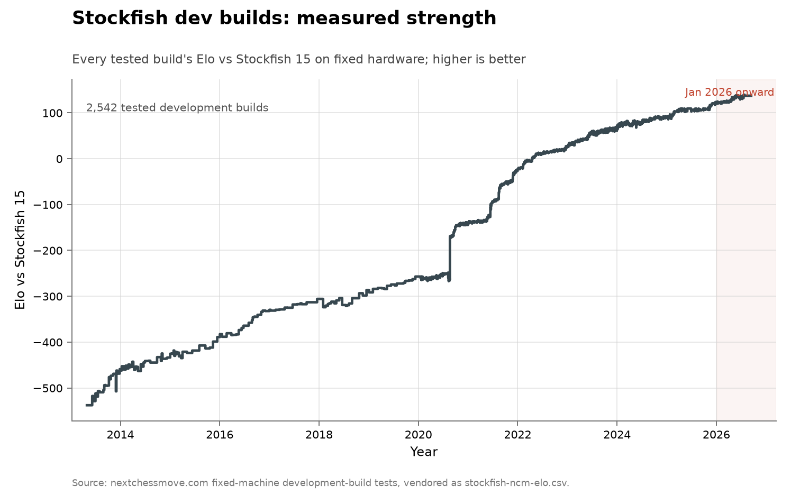

# Stockfish development builds on fixed hardware

- **Domain:** algorithms
- **Role:** discovery series
- **Metric:** Elo relative to Stockfish 15, from 20,000 games per build on one
fixed machine and time control
- **Coverage:** 2013-04-30 to 2026-07-26, 2,542 tested development builds
- **Data:** [`stockfish-ncm-elo.csv`](stockfish-ncm-elo.csv)
- **Upstream:** <https://nextchessmove.com/dev-builds>
- **Verdict:** no acceleration — 14 Elo through 2026-07-26 (annualizing to
about 24 Elo/year) against 32 Elo in 2025 and a 51 Elo/year mean over
2013–2026

## Definition

Stockfish is an open-source chess engine whose every development build is
played by a third party, nextchessmove.com, against one frozen opponent. In
the measurer's own description, "NCM plays each Stockfish dev build 20,000
times against Stockfish 15", on "Dell R7515 128-thread EPYC 7702 dedicated
servers", each playing "16 games concurrently with 30+0.3 time controls"
with hash at 128MB and threads at 8 [@nextchessmove2026devbuilds]. The
opponent, the hardware, the time control, the engine settings, and the
number of games are all held fixed, so what the series measures is software.

A "discovery" here is not a discrete record. The series measures every
build, so progress appears as a rise in the standing level, and the unit is
Elo per year rather than records per year. Each build is dated by its test.

## Facts

- **span:** Stockfish 3 measures −537.61 ± 7.82 against Stockfish 15 on
  2013-04-30, and the newest build measures +137.27 ± 1.97 on 2026-07-26 —
  about 675 Elo of pure software progress, averaging 51 Elo a year
- **builds:** 2,542 tested development builds
- **final-day spread:** 8 builds share that final date and span 136.67 to
  139.42, about three Elo of same-day measurement noise
- **nnue-era gains:** year-end to year-end, calendar 2020 gained about 117
  Elo and 2021 about 117, around the NNUE merge of 2020-08-06
- **recent gains:** the same year-end convention gives 49 in 2022, 41 in
  2023, 25 in 2024, 32 in 2025, and 14 through 2026-07-26, which annualizes
  to about 24
- **nnue patch (project figures):** Stockfish's regression tables put the
  NNUE patch at roughly 58 Elo — master against Stockfish 11 measured
  +25.49 six days before the merge and +83.42 just after — and the
  project's NNUE announcement described the gain as "currently on > 80 Elo"
  at faster time controls [@stockfish2020nnue]
- **external rate (cited, not vendored):** a 2013 survey rated chess
  engines at "around fifty Elo points per year over the last four decades"
  [@grace2013algorithmic]
- **llm-commit:** the first master commit whose message credits a language
  model is db98633b, merged 2026-07-26 — a 0.6% speed patch, not an Elo
  record

The collection-wide [cumulative index](../../CUMULATIVE.md) redraws this
series as the measured strength of every tested build:

## Method

The series was extracted by hand from a JavaScript data array on the
dev-builds page, with the release tags matched to builds afterwards, so
[`fetch.py`](fetch.py) is a staleness probe rather than a fetcher: it
reports if the page carries a build later than the last vendored one.
[`check.py`](check.py) recomputes the fact lines above from the CSV.

The CSV keeps upstream's test order, and the headline figures use the last
row as the newest build. 8 builds share the final date; taking the day's
maximum instead of the last test would report whichever run drew the easiest
games and move the span figure by a couple of Elo. Every calendar-year gain
above uses one convention: the last tested build of the year against the
last tested build of the year before.

[`figure.py`](figure.py) reads `stockfish-ncm-elo.csv` and draws
`elo_vs_sf15` against the year fraction of `date` as one thin line through
all 2,542 builds. Rows with a non-empty `release` column are additionally
drawn as points, so the twenty tagged releases from Stockfish 3 to Stockfish
18 are visible against the development noise. The LLM-credited commit is
drawn as one open red marker placed at the year fraction of 2026-07-26 and
at the last measured Elo value, annotated "first LLM-credited master commit:
0.6% speed patch, not an Elo record"; the open style marks a point that is
not a record on the plotted axis. The `elo_err` column is carried in the CSV
but is not drawn. The axis is linear, and January 2026 onward is shaded, as
in every figure here.

## Limitations

- **the LLM marker is a date, not a measured effect.** It is placed at the
  last measured point, so its height carries no information about what the
  patch did; the patch's own effect is the 0.6% speed figure quoted in its
  commit message.
- **a fixed opponent gets less informative as the gap grows.** Stockfish 15
  is now about 137 Elo weaker than master, and Elo measured against a much
  weaker opponent compresses.
- **the confidence intervals are in the data and not in the picture.** They
  run near ±8 Elo at the start of the series and near ±2 at the end.
- **the per-year rates depend on where the year is cut.** They are
  arithmetic over an irregularly sampled series, and drawing the year
  boundary at a different build moves single-year figures by several Elo.
- **the project's own regression tables cannot be read across 2023.**
  Stockfish changed opening books that year, which roughly doubles measured
  gaps — one release cycle measures +18.30 on the old book and +47.03 on
  the new one on the same day. This series holds one setup throughout, and
  the official tables should not be spliced onto it.
- **one credited commit is not a measurement of AI contribution.** The
  commit-message search says nothing about what tools contributors used
  without crediting them.

## AI attribution

One master commit. Commit db98633b of 2026-07-26 states the division of
labour in its own message:

> "The first version of this patch was coded up by gpt-5.5-high. I made many
> changes, but probably most of the lines of code are LLM-written"
> — official-stockfish/Stockfish, commit db98633b, 2026-07-26 [@stockfish2026llmcommit]

A human maintainer substantially rewrote it before it was merged. It is a
non-functional speed patch, measured at "speedup % = +0.60 +/- 0.08" in the
same commit message, and it passed the project's standard statistical gate.
A search of the repository's commit messages found no other commit crediting
a language model as of 2026-07-26, and no Elo gain in the thirteen years of
this series is AI-attributed in the vendored data.

## Sources

- [@nextchessmove2026devbuilds] — the third-party measurement quoted in
  Definition: 20,000 games per build against Stockfish 15 on fixed hardware
  and time control.
- [@stockfish2020nnue] — the project's announcement of the August 2020
  evaluation change that dominates the series, quoted above.
- [@stockfish2026llmcommit] — the commit message quoted in the
  AI-attribution register.
- [@grace2013algorithmic] — the 2013 survey quoted above for the historical
  chess-engine rate.
- [@biere2023satmuseum] — historic SAT solvers rerun on one machine, with
  progress "mostly rather slow, except for performance jumps in some years,
  which arguably happen with a frequency of 3 to 5 years"; a fixed-hardware
  series of the same design in a different domain.
- [@sherry2021fast] — across 113 algorithm families the distribution of
  improvement is bimodal rather than centred on its mean.
- Sibling series with AI-credited steps of the same order: the five
  AI-credited records on [modded-nanogpt](../algorithms-nanogpt/README.md)
  measure roughly one percent each; the acknowledged AI record on the
  [CIFAR-10 speedrun](../algorithms-cifar10/README.md) measures about 23%.
