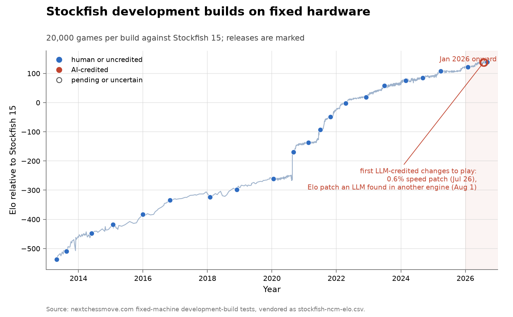
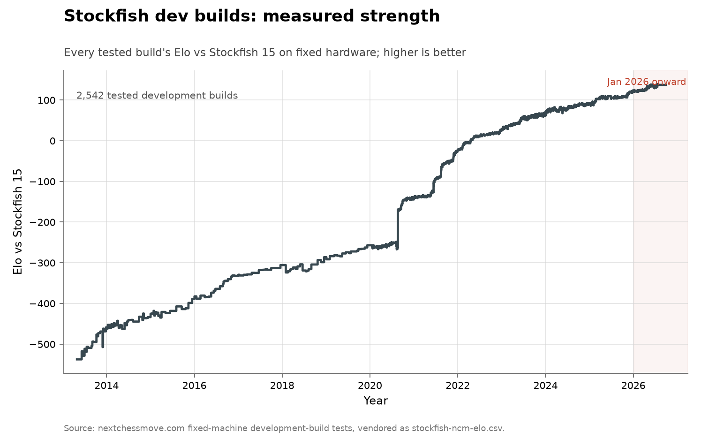

# Stockfish development builds on fixed hardware

- **Domain:** algorithms
- **Role:** discovery series
- **Metric:** Elo relative to Stockfish 15, from 20,000 games per build on one
fixed machine and time control
- **Coverage:** 2013-04-30 to 2026-09-22, 2,659 tested development builds
- **Data:** [`stockfish-ncm-elo.csv`](stockfish-ncm-elo.csv)
- **Upstream:** <https://nextchessmove.com/dev-builds>
- **Verdict:** no acceleration — 15 Elo through 2026-09-22 (annualizing to
about 21 Elo/year) against 32 Elo in 2025 and a 51 Elo/year mean over
2013–2026

## Definition

Stockfish is an open-source chess engine whose every development build is
played by a third party, nextchessmove.com, against one frozen opponent. In
the measurer's own description, "NCM plays each Stockfish dev build 20,000
times against Stockfish 15", on "Dell R7515 128-thread EPYC 7702 dedicated
servers", each playing "16 games concurrently with 30+0.3 time controls"
with hash at 128MB and threads at 8 [@nextchessmove2026devbuilds]. The
opponent, the hardware, the time control, the engine settings, and the
number of games are all held fixed, so what the series measures is software.

A "discovery" here is not a discrete record. The series measures every
build, so progress appears as a rise in the standing level, and the unit is
Elo per year rather than records per year. Each build is dated by its test.

## Facts

- **span:** Stockfish 3 measures −537.61 ± 7.82 against Stockfish 15 on
  2013-04-30, and the newest build measures +139.16 ± 1.95 on 2026-09-22 —
  about 677 Elo of pure software progress, averaging 51 Elo a year
- **builds:** 2,659 tested development builds
- **final-day spread:** 8 builds share that final date and span 139.16 to
  143.57, about four Elo of same-day measurement noise
- **nnue-era gains:** year-end to year-end, calendar 2020 gained about 117
  Elo and 2021 about 117, around the NNUE merge of 2020-08-06
- **recent gains:** the same year-end convention gives 49 in 2022, 41 in
  2023, 25 in 2024, 32 in 2025, and 15 through 2026-09-22, which annualizes
  to about 21
- **nnue patch (project figures):** Stockfish's regression tables put the
  NNUE patch at roughly 58 Elo — master against Stockfish 11 measured
  +25.49 six days before the merge and +83.42 just after — and the
  project's NNUE announcement described the gain as "currently on > 80 Elo"
  at faster time controls [@stockfish2020nnue]
- **external rate (cited, not vendored):** a 2013 survey rated chess
  engines at "around fifty Elo points per year over the last four decades"
  [@grace2013algorithmic]
- **llm-commit:** the first master commit whose message credits a language
  model with a change to play is db98633b, merged 2026-07-26 — a 0.6% speed
  patch, not an Elo record
- **llm-elo-patch:** the first master commit crediting a language model with
  an Elo-gaining idea is 218c74ec, merged 2026-08-01 — a search heuristic
  GPT 5.6 found in another engine's repository, passed at both time
  controls
- **llm-credited commits:** 7 master commits in 2026 through 2026-09-28
  credit a language model or AI tool; 2 change play (db98633b for speed,
  218c74ec for Elo) and 5 are marked "No functional change"

The collection-wide [cumulative index](../../CUMULATIVE.md) redraws this
series as the measured strength of every tested build:

## Method

[`fetch.py`](fetch.py) rebuilds the CSV from the JavaScript data array the
dev-builds page draws its chart from: one entry per tested build, carrying
the commit, the test date, the release tag where there is one, and the Elo
against Stockfish 15 with its error. Upstream repeats some recent entries
verbatim, so a commit already seen is skipped, and it back-fills and
re-measures older builds, so a refetch can revise rows before the last
vendored date as well as add new ones; the 2026-10-05 refetch added 17
builds from 2013 and 2018–2020 and replaced two re-measured ones.
[`check.py`](check.py) recomputes the fact lines above from the CSV.

The CSV keeps upstream's test order, and the headline figures use the last
row as the newest build. 8 builds share the final date; taking the day's
maximum instead of the last test would report whichever run drew the easiest
games and move the span figure by a couple of Elo. Every calendar-year gain
above uses one convention: the last tested build of the year against the
last tested build of the year before.

[`figure.py`](figure.py) reads `stockfish-ncm-elo.csv` and draws
`elo_vs_sf15` against the year fraction of `date` as one thin line through
all 2,659 builds. Rows with a non-empty `release` column are additionally
drawn as points, so the twenty-one tagged releases from Stockfish 3 to
Stockfish 19 are visible against the development noise. The two
LLM-credited changes to play are drawn as open red markers at the year
fraction of each commit's date (2026-07-26 and 2026-08-01) and at the last
build measured that day, and share one label, "first LLM-credited changes to
play: 0.6% speed patch (Jul 26), Elo patch an LLM found in another engine
(Aug 1)"; the open style marks a point that is not a
record on the plotted axis. The `elo_err` column is carried in the CSV
but is not drawn. The axis is linear, and January 2026 onward is shaded, as
in every figure here.

## Limitations

- **the LLM markers are dates, not measured effects.** Each is placed at the
  last build measured that day, so its height carries no information about
  what the patch did; the patches' own effects are in their commit messages
  and fishtest results.
- **a fixed opponent gets less informative as the gap grows.** Stockfish 15
  is now about 139 Elo weaker than master, and Elo measured against a much
  weaker opponent compresses.
- **the confidence intervals are in the data and not in the picture.** They
  run near ±8 Elo at the start of the series and near ±2 at the end.
- **the per-year rates depend on where the year is cut.** They are
  arithmetic over an irregularly sampled series, and drawing the year
  boundary at a different build moves single-year figures by several Elo.
- **the project's own regression tables cannot be read across 2023.**
  Stockfish changed opening books that year, which roughly doubles measured
  gaps — one release cycle measures +18.30 on the old book and +47.03 on
  the new one on the same day. This series holds one setup throughout, and
  the official tables should not be spliced onto it.
- **one credited commit is not a measurement of AI contribution.** The
  commit-message search says nothing about what tools contributors used
  without crediting them.

## AI attribution

Two master commits that change play. Commit db98633b of 2026-07-26 states the division of
labour in its own message:

> "The first version of this patch was coded up by gpt-5.5-high. I made many
> changes, but probably most of the lines of code are LLM-written"
> — official-stockfish/Stockfish, commit db98633b, 2026-07-26 [@stockfish2026llmcommit]

A human maintainer substantially rewrote it before it was merged. It is a
non-functional speed patch, measured at "speedup % = +0.60 +/- 0.08" in the
same commit message, and it passed the project's standard statistical gate.
Commit 218c74ec of 2026-08-01 is the first whose idea, not its code, is
credited to a model, and the first that gains Elo; it passed the project's
short and long time-control tests:

> "As an experiment I pointed some LLMs at other engine github repos to look
> for ideas to port to SF.  Most failed.  This one by GPT 5.6 from
> https://github.com/Yoshie2000/PlentyChess passed.  Congrats and credit to
> PlentyChess!"
> — official-stockfish/Stockfish, commit 218c74ec, 2026-08-01 [@stockfish2026llmelo]

The idea is a port of another engine's heuristic, so the model's
contribution was finding it, and the commit co-credits that engine's
author. A search of the repository's commit messages through 2026-09-28
found five more commits crediting a model or AI tool, each marked "No
functional change": 8cbca11a of 2026-05-29, the earliest, a macOS build
change carrying `Co-authored-by: Copilot Autofix powered by AI`; 439733ea (a Windows build fix "Claude fixed"), 01d71fc9
(`Co-authored-by: Claude Sonnet 5`), 8f6a95de ("Expected assembly changes
verified by Claude") and 248a8b86 ("AI assistance was used for the patch and
validation tooling"). The vendored data carries no build-level attribution,
so no Elo in the series is AI-attributed in the CSV itself.

## Sources

- [@nextchessmove2026devbuilds] — the third-party measurement quoted in
  Definition: 20,000 games per build against Stockfish 15 on fixed hardware
  and time control.
- [@stockfish2020nnue] — the project's announcement of the August 2020
  evaluation change that dominates the series, quoted above.
- [@stockfish2026llmcommit] — the commit message quoted in the
  AI-attribution register.
- [@stockfish2026llmelo] — the first LLM-credited Elo-gaining commit, quoted
  in the AI-attribution register.
- [@grace2013algorithmic] — the 2013 survey quoted above for the historical
  chess-engine rate.
- [@biere2023satmuseum] — historic SAT solvers rerun on one machine, with
  progress "mostly rather slow, except for performance jumps in some years,
  which arguably happen with a frequency of 3 to 5 years"; a fixed-hardware
  series of the same design in a different domain.
- [@sherry2021fast] — across 113 algorithm families the distribution of
  improvement is bimodal rather than centred on its mean.
- Sibling series with AI-credited steps of the same order: the five
  AI-credited records on [modded-nanogpt](../algorithms-nanogpt/README.md)
  measure roughly one percent each; the acknowledged AI record on the
  [CIFAR-10 speedrun](../algorithms-cifar10/README.md) measures about 23%.
