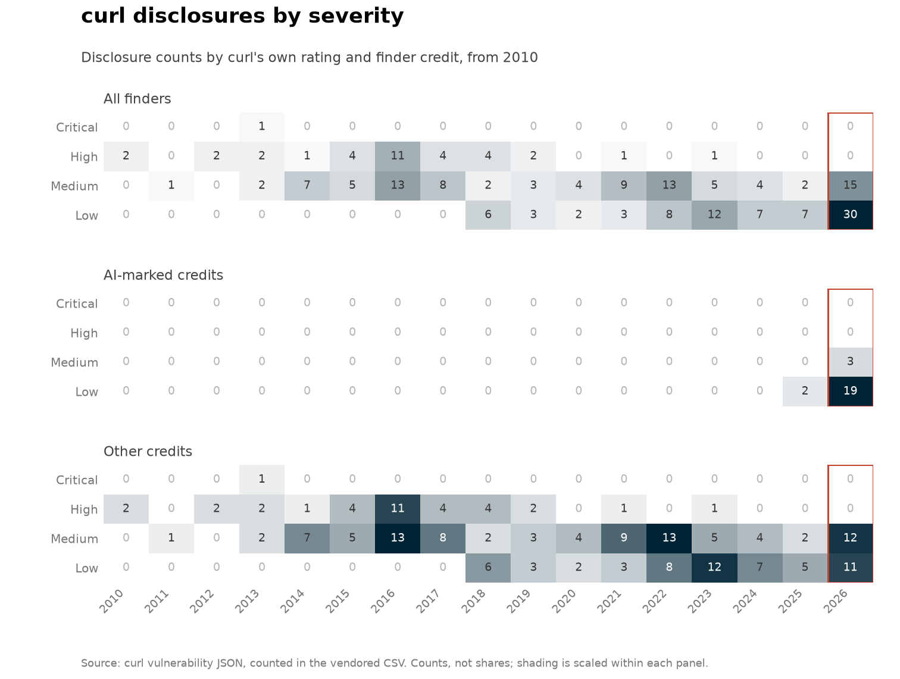
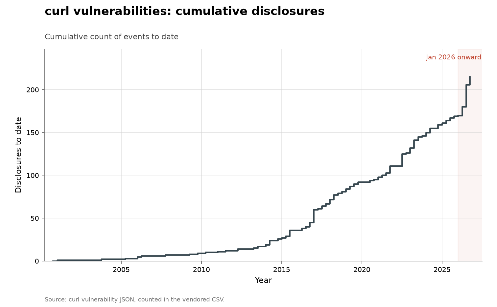

# curl vulnerability disclosures

- **Domain:** vulnerabilities
- **Role:** discovery series
- **Metric:** vulnerabilities disclosed per quarter, split by whether the finder credit carries an AI marker
- **Coverage:** 2000–2026, partial through 2026-06-24
- **Data:** annual [`curl-vulnerabilities.csv`](curl-vulnerabilities.csv) (severity detail in the same file); quarterly [`curl-vulnerabilities-quarterly.csv`](curl-vulnerabilities-quarterly.csv); per-finder [`curl-finders.csv`](curl-finders.csv)
- **Upstream:** <https://curl.se/docs/vuln.json> (human-readable at <https://curl.se/docs/security.html>)
- **Verdict:** accelerating — 36 disclosures through 2026-06-24 annualize to roughly 75 against 9 in 2025 and a 13.1/year mean over 2014–2023

## Definition

curl is a widely deployed C library and command-line tool. The project
publishes a machine-readable record of every vulnerability it has ever
disclosed, with a severity rating set by the maintainers and a credit string
naming who reported it.

A "discovery" in this series is one disclosed vulnerability, counted in the
quarter of its publication date. It is a disclosure count, not a count of
bugs introduced or bugs remaining. An "AI-marked" disclosure is one whose
credit string names an AI system or method, or names an AI-security
employer; the two signals are recorded separately in
[`curl-finders.csv`](curl-finders.csv) and combined into the annual and
quarterly tables' `ai_attributed` column.

## Facts

- **2026 (through 2026-06-24):** 36 disclosures; 15 AI-marked, 21 other
- **2026 annualized:** roughly 75 disclosures
- **prior rate:** 9 disclosures in 2025; a 13.1/year mean over 2014–2023
- **2026 quarters:** 2026-Q1: 10 · 2026-Q2: 26
- **ai-band severity (2026):** 12 of 15 AI-marked disclosures rated Low
  (80%), none High or Critical; 10 of 21 other disclosures rated Low (48%)
- **severity drift:** 2010–2022 disclosures were 18% Low and 28% High or
  Critical; 2023–2025 non-AI disclosures were 67% Low

The severity figure cuts the same rows by curl's own rating: one grid per
finder-credit cohort, years across, ratings down, every cell printing the
number of disclosures it holds. Shading is scaled within each panel, as the
note on the figure states.

The collection-wide [cumulative index](../../CUMULATIVE.md) redraws this
series as cumulative disclosures to date:

## Method

The CSVs are built by [`fetch.py`](fetch.py), which reads curl's JSON record
and buckets disclosures by publication year and quarter. The shared
classifier in [`../../lib/credits.py`](../../lib/credits.py) reads three
independent signals off each `FINDER` string: whether it names an AI system
or method (Big Sleep, Mythos, Claude, "agent"), whether it names an
AI-security employer (Aisle Research, AntAISecurityLab, OpenAI, Anthropic),
and whether it names fuzzing. The per-finder table
[`curl-finders.csv`](curl-finders.csv) records which band each credit falls
in. The annual and quarterly tables keep a single combined `ai_attributed`
column, true when a credit carries either AI signal; it describes the
credit's text, not the method used.

[`figure.py`](figure.py) calls the shared `periodic_stacked()` shape in
[`../../lib/families.py`](../../lib/families.py), drawing stacked quarterly
bars from `curl-vulnerabilities-quarterly.csv`: `other_attributed` in blue,
`ai_attributed` in red, the final quarter outlined rather than filled and
annotated with the annual table's `data_through` date. The axis is linear
and January 2026 onward is shaded, as in every figure here. The severity
figure comes from the same script through the shared `severity_heatmap()`
shape, built from the annual table's severity columns and normalized within
each panel. [`check.py`](check.py) recomputes the fact lines above from the
CSVs.

## Limitations

- **credit text is not method evidence.** Classification is by textual
  marker and errs in both directions: a researcher who used a model without
  saying so counts as human, and 14 of the 15 AI-marked credits of 2026 name
  only an employer.
- **severity is compared across the combined AI band.** The Low-severity
  shares above are computed against `ai_attributed`, so they describe
  reports from AI-security researchers rather than reports with a
  corroborated AI method.
- **2026 is a part-year**, and curl publishes in batches at releases, so the
  quarterly bars show batch timing as well as a discovery rate.
- **no denominator of effort.** A credit records who reported, not how much
  search anybody spent.
- **severity is one small team's judgment** applied over twenty-six years,
  and may not be consistent across that span.
- **triage load moved with the count.** The Register reports that curl
  closed its bug bounty in January 2026 after AI-assisted submissions
  reached about 20% of entries while genuine yield fell
  [@stenberg2026bounty].

## AI attribution

15 of the 36 disclosures of 2026 (through 2026-06-24) are AI-marked. One
credit names a system:

> "Andrew Nesbitt (powered by Mythos)"
> — curl credit string for one 2026 disclosure, vendored in [`curl-finders.csv`](curl-finders.csv), read 2026-08-14

The other 14 name an AI-security employer without stating a method: 9
credit Aisle Research ("Joshua Rogers (Aisle Research)" on 6, "Stanislav
Fort (Aisle Research)" on 3), 3 credit AntAISecurityLab hackerone handles,
1 credits "Filipe Casal of Trail of Bits in collaboration with OpenAI",
and 1 credits "Eunsoo Kim (Autonomous Code Security team at Microsoft)",
all quoted from [`curl-finders.csv`](curl-finders.csv) as read 2026-08-14.

2025 has 2 AI-marked disclosures: one system-naming credit,

> "Google Big Sleep"
> — curl credit string for one 2025 disclosure, vendored in [`curl-finders.csv`](curl-finders.csv), read 2026-08-14

and one affiliation-only credit, "Stanislav Fort (Aisle Research)". No
AI marker appears in any credit string before 2025, as of the 2026-06-24
snapshot. Stanislav Fort of Aisle Research appears in both curl and OpenSSL
finder tables ([`../cyber-openssl/`](../cyber-openssl/README.md))
[@googlebigsleep2024; @anthropicmythos2026; @aisle2026].

## Sources

- [@bloomberg2026recordflaws] — press reporting connecting the 2026
  disclosure records to AI systems; the counts here are built from curl's
  primary record, not from that reporting.
- [@googlebigsleep2024] — Google's vendor self-report on Big Sleep, the
  system named in the 2025 credit string.
- [@anthropicmythos2026] — Anthropic's Mythos preview, the system named in
  the 2026 "powered by Mythos" credit.
- [@aisle2026] — Aisle Research vendor commentary; Aisle researchers hold
  many of the AI-credited curl and OpenSSL findings.
- [@stenberg2026bounty] — The Register's report of the January 2026 bug
  bounty closure, cited for the limitation above.
- [@sherry2021fast] — measured heterogeneity of improvement rates across
  algorithm families; the published base rate for declining yields on a
  fixed target.
- Sibling series: [OpenSSL](../cyber-openssl/README.md) and
  [Firefox](../cyber-firefox/README.md) are the other fixed codebases with
  named finders; [all software: disclosed](../cyber-nvd-disclosed/README.md)
  counts CVE records across all software;
  [OSS-Fuzz](../cyber-oss-fuzz/README.md) is the no-AI automation baseline
  over codebases that include curl.
