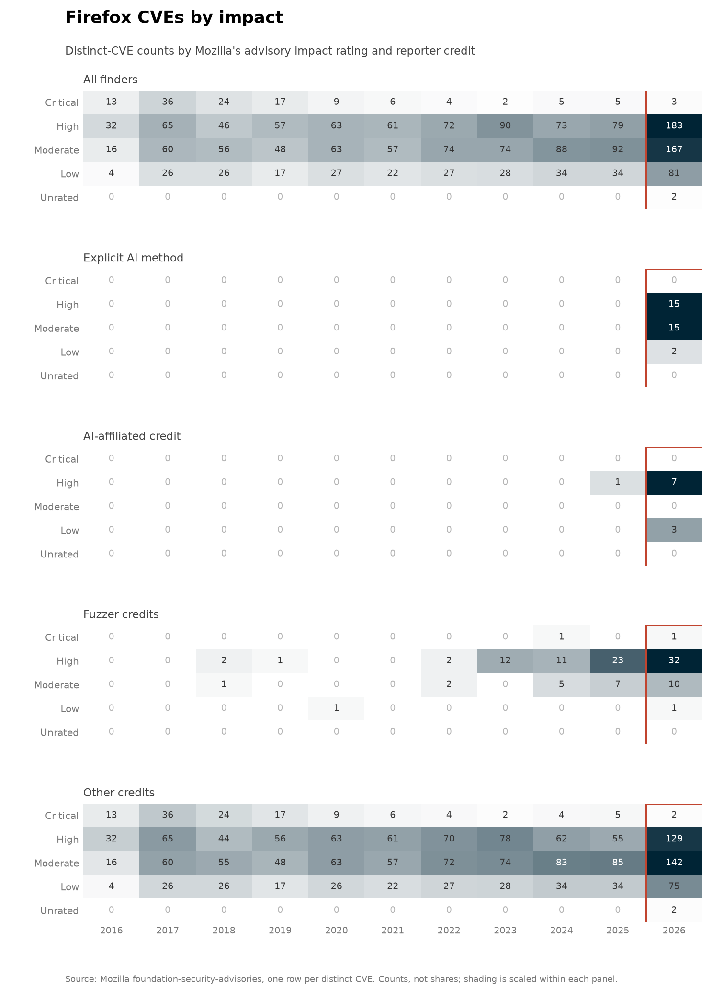
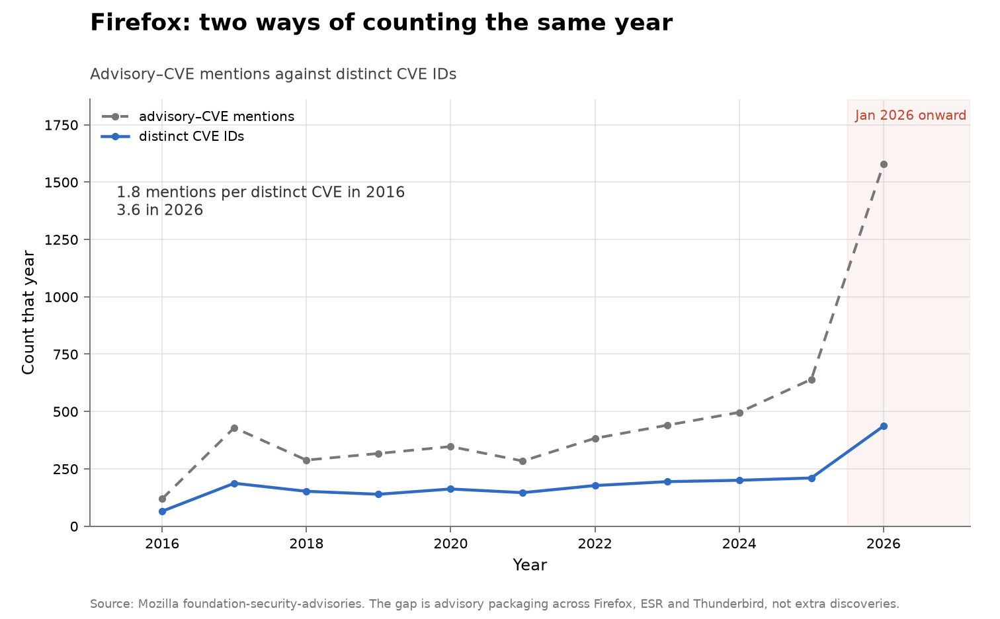
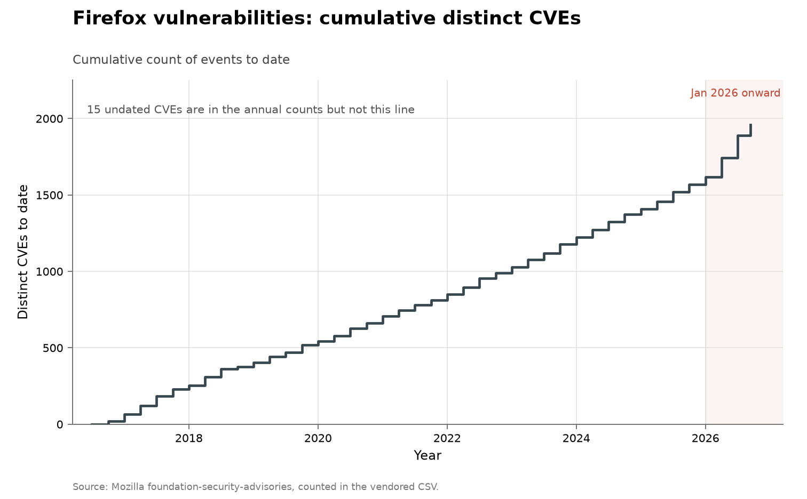

# Firefox vulnerability disclosures

**Domain:** vulnerabilities
**Role:** discovery series
**Metric:** distinct CVEs per quarter, split by whether the reporter credit names an AI method, an AI-security employer, a fuzzer, or none of these; advisory–CVE mentions retained as a sensitivity count
**Coverage:** 2016–2026, partial through 2026-08-04, the latest advisory in the snapshot
**Data:** per-CVE ledger [`firefox-cves.csv`](firefox-cves.csv); quarterly [`firefox-quarterly.csv`](firefox-quarterly.csv); annual [`firefox-advisories.csv`](firefox-advisories.csv); per-reporter rows in [`firefox-finders.csv`](firefox-finders.csv); every AI-marked CVE with its credit strings in [`firefox-ai-cves.csv`](firefox-ai-cves.csv)
**Upstream:** <https://github.com/mozilla/foundation-security-advisories> (rendered at <https://www.mozilla.org/en-US/security/advisories/>)
**Verdict:** accelerating — 342 distinct CVEs through 2026-08-04 against 210 in 2025; the part year alone is 1.6 times the 2025 full year

## Definition

Mozilla publishes one YAML file per security advisory, and each CVE inside
it carries a `reporter` string. The same CVE can appear in advisories for
several products or releases, so a mention count moves with how Mozilla
packages releases as well as with discovery. The counted unit is therefore
the distinct CVE ID: a flaw fixed in Firefox, Firefox ESR and Thunderbird on
the same day is one event, not three.

A "discovery" in this series is one distinct CVE ID appearing in that year's
advisories, dated by its earliest announcement. It is a disclosure count,
not a count of bugs found or bugs remaining. Each CVE carries one of four
credit bands: `explicit_ai` when a reporter string names an AI system or
method, `ai_affiliated` when it names only an AI-security employer, `fuzz`
when it names a fuzzer, and `other` otherwise. Because Mozilla's reporter
strings frequently name fuzzers, fuzzing is counted as its own band rather
than folded into the human or the AI side.

## Facts

- **by-year (distinct CVEs):** 2016: 65 · 2017: 187 · 2018: 152 ·
  2019: 139 · 2020: 162 · 2021: 146 · 2022: 177 · 2023: 194 · 2024: 200 ·
  2025: 210
- **2026 (through 2026-08-04):** 342 distinct CVEs, 1.6 times the 2025 full
  year; annualizes to about 578
- **2026 quarters:** 126 distinct CVEs in 2026-Q1 and 146 in 2026-Q2, each
  larger than any complete quarter before them
- **prior trend:** distinct CVEs rose 44% from 2021 to 2025; AI-marked CVEs
  over those years total 1
- **ai-marked:** 0 before 2025; 1 in 2025; 37 in 2026, or 11% of the part
  year — 32 name an AI system or method and 5 name only an AI-security
  employer
- **fuzz band:** 3 distinct CVEs in 2018, 4 in 2022, then 12, 17, 30 and 32
  across 2023–2026; the part year annualizes to about 54
- **mentions per distinct CVE:** 1.8 in 2016, 3.0 in 2025, 3.3 in 2026
- **impact mix (all finders):** 46% of distinct CVEs are rated High or
  Critical and 15% Low
- **impact mix (AI-marked):** of the 38 AI-marked CVEs, 19 are High, 15
  Moderate and 4 Low, with none Critical — 50% Low or Moderate against 54%
  across all finders
- **impact mix (fuzz):** 79 of the 100 fuzz-credited CVEs are High or
  Critical
- **remainders:** 15 of the ledger's 1,974 rows have no parseable
  announcement date; 1 of the 1,974 ledger rows carries an Unrated impact

The impact heatmap cuts the per-CVE ledger by Mozilla's own rating, one
count grid for all finders and one per credit band, each cell printing its
count. Unrated is a missing rating, not a mild one; its row stays on the
chart while the ledger holds such a row.

The counting-units chart plots the two units together. The gap between them
is Mozilla's packaging: more products shipping the same fix multiply
mentions without adding a distinct CVE.

The collection-wide [cumulative index](../../CUMULATIVE.md) redraws this
series as cumulative distinct CVEs to date:

## Method

The CSVs are built by [`fetch.py`](fetch.py), which walks every
`announce/*.yml` file in Mozilla's repository, takes each advisory's date
and year from its `announced` field — normalizing the ordinal forms a few
advisories write, like "December 15th, 2025" — and skips advisories
announced after the repository's snapshot date, so a refetch reproduces the
committed window. It classifies each CVE's `reporter` string with the shared
markers in [`../../lib/credits.py`](../../lib/credits.py):
`EXPLICIT_AI_METHOD` matches a named system or method (Claude, GPT, Gemini,
Big Sleep, Mythos, and the bare words "LLM" and "agent");
`AI_AFFILIATION` matches an employer (Anthropic, OpenAI, Aisle, XBOW,
ZeroPath, AntAISecurityLab); `FUZZ` matches "fuzz" and is orthogonal to
both, so an AI-written harness can be true in two columns at once. Bare
"Claude" is accepted only from 2024 onward, so a human reporter with that
given name cannot create a historical AI credit. Pre-2016 advisories do not
list CVEs in this structure, which is where the series starts.

Bars need one band per segment, so a display precedence applies: method,
then affiliation, then fuzz, then none. Where one CVE carries different
reporter strings in different advisories, its signals are unioned across the
year before that precedence is applied. The annual CSV keeps the
mention-level columns (`total`, `ai_attributed`, `fuzz_attributed`,
`other_attributed`) beside the distinct-CVE ones, so the older unit remains
auditable.

`firefox-cves.csv` is the ledger the aggregates summarize: one row per
distinct CVE per year, carrying its earliest announcement date and quarter,
the most severe impact any of its mentions carries, its credit band and its
verbatim reporter strings. `firefox-quarterly.csv` sums it by quarter and
band; rows with no parseable announcement date appear in the annual counts
but not in any quarter, and the main and cumulative charts state that
remainder.

[`figure.py`](figure.py) draws stacked quarterly bars from
`firefox-quarterly.csv`: `other` in blue, `fuzz` in amber, `ai_affiliated`
in pale red and `explicit_ai` in full red, with the `partial_quarter` bar
outlined. The two red bands are one colour family in two strengths because
they are two grades of evidence, not two kinds of finder. January 2026
onward is shaded, as in every figure here. The same script draws the impact
heatmap from the per-CVE ledger — shading scaled within each panel — and the
counting-units chart, kept as a separate figure because by 2026 mentions run
more than three times distinct CVEs and sharing an axis would flatten the
bars. [`check.py`](check.py) recomputes the fact lines above and fails when
the ledger, the quarterly sums and the annual bands stop agreeing.

## Limitations

- **the AI share has error in both directions.** A reporter string is free
  text, so a researcher who used a model and did not say so counts as human;
  equally, the 5 affiliation-only CVEs name an employer and not a method.
  Only the 32 method-naming CVEs are evidence about how a bug was found.
- **distinct CVEs still depend on Mozilla's process.** Deduplicating by CVE
  ID removes the product-packaging inflation but not the question of when
  Mozilla assigns one ID versus several to related flaws.
- **impact ratings inherit Mozilla's process.** Older advisories rate the
  advisory rather than each CVE, so the ledger falls back to the
  advisory-level `impact` where a CVE has no rating of its own, and a CVE
  mentioned at several impacts keeps the most severe.
- **a disclosure is not a discovery.** The count moves when Mozilla's own
  advisory process changes; the 2016–2017 step reflects a change in how
  Mozilla bundles CVEs into advisories, so the series is not comparable
  across that break.
- **the codebase is fixed but the effort is not.** Nothing here gives a
  denominator of search effort, and Mozilla's security investment grew over
  the period.
- **2026 is a part-year** through the latest advisory on 2026-08-04, so the
  final quarter's bar is outlined and is not comparable with the complete
  quarters beside it.

## AI attribution

Of the 37 AI-marked distinct CVEs in 2026, 31 are credited to a single
seven-person team using Claude; the credit string is identical on all 31
rows of [`firefox-ai-cves.csv`](firefox-ai-cves.csv):

> "Evyatar Ben Asher, Keane Lucas, Nicholas Carlini, Newton Cheng, Daniel
> Freeman, Alex Gaynor, and Joel Weinberger using Claude from Anthropic"
> — Mozilla advisory reporter string for CVE-2026-2763 and 30 further CVEs, vendored in [`firefox-ai-cves.csv`](firefox-ai-cves.csv), read 2026-08-14

Those 31 CVEs are roughly 9% of everything Firefox disclosed in 2026 through
2026-08-04. The remaining 6 AI-marked CVEs of 2026, with credit strings
quoted from the same file as read 2026-08-14: 3 credit "Amy Burnett of
OpenAI", 1 credits "Artur Cygan of Trail of Bits in partnership with
OpenAI", 1 credits "OpenAI Preparedness, Bill Demirkapi" — all affiliation
credits naming no method — and 1 carries the method-naming credit "Claude,
Kai Engert" (CVE-2026-14899).

The single AI-marked CVE of 2025 is CVE-2025-13016, whose reporter strings
are "Aisle Research | Igor Morgenstern" in the vendored ledger — an
affiliation with no method stated. No reporter string carries an AI marker
before 2025, as of the 2026-08-04 snapshot. Alex Gaynor also appears in
OpenSSL's finder table ([`../cyber-openssl/`](../cyber-openssl/README.md))
[@anthropicmythos2026; @aisle2026].

## Sources

- [@mozilla2026advisories] — the advisory repository every count here
  aggregates.
- [@bloomberg2026recordflaws] — press reporting connecting the 2026
  disclosure records to AI systems; the counts here are built from Mozilla's
  primary record, not from that reporting.
- [@anthropicmythos2026] — Anthropic's Mythos preview, background on the
  vendor whose model is named in the 31-CVE credit string.
- [@aisle2026] — Aisle Research vendor commentary; Aisle holds the single
  2025 AI-marked credit.
- [@hackerone2025autonomy] — HackerOne's platform statistics, the only
  public figures on how many reports autonomous systems file.
- Sibling series: [curl](../cyber-curl/README.md) and
  [OpenSSL](../cyber-openssl/README.md) are the other open-source fixed
  codebases with named finders; [OSS-Fuzz](../cyber-oss-fuzz/README.md)
  counts fuzzer-programme output over the same period, with no finder
  credit.
