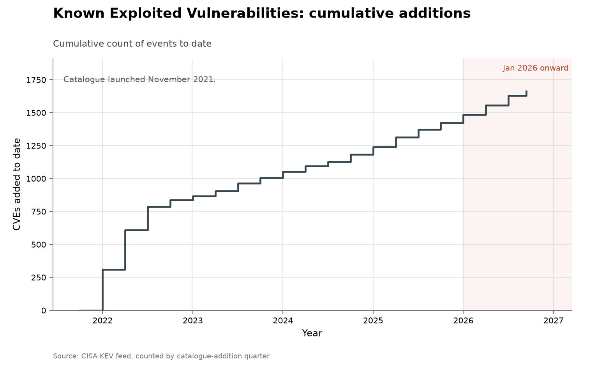

# All software: vulnerabilities known exploited

- **Domain:** vulnerabilities
- **Role:** discovery series
- **Metric:** CVEs added per quarter to CISA's Known Exploited Vulnerabilities catalogue
- **Coverage:** 2021–2026, from the catalogue's November 2021 launch, partial through 2026-08-10
- **Data:** quarterly [`kev-by-quarter.csv`](kev-by-quarter.csv); annual totals in [`kev-by-year.csv`](kev-by-year.csv)
- **Upstream:** <https://www.cisa.gov/known-exploited-vulnerabilities-catalog> (JSON feed at <https://www.cisa.gov/sites/default/files/feeds/known_exploited_vulnerabilities.json>)
- **Verdict:** no acceleration — 178 additions through 2026-08-10 annualize to about 293 against 245 in 2025 and a 206/year mean over 2023–2025

## Definition

CISA's Known Exploited Vulnerabilities catalogue lists CVEs that have been
observed being used against someone. An entry is dated by its `dateAdded`
field — when CISA added it, which can be years after the CVE was published.
The catalogue launched in November 2021, and its opening quarters populated
it with older entries.

A "discovery" in this series is one catalogue addition. It is a statement
about observed exploitation and about one agency's publication process, not
about when a flaw was found. The other series in this domain count what gets
found or disclosed; this one counts what gets used. The two clocks are not
aligned by cohort: dividing one year's additions by the same year's
disclosures does not give the share of that year's vulnerabilities that
turned out to be exploited.

## Facts

- **by-year:** 2021: 311 · 2022: 555 · 2023: 187 · 2024: 186 · 2025: 245
- **2026 (through 2026-08-10):** 178 additions; annualizes to about 293,
  +19% on 2025
- **total:** 1,662 entries through 2026-08-10
- **launch quarter:** all 311 of the 2021 additions land in 2021-Q4
- **backfill drain:** 2022 additions fall quarter by quarter from 298 to 31
- **disclosure comparator:** additions annualize to +19% growth in 2026
  while CVEs published in
  [all software: disclosed](../cyber-nvd-disclosed/README.md) annualize to
  +64%; both growth rates are this repository's arithmetic across the two
  folders' annual CSVs, not a figure any source states

The collection-wide [cumulative index](../../CUMULATIVE.md) redraws this
series as cumulative catalogue additions to date:

## Method

The CSVs are built by [`fetch.py`](fetch.py), which reads CISA's JSON feed
and buckets every entry by the year and quarter in its `dateAdded` field.
The catalogue was read complete at 1,662 entries on 2026-08-10. At that
read, 191 of the 311 entries added in 2021 and 464 of the 555 added in 2022
carried CVE identifiers from earlier years; the per-entry identifiers are
not vendored here, so those two counts are a fetch-time observation rather
than a fact recomputable from these CSVs. The identifier year is a
lower-bound diagnostic of the launch backfill: the tall 2021–2022 bars are
catalogue population, not a contemporaneous exploitation rate.

[`figure.py`](figure.py) calls the shared `periodic_stacked()` shape in
[`../../lib/families.py`](../../lib/families.py), drawing one bar per
quarter from the `kev_added` column of `kev-by-quarter.csv`. The bars are
blue because the catalogue carries no finder attribution to colour by. The
`partial_quarter` row is outlined in dark grey and annotated with its
`data_through` date; the axis is linear and January 2026 onward is shaded,
as in every figure here. The CSV starts in 2016, a range inherited from the
disclosure series this one is read against, but the chart drops the leading
all-zero quarters — found in the data, not hardcoded to a year — because
the catalogue did not exist before November 2021, and a zero drawn there
would read as a quarter in which nothing was added rather than a quarter
with no catalogue to add to. A note on the chart states the launch date.
This series and [all software: disclosed](../cyber-nvd-disclosed/README.md)
once shared a file and are drawn as separate figures because they differ by
two orders of magnitude; sharing an axis previously required a log scale.
[`check.py`](check.py) recomputes the fact lines above from the CSVs.

## Limitations

- **no pre-2021 baseline exists.** The catalogue began in November 2021, so
  the first bar covers two months and there is nothing before it to compare
  against. The 2021–2022 launch and backfill bars are not comparable to
  steady-state additions.
- **the dates are not aligned by cohort.** An entry is dated when CISA
  added it, not when the flaw was found or first exploited, so this series
  and the disclosure series do not describe the same set of vulnerabilities
  in any given year. Measuring the exploited share of a disclosure cohort
  would need per-CVE publication dates and per-CVE `dateAdded` values,
  neither of which this folder vendors; no claim about the exploited share
  of any cohort is made here.
- **this is exploitation observed and published by a US agency.** It is a
  floor on real exploitation and a policy artifact besides, responsive to
  CISA's own priorities and staffing.
- **nothing here is attributed.** The catalogue names no finder and no
  exploiter, so no row can be credited to or withheld from AI.
- **a flat count is not a flat harm.** Severity, breadth of deployment, and
  the cost of each exploited flaw are all outside this series. A few
  hundred entries a year is a thin, policy-shaped sample, and a flat count
  in the low hundreds cannot rule out a change in real exploitation the
  catalogue never saw; the 2022 figure is nearly three times the 2023 one
  with no AI near either.

## AI attribution

The catalogue records neither who found a flaw nor who exploited it. No
entry carries any AI credit, and none can, as of the 2026-08-10 read of the
feed [@cisa2026kev]. AI-side discovery claims sit in the finder-credited
series listed under Sources, not in this one [@googlebigsleep2024].

## Sources

- [@cisa2026kev] — the JSON feed every count here aggregates; entries are
  dated by when CISA added them.
- [@bloomberg2026recordflaws] — press reporting on the 2026 disclosure
  records; this folder's counts are read beside that reporting, not taken
  from it.
- [@googlebigsleep2024] — Google's vendor self-report of AI vulnerability
  discovery; no catalogue entry here is attributed to it or to any finder.
- [@folkerts2026cyberattack] — AISI's measurement of AI agents on
  multi-step cyber-attack scenarios, the offensive-capability series
  adjacent to this exploitation count.
- Sibling series:
  [all software: disclosed](../cyber-nvd-disclosed/README.md) counts CVE
  publications, a different unit on a different cohort clock;
  [curl](../cyber-curl/README.md) is the fixed-codebase series with named
  finders and severity ratings.
