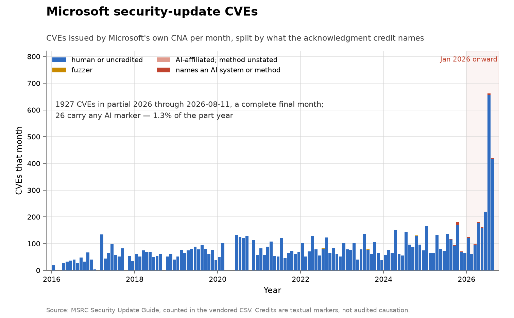
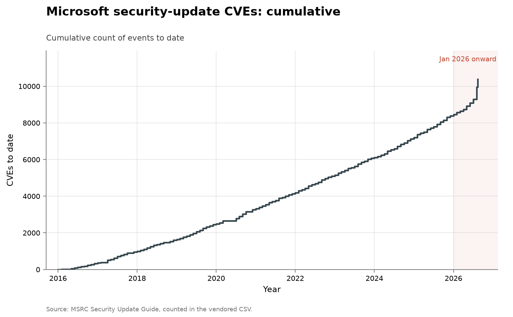

# Microsoft security-update CVEs

**Domain:** vulnerabilities
**Metric:** CVEs issued by Microsoft's own CNA per month, dated by first publication in the Security Update Guide, split by whether an acknowledgment credit names an AI method, an AI-security employer, a fuzzer, or none of these
**Coverage:** 2016–2026, partial through 2026-08-11; no February or March 2016 document exists upstream, so the first year is ten months
**Data:** [`msrc-cves.csv`](msrc-cves.csv); monthly counts by band in [`msrc-monthly.csv`](msrc-monthly.csv); per-credit rows in [`msrc-finders.csv`](msrc-finders.csv); every AI-marked CVE with its full credit strings in [`msrc-ai-cves.csv`](msrc-ai-cves.csv)
**Upstream:** <https://api.msrc.microsoft.com/cvrf/v3.0/updates> (rendered at <https://msrc.microsoft.com/update-guide>)
**Verdict:** accelerating — the 2026 part year annualizes to about 2.5 times 2025, and at most 1.3% of it carries any AI marker

## The problem

Microsoft ships security fixes in one coordinated monthly release — Patch
Tuesday, running since October 2003 — and publishes each month since January
2016 as a machine-readable CVRF document in the Security Update Guide, with
acknowledgments naming who reported most entries. That makes Microsoft the
fourth fixed codebase in this collection where the finder is named, and the
first closed-source one: curl, OpenSSL and Firefox are all open source, and a
Windows vulnerability is found against shipped binaries and a bug bounty
rather than a public repository.

How many CVEs a given Patch Tuesday contains is famously ambiguous: the
security-vendor recaps of June 2026 put the same release at anywhere from 200
to 568 items, because the monthly documents also republish CVEs Microsoft did
not author — Chromium fixes shipped through Edge, and from 2023 the Linux CVEs
of Azure Linux — and every tracker folds those in differently. This folder
pins one rule to the primary source instead: an entry counts when the CNA note
in its document says Microsoft, or when it has no CNA note at all, which is
the pre-2018 document format. Everything that rule excludes from the vendored
data is verifiably third-party — the excluded entries carry Chrome, Linux
distribution, curl or similar CNA notes. Each CVE is dated by the earliest
revision in its history across every document that mentions it, so an
out-of-band fix lands in the month it shipped.

A "discovery" here is one Microsoft-issued CVE first published that month. It
is a patch-and-disclosure count, not a count of bugs found or bugs remaining.

## What the chart shows

A vendor whose CVE count climbed, sat still, and then took off. Summed to
years, the monthly bars give 371 CVEs across ten documented months of 2016,
622 in 2017, then between 825 and 961 a year from 2019 through 2023, growth of
about 14% in each of 2024 and 2025 to 1,095 in 2024, then 1,243 in 2025 — and
1,927 CVEs through 2026-08-11, a part year already 1.55 times the 2025 full
year, annualizing to about 2.5 times 2025.

Drawing the series at its Patch Tuesday cadence locates the surge precisely.
The releases the recaps called the largest in Patch Tuesday's history are the
chart's two tallest bars: 220 CVEs dated June 2026, then 662 CVEs dated July
2026, 3.0 times the June record that had itself set the all-time high a month
earlier.

The AI bands barely register against that. No credit string carries an AI
marker until 2025, which has 17 AI-marked CVEs; the 2026 part year has 26
AI-marked CVEs, or 1.3% of the part year, of which 21 name an AI system or
method and 5 name only an AI-security employer. Whatever is driving the 2026
surge, it is not showing up in the acknowledgment strings: the growth is
overwhelmingly in the blue band. Nor is it fuzzing credit — the fuzzer band
never exceeds 2 CVEs in any year, because Microsoft's acknowledgments almost
never state a method at all.

The blue band is mostly named humans rather than silence: 87% of 2016's CVEs
carry at least one named credit, rising to 98% in the 2026 part year.

The collection-wide [cumulative index](../../CUMULATIVE.md) redraws this series
as cumulative CVEs to date:

## How the chart was built

[`figure.py`](figure.py) draws stacked monthly bars from `msrc-monthly.csv`:
`other` in blue, `fuzz` in amber, `ai_affiliated` in pale red and
`explicit_ai` in full red, in the same bands and colours as the
[Firefox series](../cyber-firefox/README.md). The part year ends on a complete
month — data run through 2026-07-31 — so no bar is drawn partial; the chart
note says where the data stop. January 2026 onward is shaded, as in every
figure here. The axis is linear and nothing is normalized.

The CSVs are built by [`fetch.py`](fetch.py), which walks every monthly
security-update document in the CVRF API — matched on document title, because
the IDs are irregular — and applies the CNA rule above. Documents released
after `lib/chart.py`'s snapshot date are skipped, which currently excludes the
August 2026 document released on 2026-08-11; a refetch after the date is
bumped picks it up. Acknowledgment strings are stripped of HTML and classified
with the shared markers in [`../../lib/credits.py`](../../lib/credits.py):
`EXPLICIT_AI_METHOD` for a named system or method, `AI_AFFILIATION` for an
employer, `FUZZ` for fuzzing, with one CVE's signals unioned across all its
credit strings before the display precedence — method, then affiliation, then
fuzz, then none — picks its band. Anonymized hex handles count as credits,
since an anonymous credit is still a credit. `msrc-monthly.csv` carries the
same four bands at the monthly grain, banded per CVE by the same rule, so the
months of a year sum to that year's row in `msrc-cves.csv`. The annual CSV
keeps an `acknowledged` column beside the bands, and a `no_customer_action`
column counting the cloud-service CVEs Microsoft patches itself, so both
caveats below stay auditable.

## What it cannot support

- **A disclosure is not a discovery, and here it is not even dated like one.**
  CVEs are batched to a monthly release cadence and published when fixed, not
  when found or reported; the 662 CVEs of July 2026 are a release event, and
  the gap between report and patch can be months. The count moves with
  Microsoft's triage and engineering throughput as much as with anyone's rate
  of finding.
- **Vendor policy moves the count.** In mid-2024 Microsoft began issuing CVEs
  for cloud-service flaws it patches itself, with no customer action required:
  23 CVEs in 2024, 68 in 2025 and 128 in the 2026 part year. That is real but
  small next to the surge — removing it entirely leaves the 2026 acceleration
  intact. Other policy shifts would not be so visible.
- **The AI share has error in both directions.** Acknowledgments are free
  text; a researcher who used a model silently counts as human, an
  affiliation-only credit may not have used one, and the SEC-agent team's
  marker is the word "agent" in its own name. Only the method-naming credits
  are evidence about how a bug was found, and even those are the finder's own
  account.
- **No severity or depth comparison.** The documents rate severity, but this
  folder has not extracted it, so a 2026 CVE cannot be compared in
  consequence with a 2019 one here.
- **The codebase is fixed but the surface and the effort are not.** Microsoft
  added cloud services, acquired products and an expanded bounty over the
  period, and nothing here gives a denominator of code or search effort.
- **Edges of coverage.** The first year is ten months, and a month with no
  bar — February 2017, for one — is a month in which no CVE has its earliest
  publication; 2026 is a part year through 2026-08-11, ending on the August
  Patch Tuesday rather than a complete month. The rare Microsoft-product CVE issued by another CNA — a 2022
  Windows SMB flaw issued by Rapid7's CNA, for instance — is excluded by the
  counting rule.

## LLM contributions

Concentrated in a handful of teams, like every finder-attributed series in
this collection. In 2025, all 17 credit the SEC-agent team — Hwiwon Lee,
Jongseong Kim and colleagues, an academic group whose SLYP pipeline runs
LLM agents end to end against Windows COTS binaries — 14 of them jointly with
ENKI WhiteHat [@secagent2026slyp]. In the 2026 part year, of the 26 AI-marked
CVEs, 14 credit the SEC-agent team, 7 credit Claude or Anthropic — Calif.io
and Milad Nasr of Anthropic "with Claude", and Adrian Denkiewicz at Doyensec
with Anthropic Research [@anthropicmythos2026] — 3 credit XBOW, an
affiliation with no method stated, and 2 credit another AI affiliation, both
naming a researcher "with OpenAI" on the August Patch Tuesday. One of the
Claude-credited CVEs is co-credited to Microsoft's own WARP and MORSE teams.
Set against the 1,927
CVEs of the part year, the story of this series is the same as Firefox's in a
heavier codebase: the AI credit is real, growing, and nowhere near large
enough to explain the record totals around it.

## Related literature

The June and July 2026 releases were covered as successive all-time records
[@arcticwolf2026june; @tenable2026july], and the spread across those recaps —
200 to 568 for the same June release — is the ambiguity this folder's counting
rule exists to remove; every count here is an aggregation of Microsoft's
published documents [@msrc2026sug]. Press coverage frames 2026 as AI finding
record numbers of flaws [@bloomberg2026recordflaws]; on this vendor, as on
[Firefox](../cyber-firefox/README.md), the AI-credited share is a sliver of a
much larger rise. The all-software counterparts are
[NVD disclosures](../cyber-nvd-disclosed/README.md), of which these CVEs are a
subset, and [known-exploited additions](../cyber-kev-exploited/README.md); the
open-source fixed codebases with named finders are
[curl](../cyber-curl/README.md), [OpenSSL](../cyber-openssl/README.md) and
[Firefox](../cyber-firefox/README.md), with
[OSS-Fuzz](../cyber-oss-fuzz/README.md) as the automation control. On the
reporting side, HackerOne's platform statistics remain the only public figures
on how many reports autonomous systems file [@hackerone2025autonomy].
