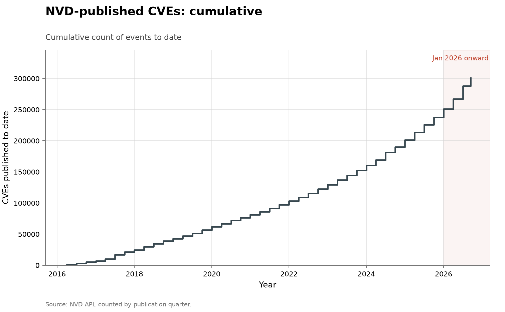

# All software: vulnerabilities disclosed

- **Domain:** vulnerabilities
- **Role:** discovery series
- **Metric:** CVEs published per quarter in the US National Vulnerability Database
- **Coverage:** 2016–2026, partial through 2026-08-10
- **Data:** quarterly [`nvd-by-quarter.csv`](nvd-by-quarter.csv); annual totals in [`nvd-by-year.csv`](nvd-by-year.csv)
- **Upstream:** <https://services.nvd.nist.gov/rest/json/cves/2.0> (human-readable at <https://nvd.nist.gov/vuln>)
- **Verdict:** accelerating — 49,838 CVEs through 2026-08-10 annualize to about 82,000, roughly 1.6 times 2025's 49,972, after +32% growth into 2024 and +23% into 2025

## Definition

This series counts every CVE published in the US government's vulnerability
database, across all software. There is no fixed codebase, so the population
being searched grows along with the count. There is no finder attribution.
A CVE is published when a numbering authority's process publishes it, so a
single organization's pipeline can move the aggregate without the world's
stock of bugs changing.

A "discovery" here is one CVE record, counted in the quarter NVD published
it. The 2016-to-2017 near-tripling is a process break — the expansion of CVE
numbering authorities — so the series is comparable only from about 2018.

## Facts

- **by-year:** 2016: 6,517 · 2017: 18,113 · 2018: 18,154 · 2019: 18,938 ·
  2020: 19,222 · 2021: 21,950 · 2022: 26,431 · 2023: 30,949 ·
  2024: 40,704 · 2025: 49,972
- **2026 (through 2026-08-10):** 49,838 CVEs, day 222 of the year;
  annualizes to about 82,000, roughly 1.6 times 2025
- **growth:** +32% into 2024 and +23% into 2025, against about +64%
  annualized for 2026
- **2026 quarters:** Q1's 16,255 topped every quarter before it; Q2's
  20,871 is another 28% above Q1 and 59% above 2025's largest quarter
- **doubling arithmetic:** a 2026 double of 2025 would require about 99,900
  disclosures; the annualized pace is about 82,000, or roughly 1.6 times

The annualization, the growth rates and the doubling arithmetic are this
repository's calculations over the vendored counts, not figures any source
states.

The collection-wide [cumulative index](../../CUMULATIVE.md) redraws this
series as cumulative CVEs published to date:

## Method

The CSVs are built by [`fetch.py`](fetch.py). NVD caps a query window at
120 days and rate-limits unkeyed callers, so each year is fetched as four
quarterly windows with a pause between calls and a backoff for the HTML
error pages the API returns when the limit is hit; the script reads
`totalResults` rather than the records themselves. Quarters are therefore
the query's native grain, and the annual file is their sum.

[`figure.py`](figure.py) calls the shared `periodic_stacked()` shape in
[`../../lib/families.py`](../../lib/families.py), drawing one bar per
quarter from the `nvd_published` column of `nvd-by-quarter.csv`. The bars
are blue, the colour this collection uses for human or uncredited finders,
because nothing in this series is attributed to anyone; there is no red band
to draw. The `partial_quarter` row is outlined in dark grey and annotated
with the `data_through` value. The axis is linear and January 2026 onward is
shaded, as in every figure here. The `kev_added` counts plotted in
[all software: known exploited](../cyber-kev-exploited/README.md) were once
a second column of this file and now live in that folder; the two are drawn
as separate figures because they differ by two orders of magnitude.
[`check.py`](check.py) recomputes the fact lines above from the CSVs.

## Limitations

- **a disclosure count is not a discovery count.** It rises when vendors
  process and publish more reports, whatever produced the reports.
- **no attribution of any kind.** Not one row here is credited to AI, to a
  human, or to a tool, so any AI reading of this chart is imported from
  elsewhere.
- **the population grows with the count.** There is more software every
  year and more numbering authorities publishing about it, so this is not a
  depletion curve on a fixed target the way the curl and OpenSSL series
  are.
- **one vendor can move the aggregate.** A CVE is published when a
  numbering authority's process publishes it, so one organization's
  internal pipeline shift shows up in the national count.
- **the enrichment step lags the submissions.** NIST reports 263% growth in
  submissions between 2020 and 2025, and enrichment of nearly 42,000 CVEs
  in 2025 that still fails to keep pace, so the published series reflects a
  processing constraint as well as a discovery one [@nist2026cvegrowth].

## AI attribution

No CVE record in this series carries a finder credit; nothing here can be
attributed to AI, to a human, or to a tool, as of the 2026-08-10 read of the
API [@nvd2026api]. Claims connecting the 2026 records to AI sit outside the
series: Anthropic's Mythos preview claims "thousands" of previously unknown
vulnerabilities, an unaudited vendor figure [@anthropicmythos2026], and
press reporting frames the 2026 records as AI-driven
[@bloomberg2026recordflaws]. Neither maps to identifiable rows here; for
attribution that can be counted, the fixed-codebase series under Sources
are the instrument.

## Sources

- [@nvd2026api] — the query interface behind every count here; windows are
  capped at 120 days and unkeyed callers are rate-limited.
- [@nist2026cvegrowth] — NIST's account of record CVE growth and its
  enrichment backlog, cited for the processing-constraint limitation.
- [@bloomberg2026recordflaws] — press reporting of record 2026 disclosure
  counts; the counts here are this repository's own query against the
  government API behind that reporting.
- [@anthropicmythos2026] — the Mythos preview, an unaudited vendor claim
  with no per-CVE mapping into this series.
- [@darpa2025aixcc] — the AI Cyber Challenge: seven autonomous systems
  measured on a fixed task set, which no aggregate disclosure count
  supplies.
- Sibling series:
  [all software: known exploited](../cyber-kev-exploited/README.md) counts
  catalogue additions for observed exploitation, a different unit on a
  different clock; [curl](../cyber-curl/README.md) is a fixed codebase with
  named finders; [Microsoft](../cyber-microsoft/README.md) counts one
  vendor's own CVEs, a subset of this aggregate.
