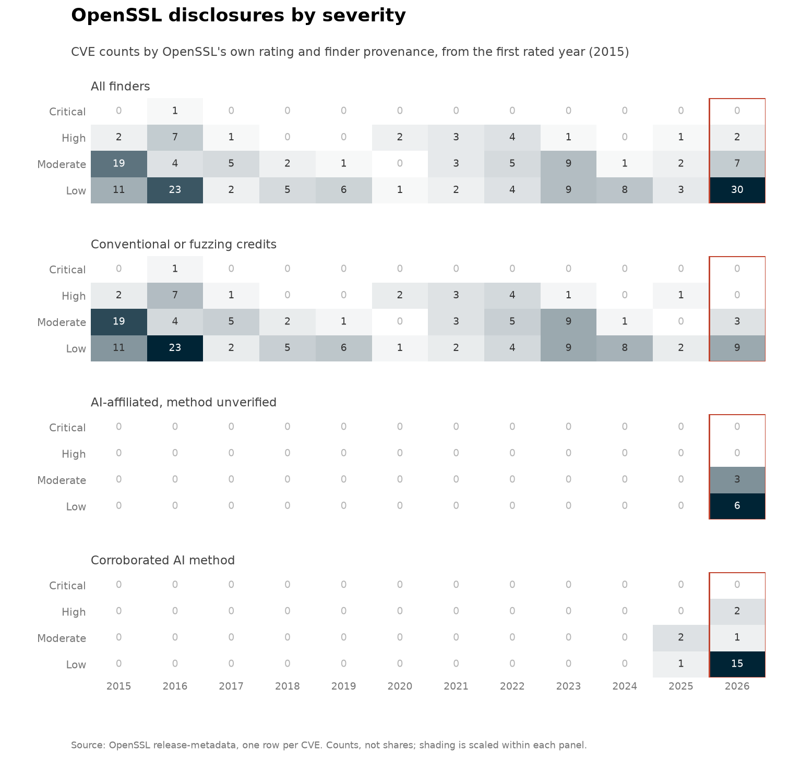
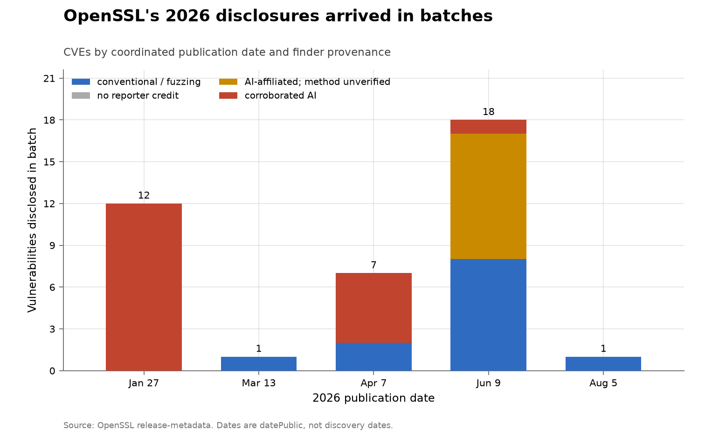
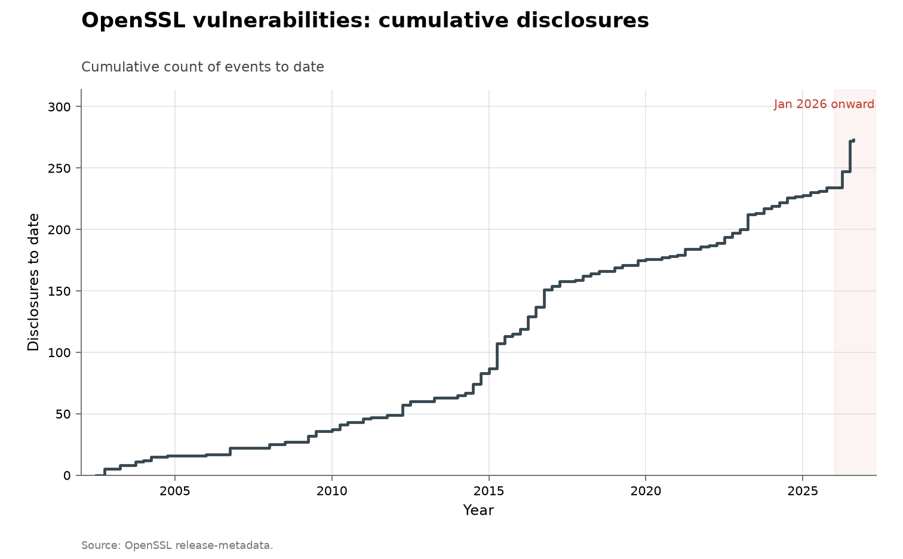

# OpenSSL vulnerability disclosures

**Domain:** vulnerabilities
**Metric:** vulnerabilities disclosed per quarter, split by finder provenance
**Coverage:** 2002–2026, partial through 5 August 2026
**Data:** CVE-level [`openssl-cves.csv`](openssl-cves.csv); annual [`openssl-vulnerabilities.csv`](openssl-vulnerabilities.csv); per-finder [`openssl-finders.csv`](openssl-finders.csv)
**Upstream:** <https://github.com/openssl/release-metadata/tree/main/secjson>
**Verdict:** accelerating — a record 2026 surge, with provenance and release-batching caveats


## The problem

OpenSSL is a widely deployed, security-critical cryptographic library. Its
official security metadata provides a publication date, project severity,
reporter and remediation credits, affected version ranges and references for
each CVE.

OpenSSL is a fixed *project*, not a fixed body of code. Code size, features,
supported versions and bug surface change. New bugs continue to be introduced;
for example, the January 2026 QUIC cipher-handling vulnerability
CVE-2025-15468 affected code added with QUIC support in OpenSSL 3.2. The series
therefore cannot assume that a fixed stock of findable bugs should deplete, or
rule out “more software to search” as an explanation.

A disclosure here is one CVE in the year of OpenSSL's `datePublic`. It is not a
discovery date, a count of bugs introduced or a measure of bugs remaining.
Finder provenance identifies who reported a CVE and, when separately
corroborated, the reported method; it does not measure search effort.

## What the chart shows

OpenSSL recorded 39 by 5 August 2026, more than any previous complete calendar
year. The largest pre-2026 totals were 35 in 2016 and 32 in 2015. Those earlier
bursts show that unusually high disclosure rates occurred before modern AI,
although 2026 has already surpassed them by 5 August.

The like-for-like partial-year comparison is also a record: 39 versus 27
disclosures from 1 January through 5 August 2015, 19 in the same period of 2016,
and 16 in 2023. Comparing only partial 2026 with complete prior years understates
rather than creates the numerical record.

Of the 39 CVEs in 2026, 18 have finding-level evidence of AI use, and 9 more name
an AI-security affiliation, but their discovery method is unverified. The other
12 have conventional reporter credits; none is uncredited or explicitly
fuzz-attributed. This replaces the previous claim that 27 of 39 were “explicitly
AI-credited”: 27 of 39, or 69%, have an AI-lab affiliation or an explicit AI
method marker, but affiliation alone is not method evidence.

OpenSSL's severity mix shows why the raw total is not enough:

| Finder provenance | Critical | High | Moderate | Low |
|---|---:|---:|---:|---:|
| Corroborated AI | 0 | 2 | 1 | 15 |
| AI-affiliated, method unverified | 0 | 0 | 3 | 6 |
| Conventional/fuzzing | 0 | 0 | 3 | 9 |
| No reporter credit | 0 | 0 | 0 | 0 |

These are OpenSSL's ratings, not NVD CVSS bands. Corroborated AI findings include
both High-severity CVEs disclosed in 2026, but 15 of 18 are Low. The evidence
therefore supports substantial AI-assisted discovery without implying that the
count is a count of equally consequential flaws.



The severity chart puts that table in its trend, as counts a reader can take a
number straight out of: one grid per finder-provenance cohort, years across,
OpenSSL's ratings down, every cell printing how many CVEs it holds. It starts
in 2015 because the structured metadata carries no severity before 2014, and an
unrated record is missing data rather than a low-severity one; drawing the
earlier years would invent a rating OpenSSL never gave. Across 2015–2025 half
of all rated CVEs were Low and 15% were High or Critical, and the annual mix
swings widely on year sizes of three to thirty-five — 2020's three CVEs are
two-thirds High, which is a fact about three CVEs.

Against that baseline the 2026 cohorts are close together: 75% Low for
conventional or fuzzing credits, 67% for affiliation-only credits, and 83% for
the corroborated-AI set. The AI-corroborated cohort is the shallowest of the
three, but it is also the only 2026 cohort holding a High-severity finding, and
a spread of 67 to 83% across cohorts of nine to eighteen CVEs is not a
difference this data can carry much weight on.



The 2026 total is lumpy rather than a steady seven-month rate. Coordinated
publications on 27 January, 13 March, 7 April, 9 June and 5 August contained
12, 1, 7, 18 and 1 CVEs respectively. Publication-batch size can reflect release
coordination and remediation timing as well as the rate at which bugs were
found.

The collection-wide [cumulative index](../../CUMULATIVE.md) redraws this series
as cumulative disclosures to date:



## How the chart was built

[`fetch.py`](fetch.py) downloads one tarball for OpenSSL release-metadata commit
[`597a9a75044f`](https://github.com/openssl/release-metadata/commit/597a9a75044fb94b2823d111fd96ad9607a38189),
the final metadata correction on 5 August 2026. The pin makes the vendored
snapshot reproducible. It parses all 273 `secjson/CVE-*.json` records and fails
on a missing publication date or severity; coverage is 273 of 273 structured
records, with no silent omissions. Reporter/finder credits are kept separate
from remediation developers.

[`openssl-cves.csv`](openssl-cves.csv) is the auditable, one-row-per-CVE source
for both aggregates. It records:

- CVE, publication date, OpenSSL severity and reporter;
- independent `explicit_ai`, `ai_affiliated` and `fuzz` booleans;
- the finding-level AI evidence URL, affected version ranges and OpenSSL's
  structured `source.discovery` value;
- a pinned source URL, SHA-256 of the source JSON and metadata commit.

Here `explicit_ai` means *corroborated AI method*, not “the reporter works at an
AI company.” It is `yes` only in these cases:

1. A separate source enumerates the CVE as produced by an AI system: Aisle's
   three September 2025 findings, all 12 January 2026 findings, and five April
   2026 findings [@aisleopenssl2025; @aisleopenssljan2026;
   @aisleopensslapr2026].
2. The official reporter text itself names the method. This applies to
   CVE-2026-45447, credited to Thai Duong “in collaboration with Claude and
   Anthropic Research.”

The Aisle evidence is external to OpenSSL but is still the vendor's own
finding-level claim, not a neutral replication. OpenSSL independently confirms
the reporter identities but records `source.discovery` as `UNKNOWN`; that field
must not be converted into AI attribution. Bare Aisle or Anthropic affiliations
without CVE-level method evidence remain `ai_affiliated=yes`,
`explicit_ai=no`.

AI and fuzz are independent booleans. A future AI-guided fuzzing credit can be
true in both columns. The mutually exclusive chart bands are only a display
rule, applied in this order: corroborated AI; affiliation-only; credited
conventional/fuzzing; no reporter. This precedence does not erase the underlying
signals.

[`figure.py`](figure.py) derives the four-band quarterly chart, the event-level
2026 chart and the severity chart from the CSVs; quarters come from each CVE's
publication date, so the main chart and the CVE ledger cannot disagree. The
severity chart refuses to
draw if any CVE from 2015 on lacks a rating, since its whole premise is that
every year it covers was scored. [`check.py`](check.py) runs offline semantic checks:
unique CVEs, complete dates, category sums, CVE-to-annual and CVE-to-reporter
aggregation, evidence for every AI classification, and pinned source hashes.
For a network-backed verification that every vendored field still exactly
matches the pinned OpenSSL snapshot, run:

```sh
python3 problems/cyber-openssl/fetch.py --check
```

## What it cannot support

- **No causal estimate.** The series has no denominator for researcher time,
  compute, audit intensity or code added. AI capability and increased attention
  cannot be separated.
- **Changing target.** Project identity is stable, but features, versions and
  newly introduced bugs are not.
- **Self-reported method evidence.** Aisle's CVE-specific disclosures are much
  stronger than inference from its name, but they remain first-party claims.
- **Unknown tools elsewhere.** “Conventional/fuzzing” means no corroborated AI
  method in the collected sources. It does not prove that every researcher used
  only manual methods.
- **Publication is batched.** `datePublic` tracks coordinated releases, not when
  each issue was discovered.
- **Partial year.** The 2026 observation ends on 5 August. The same-period
  comparison addresses exposure time, not seasonality or future releases.

## LLM contributions

The defensible conclusion is narrower than the original chart's: **OpenSSL
disclosures surged to a record level in 2026. Many were reported by researchers
at AI-security labs, and CVE-level disclosures confirm substantial AI-driven
discovery, but the series also reflects increased audit effort, coordinated
release batching and a changing codebase. A large pre-LLM disclosure burst in
2015–16 is an important historical control.**

The corroborated set contains 20 Aisle CVEs across September 2025, January 2026
and April 2026, plus one June 2026 credit that explicitly names collaboration
with Claude. Eighteen of those 21 were published in 2026. Nine additional 2026
CVEs name Aisle or Anthropic but lack finding-level method evidence in the
sources collected here.

Anthropic's public Mythos disclosure dashboard establishes that Mythos finds
vulnerabilities and names Alex Gaynor on the project team, but affiliation with
Anthropic alone does not put a particular OpenSSL CVE in that ledger
[@anthropicmythos2026; @anthropiccvd2026]. CVE-2026-28386 is already in the
corroborated set because Aisle's CVE-specific account says its autonomous system
found it; the same account describes Gaynor's later co-report as “likely using
Mythos,” which is not strong enough to classify his other OpenSSL reports.

## Related literature

OpenSSL's release-metadata repository is the authoritative source for every
count, severity and official credit here [@openssl2026index]. Reporting on the
2026 surge supplies context but does not substitute for CVE-level provenance
[@bloomberg2026recordflaws]. The aggregate comparison is
[all software: disclosed](../cyber-nvd-disclosed/README.md); the closest
finder-attributed project comparisons are [curl](../cyber-curl/README.md) and
[Firefox](../cyber-firefox/README.md). The pre-LLM burst is also a reminder that
record series are lumpy without AI [@sherry2021fast].
