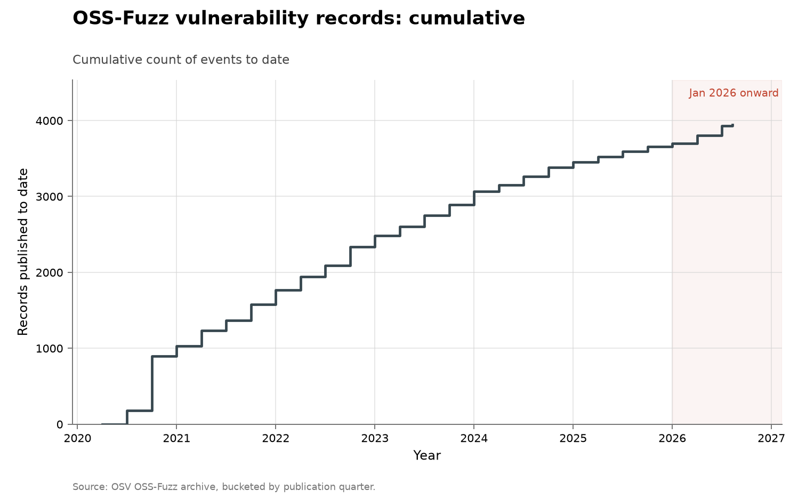

# OSS-Fuzz vulnerability discoveries

**Domain:** vulnerabilities
**Metric:** vulnerability records published per quarter by an automated fuzzing programme
**Coverage:** 2020–2026, partial through 10 August 2026
**Data:** quarterly [`ossfuzz-by-quarter.csv`](ossfuzz-by-quarter.csv); annual [`ossfuzz-discoveries.csv`](ossfuzz-discoveries.csv)
**Upstream:** <https://osv-vulnerabilities.storage.googleapis.com/OSS-Fuzz/all.zip> (browsable at <https://osv.dev/list?q=ecosystem%3AOSS-Fuzz>, programme at <https://google.github.io/oss-fuzz/>)
**Verdict:** declining

## The problem

OSS-Fuzz is Google's continuous fuzzing service for open-source software: it
runs automated search against hundreds of projects, all the time, and publishes
every finding as a dated record in the OSV database. It is the automated-but-not-AI
baseline the rest of this domain lacks.

The reason it earns a document of its own is that it answers the obvious
alternative explanation for the 2026 rises on curl, OpenSSL and Firefox — that
automation in general finds more bugs — and answers it in the negative. A decade
of the largest automated discovery programme in open source is exactly the
control a claim about AI-driven discovery needs, and it is a control nobody had
to construct after the fact.

A "discovery" here is one published OSV record attributed to OSS-Fuzz. It is not
a severity-weighted count, and it is not restricted to any single codebase: the
target set is hundreds of projects and it grew over the period.

## What the chart shows

A steady fourfold decline. 1,041 records in 2020, then 739, 710, 581, 388 and
244 in 2025, with 241 through 10 August 2026. Annualizing the part-year gives
roughly 396, which is an uptick against 2025 but still far below where the
series started. The 2020-onward total is 3,944 records. The quarterly bars add
the shape inside those years: one enormous quarter carries most of 2020, the
slide from there is noisy but unbroken, and the 2026 uptick is already visible
in the first quarter.

The decline is the finding, and it is sharpened by what happened to the
denominator. OSS-Fuzz has onboarded projects continuously over the period, so
the search space was growing while the yield fell. That is the shape a fixed
technique makes as it exhausts the bugs it can reach in the code it is pointed
at, and it happens here with no AI involved anywhere. Whatever produced the 2026
bends in the finder-credited series, it is not automation as such.

The collection-wide [cumulative index](../../CUMULATIVE.md) redraws this series
as cumulative vulnerability records to date:

## How the chart was built

[`figure.py`](figure.py) calls the shared `periodic_stacked()` shape in
[`../../lib/families.py`](../../lib/families.py), which draws a single amber
bar per quarter from the `discoveries` column of `ossfuzz-by-quarter.csv`.
Amber is the fuzzer colour throughout this collection, so the whole chart is
the band that appears as a thin stripe inside the Firefox and OpenSSL charts.
There is no AI classification here because the records carry no finder credit
to classify. The `partial_quarter` row is outlined in dark grey, and its
annotation names the `data_through` date carried on the CSV's final row.

The axis is linear and January 2026 onward is shaded, as in every figure here.

Both CSVs are built by [`fetch.py`](fetch.py) from the same archive, on two
different clocks. The annual `ossfuzz-discoveries.csv` counts records by the
year embedded in the record identifier (`OSV-YYYY-N`) rather than by the
`published` date. That choice matters. Records predating 2020 were backfilled
into OSV during 2021, so their publication dates all land in that year and
would manufacture a spurious 2021 peak while emptying 2016 to 2019. The two
fields agree closely from 2020 onward — 1,041 against 1,031 for 2020, 710
against 716 for 2022 — so the series is reported from 2020 and the 267 earlier
records are dropped. The quarterly CSV buckets the same records by their
`published` date, which is trustworthy in that range; the two clocks can still
disagree slightly at a year boundary, and in 2026 the quarters sum to 247
records against 241 by record id. Records published after the repository's
snapshot date (`AS_OF_DATE` in [`../../lib/chart.py`](../../lib/chart.py)) are
dropped, so a refetch reproduces the committed window; that snapshot is the
`data_through` date the partial rows carry. The annual CSV keeps the id-year
series the prose quotes and [`check.py`](check.py) recomputes.

## What it cannot support

- **This is publication, not discovery.** These are the findings OSS-Fuzz chose
  to publish through OSV, so a change in disclosure practice would move the
  series and nothing here rules that out.
- **The project set is not fixed.** Unlike curl or OpenSSL this is not a clean
  per-codebase depletion curve; the target set grew while the count fell, which
  strengthens the reading but is not the same measurement.
- **No severity anywhere.** The records carry none, so nothing here says whether
  the declining finds were getting shallower, deeper, or neither.
- **No finder attribution at all.** There is no AI-versus-human split to be made
  in this series, only the programme-level total.
- **The 2026 annualization is this repository's arithmetic**, scaled from a
  part-year on the assumption of an even rate, which fuzzing output need not
  follow.

## LLM contributions

None is separable in this series, and that is the point of including it. OSV
records an ecosystem and a date but no finder, so there is no credit string to
classify the way the curl, OpenSSL and Firefox records allow. The one place the
boundary genuinely blurs is OSS-Fuzz-Gen, an LLM-assisted generator of fuzzing
harnesses: it appears by name in OpenSSL's credits, and this collection counts
those CVEs as fuzzing because the credit names the fuzzer. So models have
touched the tooling, but the published OSS-Fuzz records do not identify an LLM
discovery flow and this chart should not be read as evidence either way about
one [@osv2026ossfuzz; @google2026ossfuzz].

## Related literature

The declining yield here is the depletion mechanism this collection exists to
test, measured on automated search with no models in it; the heterogeneity of
such rates across algorithm families is Sherry and Thompson's subject
[@sherry2021fast]. Autonomous discovery long predates language models, and the
2016 DARPA Cyber Grand Challenge is the standing reminder that machines were
already finding and patching bugs in unseen software [@darpa2016cgc]. Google's
own AI vulnerability work runs alongside this programme rather than inside it
[@googlebigsleep2024]. The three finder-credited series this one is a control
for are [curl](../cyber-curl/README.md), [OpenSSL](../cyber-openssl/README.md)
and [Firefox](../cyber-firefox/README.md).
