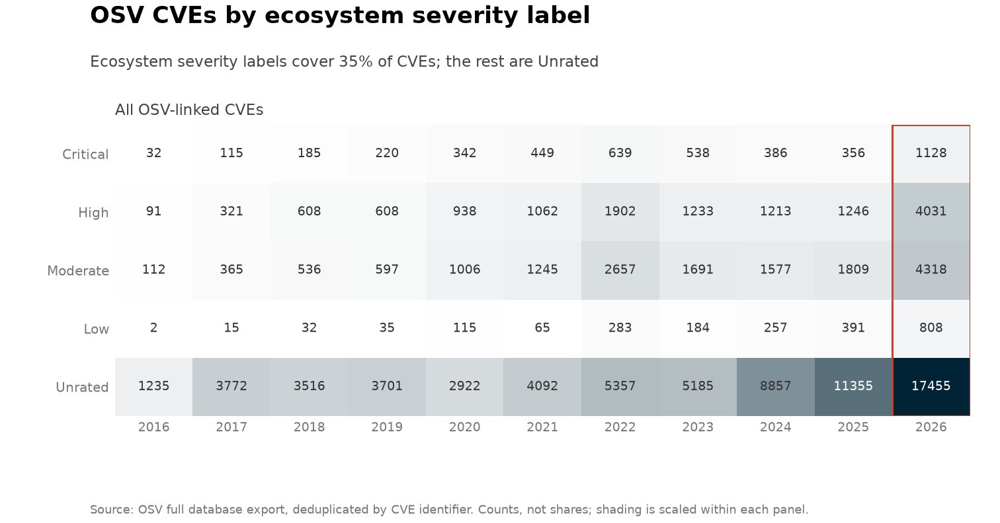
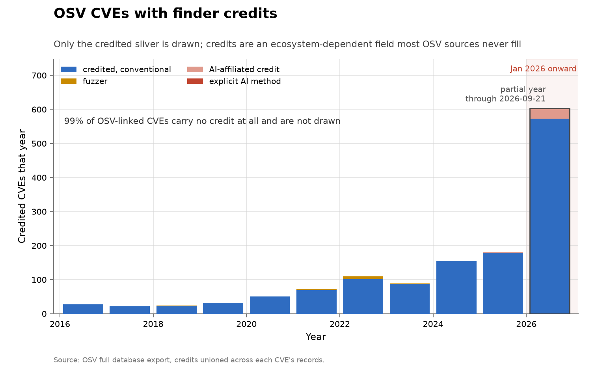
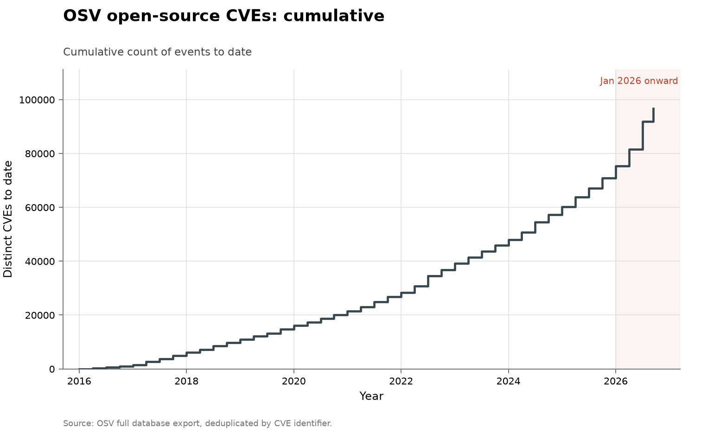

# Open-source CVEs represented in OSV

- **Domain:** vulnerabilities
- **Role:** discovery series
- **Metric:** distinct CVE IDs linked to at least one active affected-package record in OSV, per quarter by earliest OSV publication date
- **Coverage:** 2016–2026, partial through 2026-08-10
- **Data:** quarterly [`osv-cves-by-quarter.csv`](osv-cves-by-quarter.csv); annual [`osv-cves-by-year.csv`](osv-cves-by-year.csv); severity labels in [`osv-severity-by-year.csv`](osv-severity-by-year.csv); finder credits in [`osv-credits-by-year.csv`](osv-credits-by-year.csv); every AI-marked CVE with its credit strings in [`osv-ai-cves.csv`](osv-ai-cves.csv)
- **Upstream:** <https://storage.googleapis.com/osv-vulnerabilities/all.zip> (documentation at <https://google.github.io/osv.dev/data/>)
- **Verdict:** accelerating — 21,321 distinct CVEs through 2026-08-10 annualize to about 35,100, 2.3 times 2025's 15,146

## Definition

OSV aggregates machine-readable vulnerability records from open-source
package ecosystems, project databases, Linux distributions, GitHub
advisories and a converted subset of NVD [@osv2026data]. It is an
all-open-source aggregate beside the all-software NVD count, and its
headline series requires no finder credit.

A counted event is one distinct CVE identifier linked by at least one
non-withdrawn OSV record to an affected package. It is dated to the
earliest `published` date among all such records for that CVE. Multiple
distribution and ecosystem advisories pointing to the same flaw collapse to
one event; an advisory naming several CVEs contributes one event per CVE.

## Facts

- **by-year:** 2016: 1,472 · 2017: 4,588 · 2018: 4,877 · 2019: 5,161 ·
  2020: 5,317 · 2021: 6,911 · 2022: 10,821 · 2023: 8,812 · 2024: 12,269 ·
  2025: 15,146
- **2026 (through 2026-08-10):** 21,321 distinct CVEs; annualizes to about
  35,100, or 2.3 times the 2025 count
- **peak quarter:** 2026-Q2 alone holds 10,193 distinct CVEs, more than any
  full year before 2022
- **severity coverage:** 34,163 of the 96,695 CVEs (35%) carry an ecosystem
  severity label
- **credit coverage:** 1,129 CVEs (1.2%) carry any credit
- **ai-marked:** 24 CVEs — 2 whose credits state an AI method and 22
  carrying an AI-lab affiliation only — each kept with its full credit
  strings in [`osv-ai-cves.csv`](osv-ai-cves.csv)

The severity heatmap draws the Unrated majority as its own row rather than
silently dropping it. The rated mix is not a random sample: labels come from
whichever upstream databases choose to assign them — GitHub's advisory
database does, the converted NVD subset and several distributions do not —
and that composition shifts over time, so a drift in the rated mix can be a
drift in which sources publish labels rather than in the vulnerabilities
themselves.

The credits chart draws the credited sliver alone, and its note states that
the uncredited majority is not drawn. These counts are a floor set by which
ecosystems publish credits, not a measurement of AI's share of discovery.

The collection-wide [cumulative index](../../CUMULATIVE.md) redraws this
series as cumulative distinct CVEs to date:

## Method

[`fetch.py`](fetch.py) downloads OSV's official full-database archive, then
applies the same inclusion rule to every JSON record:

1. exclude withdrawn records and records with no affected package;
2. retain only CVE identifiers appearing as the record ID or an alias;
3. count each distinct CVE once, at its earliest valid `published` date.

The second step deliberately excludes OSV's malicious-package reports,
non-security distribution updates, and advisories that have no CVE. CVEs
first published after the repository's snapshot date (`AS_OF_DATE` in
[`../../lib/chart.py`](../../lib/chart.py)) are dropped, so a refetch
reproduces the committed window.

The merged per-CVE entries feed five CSVs: quarterly and annual counts, the
severity and credits cuts, and the AI-marked ledger. Severity is the
`database_specific.severity` label an ecosystem database assigns
(GHSA-style LOW/MODERATE/HIGH/CRITICAL, with MEDIUM folded into Moderate),
taken at the highest label across a CVE's records; records carrying only a
CVSS vector stay Unrated rather than being scored by a calculator this
repository would then have to defend. Credits are OSV `credits` names
unioned across a CVE's records and classified with the shared
[`../../lib/credits.py`](../../lib/credits.py) rules; a CVE with no credit
on any record is uncredited, which is the majority and is its own column.

The plotted series starts in 2016. Earlier years in the present export
contain only tens or low hundreds of matching CVEs, a coverage
discontinuity rather than a measure of open-source disclosure volume.
[`figure.py`](figure.py) draws the main chart from the quarterly CSV in the
shared periodic-bar shape, in the unattributed colour because the headline
count carries no finder split, with the current quarter outlined and
labelled partial; the severity heatmap and the credits chart come from
their annual CSVs, with the coverage percentages in their subtitles and
notes computed from the data at draw time. [`check.py`](check.py)
recomputes the fact lines above from the vendored CSVs.

## Limitations

- **the count does not attribute discoveries.** The headline series has no
  finder field, and the credit columns cover 1.2% of CVEs — a floor set by
  which ecosystems publish credits, not an attribution of the rest.
- **the severity mix is a coverage artifact first.** Most CVEs are Unrated,
  and which sources assign labels changes over time, so composition shifts
  can masquerade as severity shifts.
- **it is publication, not discovery.** The date is an advisory's
  publication date; discovery, CVE assignment and publication can be far
  apart.
- **the denominator is not fixed.** OSV adds sources and packages while the
  open-source software population itself grows, so a rise in the bars can
  reflect source growth, backfills, more CVE assignment or faster advisory
  publication as well as more newly found flaws.
- **the snapshot can revise history.** A newly imported or corrected record
  can add a CVE to an earlier publication year on the next fetch.
- **CVE-only is a conservative slice of OSV.** Valid GHSA-only,
  ecosystem-only and project advisories are omitted so that duplicate
  records can be collapsed with a simple, auditable identifier rule.
- **annualization is only arithmetic.** The 2026 projection assumes an even
  publication rate and is not a forecast.

## AI attribution

The AI-marked ledger holds 24 CVEs. 2 carry credits stating an AI method:

> "Google Big Sleep | Daniel Stenberg"
> — OSV credit strings for CVE-2025-9086, vendored in [`osv-ai-cves.csv`](osv-ai-cves.csv), read 2026-08-14

> "Andrew Nesbitt (powered by Mythos) | Stefan Eissing"
> — OSV credit strings for CVE-2026-8286, vendored in [`osv-ai-cves.csv`](osv-ai-cves.csv), read 2026-08-14

The other 22 carry an AI-lab affiliation with no method stated: 17 name
Aisle Research, 3 name AntAISecurityLab hackerone handles, 1 names "Filipe
Casal of Trail of Bits in collaboration with OpenAI" and 1 names "Eunsoo
Kim (Autonomous Code Security team at Microsoft)", all quoted from
[`osv-ai-cves.csv`](osv-ai-cves.csv) as read 2026-08-14. Several of the
same credit strings appear in the curl series' finder table
([curl](../cyber-curl/README.md)), which counts the same projects'
disclosures at the project level. No other CVE in the export carries any AI
marker in its credits, as of the 2026-08-10 read.

## Sources

- [@osv2026data] — OSV's documentation of the full export and its mix of
  native and converted data sources; accessed 2026-08-11.
- Sibling series:
  [all software: disclosed](../cyber-nvd-disclosed/README.md) is the
  broader all-software comparator;
  [OSS-Fuzz](../cyber-oss-fuzz/README.md) is the narrower programme-level
  slice; dense finder credits live in the project-level
  [curl](../cyber-curl/README.md), [OpenSSL](../cyber-openssl/README.md)
  and [Firefox](../cyber-firefox/README.md) series, while here they exist
  only for the 1.2% sliver above.
