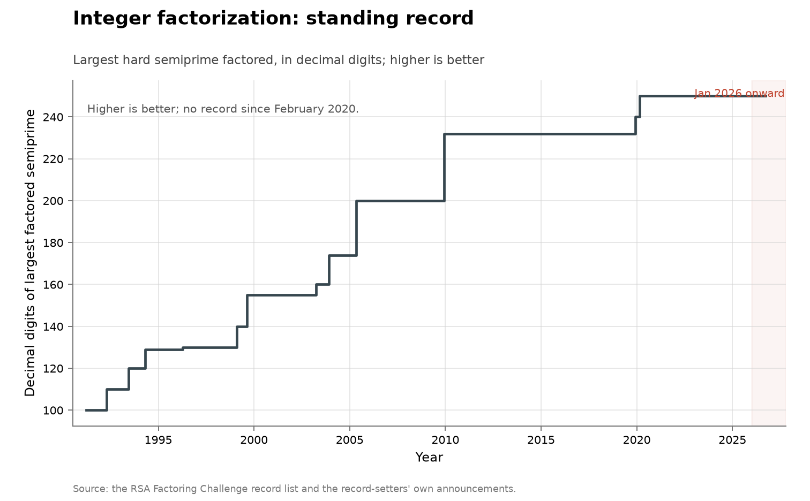

# Integer factorization records

**Domain:** outside the three domains
**Role:** control: no-AI baseline
**Metric:** cryptanalysis; decimal digits in the largest hard semiprime factored, as a running maximum over dated records
**Coverage:** 1991-04 to 2020-02, confirmed unmoved as of 2026-08-10
**Data:** [`factoring-records.csv`](factoring-records.csv) (all 23 published RSA factorizations, plus the 795-bit discrete-logarithm record and the first SHA-1 collision for context)
**Upstream:** <https://en.wikipedia.org/wiki/RSA_numbers>, with the last two records from <https://caramba.loria.fr/rsa250.txt> and <https://caramba.loria.fr/dlp240-rsa240.txt>
**Verdict:** no acceleration — 0 records in 2026 against 0 in 2025 and a 0.4/year mean over 1991–2025; the standing record is 250 digits, set 2020-02-28

## Definition

The RSA numbers are a published list of hard semiprimes — each the product
of two primes of similar size — posed as factoring targets by RSA
Laboratories. The upstream record of them is Wikipedia's RSA-numbers page,
which lists every published factorization with its date, team and method;
the two most recent records are announced in their teams' own texts at
caramba.loria.fr. The cash-prize programme attached to the list ended
before the last records were set:

> "While the RSA challenge officially ended in 2007, people are still
> attempting to find the factorizations."
> — en.wikipedia.org, RSA numbers, read 2026-08-14

A "discovery" in this series is a published factorization that raises the
running maximum of decimal digits over the 23 vendored RSA factorizations.
Rows are dated by announcement date. Two adjacent rows are vendored for
context and excluded from the maximum — the 795-bit discrete-logarithm
record and the first SHA-1 collision — because they are different
quantities. A claimed factorization is verified by multiplying the factors.

## Facts

- **rows:** 25 rows: 23 RSA factorizations, 1 discrete-logarithm record,
  1 hash collision
- **records:** 13 running-maximum records, RSA-100 (100 digits, 1991-04-01)
  to RSA-250 (250 digits, 2020-02-28)
- **rate split:** 7.1 digits/year from RSA-100 (1991-04-01) to RSA-768
  (232 digits, 2009-12-12), then 1.8 digits/year to RSA-250 (2020-02-28)
- **standing:** the 250-digit record is unmoved from 2020-02-28 to
  2026-08-10, 6.4 years
- **non-records:** 10 of the 23 factorizations set no new maximum
- **ai-involved:** `no` on all 25 rows
- **context rows:** the discrete-logarithm record is dated 2019-12-02, the
  same date and team as RSA-240; the SHA-1 collision is dated 2017-02-23
  with method "differential path + brute force (2^63.1 SHA-1 evals)"
- **unfactored targets:** the Wikipedia list records RSA-260, RSA-270,
  RSA-896 and RSA-1024 as "has not been factored so far", read 2026-08-14

The two most recent record computations state their own cost:

> "The total computation time was roughly 2700 core-years, using Intel Xeon
> Gold 6130 CPUs as a reference (2.1GHz)"
> — Boudot, Gaudry, Guillevic, Heninger, Thomé and Zimmermann, caramba.loria.fr/rsa250.txt, 2020-02-28

> "The CPU time spent on finding these factors by a collection of parallel
> computers amounted approximately to the equivalent of almost 2000 years
> of computing on a single-core 2.2 GHz AMD Opteron-based computer."
> — en.wikipedia.org, RSA numbers, RSA-768 section, read 2026-08-14

The collection-wide [cumulative index](../../CUMULATIVE.md) redraws this
series as the standing record's value over time:

## Method

There is no fetcher; the rows are hand-collected from the Wikipedia list
and from the two caramba.loria.fr announcements. The record list is a
hand-maintained page rather than an API, and the fields scored here — who,
which method, whether machine learning was involved — are read from prose
rather than parsed.

[`figure.py`](figure.py) filters `factoring-records.csv` to the
`integer_factorization` rows, sorts by date, and takes the running maximum
over `digits` as a step function; the discrete-logarithm and hash-collision
rows are excluded because they are different quantities. The open markers
behind the line are every published RSA factorization, record or not,
including the ten factored while the maximum stood still. Three records are
labelled — RSA-100, RSA-768 and RSA-250 — and the rates in the annotation
are computed at plot time from the running maximum, split at RSA-768, so
they cannot drift from the CSV. January 2026 onward is shaded, as in every
figure here. The same script draws the cumulative view as the standing
record's value over time. [`check.py`](check.py) recomputes the fact lines
from the CSV.

## Limitations

- **sample size.** Thirteen records in twenty-nine years; a modest change
  in rate is not detectable in a series this sparse.
- **running maximum.** Effort spent on numbers smaller than the standing
  record does not move the line; the ten non-record factorizations appear
  only as open markers.
- **no prize after 2007.** The records of 2019-12-02 and 2020-02-28
  postdate the challenge's cash prizes.
- **cost of a record.** The quoted efforts for the last records run to
  thousands of core-years; a step in this series is a computation of that
  scale committed to the next number on the list.
- **attempts are unrecorded.** The list holds published factorizations
  only; a standing record does not distinguish problems unattempted from
  attempts unpublished.

## AI attribution

The `ai_involved` column is `no` on all 25 rows of
[`factoring-records.csv`](factoring-records.csv). Every record row's method
is the quadratic sieve or the number field sieve, run as a parallel
computation by a named human team. No AI credit appears on the Wikipedia
list or in the two caramba.loria.fr announcements as of 2026-08-14.

The RSA-240/DLP-240 announcement states its own split between algorithmic
gain and hardware:

> "Taking this into account, and still using identical hardware, our
> computation was 3 times faster than the expected time that would have
> been extrapolated from previous records."
> — Boudot, Gaudry, Guillevic, Heninger, Thomé and Zimmermann, caramba.loria.fr/dlp240-rsa240.txt, 2019-12-02

> "The acceleration can be attributed to various algorithmic improvements
> that were implemented for these computations. The CADO-NFS implementation
> was also vastly improved."
> — Boudot, Gaudry, Guillevic, Heninger, Thomé and Zimmermann, caramba.loria.fr/dlp240-rsa240.txt, 2019-12-02

## Sources

- <https://en.wikipedia.org/wiki/RSA_numbers> — the record list the rows
  are hand-collected from; the RSA-768 effort sentence, the challenge-end
  statement and the unfactored-target statuses quoted above (read
  2026-08-14).
- <https://caramba.loria.fr/rsa250.txt> and
  <https://caramba.loria.fr/dlp240-rsa240.txt> — the record-setters'
  announcements of the 2020-02-28 and 2019-12-02 records, quoted above.
- [@grace2013algorithmic] — the pre-2013 rate for this problem:

> "Since the 1970s, the numbers that can be factored have apparently
> increased from around twenty digits to 222 digits, or 5.5 digits per
> year."
> — Katja Grace, Algorithmic Progress in Six Domains, p. 33, 2013 [@grace2013algorithmic]

- [@sherry2021fast] — measured improvement rates across many algorithm
  families; the base-rate reference for uneven pre-AI progress.
- [math-sphere-packing](../math-sphere-packing/README.md) — a sibling
  series that also tracks a dated numerical record over decades; it counts
  a different quantity (sphere-packing density bounds).
