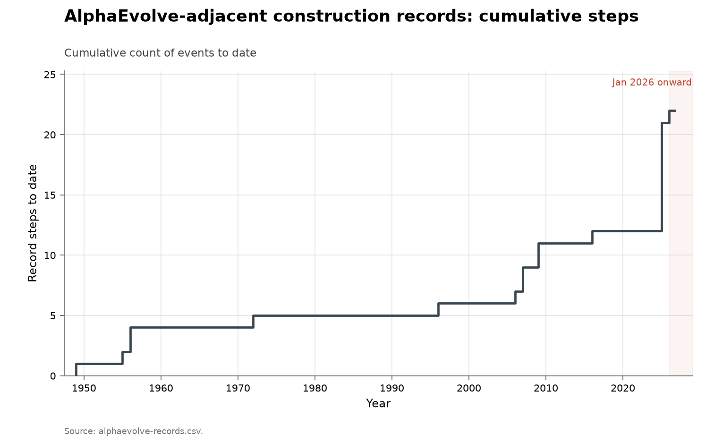

# Finite construction records around AlphaEvolve

**Domain:** mathematics
**Role:** discovery series
**Metric:** cumulative record steps in five groups of finite construction and packing problems
**Coverage:** 1949–2026, 22 record steps across the five groups
**Data:** [`alphaevolve-records.csv`](alphaevolve-records.csv), with the sampling frame in [`../math-alphaevolve-inventory/alphaevolve-inventory.csv`](../math-alphaevolve-inventory/alphaevolve-inventory.csv)
**Upstream:** <https://github.com/google-deepmind/alphaevolve_repository_of_problems> and <https://arxiv.org/abs/2511.02864>, with per-step sources recorded in the CSV's `ref` and `note` columns
**Verdict:** inconclusive — 1 record step in 2026 against 9 in 2025 and a 0.2/year mean over 1949–2024

## Definition

Five groups of finite problems from the AlphaEvolve problem set, each with a
standing record held by an explicit construction: the Erdős minimum-overlap
type constant (6.5), the difference-basis constant (6.7), Heilbronn-style
triangle packing (6.48) and convex packing (6.49), and a max-min packing
ratio (6.50). In each case the record is a finite object — a step function, a
difference set, a packing of $n$ shapes — that can be scored exactly, and the
incumbent record often lives on a community page maintained by continuous
computer search rather than in a journal. A "discovery" in this series is one
such record being improved.

The sampling frame is the
[inventory folder's](../math-alphaevolve-inventory/README.md) 65 numbered
problems, of which 31 carry a live numeric record under the companion
repository's classification; the five groups are drawn from those 31.

## Facts

- **steps:** 22 record steps across the five groups, 1949–2026; 7 AI-set,
  all in 2025
- **by-year:** 1949: 1 · 1955: 1 · 1956: 2 · 1972: 1 · 1996: 1 · 2006: 1 ·
  2007: 2 · 2009: 2 · 2016: 1 · 2025: 9 · 2026: 1
- **by-group:** minimum-overlap 5 steps (1955–2025) · difference basis 4
  steps (1949–2025) · triangle packing 2 steps (2006–2025) · convex packing
  4 steps (2007–2025) · max-min packing 7 steps (2009–2026)
- **ai-step sizes:** +1.44% on triangle packing · +0.98% and +0.47% on
  convex packing · +0.69% on difference basis · +0.052% and +0.0057% on the
  two max-min slices · +0.00075% on minimum-overlap
- **minimum-overlap levels:** the 2025 AI step moves the upper bound from
  0.380926853433087 (Haugland, 2016) to 0.380924
- **pooled step-size medians (whole file):** AlphaEvolve +0.98% over 28
  steps · AI-guided search +3.90% over 2 · agent platform +1.85% over 1 ·
  human computer search +2.52% over 13 · human by hand +2.83% over 9

The difference-basis record had stood since Golay in 1972. On that group the
paper reports:

> "AlphaEvolve by itself, with no expert advice, was not able to beat the
> 2.6571 upper bound. In order to get a better result we had to show it the
> correct code for generating Singer difference sets [258]. Using this code
> AlphaEvolve managed to find a substantial improvement in the upper bound
> from 2.6571 to 2.6390."
> — Georgiev, Gómez-Serrano, Tao and Wagner, arXiv 2511.02864, 2025 [@georgiev2025mathexploration]

Both max-min AI records were retaken in 2025 by FICO's Xpress global solver,
run with no custom algorithm and verified with DeepMind's verification tool,
per the FICO blog of 2025-06-13 and arXiv:2601.05943 recorded in the CSV's
`ref` column. The one 2026 step, on the max-min $(3,14)$ slice, is credited
by the community records page to M. Sun and E. Samanta.

The collection-wide [cumulative index](../../CUMULATIVE.md) redraws this
series as cumulative record steps to date:

## Method

The CSV is built by [`fetch.py`](fetch.py), which carries the hand
transcription itself: the values, the quoted sentence each was read from,
the reference, and the agent coding are all literals in that file, and the
relative gains are computed from consecutive values as it writes. It is the
only place any of these records is maintained, and it also writes the slice
that [sums and autoconvolution](../math-sums-autoconvolution/README.md)
plots, so that child dataset cannot drift from the file it is drawn out of.
This folder keeps the full transcription rather than a slice of it because
`alphaevolve-record-steps.png` pools every record step in the frame, across
all the problems the paper numbers, not only the five plotted in the first
figure. [`check.py`](check.py) recomputes the fact lines from the CSV.

[`figure.py`](figure.py) draws all three figures from
`alphaevolve-records.csv`. For the first it holds the five problem ids in a
hardcoded `selected` set, keeps rows with a non-empty `year` and `is_record`
equal to `yes`, groups by `problem`, sorts each group by `year` then
`quantity` then `step`, and plots the cumulative step count per group; the
group labels in the legend are hardcoded in the function. The y-axis is a
count because the values are not commensurable: an area, a squared radius,
and two dimensionless constants cannot share a numeric axis, so this figure
plots discoveries rather than levels, as the
[sphere-packing ladder](../math-sphere-packing/README.md) does for the same
reason. A callout names the Singer-code hint behind the difference-basis
step.

Step markers are colour-coded by who set them: `record_marker()` reads
`agent`, draws red for anything beginning `ai_` and blue otherwise, and
draws an unfilled marker where `date_certain` is `no`. The FICO solver steps
and the 2026 step are blue: the coding distinguishes AI from non-AI rather
than automated from manual, and much of the blue here is computer search.

The second figure's left three panels plot the best known value against
record step rather than year, because several steps share a year: problem
6.44's sums-and-differences bound over eight steps, problem 6.3's
autoconvolution constant over four, and problem 6.8's kissing number in
dimension 11 over five. Marker colour is who made the step — AlphaEvolve,
AI-guided search, an agent platform, human computer search, human work by
hand, or a community records page — and each point is annotated with its
year. The right panel pools every record step in the file that has a
computable size and an `is_record` of `yes`, one row per kind of agent on a
symmetric log axis, with a vertical bar at each row's median and the median
printed above it.

Two rows in the same CSV are flagged `is_record: no` and are excluded from
every figure. Both are spherical-design constructions the paper described as
improving on the literature bounds it cited, where a 2016 result the paper
does not cite was already better.

## Limitations

- **selection.** The five groups are in the data because an AI system was
  pointed at them; the 2025 cluster follows from that selection, so no
  discovery rate can be read from this series.
- **counts, not sizes.** The axis counts steps, and the AI steps are among
  the smallest in the series, several in the fourth or fifth decimal place.
- **groups mix quantities.** Convex packing pools $n=13$ and $n=14$, and
  max-min pools two slices, so a group reaching seven steps is not one
  record improving seven times.
- **overlapping markers.** Two groups both take their second step in 1956,
  and the minimum-overlap one — whose date rests on secondary sources only,
  and which is therefore drawn as an open marker — is hidden underneath the
  other group's filled marker.
- **the human baseline is itself continuous computer search.** Several
  incumbent records come from Erich Friedman's packing pages, whose "+"
  convention truncates values and so slightly understates prior records and
  overstates AI gains; one page shows AlphaEvolve's value for the $n=13$
  convex case while still crediting Cantrell in 2007, so page and paper
  disagree about who holds it.
- **one value is missing.** The 2026 max-min step has an empty `value`,
  because the community page truncates the figure and the exact number could
  not be established; the step is counted, the level is not recorded.
- **hint-dependence.** The 2025 difference-basis step, on a record standing
  since Golay in 1972, followed a supplied Singer difference-set code hint;
  the paper reports the unaided system did not beat the prior bound (quoted
  above).

## AI attribution

Seven of the twenty-two steps in the five groups are AI-set, all
AlphaEvolve, all in 2025 [@novikov2025alphaevolve; @deepmind2025problems].
Their sizes run from +1.44% down to +0.00075%; two were retaken in 2025 by
FICO's Xpress global solver, and the difference-basis step followed the
Singer-code hint quoted above. The paper's own summary of the system's
reach:

> "We have found that AlphaEvolve excels at discovering constructions that
> were already within reach of current mathematics, but had not yet been
> discovered due to the amount of time and effort required to find the right
> combination of standard ideas that works well for a particular problem."
> — Georgiev, Gómez-Serrano, Tao and Wagner, arXiv 2511.02864, 2025 [@georgiev2025mathexploration]

Tao's account of the same run, on named conjectures:

> "For well-known open conjectures (e.g., Sidorenko’s conjecture, Sendov’s
> conjecture, Crouzeix’s conjecture, the ovals problem, etc.), AlphaEvolve
> generally was able to locate the previously known candidates for
> optimizers (that are conjectured to be optimal), but did not locate any
> stronger counterexamples"
> — Terence Tao, terrytao.wordpress.com, 2025-11-05 [@tao2025exploration]

The dated precedent for AI-set records on recognised open mathematical
problems is FunSearch's cap-set improvement of December 2023
[@deepmind2023funsearch].

## Sources

- [@georgiev2025mathexploration] — the mathematics paper whose appendix the
  2025 steps and the bounds they were measured against are transcribed from;
  quoted above.
- [@novikov2025alphaevolve; @deepmind2025problems] — the AlphaEvolve system
  paper and the companion repository supplying the status classification
  used as the frame.
- [@tao2025exploration] — Tao's account of the mathematics paper, quoted
  above.
- [@deepmind2023funsearch] — FunSearch, the line of work's first recorded
  AI step.
- [@arxiv2026horizonmath] — HorizonMath, a benchmark comparing AI output to
  the current best published results, with no historical dimension.
- [@sherry2021fast] — records in algorithm families arrive in bursts with
  long gaps.
- The sampling frame is
  [the inventory](../math-alphaevolve-inventory/README.md); the individually
  plotted child series from the same frame is
  [sums and autoconvolution](../math-sums-autoconvolution/README.md).
