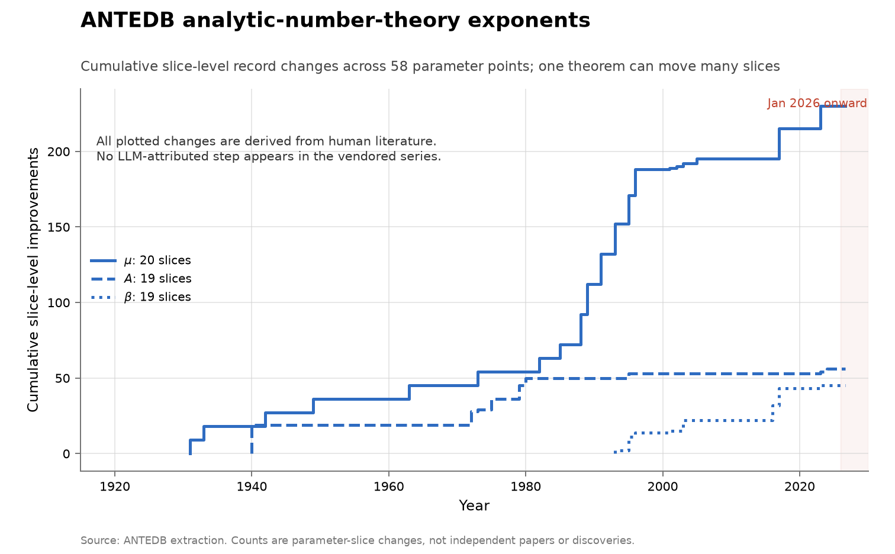

# ANTEDB analytic-number-theory exponents

**Domain:** mathematics
**Metric:** cumulative slice-level record changes across 58 exponent slices in the three families $\mu$, $A$ and $\beta$
**Coverage:** 1920–2024 in the underlying literature; extracted from the database as of 2026-07-26
**Data:** [`../data/antedb-sweep.csv`](../data/antedb-sweep.csv), with the six named slices and their attributions in [`../data/antedb-bounds.csv`](../data/antedb-bounds.csv)
**Upstream:** <https://github.com/teorth/expdb> (human-readable blueprint at <https://teorth.github.io/expdb/>)
**Verdict:** no acceleration

## The problem

The Analytic Number Theory Exponent Database records the best known values of the
classical exponents of the field, with the theorem and the date behind each. Three
families are extracted here. $\mu(\sigma)$ bounds the growth of the Riemann zeta
function, and $\mu(1/2)$ is the Lindelöf exponent, conjectured to be 0.
$A(\sigma)$ is a zero-density exponent, with the density hypothesis asserting
$A \leq 2$; $A(3/4)$ is the slice Ingham bounded in 1940 and Guth and Maynard
improved in 2024. $\beta(\alpha)$ is a third family, whose derivable history in
the database begins only around 1989.

These are scored here because a bound is a continuous outcome variable where a
famous problem is a binary one. Each exponent is a number whose best known value
is dated, so progress on it is a monotone series rather than a flag that flips
once — the closest thing research mathematics has to a cost curve. A "discovery"
in this series is a year in which the best value derivable at some parameter point
changes.

It is the best pre-AI baseline the mathematics domain has and it measures no AI
contribution whatever, which is precisely its use. When an AI system was pointed
at this area it did not work, so these curves say what a century of very strong
human effort on a hard quantity looks like, against which any claimed AI-era bend
elsewhere can be read.

## What the chart shows

Three hundred and thirty-one slice-level record changes in a century: 230 across
the twenty $\mu$ slices, 56 across the nineteen $A$ slices, and 45 across the
nineteen $\beta$ slices. All three lines are flat from 2024 onward, and the last
change anywhere in the vendored series is Guth and Maynard's on $A$ in 2024.
Nothing enters the shaded 2026 period.

The steep stretch is the 1980s and 1990s, not the recent decades. The cumulative
$\mu$ count runs 54 through 1980, 112 through 1990 and 188 through 2000, so
well over half of the century's slice changes fall in those two decades. It adds
42 more by 2023, seven of them in the five years to 2005 and none at all from 2006
through 2010. So the flat right edge continues a slowdown that began long before
agents existed.

The named slices in `antedb-bounds.csv` put the magnitudes on this. The Lindelöf
exponent fell from $5/28 \approx 0.1786$, van der Corput in 1920, to
$13/84 \approx 0.1548$, Bourgain in 2017, across fifteen recorded values — a
factor of 0.867 in 97 years, an implied halving time near 500 years, against a
conjectured value of 0. $A(3/4)$ has three records in 103 years: Carlson in 1921,
Ingham in 1940, then nothing until Guth and Maynard's $20/9$ in 2024.

What cuts the reading down is that the y-axis counts slices, not results. One
theorem can move many parameter points at once, so 331 is an upper bound on the
number of underlying papers by an unknown margin, and the tall $\mu$ line partly
reflects the fact that $\mu$ was swept at twenty points.

## How the chart was built

`antedb_chart()` in [`../tools/make_figures.py`](../tools/make_figures.py) groups
`antedb-sweep.csv` by `quantity` and `point`, sorts each slice by `year`, and
counts an event whenever `value_float` differs from the previous year's value for
that slice. The per-family cumulative counts are drawn as step functions, all in
blue with three line styles, because no step in the series is AI-attributed and
there is nothing to colour-code.

The scoring rule is the important part. The year attached to a value is the year
in which that bound became *derivable* from the literature the database records,
computed by the database's own solver restricted to results published up to that
year — not the year somebody wrote the bound down. Those differ, and the
difference is the database's whole point: collating relations that were implicit
across many papers yields bounds nobody had stated. So this is a curve of
available knowledge, and it is the more favourable of the two curves to plot.

`antedb-bounds.csv` carries the six named slices with exact fractional `value`
strings and an `attribution` column naming who set each record. It is not plotted
in this figure and is the file to read for provenance of a particular record. Note
that the attribution stored against a year names that year's dependency chain, so
the last improver of a slice is the last row whose value actually changed rather
than simply the last row.

One gap is deliberate and reported rather than patched: the database's own $\beta$
solver raises a `TypeError` for the 1991 restriction of the literature, so 1991 is
missing from the $\beta$ sweep. No other year fails, and $\mu$ and $A$ are
unaffected.

## What it cannot support

- **Slice changes are not independent discoveries.** One theorem moves many
  parameter points, so the counts on the y-axis exceed the number of results by an
  unknown factor and cannot be compared to a paper count.
- **Derivable is not published.** A step marks the year a bound became derivable
  from the recorded literature, which can precede anyone stating it.
- **The three families are not commensurable.** They are different exponents
  swept at 20, 19 and 19 points; the relative heights of the three lines are
  partly an artifact of how many points each family was sampled at.
- **Each line starts at its own first change**, so the pre-1931 history of $\mu$
  and the pre-1940 history of $A$ are off the chart, and $\beta$'s flat left edge
  is the absence of database entries rather than the absence of progress.
- **The grid is uniform in the parameter, not in mathematical interest.** Values of
  $\sigma$ near 1 are both easier and faster-moving, so a sweep mixes difficulty
  with attention.
- **No denominator of effort.** An exponent's improvement has no denominator at
  all, and effort on these quantities certainly rose across the century, so the
  halving times above are not comparable to a cost curve's.
- **1991 is missing from $\beta$**, for the solver reason described above.

## LLM contributions

None, and here the negative is sourced rather than assumed. The database's own
authors say AI integration has not happened, and that the repository "only
contains a placeholder Lean folder" [@tao2025antedb]. The automation that did
produce new results at launch — four new exponent pairs, several new zero-density
estimates, and new additive-energy estimates — was optimization over collated
relations rather than a model, and improved the state of the art "without
introducing any substantial new inputs from analytic number theory"
[@tao2025exponent; @tao2025launch]. And when an AI system was pointed at this
area, it failed: AlphaEvolve "struggled to take advantage of the number theoretic
structure in the problem, even when given suitable expert hints"
[@tao2025exploration; @novikov2025alphaevolve].

The stated reason is problem form rather than difficulty, and it has a testable
edge. Tao's own diagnosis leaves both open — "This could potentially be a prompting
issue, or perhaps the landscape of number-theoretic optimization problems is less
amenable to this sort of LLM-based evolutionary approach" — while noting that what
does work has algebraic structure a search can exploit. These exponents are
asymptotic inequalities rather than finite constructions with a computable score,
which predicts that the AI-reachable part of mathematics is delimited by whether a
candidate can be cheaply scored. August 2026 Astra claims in this domain concern
packing and coding upper bounds, carry Lean certificates, and await peer review;
none of them touches these exponents.

## Related literature

The database, its blueprint, and its authors' statement about AI integration are
the primary source [@tao2025antedb]; the launch paper and post report the
relation-search improvements and the caveat that they used no new number theory
[@tao2025exponent; @tao2025launch]. The recorded failure of an evolutionary coding
agent on this material is Tao's account of the system's own mathematics paper
[@tao2025exploration; @novikov2025alphaevolve]. The eighty-four-year plateau on
$A(3/4)$ before 2024 is the same step-function shape Sherry and Thompson measure
across algorithm families, where half of all families never improve at all
[@sherry2021fast]. The structurally identical series that disagrees about the
recent trend is [sphere packing](math-sphere-packing.md), which accelerates
through the same window with no AI in it either; the quantities where AI steps do
appear are finite constructions
([kissing number](math-kissing-11.md),
[sums and autoconvolution](math-sums-autoconvolution.md)).
