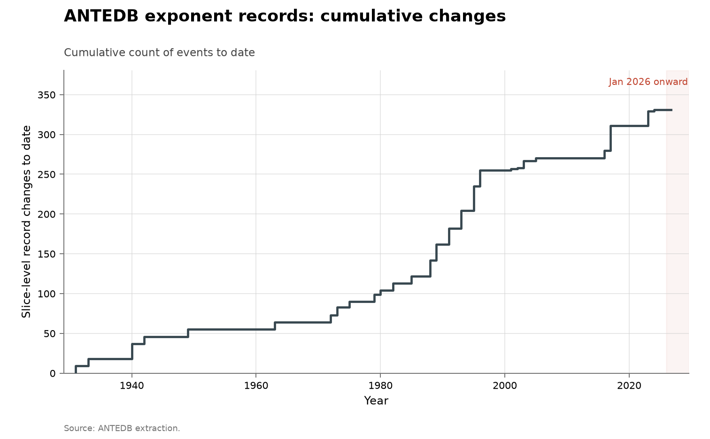

# ANTEDB analytic-number-theory exponents

- **Domain:** mathematics
- **Role:** control: no-AI baseline
- **Metric:** cumulative slice-level record changes across 58 exponent slices in the three families $\mu$, $A$ and $\beta$
- **Coverage:** 1920–2024 in the underlying literature; extracted from the database as of 2026-07-26
- **Data:** [`antedb-sweep.csv`](antedb-sweep.csv), with the six named slices and their attributions in [`antedb-bounds.csv`](antedb-bounds.csv)
- **Upstream:** <https://github.com/teorth/expdb> (human-readable blueprint at <https://teorth.github.io/expdb/>)
- **Verdict:** no acceleration — 0 slice changes in 2025 or 2026 against 2 in 2024 and a 3.5/year mean over 1931–2024

## Definition

The Analytic Number Theory Exponent Database records the best known values
of the classical exponents of the field, with the theorem and the date
behind each [@tao2025antedb]. Three families are extracted here.
$\mu(\sigma)$ bounds the growth of the Riemann zeta function, and $\mu(1/2)$
is the Lindelöf exponent, conjectured to be 0. $A(\sigma)$ is a zero-density
exponent, with the density hypothesis asserting $A \leq 2$; $A(3/4)$ is the
slice Ingham bounded in 1940 and Guth and Maynard improved in 2024.
$\beta(\alpha)$ is a third family, whose derivable history in the database
begins only around 1989.

A "discovery" in this series is a year in which the best value derivable at
some parameter point changes. The year attached to a value is the year in
which that bound became derivable from the literature the database records,
computed by the database's own solver restricted to results published up to
that year — not the year somebody wrote the bound down. Collating relations
that were implicit across many papers yields bounds nobody had stated, so
the two datings differ, and the curve plotted here is the derivable-year
one.

## Facts

- **changes:** 331 slice-level record changes: 230 across the twenty $\mu$
  slices, 56 across the nineteen $A$ slices, and 45 across the nineteen
  $\beta$ slices
- **span:** first change 1931, last change 2024; 0 changes in 2025 or 2026
- **mu by period:** the cumulative $\mu$ count runs 54 through 1980, 112
  through 1990 and 188 through 2000, with 7 changes over 2001–2005, none
  from 2006 through 2010, and 230 through 2023
- **lindelof slice:** $\mu(1/2)$ fell from $5/28 \approx 0.1786$ (van der
  Corput, 1920) to $13/84 \approx 0.1548$ (Bourgain, 2017) across 15
  recorded values, a factor of 0.867 in 97 years, against a conjectured
  value of 0
- **a-slice:** $A(3/4)$ has 3 records in 103 years: Carlson in 1921, Ingham
  in 1940, then Guth and Maynard's $20/9$ in 2024

The collection-wide [cumulative index](../../CUMULATIVE.md) redraws this
series as cumulative slice-level record changes to date:

## Method

Both CSVs are built by [`fetch.py`](fetch.py), which is run by hand: it
needs a checkout of the ANTEDB source tree and a cddlib-backed `pycddlib<3`,
neither of which belongs in this repository's dependencies.
[`check.py`](check.py) recomputes the fact lines above from the two CSVs.

[`figure.py`](figure.py) draws all three figures from `antedb-sweep.csv`.
The first groups the sweep by `quantity` and `point`, sorts each slice by
`year`, and counts an event whenever `value_float` differs from the previous
year's value for that slice; the per-family cumulative counts are drawn as
step functions, all in blue with three line styles, because no step in the
series is AI-attributed and there is nothing to colour-code.

The small multiples draw the same sweep as thirty panels, one per slice: ten
$\mu$ slices, then ten $A$ slices, then ten $\beta$ slices, hand-picked from
the grid so that the named points are present. Each panel plots that slice's
best known value against the year it became derivable, as a step function
extended flat to 2026, with a dot at each recorded change and the area under
the line shaded. The y-axis runs from 0 to a little above the slice's own
earliest value, and both raw values are printed in the panel title; the
corner text gives the ratio of the latest value to the earliest, the year
the slice last moved, and how many records it carries. The dashed horizontal
line on the $A$ panels marks the density hypothesis, $A \leq 2$, where it
falls inside the panel.

`antedb-bounds.csv` carries the six named slices with exact fractional
`value` strings and an `attribution` column naming who set each record; it
is not plotted in the first figure and holds the provenance of particular
records. The attribution stored against a year names that year's dependency
chain, so the last improver of a slice is the last row whose value actually
changed rather than simply the last row.

One gap is deliberate and reported rather than patched: the database's own
$\beta$ solver raises a `TypeError` for the 1991 restriction of the
literature, so 1991 is missing from the $\beta$ sweep. No other year fails,
and $\mu$ and $A$ are unaffected.

## Limitations

- **slice changes are not independent discoveries.** One theorem moves many
  parameter points, so the counts on the y-axis exceed the number of results
  by an unknown factor and cannot be compared to a paper count; the tall
  $\mu$ line partly reflects that $\mu$ was swept at twenty points.
- **derivable is not published.** A step marks the year a bound became
  derivable from the recorded literature, which can precede anyone stating
  it.
- **the three families are not commensurable.** They are different exponents
  swept at 20, 19 and 19 points; the relative heights of the three lines are
  partly an artifact of how many points each family was sampled at.
- **each line starts at its own first change**, so the pre-1931 history of
  $\mu$ and the pre-1940 history of $A$ are off the chart, and $\beta$'s
  flat left edge is the absence of database entries rather than the absence
  of progress.
- **the grid is uniform in the parameter, not in mathematical interest.**
  Values of $\sigma$ near 1 are both easier and faster-moving, so a sweep
  mixes difficulty with attention.
- **no denominator of effort.** An exponent's improvement has no denominator
  at all, and effort on these quantities rose across the century.
- **problem form.** These exponents are asymptotic inequalities rather than
  finite constructions with a computable per-candidate score.
- **1991 is missing from $\beta$**, for the solver reason described in
  Method.

## AI attribution

No slice change in the vendored series carries an AI credit: the sweep
carries no attribution field, and the `attribution` column of
`antedb-bounds.csv` names human authors only, from van der Corput in 1920 to
Guth and Maynard in 2024, as of the 2026-07-26 extraction.

The automation that did produce new results at the database's launch — four
new exponent pairs, several new zero-density estimates, and new
additive-energy estimates — was optimization over collated relations rather
than a model [@tao2025exponent]; the launch post states the improvements
came

> "without introducing any substantial new inputs from analytic number
> theory"
> — Terence Tao, launch post, terrytao.wordpress.com, 2025-01-28 [@tao2025launch]

When an evolutionary coding agent [@novikov2025alphaevolve] was tested on
analytic number theory problems, its co-author's account records:

> "it struggled to take advantage of the number theoretic structure in the
> problem, even when given suitable expert hints"
> — Terence Tao, terrytao.wordpress.com, 2025-11-05 [@tao2025exploration]

> "This could potentially be a prompting issue on our end, or perhaps the
> landscape of number-theoretic optimization problems is less amenable to
> this sort of LLM-based evolutionary approach."
> — Terence Tao, terrytao.wordpress.com, 2025-11-05 [@tao2025exploration]

On formal verification, the database's contributing guide states:

> "A formalization effort is underway, but at present it covers only a small
> portion of the blueprint (the basic notation, $L^2$ integral estimate, and
> exponential sum growth exponent chapters)"
> — ANTEDB contributing guide, github.com/teorth/expdb, read 2026-08-14 [@tao2025antedb]

OpenAI's 2026-08-01 Astra release of ten Lean-certified claims spans, per
the press account cited, "group theory, von Neumann algebras,
high-dimensional geometry, quantum complexity, lattice cryptography, and
extremal combinatorics" [@openai2026astra]; none of the ten concerns the
exponent families tracked here, as of 2026-08-14.

## Sources

- [@tao2025antedb] — the database, its blueprint, and the contributing guide
  quoted above.
- [@openai2026astra] — press account of the 2026-08-01 Astra release, cited
  for the scope statement in AI attribution.
- [@tao2025exponent] — the launch paper reporting four new exponent pairs,
  new zero-density estimates and new additive-energy estimates from
  optimization over collated relations.
- [@tao2025launch] — the launch post of 2025-01-28, quoted above.
- [@tao2025exploration] — Tao's account of AlphaEvolve on this material,
  quoted above.
- [@novikov2025alphaevolve] — the AlphaEvolve system paper.
- [@sherry2021fast] — the step-function shape of improvement across
  algorithm families, where half of all families never improve at all.
- Sibling series: [sphere packing](../math-sphere-packing/README.md), an
  asymptotic-bound ladder with no AI-attributed step over an overlapping
  window; the finite-construction series carrying AI steps are
  [the AlphaEvolve record sequences](../math-alphaevolve-records/README.md)
  and [sums and autoconvolution](../math-sums-autoconvolution/README.md).
