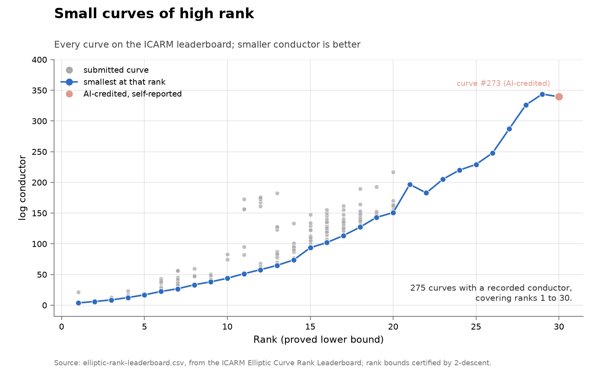
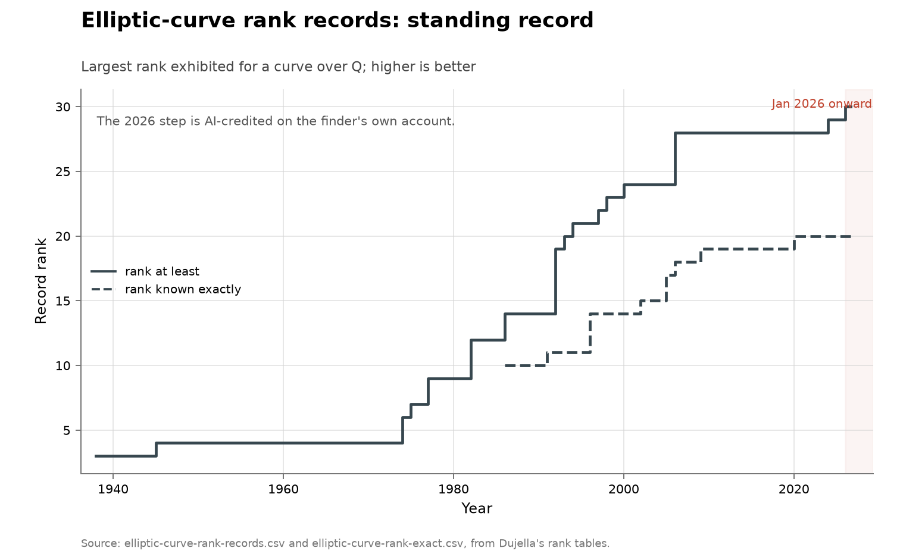

# Elliptic-curve rank records

- **Domain:** mathematics
- **Role:** discovery series
- **Metric:** the largest rank exhibited for an elliptic curve over Q,
counted as one step per record, split into a proved-lower-bound frontier and a
frontier of ranks known exactly; a third table holds every curve on the ICARM
leaderboard with its rank and its size, and a fourth dates the posts around the
2026 record
- **Coverage:** nineteen record steps, 1938 to 2026, dated by year; the
leaderboard snapshot spans 2026-05-27 to 2026-08-20, read 2026-08-20
- **Data:**
[`elliptic-curve-rank-records.csv`](elliptic-curve-rank-records.csv),
[`elliptic-curve-rank-exact.csv`](elliptic-curve-rank-exact.csv),
[`elliptic-rank-leaderboard.csv`](elliptic-rank-leaderboard.csv),
[`rank30-timeline.csv`](rank30-timeline.csv)
- **Upstream:** <https://web.math.pmf.unizg.hr/~duje/tors/rankhist.html> for
both frontiers, one subpage per record;
<https://elliptic-rank.icarm.cloud/database.json> for the leaderboard table;
the five dated posts and reads listed in `rank30-timeline.csv`
- **Verdict:** inconclusive — 1 record step in 2026 against 0 in 2025 and 1 in
2024; 3 steps over 2001–2026 against 14 over 1974–2000

## Definition

For an elliptic curve *E* over **Q**, Mordell's theorem makes *E*(**Q**) a
finitely generated abelian group, so *E*(**Q**) is a finite torsion group times
Z^*r*. The integer *r* is the rank. Which values of *r* occur is open: the
older conjecture is that rank is unbounded, and more recent heuristics point
the other way. Nothing in the problem statement has changed since it was posed,
so one integer can be tracked across nine decades of methods.

A discovery is an exhibited curve whose rank exceeds every previously exhibited
rank, dated by the year in Dujella's table. Exhibiting a curve of rank at least
*r* means giving the curve together with *r* independent points of infinite
order; each of the table's rows links a subpage carrying exactly that. A step
is therefore a construction, not a theorem about which ranks are possible.

Two frontiers run in parallel and are counted separately. The first is the
lower-bound frontier: rank at least *r*, where the points prove a bound and the
true rank may be higher. The second is the exact frontier: curves whose rank is
known unconditionally rather than bounded below, which runs behind the first.

The ICARM Elliptic Curve Rank Leaderboard counts a different thing. It fixes
the rank and asks how *small* a curve of that rank can be, ordering submissions
by conductor, naive height, Faltings height and discriminant. Its rank bounds
are certified before a curve is recorded:

> the points are proven independent in E(**Q**) modulo torsion, so rank ≥ the
> number of points
> — elliptic-rank.icarm.cloud, submission form, read 2026-08-20

## Facts

- **steps:** 19 recorded steps, 1938 to 2026, 18 credited human and 1 credited
  ai
- **span:** rank ≥ 3 (Billing, 1938) to rank ≥ 30 (ranksunbounded, 2026)
- **by-period:** 2 steps over 1938–1945 · 14 steps over 1974–2000 · 3 steps
  over 2001–2026
- **longest gap:** 29 years, from 1945 to 1974
- **recent steps:** rank ≥ 28 (Elkies, 2006) · rank ≥ 29 (Elkies–Klagsbrun,
  2024) · rank ≥ 30 (ranksunbounded, 2026)
- **exact frontier:** 8 recorded steps, rank = 10 (Kretschmer, 1986) to rank =
  20 (Elkies–Klagsbrun, 2020)
- **ai-attributed:** 1 of 19 record steps, dated 2026

- **board rows:** 275 curves, 2026-05-27 to 2026-08-20, from 11 submitters,
  covering ranks 1 to 30
- **board cadence:** 71 curves in 2026-05 · 171 in 2026-06 · 22 in 2026-07 ·
  11 in 2026-08
- **board record curve:** curve #273, rank ≥ 30, log conductor 339.3479, naive
  height 442.0854, submitted 2026-08-20
- **timeline:** 5 dated events, 2024-08-29 to 2026-08-20
- **challenge to record:** rank ≥ 30 posed publicly on 2026-08-05 and
  submitted on 2026-08-20, 15 days later

The collection-wide [cumulative index](../../CUMULATIVE.md) redraws this series
as the standing record over time:

## Challenge and response

The 2026 record answers a dated public challenge. On 2026-08-05, fifteen days
before the curve was submitted, Bartosz Naskręcki posed rank 30 as a problem
addressed to AI systems as well as to people:

> Here is another awesome challenge for your brain and AI. Find an elliptic
> curve with at least 30 independent points.
> — Bartosz Naskręcki (@nasqret), X, 2026-08-05 [@naskrecki2026rank30]

The prior record was announced by the maintainer of the tables this series is
built from:

> New record for the rank of elliptic curves over Q, due to Noam Elkies and Zev
> Klagsbrun, is 29!
> — Andrej Dujella (@dujella1), X, 2024-08-29 [@dujella2024rank29]

Daniel Litt plotted the same frontier the next day, and stated what the shape
of the series measures:

> maybe a reasonable measure of how much effort new records require
> — Daniel Litt (@littmath), X, 2024-08-30 [@litt2024rankrecords]

## Method

[`fetch.py`](fetch.py) rebuilds all three CSVs. The two record frontiers are
read from Dujella's page: the lower-bound table sits in a fixed-width `<pre>`
block, one row per record, and each row's rank links a subpage carrying the
curve, its independent points and a centred author-and-year line. The fetcher
parses the table and also reads every subpage, keeping the table's author
string where the two differ and failing if the years disagree. The 2026 row's
author column in the table is empty, so that row's credit string comes from its
subpage. The exact frontier has no table at all: its records are named in the
page's prose, and the fetcher collects the `rkeq<r>.html` links and reads the
author and year from each subpage.

The leaderboard CSV is the ICARM board's own `/database.json`, one row per
curve. The conductor and discriminant are integers hundreds of digits long, so
the vendored columns are their natural logarithms — the quantities the board
plots — and the exact integers stay upstream. Submitter and submission date are
recorded as the board gives them.

[`rank30-timeline.csv`](rank30-timeline.csv) is the one table here with no
fetcher: its five rows are transcribed by hand from four public posts and one
HTTP `Last-Modified` header, each row carrying the URL it came from. It is
maintained by editing the file. The gap the page states is the difference
between its challenge row and its submission row.

Neither upstream records how a record was found, so the `credit` and
`credit_evidence` columns are this folder's own and are set in one place, the
`CREDITS` table in `fetch.py`. Every row defaults to `human` / `published`. The
2026 row is set to `ai` / `self-reported`, and the evidence for it is quoted in
the AI-attribution register below.

[`figure.py`](figure.py) draws three PNGs.
`discovery-math-elliptic-rank.png` steps the lower-bound frontier against year
in human blue, extended flat to the snapshot date, with the exact frontier as a
grey dashed step behind it; each record is a point coloured by the pair
(`credit`, `credit_evidence`), so the one AI-credited record takes the
collection's soft red rather than its AI red — the same family, visibly weaker
evidence. Five records are labelled by matching the `discoverer` column, and
the corner note counts the period splits and the AI-credited steps at plot
time. `leaderboard-math-elliptic-rank.png` scatters log conductor against rank
for every board curve, joins the smallest curve at each rank, and marks the
board curve at each rank the record CSV credits to an AI.
`cumulative-math-elliptic-rank.png` is the shared standing-record shape with
both frontiers on one panel.

## Limitations

- **a secondary chronology.** The record rows reproduce one maintainer's
  table and its subpages rather than nineteen primary papers read in turn.
  Dujella's own reference list is carried on the same page and is not
  transcribed here.
- **the table is the scoring rule.** The page's prose still names rank ≥ 29 as
  the current record while its table and subpage carry the 2026 rank ≥ 30 row,
  as of the 2026-08-20 read; the CSV follows the table.
- **a lower bound is not the rank.** A row states that a curve has at least
  that rank. The exact frontier is a separate, lower series for that reason,
  and no row here asserts a curve's true rank.
- **ranks are skipped.** Records jumped from 4 to 6, 9 to 12 and 24 to 28, so
  the step count is a count of records, not of ranks.
- **the 2026 credit is self-reported.** It rests on one editable commentary
  field written by a pseudonymous account, quoted below; no paper or
  named-author statement carried it as of 2026-08-20.
- **the leaderboard has no baseline.** Its first submission is dated
  2026-05-27 and its opening weeks are seeding rather than discovery, so its
  own submission counts cannot be compared against a prior-year rate.
- **the fifteen-day gap is a coincidence of dates, not a causal link.**
  Nothing in either source states that the challenge post prompted the
  submission; the two rows record when each was published.
- **one timeline row is a header, not a statement.** The date Dujella's table
  gained the 2026 row is the page's HTTP `Last-Modified` value at the
  2026-08-20 read, which moves whenever the file is edited for any reason.
- **year granularity.** The record CSV dates each step to a year, which is what
  the upstream gives, while the board records timestamps to the second; the two
  time axes are not interchangeable.

## AI attribution

One of the 19 record steps carries an AI credit: the `credit` column is `ai`
for the 2026 row and `human` for the other 18. No AI credit appears anywhere in
Dujella's tables or subpages as of the 2026-08-20 read.

### 2026 — rank ≥ 30, ranksunbounded

- **credit:** ai
- **credit_evidence:** self-reported
- **discoverer:** `ranksunbounded`, a pseudonymous leaderboard account
- **certificate:** curve #273, 30 independent points, rank bound proved by the
  board's 2-descent check before the row was recorded
- **notes:** submitted 2026-08-20 08:10:53 UTC and the credit added to the
  commentary at 17:51:36 UTC the same day; Dujella's table carried the row that
  day with an empty author column

> [edit: Hmm not sure where to put this so editing Drew's comment (sorry
> Drew!): it was Claude, with Levent Alpöge and Ava Howell!]
> — elliptic-rank.icarm.cloud, curve #273 commentary, edited by ranksunbounded, read 2026-08-20

The rank bound and the credit rest on different evidence. The bound follows
from the 30 witness points by a check that does not depend on who supplied
them; the credit is one sentence appended to another contributor's comment, in
a field any logged-in user may edit. Andrew Sutherland, commenting on the same
curve, adds a conditional statement about the exact rank:

> Under GRH+BSD the rank is exactly 30
> — Andrew Sutherland, elliptic-rank.icarm.cloud, curve #273 commentary, 2026-08-20

Levent Alpöge is named in one earlier AI-credited resolution recorded in this
collection, the 2026 negative resolution of the Jacobian conjecture in
dimension 3 credited to Alpöge with Claude Fable 5 (see
[../math-smale/README.md](../math-smale/README.md)).

## Sources

- <https://web.math.pmf.unizg.hr/~duje/tors/rankhist.html> — Dujella's history
  of elliptic-curve rank records: the lower-bound table, the prose naming the
  exact-rank records, and the per-record subpages. Supports every row of
  `elliptic-curve-rank-records.csv` and `elliptic-curve-rank-exact.csv`, and
  the per-row `source_url` column points at the subpage a row came from
  [@dujella2026rankhist].
- <https://elliptic-rank.icarm.cloud/database.json> — the ICARM Elliptic Curve
  Rank Leaderboard's public table, maintained by the NSF Institute for
  Computer-Aided Reasoning in Mathematics under grant DMS 2425401. Supports
  every row of `elliptic-rank-leaderboard.csv`, the 2-descent certification
  quoted in Definition, and the commentary quoted in the AI-attribution
  register. Its source is at <https://github.com/icarm/elliptic-rank>
  [@icarm2026ellipticrank].
- [@naskrecki2026rank30] — the 2026-08-05 challenge post, quoted above and
  recorded as the challenge row of `rank30-timeline.csv`.
- [@dujella2024rank29] — the 2024-08-29 announcement of the rank ≥ 29 record,
  quoted above and recorded as the first row of `rank30-timeline.csv`.
- [@litt2024rankrecords] — the 2024-08-30 plot of record rank by year, quoted
  above for what the series measures; a prior rendering of the same frontier.
- [../math-smale/README.md](../math-smale/README.md) — records the Jacobian
  conjecture resolution credited to Levent Alpöge with Claude Fable 5, the
  earlier AI-credited result naming the same mathematician.
- [../matrix-omega/README.md](../matrix-omega/README.md) — a record frontier
  built the same way, one hand-checked chronology with one AI-credited 2026
  step.
- [Additional candidates](../../ADDITIONAL-CANDIDATES.md) — holds the other
  ICARM record boards, which share this folder's second upstream but have no
  pre-2026 baseline.
