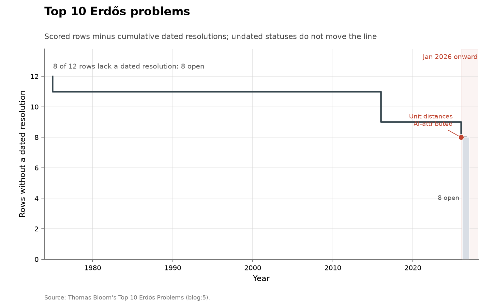

# Top 10 Erdős problems

**Domain:** mathematics
**Metric:** dated resolutions per year across 12 scored rows
**Coverage:** 1936–2026, with dated resolutions in 1975, 2016 and 2026; the list itself was posed 2026-04-16
**Data:** [`erdos-top10-problems.csv`](erdos-top10-problems.csv)
**Upstream:** <https://www.erdosproblems.com/forum/thread/blog:5>, with the unit-distance row resting on the human-verified account at <https://arxiv.org/abs/2605.20695>
**Verdict:** inconclusive — one AI-attributed fall among the four resolutions ever, and a single event cannot set a slope

## The problem

In April 2026, Thomas Bloom — the mathematician who built and maintains
erdosproblems.com — published a personal "top 10" of the most important Erdős
problems, solved and unsolved, naming twelve problem numbers: 3, 139, 4, 20,
28, 52, 61, 67, 77, 90, 571 and 713 [@bloom2026top10]. His stated reason for
writing it is this collection's reason for scoring it: he had seen
mathematicians "grow dismissive of Erdős problems recently, perhaps because
they have seen reports of AI solving problems on this site that turned out to
be quite simple", and wanted to mark out the problems that carry the
catalogue's mathematical weight.

That makes this subset the deliberate opposite of the corpus it comes from.
The full [Erdős catalogue](../math-erdos/README.md) is the largest body of
individually stated open mathematics AI systems have been pointed at, and its
solved count is surging; this ledger holds the twelve entries its own curator
selected for importance rather than tractability. It is scored here as a
prestige list, like [Hilbert](../math-hilbert/README.md) or
[Smale](../math-smale/README.md): if AI systems were reaching the mathematics
that matters most on that site, this is the dozen rows where it would show.

A "discovery" in this series is a row moving to resolved, dated by the year of
the resolving work. Twelve rows are scored rather than ten because Bloom's ten
entries name twelve site numbers: the progressions entry spans [3] and [139],
and the Turán-exponents entry spans [571] and [713].

## What the chart shows

Of the twelve scored rows, four carry a dated resolution and eight stand open.
The four resolutions span ninety years of effort: Szemerédi's theorem in 1975,
nearly forty years after the 1936 Erdős–Turán conjecture; then two fell in
2016 — the large-gaps-between-primes problem ($10,000, the largest prize Erdős
ever offered, standing about 60 years) to Maynard and to Ford, Green, Konyagin
and Tao, and the Erdős discrepancy problem to Tao — and one in 2026: the
unit-distance conjecture, disproved in May by an OpenAI model, with nine
mathematicians digesting the argument into a human-verified account
[@openai2026discretegeometry]. The chart marks that row in red.

The reading is the same as the [Smale ledger's](../math-smale/README.md) and
worth stating twice because the two events landed within months of each other:
an AI-attributed fall on an importance-selected list is now possible, at a
rate of one event, on a list where the historical rate is roughly one
resolution per generation. Four events in ninety years cannot show
acceleration, and the verdict says so. What the row does show is reach — the
unit-distance problem was posed in 1946, carried a $500 prize, and its
standing 44-year-old partial bound had resisted everyone — and shape: like the
Jacobian counterexample on the Smale list, what fell was a disproof anchored
by an explicit construction, not a proof of the conjectured statement.

The eight open rows are where Bloom's argument lives: the $5000
reciprocal-sums conjecture, the sunflower conjecture, the Erdős–Turán basis
conjecture, sum-product, Erdős–Hajnal, the Ramsey constant, and the two
Turán-exponent conjectures. None records any AI progress worth a note as of
the list's writing.

The collection-wide [cumulative index](../../CUMULATIVE.md) redraws this
ledger as rows remaining:

## How the chart was built

[`figure.py`](figure.py) calls the shared `problem_list_chart()` shape in
[`../../lib/families.py`](../../lib/families.py) with `ai_problem="90"`,
reading `erdos-top10-problems.csv`, keeping rows with `status` equal to
`resolved` and a non-empty `resolved_year`, and counting resolution events by
year. The `ai_caption` argument replaces the default annotation with this
row's actual standing — an AI disproof digested into a human-verified account
— since the default text describes the Smale row's formal kernel checks, which
is not what happened here. The cumulative view is the shared
`ledger_remaining_chart()`.

There is no `fetch.py`. The rows are hand-scored from the blog post itself,
which discusses each problem's status and history; the resolution years for
rows 4, 67 and 139 match the imputed solution years the
[math-erdos](../math-erdos/README.md) folder derives independently from the
catalogue's own pages, and the 2026 unit-distance row is dated by the same
May 2026 record used there, with its source column naming the human-verified
account rather than the blog.

## What it cannot support

- **Ten entries chosen by one mathematician are a judgment, not a sample.**
  Bloom calls the list "very subjective (and probably will change even for
  myself day to day)". A different expert's top ten would overlap but not
  coincide, and commenters on the post immediately proposed alternates
  (Erdős–Straus, the similarity problem, covering systems).
- **The list was posed in 2026, after most of its history.** Its selection
  already knows which problems fell and how; a solved problem can be chosen
  partly *because* its solution was celebrated, which inflates the apparent
  resolution rate of the chosen set.
- **Four events in ninety years is not a rate.** The chart can show that the
  2026 event happened; it cannot show whether anything about the underlying
  process changed.
- **The unit-distance row is a partial negative resolution on a different
  verification standard.** The conjecture is disproved — the truth of the
  growth exponent is now known to exceed 1.014 — but the sharp form of the
  question (the exact exponent) remains open, and the row rests on a
  human-verified account of a model's argument, not on formal kernel checks
  or completed peer review.
- **Rows overlap the parent catalogue by construction**, so this ledger is a
  re-reading of twelve of [math-erdos](../math-erdos/README.md)'s rows, not
  independent evidence about a different corpus.
- **Resolution landmarks are not effort-adjusted discovery rates**, here as on
  every ledger in this collection.

## LLM contributions

One, and it is the strongest single AI event anywhere in this collection: the
May 2026 disproof of the 1946 unit-distance conjecture, row 90 here, described
by the vendor and digested by nine mathematicians into a human-verified
account with Sawin making the exponent explicit at greater than 1.014
[@openai2026discretegeometry]. On the full catalogue that event sits among
dozens of AI resolutions of mostly minor problems
[@erdosproblems2026wiki]; on this importance-selected dozen it is the only AI
mark, and the other eleven rows include every problem Bloom considers
hardest. That asymmetry is the useful measurement: AI reach into this list's
top tier currently consists of one negative resolution whose verification ran
through human digestion, against eight open rows untouched — the same
one-event-of-the-right-shape pattern as the Jacobian counterexample on the
[Smale list](../math-smale/README.md).

## Related literature

The list, its reasoning, and every status here are Bloom's post
[@bloom2026top10], read against the catalogue he maintains
[@erdosproblems2026catalogue]. The unit-distance record is the vendor
announcement and the nine-author verified account
[@openai2026discretegeometry]; the AI-contribution ledger for the parent
corpus is the frozen wiki [@erdosproblems2026wiki]. The companion instruments
are [math-erdos](../math-erdos/README.md) for the full catalogue,
[math-green](../math-green/README.md) for a neighbouring expert-curated list
with no AI-attributed fall at all, and the prestige ledgers
([Hilbert](../math-hilbert/README.md), [Smale](../math-smale/README.md),
[Millennium](../math-millennium/README.md)) this subset is scored to match.
