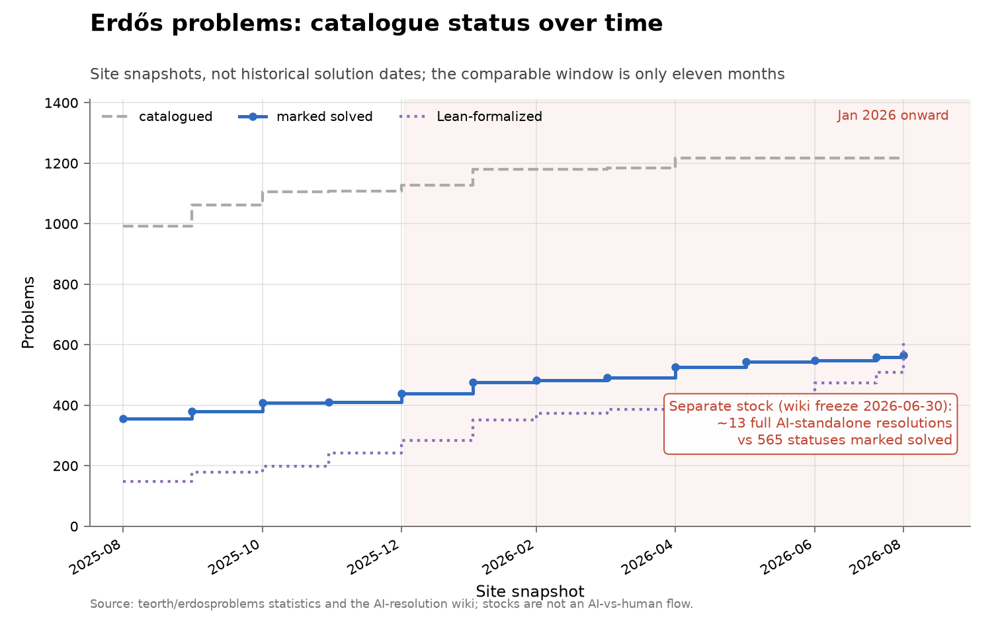

# Erdős problems catalogue

**Domain:** mathematics
**Metric:** problems catalogued, statuses marked solved, and statements formalized in Lean, at monthly site snapshots
**Coverage:** 2025-08-31 to 2026-08-08, thirteen snapshots
**Data:** [`../data/erdos-database-history.csv`](../data/erdos-database-history.csv)
**Upstream:** <https://www.erdosproblems.com/>, with the snapshot statistics and Lean counts from <https://github.com/teorth/erdosproblems> and the AI-resolution count from <https://github.com/teorth/erdosproblems/wiki/AI-contributions-to-Erd%C5%91s-problems>
**Verdict:** inconclusive — the comparable window is about eleven months, and a status edit is not a solution

## The problem

The Erdős problems catalogue is a community register of the problems Erdős
posed, one page per problem, each carrying a status and increasingly a Lean
formalization of its statement. It matters here for one reason: it is by far the
largest body of individually stated, genuinely open mathematics that AI systems
have actually been pointed at, and the project keeps a public per-problem record
of what has fallen.

A "discovery" in this series is a status edit from open to solved. That is a
bookkeeping event, not a mathematical one, and the site itself warns that the
edit can follow the underlying solution by weeks, months, or decades. It is also
a stock rather than a flow: the chart shows how many problems currently carry a
solved status, not how many were solved in a given month.

That makes this a poor instrument for a slope change and a good one for scale.
The catalogue can tell you how large the AI-attributed contribution is next to
the recorded total. It cannot tell you the rate at which either is growing,
because it has no pre-2025 history in comparable form and because the cohort was
still being assembled for most of the window.

## What the chart shows

Between August 2025 and August 2026 the catalogue grew from 992 problems to
1,217, statuses marked solved from 355 to 565, and Lean-formalized statements
from 148 to 605. The red callout is the separate stock: about 13 full
AI-standalone resolutions recorded in the project's AI wiki at its 2026-06-30
freeze, against those 565 solved statuses.

The catalogue count stopped changing in April 2026, which is the only part of the
window where a rise in solved status cannot be caused by adding an
already-solved historical problem. Over that fixed cohort the solved count went
from 525 on 30 April to 565 on 8 August, forty rows in about a hundred days.
That arithmetic is this repository's, not the project's, and forty rows is too
few and too recent to compare against anything.

One reading is worth stating because the lines cross: Lean-formalized statements
pass the solved count in the final snapshot, 605 against 565. The two count
different things. Formalizing a statement is not proving it, and the
formalization drive is a separate effort from the solving.

## How the chart was built

`erdos_chart()` in [`../tools/make_figures.py`](../tools/make_figures.py) plots
three step series from `erdos-database-history.csv` against `date`: `total_problems`
as a dashed grey line, `total_solved` in blue with markers, and `lean_formalized`
as a purple dotted line. The x tick labels come from the `month` column, every
second snapshot plus the last. January 2026 onward is shaded, as in every figure
here.

The AI-standalone stock is drawn as a boxed callout rather than a fourth line.
About 13 against stocks of 565 and 1,217 would be a flat line on the axis, and
plotting it as a series would also imply it is measured on the same basis, which
it is not: it comes from a different source, frozen on a different date, under
its own definition of standalone contribution.

The `catalogue_count_unchanged` column flags the snapshots from April 2026 on,
where the cohort is fixed. The figure does not shade that sub-window separately;
the column is there so a reader can find it.

The series changes source at its tip. Through July the points follow the
project's GitHub statistics history; the 8 August endpoint uses the live
website's solved-status headline together with that day's GitHub Lean count.

## What it cannot support

- **Status-change dates are not solution dates.** The site says so itself, and
  the gap can run to decades. Every date on this chart is an editing date.
- **The comparable window is about eleven months.** There is no before, so there
  is nothing for the agent era to be compared against.
- **The two stocks are not an AI-versus-human flow.** The roughly 13 AI-standalone
  resolutions and the 565 solved statuses are counted on different dates under
  different definitions, so subtracting one from the other does not estimate
  human output.
- **The cohort grew by 225 rows inside the window**, and problems can be added
  already solved, so most of the rise in solved status is catalogue construction
  rather than new mathematics.
- **Lean formalization counts statements, not proofs**, and is driven by a
  separate volunteer effort, so it is a measure of infrastructure rather than of
  discovery.
- **The wiki is frozen and downstream.** Its AI counts stop at 2026-06-30, and
  its largest single input is a vendor's own denominator rather than an
  independent recount.

## LLM contributions

This is the one corpus in the collection where an AI-contributed flow is
measurable at all. The frozen wiki records roughly 47 AI-standalone
contributions — about 13 full resolutions, about 25 partial, and about 9
incorrect — and states both that the list "is not a benchmark" and that
"absence of past progress may reflect obscurity rather than difficulty"
[@erdosproblems2026wiki]. The one rate with a real denominator is AlphaProof
Nexus, which resolved 9 of 353 open problems, about 2.5%, at a few hundred
dollars each, two of them open for 56 years; on the more mechanically stated
OEIS corpus the same system proved 44 of 492, about 9% [@deepmind2026nexus].
Named single results run from Erdős #728 in January 2026, produced by GPT-5.2 Pro
with Aristotle and described as the first resolved autonomously, to the May 2026
disproof of Erdős's 1946 unit-distance conjecture, which nine mathematicians
digested into a human-verified account and for which Will Sawin made the exponent
explicit at greater than 1.014 [@openai2026discretegeometry]. Astra's August 2026
claims on #146, #180 and #183 post-date the wiki freeze, carry Lean certificates,
and are awaiting peer review. Tao supplies the scale without a rate: "Fifty-odd
problems have been solved with AI assistance, which is great, but there's like
six hundred to go" [@tao2026interview].

## Related literature

The catalogue and its warning about status dates are the project's own
[@erdosproblems2026catalogue]; the AI counts come from a wiki its maintainers
have stopped updating [@erdosproblems2026wiki]. The formal-proof route that
produced the only denominated rate here is documented by its vendor
[@deepmind2026nexus], and the single most consequential result by another
[@openai2026discretegeometry]. Tao's commentary is the sharpest statement of why
a solve count is not a success rate, since problem selection, effort, and failed
attempts are all unobserved [@tao2026interview]. The prestige-list series in
[Hilbert](math-hilbert.md), [Smale](math-smale.md),
[Millennium](math-millennium.md) and [TOPP](math-topp.md) are the ceiling check
on this corpus: they move far less, and they are selected against cheap
verification.
