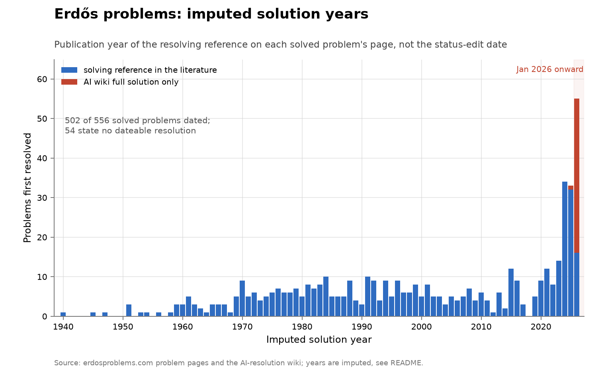
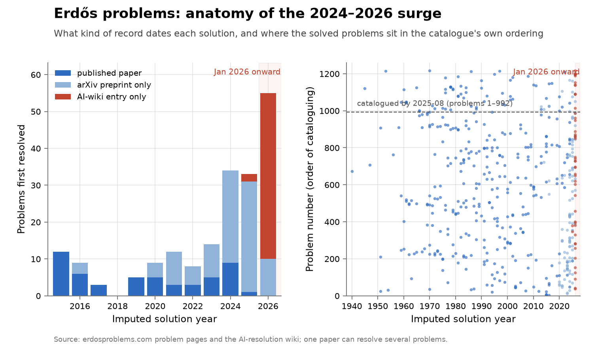
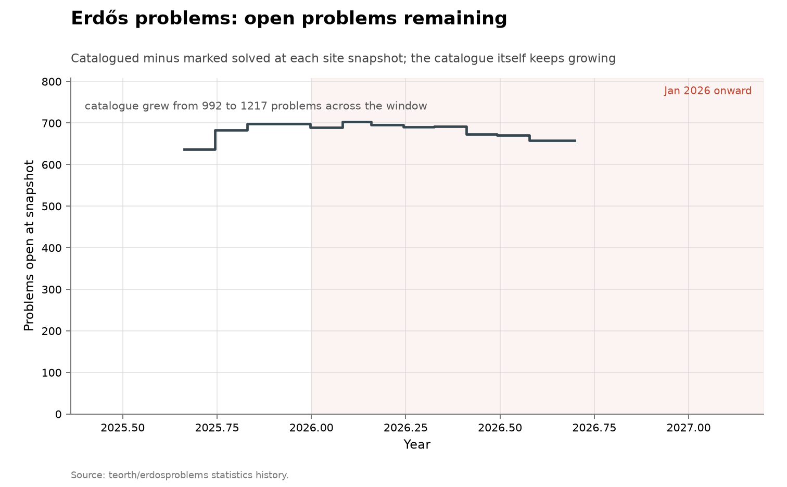

# Erdős problems catalogue

**Domain:** mathematics
**Role:** discovery series
**Metric:** problems catalogued, statuses marked solved, and statements formalized in Lean, at monthly site snapshots; plus an imputed solution year per solved problem
**Coverage:** thirteen monthly snapshots, 2025-08-31 to 2026-08-10; imputed solution years 1940–2026
**Data:** [`erdos-database-history.csv`](erdos-database-history.csv), [`erdos-solution-years.csv`](erdos-solution-years.csv), [`erdos-solution-year-overrides.csv`](erdos-solution-year-overrides.csv)
**Upstream:** <https://www.erdosproblems.com/>, with the snapshot statistics and Lean counts from <https://github.com/teorth/erdosproblems> and the AI-resolution count from <https://github.com/teorth/erdosproblems/wiki/AI-contributions-to-Erd%C5%91s-problems>
**Verdict:** inconclusive — 55 imputed resolutions in 2026 through 2026-08-10, against 33 in 2025 and a 5.9/year mean over 2000–2023

## Definition

The Erdős problems catalogue is a community register of the problems Erdős
posed, one page per problem, each carrying a status and increasingly a Lean
formalization of its statement [@erdosproblems2026catalogue]. The project
publishes a per-commit statistics history of three stocks — problems
catalogued, statuses marked solved, statements formalized in Lean — and a
separate wiki attributing contributions to AI systems, which stopped
updating on 2026-06-30 [@erdosproblems2026wiki]. The catalogue itself,
including problem statuses, is still edited past that date.

This folder holds two instruments over that corpus.

The snapshot series counts the three stocks at one snapshot per month. A
"discovery" at this level is a status edit from open to solved — a
bookkeeping event, and the site itself warns that the edit can follow the
underlying solution by weeks, months, or decades
[@erdosproblems2026catalogue]. The series shows how many problems carry a
solved status at each date, not how many were solved in a given month.

The imputed series assigns each solved problem a solution year. A solved
problem's page usually states what resolved it — "Solved by Maynard [Ma16]"
— and the page's bibliography dates that reference; the imputed year is the
publication year of the resolving reference, or, where the page cites no
dateable resolution, the date in the AI wiki's primary-contribution tables.
That turns the 556-row stock of solved problems into a per-year series
running back to 1940. Every date in it is the publication year of the
resolving work, not the day the mathematics happened, and the rules and
review ledger behind it are stated under Method.

## Facts

Snapshot series, from
[`erdos-database-history.csv`](erdos-database-history.csv):

- **snapshots:** thirteen, monthly, 2025-08-31 to 2026-08-10
- **catalogue:** 992 problems at the first snapshot to 1,217 at the last; the count is unchanged from the 2026-04-30 snapshot on
- **solved statuses:** 355 to 559
- **lean-formalized:** 148 to 608; 608 against 559 solved statuses at the last snapshot
- **fixed cohort:** solved statuses 525 on 30 April to 559 on 10 August, thirty-four rows in about a hundred days
- **cohort growth:** the catalogue grew by 225 rows inside the snapshot window
- **ai-standalone stock:** about 13 full AI-standalone resolutions in the wiki at its 2026-06-30 freeze, against 559 solved statuses
- **three counts:** 556 solved rows in the solution-years read, 559 in the 2026-08-10 statistics snapshot, 565 on the site's headline of 8 August

The project publishes its own running chart of the same statistics history
this folder's fetcher reads. Unlike the PNG above, the image below is
upstream's and live: it keeps moving after this document's snapshot date,
and its counts are the project's own.

Imputed series, from
[`erdos-solution-years.csv`](erdos-solution-years.csv):

- **imputed rows:** of the 556 solved problems, 502 carry an imputed year and 54 state no dateable resolution
- **imputed span:** 1940 to 2026
- **imputed mean:** 5.9 dated resolutions per year over 2000–2023
- **imputed recent:** 34 in 2024, 33 in 2025, and 55 in 2026 through 2026-08-10
- **2024 anatomy:** the 34 rows of 2024 trace to 31 distinct works, with 25 dated by arXiv preprints and 9 by published papers
- **2025 anatomy:** 30 of the 33 rows are preprint-dated and 1 published
- **2026 anatomy:** 45 of the 55 rows are dated only by the AI wiki, against 10 preprints
- **2026 placement:** 41 of the 55 sat at numbers 1–992, catalogued by the 2025-08-31 snapshot
- **kind totals:** 98 of the 502 dated rows rest on arXiv preprints and 47 on wiki entries
- **basis against kind:** 40 problems rest on the wiki alone, 47 are wiki-dated

Pre-2024 dated solutions sit at every problem number: problems entered the
catalogue with their resolutions already attached, so old solution years
record literature archaeology rather than events observed by the site. For
2024–2025 the first snapshot is too late to order cataloguing against
solution. For 2026, 41 of the 55 dated rows sat at numbers the 2025-08-31
snapshot had already catalogued.

The collection-wide [cumulative index](../../CUMULATIVE.md) redraws the
snapshot series as open problems remaining — a line that can rise, because
new problems are catalogued faster than problems fall:

## Method

Every point in the snapshot series comes from one source, the project's
GitHub statistics history, which is what [`fetch.py`](fetch.py) rebuilds the
whole file from: one row per calendar month, the last snapshot in that
month. The `catalogue_count_unchanged` column flags the snapshots from April
2026 on, where the catalogue count holds at 1,217; over that fixed cohort a
rise in solved statuses cannot be caused by adding an already-solved
problem. An earlier version of this series set its last point by hand from
the live website's solved-status headline; the two sources disagree — on 8
August the headline read 565 where the statistics history recorded 559 — and
a hand-set endpoint the folder's own fetcher overwrites cannot be rebuilt,
so the fetcher's value stands and the disagreement is recorded in the
**three counts** fact line.

The imputed years come from [`fetch_solutions.py`](fetch_solutions.py),
which is run by hand rather than by `make fetch` because it downloads the
LaTeX source of every solved problem's page — about 560 throttled requests.
It enumerates the problems whose `problems.yaml` status read proved,
disproved or solved on the day it ran (556 rows, against 559 in the same
week's statistics snapshot), and imputes each a year by three rules, in
order. First, review overrides:
[`erdos-solution-year-overrides.csv`](erdos-solution-year-overrides.csv)
carries 175 hand-checkable rows, each with its reference and reason, for
pages where the mechanical rule misfires. Second, the solving citation: the
page's discussion usually attributes the resolution in a sentence like
"Solved by Maynard [Ma16]", and the imputed year is the publication year of
the newest reference cited in the first such sentence, taken from the page's
own bibliography. Third, the AI wiki: problems whose only recorded
resolution is an AI system's take the date in the wiki's
primary-contribution tables. Where a citation and a wiki date both exist the
earlier wins.

The overrides file is the review record. The sentence rule and the wiki
overlay together dated 418 of the 556 pages, and every one of the 556 was
then re-read against that output — a model-assisted review of each page's
discussion text, spot-checked by hand — which supplied a year for 94 pages
the rule had missed, corrected 71, and withdrew 10, leaving 54 problems with
no dateable resolution stated anywhere on their page. Rerunning the fetcher
reapplies the overrides, so the review survives a refetch until the
underlying page text changes.

[`figure.py`](figure.py) draws the four charts. The first plots three step
series from `erdos-database-history.csv` against `date`: `total_problems` as
a dashed grey line, `total_solved` in blue with markers, and
`lean_formalized` as a purple dotted line; January 2026 onward is shaded, as
in every figure here. The AI-standalone stock is drawn as a boxed callout
rather than a fourth line: it comes from a different source, frozen on a
different date, under its own definition of standalone contribution, and at
about 13 against stocks of 559 and 1,217 it would not resolve on the linear
axis. The second chart bars the `solution_year` column of
`erdos-solution-years.csv` by year, blue where the year comes from a
reference on the problem's page and red where the only dated resolution is
the AI wiki's. The third chart reads the same file's `reference_kind` column
— `published` when a dating reference carries a venue in the page's
bibliography, `preprint` when every dating reference is arXiv-only,
`ai_wiki` when the date is a wiki entry — and plots each dated solution
against its problem number, with the catalogue's size at the first snapshot
marked. The two splits are not the same rule: the second chart keys on
`basis`, what dated the problem after review, while the third keys on
`reference_kind`, what kind of reference did the dating; 7 problems whose
dates rest on the wiki but were confirmed in review are blue in the second
chart and red in the third. The cumulative view is the shared
open-problems-remaining shape.

## Limitations

- **status-change dates are not solution dates.** The site says so itself,
  and the gap can run to decades; every date on the snapshot chart is an
  editing date [@erdosproblems2026catalogue].
- **an imputed year is the publication year of the resolving reference,**
  not the date of the mathematics, and the assignment of "the resolving
  reference" is an editorial reading of each page's discussion — reviewed,
  but not ground truth. 54 solved problems resisted any dating at all.
- **recent rows are mostly unrefereed, and they cluster.** 98 of the 502
  dated rows rest on arXiv preprints and 47 on wiki entries; the surge years
  are almost entirely these two kinds. One paper can resolve several
  problems, so the recent bars count catalogue rows cleared rather than
  independent works, and the underlying preprints and wiki claims have not
  completed peer review.
- **the imputed flow inherits the catalogue's selection.** The corpus was
  assembled from 2023 onward, partly around solutions as they happened, and
  AI systems have been pointed at this list because it is a list. A
  2024–2026 surge in this series measures these problems, not mathematics
  at large.
- **the snapshot window is about eleven months.** No snapshots exist before
  2025-08-31.
- **the two stocks are not an AI-versus-human flow.** The roughly 13
  AI-standalone resolutions and the 559 solved statuses are counted on
  different dates under different definitions, so subtracting one from the
  other does not estimate human output.
- **the cohort grew by 225 rows inside the window,** and problems can enter
  the catalogue already solved, so a rise in solved statuses before
  2026-04-30 does not separate new resolutions from catalogue additions.
- **Lean formalization counts statements, not proofs,** and is driven by a
  separate volunteer effort.
- **the AI-attribution wiki is frozen and downstream — the catalogue is
  not.** The wiki's counts stop at 2026-06-30, and its largest single input
  is a vendor's own denominator rather than an independent recount. The
  catalogue's status tracking continues past that date, so AI resolutions
  after June 2026 can appear as status edits but never in the wiki's count.

## AI attribution

The catalogue's AI-contribution record is the project's wiki, which states
its own freeze:

> "The wiki is no longer updated. The latest data is as of Jun 30, 2026."
> — AI contributions to Erdős problems, teorth/erdosproblems wiki, read 2026-08-14 [@erdosproblems2026wiki]

At that freeze it records roughly 47 AI-standalone contributions — about 13
full resolutions, about 25 partial, and about 9 incorrect — under
disclaimers that include:

> "This page is not a benchmark […] Absence of past progress may reflect
> obscurity rather than difficulty"
> — AI contributions to Erdős problems, wiki disclaimers, read 2026-08-14 [@erdosproblems2026wiki]

The one AI result with a stated denominator on this corpus is AlphaProof
Nexus [@deepmind2026nexus]:

> "Our most capable agent autonomously resolved 9 of 353 open Erdős problems
> at the per-problem cost of a few hundred dollars, proved 44/492 OEIS
> conjectures […]"
> — AlphaProof Nexus paper abstract, arXiv 2605.22763, v2 of 2026-06-08, read 2026-08-14 [@deepmind2026nexus]

Dated single events:

- The wiki's AI-standalone table records problem 728 as "Full solution
  (Lean)" by "Aristotle, GPT-5.2 Pro", dated "6 Jan, 2026" (wiki read
  2026-08-14) [@erdosproblems2026wiki].
- Problem 90, Erdős's 1946 unit-distance growth conjecture, was disproved in
  May 2026. The vendor announcement of 2026-05-20 is titled

  > "Model disproves discrete geometry conjecture"
  > — OpenAI, announcement title, 2026-05-20 [@openai2026discretegeometry]

  and the argument was digested by nine mathematicians into a human-verified
  account (arXiv 2605.20695), with the explicit exponent, greater than
  1.014, stated by Sawin (arXiv 2605.20579). The wiki's table carries the
  same event as "OpenAI internal model", dated "20 May, 2026", which is the
  date the imputed series records for problem 90.
- Astra announced claims on catalogue problems 146, 180 and 183 in August
  2026. They post-date the wiki freeze, carry Lean certificates, and were
  awaiting peer review as of 2026-08-14; none of the three appears in the
  wiki's tables.

On scale, Tao's statement in the 2026-03-20 interview:

> "Fifty-odd problems have been solved with AI assistance, which is great,
> but there's like six hundred to go"
> — Terence Tao, interview with Dwarkesh Patel, 2026-03-20 [@tao2026interview]

The snapshot CSVs themselves carry no finder attribution; the AI/human split
in the imputed series is the `basis` and `reference_kind` columns' record of
whether a row's date rests on the wiki, as stated in Method.

## Sources

- [@erdosproblems2026catalogue] — the catalogue, its statuses, and the
  site's warning that status edits lag solutions.
- [@erdosproblems2026wiki] — the AI-contribution wiki, frozen 2026-06-30;
  source of the AI-standalone stock, the problem-728 record, and the
  disclaimers quoted above.
- [@deepmind2026nexus] — AlphaProof Nexus: 9 of 353 open Erdős problems
  resolved, 44 of 492 OEIS conjectures proved, quoted above from the
  paper's abstract.
- [@openai2026discretegeometry] — the 2026-05-20 unit-distance disproof:
  vendor announcement, the nine-author verified account (arXiv 2605.20695),
  and Sawin's explicit exponent (arXiv 2605.20579).
- [@tao2026interview] — the interview quoted above; also the source note
  for the "fifty-odd problems" scale.
- Prestige ledgers over importance-selected corpora, of the same instrument
  type: [Hilbert](../math-hilbert/README.md),
  [Landau](../math-landau/README.md),
  [Thurston](../math-thurston/README.md),
  [Smale](../math-smale/README.md),
  [Millennium](../math-millennium/README.md),
  [TOPP](../math-topp/README.md).
- The catalogue's curator's own top-10 subset is scored in
  [math-erdos-top10](../math-erdos-top10/README.md); its twelve rows all
  index into this catalogue.
