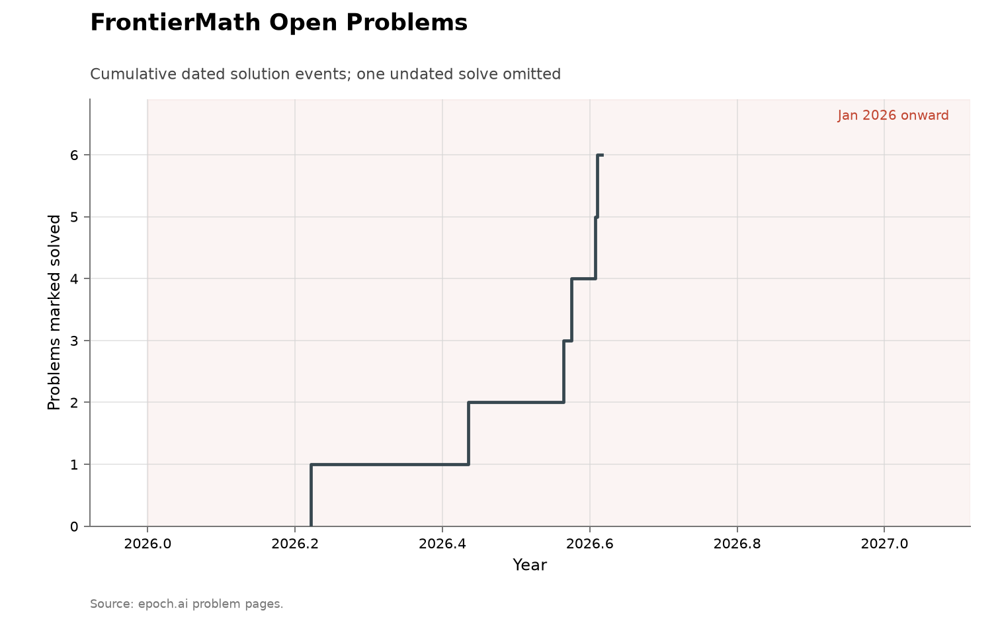

# FrontierMath Open Problems

**Domain:** mathematics
**Metric:** dated solution events on Epoch AI's pool of open research problems, placed by curator-assigned notability tier
**Coverage:** benchmark announced 2026-02-26; pages read 2026-08-14, with recorded solves from 2026-03-23 to 2026-08-12
**Data:** [`frontiermath-open-problems.csv`](frontiermath-open-problems.csv), [`frontiermath-open-solutions.csv`](frontiermath-open-solutions.csv)
**Upstream:** <https://epoch.ai/frontiermath/open-problems>
**Verdict:** too early — a six-month-old pool built for cheap verification; every solve sits in its two lowest notability tiers

## The problem

FrontierMath: Open Problems is Epoch AI's pool of genuinely unsolved research
mathematics — problems that are open, that at least two professional
mathematicians have seriously attempted, and whose solutions "can be verified
to a high degree of confidence by a typical computer program running on a
typical laptop in under an hour" [@epoch2026openproblems]. That last criterion
is the reason the series is here: this is the cheap-verification selection
rule made explicit and institutional, the same design choice
[@arxiv2026horizonmath] describes and the same mechanism this collection's
[Smale](../math-smale/README.md) and
[Erdős top-10](../math-erdos-top10/README.md) ledgers surface one event at a
time. Each problem also carries an editorial notability tier — moderately
interesting, solid result, major advance, breakthrough — which makes the pool
the one corpus in this collection where the *significance* of what falls is
scored by the curator rather than argued after the fact.

A "discovery" in this series is a problem page moving to a solved status. The
pool is young and still moving: announced in late February 2026, recently
expanded, with problems added, retired after solves, and in one case withdrawn
for failing the publishable-result bar.

## What the chart shows

As of 2026-08-14 the sitemap lists 54 problem pages: 6 are marked solved by
AI, 1 by humans, and 47 stand unsolved. The tiers split 23 moderately
interesting, 20 solid result, 6 major advance, and 4 breakthrough, plus one
withdrawn page badged outside the tier scale. 6 of the 7 recorded solves
carry a date, running from 2026-03-23 to 2026-08-12 — roughly one a month,
with a cluster in late July around the expanded release's pre-testing.

The placement is the reading. Four solves sit in the lowest tier (a hypergraph
Ramsey construction by GPT-5.4 Pro; short superpermutations over 8, 9 and 10
and a genus-2 torsion record, both by GPT-5.6 Sol; a Hadamard matrix of order
668 credited to a team of three humans and Claude) and two in the second tier
(a presentation of the absolute Galois group of $\mathbb{Q}_2$, first produced
by Claude Fable 5, and the inverse Galois problem for $M_{23}$, scored as a
human solve). The top two tiers — ten problems the editors call a major
advance or a breakthrough — are untouched. The genus-2 solve is also a
caution about what "solved by AI" can mean: the model found an existing curve
in a public database whose torsion nobody had checked, a literature-search
result the curators themselves flag, not new mathematics.

Two scoring judgments are worth quoting because they show where the AI/human
line is drawn. The $M_{23}$ solve involved AI heavily, but Epoch requires
"that the core ideas of the solution be unambiguously contributed by AI", and
one author said no sharp line could be drawn — so it counts as human. The
Hadamard solve, reported by Levent Alpöge crediting three humans and Claude,
is "provisionally" AI pending detail on the human share. Both defaults could
reasonably have gone the other way, which is the usual floor-not-measurement
caveat running in both directions.

The site's own front page tallies differently — "recently expanded to 50
problems", with AI solves of 3/22, 1/18, 0/6 and 0/3 across the four tiers —
than a page-by-page read of its sitemap, consistent with recent additions,
retirement of solved rows from the active pool, and the withdrawal. The same
one-stock-several-counts pattern appears on the
[Erdős catalogue](../math-erdos/README.md), and the CSVs here vendor the
page-by-page read.

The collection-wide [cumulative index](../../CUMULATIVE.md) redraws the six
dated events as a running count:

## How the chart was built

[`fetch.py`](fetch.py) reads the site's sitemap, fetches each problem page,
and rebuilds [`frontiermath-open-problems.csv`](frontiermath-open-problems.csv)
from the server-rendered status chip, field chip, task-type chips and
notability badge; an unrecognised status is a hard failure rather than a
guessed category. [`frontiermath-open-solutions.csv`](frontiermath-open-solutions.csv)
is hand-transcribed from the pages' solution-update prose and Epoch's
announcement posts, because the dates, systems and elicitors of each solve are
stated only in prose; the ramsey-hypergraphs row is dated by the announcement
post since its page states no solve date, and the hadamard date is the day of
the public report the page links. [`check.py`](check.py) cross-checks the two
ledgers, so a refetch that flips a status without the event ledger being
reviewed fails the folder rather than passing silently.

[`figure.py`](figure.py) places each dated event at its date and tier lane,
with each lane's unsolved count at the right edge, and draws the cumulative
count of dated solves for [CUMULATIVE.md](../../CUMULATIVE.md). The one
undated solve — the withdrawn explicit-deformations page — is stated in a
corner note rather than drawn.

## What it cannot support

- **Six months of data cannot show a trend.** The verdict is "too early" for
  the same reason as the [ECDSA circuit sprint](../algorithms-ecdsa-circuit/README.md):
  there is no pre-agent-era baseline, and the pool itself is being edited as
  the events arrive.
- **The pool is selected to be solvable by machines.** Cheap verification is
  an admission criterion, so a solve rate here measures AI reach into
  machine-checkable mathematics, not into mathematics.
- **The denominator moves.** Problems are added, retired on solving, and in
  one case withdrawn; the site's own front-page tally and its sitemap
  disagree, and this folder's page count is one day's read of a moving pool.
- **Solve dates are announcement dates.** Pre-release solves are dated by when
  Epoch tested or announced them, not when a model first produced the answer;
  one solve has no recoverable date at all.
- **"Solved by AI" is an editorial call with a high bar** — the $M_{23}$
  case shows a heavily-AI solve scored human, and the Hadamard case a
  provisional AI credit that may be revised. Neither direction of the
  scoring is a measurement of the AI share of the work.
- **Notability tiers are one editorial board's judgment**, and the tier
  denominators are small — six major-advance and four breakthrough rows —
  so a single future solve would move a top tier from 0% to a large-looking
  share.

## LLM contributions

This series is itself an AI-evaluation instrument, so the contributions are
the data: six of seven recorded solves are credited to AI systems — GPT-5.4
Pro, GPT-5.6 Sol twice, Claude Fable 5, Claude, and one unnamed system on the
withdrawn problem — with humans eliciting, verifying and writing up in every
case [@epoch2026openproblems]. What the instrument adds over the
[Erdős catalogue's](../math-erdos/README.md) larger counts is the notability
axis: it shows machine solves reaching real but minor open mathematics —
record-type constructions and searches, several explicitly latent in the
literature — while the rows its editors rank as major advances or
breakthroughs stand at zero. That is the cheap-verification prediction from
the [Smale ledger](../math-smale/README.md) stated as a scoreboard: what falls
is what can be certified, and how much it matters is a separate, currently
low, number.

## Related literature

The pool, its criteria, and every status here are Epoch AI's pages
[@epoch2026openproblems]; the explicit cheap-verification design is shared
with other post-2025 benchmarks [@arxiv2026horizonmath]. The corpus-scale
companion is the [Erdős catalogue](../math-erdos/README.md) with its frozen
AI-contribution wiki [@erdosproblems2026wiki]; the importance-selected
companions are the [Erdős top-10](../math-erdos-top10/README.md) and
[Ben Green's list](../math-green/README.md), and two of this pool's rows
(no-three-in-line, Chowla's cosine problem) appear on Green's list under
different framing. Tao's remark that a solve count is not a success rate —
selection, effort and failed attempts are all unobserved — applies here with
the unusual advantage that this curator publishes the denominator
[@tao2026interview].
