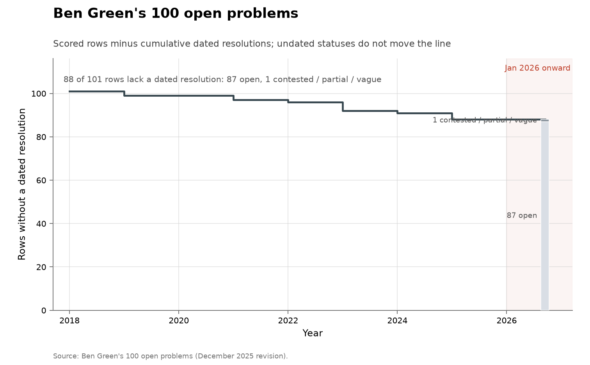

# Ben Green's 100 open problems

**Domain:** mathematics
**Role:** prestige ledger
**Metric:** dated resolutions per year across 101 scored rows
**Coverage:** 2018–2026; statuses as the December 2025 revision records them, read 2026-08-13; dated resolutions 2019–2025
**Data:** [`green-problems.csv`](green-problems.csv)
**Upstream:** <https://people.maths.ox.ac.uk/greenbj/papers/open-problems.pdf>
**Verdict:** no acceleration — 0 dated resolutions in 2026 against 3 in 2025 and a 1.9/year mean over 2019–2025

## Definition

Ben Green's "100 open problems" is a list of one hundred questions in
additive combinatorics, number theory, discrete geometry and harmonic
analysis, circulated since 2018 and revised by its author, with statuses
updated as problems fall [@green2025openproblems]. A problem's heading
carries "(Solved)" when Green marks it solved, and a dated update note names
what solved it. The document states its own revision cadence:

> "Perhaps once a year or so. Most recent update: December 2025. Updates are
> generally in the form of additional remarks, with the original text
> unchanged."
> — Ben Green, 100 open problems (December 2025 revision), read 2026-08-13 [@green2025openproblems]

A "discovery" in this series is a row carrying Green's solved marker
together with the year of the update note recording the solution. In every
case but one that is also the year the resolving work first appeared; the
exception is Problem 9(i), where the update note is dated a year after the
Kelley–Meka preprint and the row carries the preprint's year. The ledger is
a snapshot of the December 2025 revision, read on 2026-08-13.

There are 101 scored rows rather than 100 problems because Problem 9's part
(i) carries its own solved marker while parts (ii) and (iii) stand open, so
it is split into two rows — the same split rule the
[Smale ledger](../math-smale/README.md) applies to its row 11. A heading
marked "(Mostly solved)" is scored partial.

## Facts

- **rows:** 101 scored; 13 resolved with a dated year; 1 partial; 87 open
- **span:** dated resolutions 2019–2025
- **by-year:** 2019: 2 · 2021: 2 · 2022: 1 · 2023: 4 · 2024: 1 · 2025: 3
- **ai-attributed:** 0 of 13 dated resolutions
- **post-revision:** resolutions reported after the December 2025 revision
  are recorded in the notes of rows 44, 90 and 100; the rows keep the
  document's own statuses (see AI attribution)

The collection-wide [cumulative index](../../CUMULATIVE.md) redraws this
ledger as rows remaining:

### 1 — Sum-free subsets of size n/3 + ω(n)
- **status:** resolved
- **resolved:** 2025
- **resolver:** Bedert
- **notes:** Any n-element integer set has a sum-free subset of size n/3 + c log log n

> "Update 2025. Bedert [28] has solved the original question, showing that
> any set A ⊂ Z of size n contains a sum-free set of size at least
> n/3 + c log log n."
> — Ben Green, 100 open problems (December 2025 revision), read 2026-08-13 [@green2025openproblems]

### 4 — Largest product-free set in the alternating group
- **status:** resolved
- **resolved:** 2022
- **resolver:** Keevash–Lifshitz–Minzer
- **notes:** Solved with a stability result characterising extremal sets

> "Update 2022. This question has been solved (together with a stability
> result characterising sets close to the extremum) by Keevash, Lifshitz and
> Minzer [192]."
> — Ben Green, 100 open problems (December 2025 revision), read 2026-08-13 [@green2025openproblems]

### 9a — Is r3(N) below N/(log N)^10
- **status:** resolved
- **resolved:** 2023
- **resolver:** Kelley–Meka
- **notes:** Green marks part (i) solved; his 2024 update records the 2023 Kelley–Meka bound

> "Update 2024. In a remarkable breakthrough, Kelley and Meka [194] […]"
> — Ben Green, 100 open problems (December 2025 revision), read 2026-08-13 [@green2025openproblems]

### 11 — Progressions with square-minus-one or prime-minus-one differences
- **status:** partial
- **resolved:**
- **resolver:**
- **notes:** Marked mostly solved: Peluse–Sah–Sawhney 2023 and Leng 2025 settle part (i) up to what Green concedes is reasonable; Tao–Teräväinen 2021 advanced part (ii)

> "Update 2023. Depending on one’s definition of ‘reasonable’, problem (i)
> has been resolved by Peluse, Sah and Sawhney [241] […]"
> — Ben Green, 100 open problems (December 2025 revision), read 2026-08-13 [@green2025openproblems]

### 14 — Is W(3;r) polynomial in r
- **status:** resolved
- **resolved:** 2021
- **resolver:** Green
- **notes:** Resolved in the negative by a superpolynomial lower bound

> "Update 2021. I [150] resolved this question in the negative by proving a
> lower bound of shape […]"
> — Ben Green, 100 open problems (December 2025 revision), read 2026-08-13 [@green2025openproblems]

### 19 — Corner-count exponent over F2^n
- **status:** resolved
- **resolved:** 2019
- **resolver:** Fox–Sah–Sawhney–Stoner–Zhao
- **notes:** Showed the exponent C equals 4

> "Update 2019. This question has been resolved by Fox, Sah, Sawhney,
> Stoner, and Zhao [125], showing that C = 4."
> — Ben Green, 100 open problems (December 2025 revision), read 2026-08-13 [@green2025openproblems]

### 23 — Monochromatic x and y with x^2+y^2 a square
- **status:** resolved
- **resolved:** 2023
- **resolver:** Frantzikinakis–Klurman–Moreira
- **notes:** Partition regularity of Pythagorean pairs; the full x^2+y^2=z^2 question stays open

> "Update 2023. This problem has now been resolved by Frantzikinakis,
> Klurman and Moreira [128]."
> — Ben Green, 100 open problems (December 2025 revision), read 2026-08-13 [@green2025openproblems]

### 26 — Do 100 cubes in F3^n sum to everything
- **status:** resolved
- **resolved:** 2025
- **resolver:** Yu
- **notes:** Solved with 100 replaced by 4; the Fp^n analogue remains open

> "Update 2025. Yang Yu [308] has solved the original problem (with 100
> replaced by 4)."
> — Ben Green, 100 open problems (December 2025 revision), read 2026-08-13 [@green2025openproblems]

### 49 — Marton's conjecture (polynomial Freiman–Ruzsa over F2)
- **status:** resolved
- **resolved:** 2023
- **resolver:** Gowers–Green–Manners–Tao
- **notes:** The integer analogue remains wide open

> "Update 2023. This has been solved by Gowers, Manners, Tao and me [135]."
> — Ben Green, 100 open problems (December 2025 revision), read 2026-08-13 [@green2025openproblems]

### 67 — Waring's problem over finite fields
- **status:** resolved
- **resolved:** 2025
- **resolver:** Sawin
- **notes:** Algebro-geometric asymptotic formula with s = O(k) summands

> "Update 2025. Sawin [275] has used algebro-geometric methods to obtain an
> asymptotic formula with s = O(k), provided say p ⩾ 2k."
> — Ben Green, 100 open problems (December 2025 revision), read 2026-08-13 [@green2025openproblems]

### 78 — Measure growth µ(A·A) ≥ (4−ε)µ(A) in SO(3)
- **status:** resolved
- **resolved:** 2023
- **resolver:** Jing–Tran–Zhang
- **notes:** Machado subsequently extended the result to all compact connected Lie groups

> "Update 2023. The original question has been resolved positively by Jing,
> Tran and Zhang [183]."
> — Ben Green, 100 open problems (December 2025 revision), read 2026-08-13 [@green2025openproblems]

### 84 — Flat Littlewood polynomials exist
- **status:** resolved
- **resolved:** 2019
- **resolver:** Balister–Bollobás–Morris–Sahasrabudhe–Tiba

> "Update 2019. This problem, though not the further problems below, has now
> been solved in very nice work of Balister, Bollobás, Morris, Sahasrabudhe
> and Tiba [18]."
> — Ben Green, 100 open problems (December 2025 revision), read 2026-08-13 [@green2025openproblems]

### 91 — Friendly bisections of random graphs
- **status:** resolved
- **resolved:** 2021
- **resolver:** Ferber–Kwan–Narayanan–Sah–Sawhney
- **notes:** Minzer–Sah–Sawhney 2023 comprehensively strengthened the result

> "Update 2021. Ferber, Kwan, Narayanan, Sah and Sawhney [118] have shown
> that this is indeed true."
> — Ben Green, 100 open problems (December 2025 revision), read 2026-08-13 [@green2025openproblems]

### 95 — Positive proportion of integers as sums of two palindromes
- **status:** resolved
- **resolved:** 2024
- **resolver:** Zakharov
- **notes:** Resolved in the negative: such integers have density zero

> "Update 2024. D. Zakharov [309] has shown that the answer to Problem 95 is
> negative […]"
> — Ben Green, 100 open problems (December 2025 revision), read 2026-08-13 [@green2025openproblems]

## Method

There is no `fetch.py`. The rows are hand-scored from the PDF itself: the
status column follows the "(Solved)" and "(Mostly solved)" markers Green
puts on problem headings, the year comes from his dated update notes, and
the resolver from the names those notes credit. A problem counts as resolved
exactly when the list's own author marks it so; the scoring is rebuildable
by reading the same PDF.

[`figure.py`](figure.py) calls the shared `problem_list_chart()` shape in
[`../../lib/families.py`](../../lib/families.py), reading
`green-problems.csv`, keeping rows with `status` equal to `resolved` and a
non-empty `resolved_year`, and counting resolution events by year from the
2018 `list_year` to the present. The cumulative view is the shared
`ledger_remaining_chart()`. [`check.py`](check.py) recomputes the fact lines
and the register entries from the CSV.

## Limitations

- **revision lag.** Green updates roughly once a year, so a problem solved
  after December 2025 still reads open here. Three such resolutions are
  known as of 2026-08-14 and recorded in their rows' notes: Problem 90 (Ma,
  Tang and Xu, arXiv 2605.13454, May 2026), Problem 44 and the sofic half of
  Problem 100 (both AI-credited; see AI attribution). All three rows keep
  the document's open status. The zero at 2026 on the chart is an artifact
  of the revision cycle, not a measurement of 2026.
- **update years are not solution dates.** The rule dates each resolution to
  Green's update note, which usually matches the resolving preprint's year
  but is his bookkeeping, not the event itself.
- **single scorer.** Statuses are one mathematician's markings. Problem 22's
  heading stands unmarked although its 2025 update records a Green–Sawhney
  bound that, in Green's words, "arguably addresses the original
  formulation of the problem"; Problem 87's heading stands unmarked although
  its 2025 update records that "At a meeting in Oberwolfach in November
  2025, Sawhney announced a solution (in joint work with me) to this
  problem".
- **sample size.** Thirteen dated events over 2019–2025; no rate or trend is
  estimable from this series.
- **selection.** The list is one expert's choice of problems around 2018,
  not a sample of mathematics; several rows overlap the
  [Erdős catalogue](../math-erdos/README.md), and Problems 72 and 81 are
  also posed as
  [FrontierMath open problems](../math-frontiermath-open/README.md), so the
  ledgers are correlated.
- **resolution landmarks are not effort-adjusted discovery rates.**

## AI attribution

No solved marker in the December 2025 revision credits an AI system: 0 of
the 13 dated resolutions carry AI credit, and every resolver named in the
ledger is a human mathematician or group of mathematicians, as of the
2026-08-13 read. Two AI-credited resolutions after that revision are known
as of 2026-08-14; both rows keep the document's own open status per the
scoring rule, with the events recorded here and in the rows' notes.

### 44 — Halving sieve: what size set survives

The problem is catalogued as erdosproblems.com problem 1202, citing the
same Erdős 1980 survey Green cites; the catalogue's page states:

> "This was resolved in the negative by Price and GPT-5.4 Pro."
> — erdosproblems.com, problem 1202, read 2026-08-14 [@erdosproblems2026catalogue]

The catalogue's AI-contribution wiki dates the solve 2026-04-01 and grades
it a full solution [@erdosproblems2026wiki]. The December 2025 revision's
own comment on the problem is:

> "I must admit that I do not know anything about this problem other than
> what Erdős wrote nearly 40 years ago; this part of his paper does not
> appear to have been cited since."
> — Ben Green, 100 open problems (December 2025 revision), Problem 44, read 2026-08-13 [@green2025openproblems]

### 100 — Is every group sofic or hyperlinear (sofic half)

The document states the problem as two questions:

> "There are really two questions here, namely is every group sofic? and is
> every group hyperlinear?"
> — Ben Green, 100 open problems (December 2025 revision), Problem 100, read 2026-08-13 [@green2025openproblems]

On 2026-08-01 OpenAI released ten claimed solutions by its Astra model,
published with a 249-page manuscript and a public repository of Lean 4
certificates, headlined by the construction of a non-sofic group
[@openai2026astra]. That construction answers the sofic question in the
negative. It does not answer the hyperlinear question: the document notes
that "all sofic groups are hyperlinear, but the reverse implication is not"
known, so a non-sofic group leaves the hyperlinear half open. Peer review of
the release is not complete as of 2026-08-14.

The one AI event the document itself records is not a resolution but a
bound improvement, in the 2025 update to Problem 35:

> "Update 2025. An AI-based approach [313] has slightly improved the upper
> bound of Matolcsi and Vinuesa to c∞ ⩽ 0.75026."
> — Ben Green, 100 open problems (December 2025 revision), read 2026-08-13 [@green2025openproblems]

The document's reference [313] is "Google DeepMind, AlphaEvolve: A coding
agent for scientific and algorithmic discovery, white paper"; the system is
documented in [@novikov2025alphaevolve]. The prior bound in the same
problem's comments is c∞ ⩽ 0.75049. The autoconvolution constants are the
family whose lower-bound ladder
[math-sums-autoconvolution](../math-sums-autoconvolution/README.md) tracks,
and the bound-improvement contribution type is the one
[math-alphaevolve-records](../math-alphaevolve-records/README.md) counts.
Google DeepMind's formal-conjectures project maintains a milestone
formalizing this list's statements in Lean
(<https://github.com/google-deepmind/formal-conjectures/milestone/2>); that
is statement formalization, not resolution, and no formalization changes any
status in this ledger.

## Sources

- [@green2025openproblems] — the list; every status, update note, and quote
  in this ledger.
- [@novikov2025alphaevolve] — AlphaEvolve, the system behind the document's
  reference [313] and the Problem 35 bound improvement.
- [@erdosproblems2026catalogue] — the catalogue whose problem 1202 page
  records the Problem 44 resolution, quoted in AI attribution.
- [@erdosproblems2026wiki] — the AI-contribution wiki dating that solve
  2026-04-01.
- [@openai2026astra] — press account of the 2026-08-01 Astra release behind
  the Problem 100 sofic-half entry.
- Ledgers over overlapping corpora: the
  [Erdős catalogue](../math-erdos/README.md) and its
  [top-10 subset](../math-erdos-top10/README.md), and the
  [FrontierMath open-problems pool](../math-frontiermath-open/README.md),
  which poses Problems 72 and 81 under its own framing.
- Prestige ledgers of the same instrument type:
  [Hilbert](../math-hilbert/README.md), [Landau](../math-landau/README.md),
  [Thurston](../math-thurston/README.md), [Smale](../math-smale/README.md),
  [Millennium](../math-millennium/README.md), [TOPP](../math-topp/README.md).
