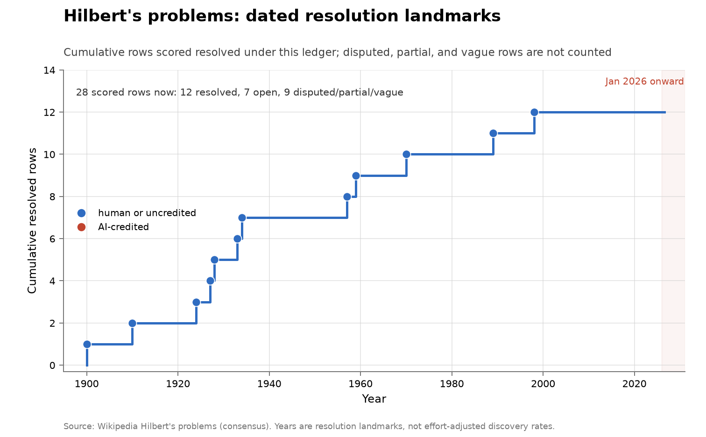

# Hilbert's problems

**Domain:** mathematics
**Metric:** cumulative ledger rows scored resolved, out of 28 scored rows
**Coverage:** 1900–2026, with dated resolutions running 1900–1998
**Data:** [`../data/famous-open-problem-lists.csv`](../data/famous-open-problem-lists.csv)
**Upstream:** <https://en.wikipedia.org/wiki/Hilbert%27s_problems>
**Verdict:** no acceleration

## The problem

Hilbert's 1900 list is the canonical statement of what the mathematics of a
century was going to be about, and its problems have been tracked ever since. It
is scored here because it is the clearest available ceiling: whatever else AI has
done in mathematics, the public question is whether it has touched problems of
this kind.

A "discovery" in this series is a ledger row moving to resolved, on the year a
secondary consensus account gives for the resolution. Twenty-eight rows are
scored rather than twenty-three problems, because several of Hilbert's problems
split into parts that fell separately — 18a, 18b and 18c; 6a and 6b; 8a, 8b and
8c — and because nine rows are recorded as contested or vague rather than as
resolved or open. The continuum hypothesis is the standing example: Gödel and
Cohen established independence, and there is no consensus that this resolves what
Hilbert asked.

It is a bad instrument for a discovery rate, and the reason is selection. These
problems were chosen for depth and for the interest of the answer, which in
practice means they are exactly the problems whose solutions are most expensive
to check: a proof here takes years of expert reading, not a script. Every strong
AI result in this collection sits on a problem where a candidate answer can be
scored cheaply. So a count of zero AI-attributed Hilbert falls is close to what
the cheap-verification story predicts, and is weak evidence about capability in
either direction.

## What the chart shows

Twelve dated resolutions, from Dehn in 1900 to Hales's computer-assisted
sphere-packing proof in 1998, and nothing in the twenty-eight years since. Of the
twenty-eight scored rows, twelve are resolved, seven are open, and nine are
disputed, partial or vague. Nothing lands in the shaded 2026 period, and no
marker on the chart is red, because no row carries an AI attribution.

The visible clustering — five falls between 1924 and 1934, then a gap, then three
between 1957 and 1970 — is a reminder that this ledger was never a steady
process even when it was moving. Reading a twenty-eight-year flat stretch at the
right edge as exhaustion would require distinguishing it from the flat stretches
of 1934–1957 and 1970–1989, which nothing in the series lets you do.

The chart's own count line is the more useful reading: the seven rows still open
are Riemann, the Goldbach and twin-prime family, general reciprocity,
Kronecker–Weber over arbitrary base fields, limit cycles, general boundary-value
problems, and uniformization. That is the list against which any claim about AI
and famous open problems should be checked.

## How the chart was built

`problem_list_chart("hilbert", ...)`, called from `math_charts()` in
[`../tools/make_figures.py`](../tools/make_figures.py), filters
`famous-open-problem-lists.csv` on `list_id`, keeps the rows whose `status` is
`resolved` and whose `resolved_year` is non-empty, sorts them by resolution year
and then `problem_id`, and draws the cumulative count as a step function from the
`list_year` of 1900 to the present. The header text counts the remaining rows by
status, and the source note is taken from the `source` column.

The scoring rule is the strict one. `contested` and `vague` rows are excluded
rather than counted as half-resolutions, so problems with a defensible claim to
being settled under some reading — Hilbert 1, 2, 5, 6b, 8c, 13, 15 — do not
appear on the line at all. That choice makes the count smaller and the series
more comparable to the other ledgers here, and it is the reason the chart says
twelve rather than any of the larger numbers in circulation.

The function takes an `ai_problem` argument that colours one marker red. It is
not supplied for this list, because there is no such row.

## What it cannot support

- **Resolution landmarks are not effort-adjusted discovery rates.** The dates say
  when something fell, not how much work was spent, and effort on these problems
  has certainly risen over the century.
- **Twenty-eight rows are not twenty-three problems.** The subproblem splitting
  is the ledger's, so the count is not comparable across lists that split
  differently.
- **The contested rows are a judgment call.** Nine of twenty-eight rows turn on
  what Hilbert meant, and a different reasonable reading would move the line.
- **One secondary ledger.** Every row here is transcribed from a single
  consensus account rather than from independent review of the literature.
- **The rows overlap other lists.** Riemann appears on Hilbert, Smale and the
  Millennium list, and Hilbert's 16th is Smale's 13th, so these series are not
  independent draws from one urn.

## LLM contributions

None. No row in this ledger is attributed to an AI system, and the last dated
piece of it is human work from 1998.

The absence is worth stating precisely, because it is easy to over-read. It is
not evidence that AI systems cannot do deep mathematics; it is evidence that they
have not resolved a Hilbert problem, on a list whose selection principle is
almost the inverse of the conditions under which AI results have arrived. The one
prestige list here with an AI-attributed fall is [Smale](math-smale.md), and it
fell to a finite counterexample — an object that can be checked mechanically.
That contrast, rather than the zero, is the informative part.

## Related literature

The rows and their contested classifications come from the consensus ledger
[@wikipedia2026hilbert]. The selection argument above — that scored mathematical
targets are the ones with cheap verification — is made explicitly by the
benchmark designers who built a problem set on that principle, choosing problems
where "discovery is hard, requiring meaningful mathematical insight, but
verification is computationally efficient and simple" [@arxiv2026horizonmath]. The general warning that record series are lumpy
with no AI in them, so that a flat stretch is not an exhausted frontier, is
Sherry and Thompson's [@sherry2021fast]. The companion ledgers are
[Smale](math-smale.md), [Millennium](math-millennium.md) and
[TOPP](math-topp.md); the high-volume corpus that actually shows AI flow is
[Erdős](math-erdos.md).
