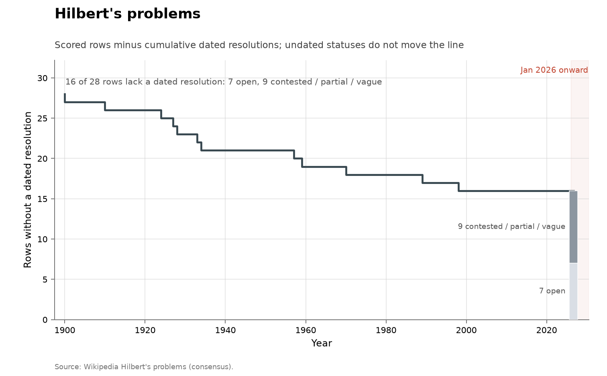

# Hilbert's problems

- **Domain:** mathematics
- **Role:** prestige ledger
- **Metric:** dated resolutions per year across 28 scored rows
- **Coverage:** list posed 1900; dated resolutions 1900–1998; statuses read 2026-08-14
- **Data:** [`hilbert-problems.csv`](hilbert-problems.csv)
- **Upstream:** <https://en.wikipedia.org/wiki/Hilbert%27s_problems>
- **Verdict:** no acceleration — 0 resolutions in 2026 and 0 since 1998; 12 dated resolutions over 1900–1998

## Definition

David Hilbert stated his list of mathematical problems in 1900. The ledger
here scores the standing of each problem as recorded in the Wikipedia
problem table [@wikipedia2026hilbert], with 28 rows rather than 23 problems:
problems 6, 8 and 18 are split into parts tracked separately (6a/6b,
8a/8b/8c, 18a/18b/18c), and the unpublished 24th problem is not scored.

Each row carries one of four statuses. A `resolved` row has a
`resolved_year`, the year the consensus account gives for the resolving
work, and is one event in the series. An `open` row has no resolution claim.
A `contested` row has a claimed or partial resolution without consensus that
it settles what Hilbert asked; the continuum hypothesis (row 1) is scored
contested because the Gödel–Cohen independence results are not agreed to
answer Hilbert's statement. A `vague` row (4 and 23) is not stated precisely
enough to score either way. Only `resolved` rows with a dated year count as
events; `contested` and `vague` rows contribute nothing to the series.

## Facts

- **rows:** 28 scored; 12 resolved with a dated year; 7 open; 7 contested;
  2 vague
- **span:** dated resolutions 1900–1998
- **by-year:** 1900: 1 · 1910: 1 · 1924: 1 · 1927: 1 · 1928: 1 · 1933: 1 ·
  1934: 1 · 1957: 1 · 1959: 1 · 1970: 1 · 1989: 1 · 1998: 1
- **ai-attributed:** 0 of 12 dated resolutions
- **open rows:** 8a, 8b, 9, 12, 16, 20, 22

The collection-wide [cumulative index](../../CUMULATIVE.md) redraws the
ledger as rows remaining:

### 3 — Scissor congruence of polyhedra
- **status:** resolved
- **resolved:** 1900
- **resolver:** Dehn
- **notes:** First of the list to fall; equal-volume polyhedra need not be
  equidissectable

> "Resolved. Result: No, proven by Max Dehn using Dehn invariants."
> — Wikipedia, Hilbert's problems, problem 3, read 2026-08-14 [@wikipedia2026hilbert]

### 18a — Finitely many space groups in n dimensions
- **status:** resolved
- **resolved:** 1910
- **resolver:** Bieberbach
- **notes:** Part (a) of problem 18

> "Resolved. Result: Yes (by Ludwig Bieberbach)"
> — Wikipedia, Hilbert's problems, problem 18, read 2026-08-14 [@wikipedia2026hilbert]

### 11 — Quadratic forms over number fields
- **status:** resolved
- **resolved:** 1924
- **resolver:** Hasse
- **notes:** Local-global principle

> "Resolved. Helmut Hasse in 1924 created a general theory of classification
> and deciding solvability of quadratic forms over number fields using the
> local-global principle."
> — Wikipedia, Hilbert's problems, problem 11, read 2026-08-14 [@wikipedia2026hilbert]

### 17 — Nonnegative forms as sums of squares
- **status:** resolved
- **resolved:** 1927
- **resolver:** Artin

> "Resolved. Result: Yes, due to Emil Artin."
> — Wikipedia, Hilbert's problems, problem 17, read 2026-08-14 [@wikipedia2026hilbert]

### 18b — Anisohedral polyhedron in 3D
- **status:** resolved
- **resolved:** 1928
- **resolver:** Reinhardt
- **notes:** Part (b) of problem 18

> "Resolved. Result: Yes (by Karl Reinhardt)."
> — Wikipedia, Hilbert's problems, problem 18, read 2026-08-14 [@wikipedia2026hilbert]

### 6a — Axiomatic probability
- **status:** resolved
- **resolved:** 1933
- **resolver:** Kolmogorov
- **notes:** Part (a) of problem 6; part (b) remains contested

> "(a) Resolved. Kolmogorov's axiomatics is accepted as the foundation of
> probability theory."
> — Wikipedia, Hilbert's problems, problem 6, read 2026-08-14 [@wikipedia2026hilbert]

### 7 — Transcendence of a^b
- **status:** resolved
- **resolved:** 1934
- **resolver:** Gelfond–Schneider

> "Resolved. Result: Yes, illustrated by the Gelfond–Schneider theorem."
> — Wikipedia, Hilbert's problems, problem 7, read 2026-08-14 [@wikipedia2026hilbert]

### 19 — Analyticity of regular variational solutions
- **status:** resolved
- **resolved:** 1957
- **resolver:** De Giorgi; Nash
- **notes:** Independent proofs

> "Resolved. Result: Yes, proven by Ennio De Giorgi and, independently and
> using different methods, by John Forbes Nash."
> — Wikipedia, Hilbert's problems, problem 19, read 2026-08-14 [@wikipedia2026hilbert]

### 14 — Finiteness of invariant rings
- **status:** resolved
- **resolved:** 1959
- **resolver:** Nagata
- **notes:** Negative answer: counterexample

> "Resolved. Result: No, a counterexample was constructed by Masayoshi
> Nagata."
> — Wikipedia, Hilbert's problems, problem 14, read 2026-08-14 [@wikipedia2026hilbert]

### 10 — Decidability of Diophantine equations
- **status:** resolved
- **resolved:** 1970
- **resolver:** Matiyasevich
- **notes:** Negative answer: no such algorithm

> "Resolved. Result: Impossible; Matiyasevich's theorem implies that there
> is no such algorithm."
> — Wikipedia, Hilbert's problems, problem 10, read 2026-08-14 [@wikipedia2026hilbert]

### 21 — Fuchsian equations with prescribed monodromy
- **status:** resolved
- **resolved:** 1989
- **resolver:** Bolibrukh
- **notes:** Negative answer in the general case

> "Resolved. Result: No, a counterexample was shown by Andrei Bolibrukh."
> — Wikipedia, Hilbert's problems, problem 21, read 2026-08-14 [@wikipedia2026hilbert]

### 18c — Densest sphere packing in 3D
- **status:** resolved
- **resolved:** 1998
- **resolver:** Hales
- **notes:** Part (c) of problem 18; computer-assisted; later formalized

> "Resolved, by computer-assisted proof (by Thomas Callister Hales) and
> later with a machine-verified proof in project flyspeck."
> — Wikipedia, Hilbert's problems, problem 18, read 2026-08-14 [@wikipedia2026hilbert]

### 1 — Continuum hypothesis
- **status:** contested
- **resolved:**
- **resolver:**
- **notes:** Gödel–Cohen independence; no consensus that this solves
  Hilbert's statement

> "There is no consensus on whether this is a solution to the problem."
> — Wikipedia, Hilbert's problems, problem 1, read 2026-08-14 [@wikipedia2026hilbert]

### 2 — Consistency of arithmetic
- **status:** contested
- **resolved:**
- **resolver:**
- **notes:** Gödel incompleteness / Gentzen; no consensus

> "There is no consensus on whether the results of Gödel and Gentzen give a
> solution to the problem as stated by Hilbert."
> — Wikipedia, Hilbert's problems, problem 2, read 2026-08-14 [@wikipedia2026hilbert]

### 4 — Straight line as shortest distance
- **status:** vague
- **resolved:**
- **resolver:**
- **notes:** Too vague to score as solved or open

> "Too vague to be stated resolved or not."
> — Wikipedia, Hilbert's problems, problem 4, read 2026-08-14 [@wikipedia2026hilbert]

### 5 — Continuous groups without differentiability
- **status:** contested
- **resolved:**
- **resolver:**
- **notes:** Gleason for one reading; Hilbert–Smith conjecture open for
  another

> "Depends on the interpretation of "continuous group". If the term is
> understood as a topological group that is also a topological manifold:
> yes, proven by Andrew Gleason. If "continuous group" is understood as a
> topological group acting on a manifold, the problem becomes the
> Hilbert–Smith conjecture, which is still unresolved."
> — Wikipedia, Hilbert's problems, problem 5, read 2026-08-14 [@wikipedia2026hilbert]

### 6b — Atomistic-to-continuum limit in physics
- **status:** contested
- **resolved:**
- **resolver:**
- **notes:** Interpretation-dependent

> "Depends on the interpretation of the problem."
> — Wikipedia, Hilbert's problems, problem 6 part (b), read 2026-08-14 [@wikipedia2026hilbert]

### 8c — Primes in number fields via zeta
- **status:** contested
- **resolved:**
- **resolver:**
- **notes:** Hecke 1917 for some readings; extended RH still open

> "Depends on the interpretation of expected results. In 1917, Erich Hecke
> constructed an analytic continuation for Dedekind zeta functions and
> proved functional equation, which allowed for obtaining results similar to
> that currently accessible using Riemann zeta function."
> — Wikipedia, Hilbert's problems, problem 8 part (c), read 2026-08-14 [@wikipedia2026hilbert]

### 13 — Seventh-degree equation / composition
- **status:** contested
- **resolved:**
- **resolver:**
- **notes:** Continuous variant resolved (Kolmogorov–Arnold 1957); algebraic
  variant open

> "Depends on the variant of the problem. For the continuous variant: No;
> the Kolmogorov–Arnold representation theorem shows that every multivariate
> continuous function can be obtained through such composition."
> — Wikipedia, Hilbert's problems, problem 13, read 2026-08-14 [@wikipedia2026hilbert]

### 15 — Schubert enumerative calculus
- **status:** contested
- **resolved:**
- **resolver:**
- **notes:** Claims of resolution exist; no consensus

> "Significant developments for resolving this problem have been made since
> the publication of the list …"
> — Wikipedia, Hilbert's problems, problem 15, read 2026-08-14 [@wikipedia2026hilbert]

### 23 — Further development of calculus of variations
- **status:** vague
- **resolved:**
- **resolver:**
- **notes:** Deliberately open-ended

> "Too vague to be stated resolved or not. Since the list was proposed,
> Hilbert and many other mathematicians have made numerous contributions to
> the calculus of variations."
> — Wikipedia, Hilbert's problems, problem 23, read 2026-08-14 [@wikipedia2026hilbert]

## Method

The ledger is hand-scored from the Wikipedia problem table named in the
`source` column: one row per problem or subproblem, with the status and the
resolution year read off that account. There is no `fetch.py`; nothing
upstream publishes the table in a form a script could take, so a correction
means editing the CSV. The scoring rule is strict: `contested` and `vague`
rows carry no `resolved_year` and contribute no event, so rows with a
defensible claim to being settled under some reading (1, 2, 5, 6b, 8c, 13,
15) do not appear in the event count.

[`figure.py`](figure.py) calls the shared `problem_list_chart()` in
[`../../lib/families.py`](../../lib/families.py), which keeps the rows whose
`status` is `resolved` with a non-empty `resolved_year` and draws one event
bar per year from the 1900 `list_year` to the present; a corner note states
how many of the 28 rows have dated resolutions. No `ai_problem` argument is
passed, because no row carries an AI credit. The cumulative view is the
shared `ledger_remaining_chart()`. [`check.py`](check.py) recomputes the
fact lines and the register entries from the CSV.

## Limitations

- **effort.** Resolution landmarks are not effort-adjusted discovery rates;
  the dates say when a row fell, not how much work was spent.
- **row count.** 28 rows are not 23 problems; the subproblem split is this
  ledger's, so the counts are not comparable across lists that split
  differently.
- **contested rows.** 9 of 28 rows turn on what Hilbert meant; a different
  reasonable reading of those rows moves every count above.
- **one secondary ledger.** Every row is transcribed from a single consensus
  account rather than from independent review of the literature.
- **overlap.** Row 8a is the Riemann hypothesis, also scored on
  [Smale](../math-smale/README.md) and
  [Millennium](../math-millennium/README.md); row 16 is Smale's 13th. The
  prestige ledgers are not independent samples.

## AI attribution

No row in [`hilbert-problems.csv`](hilbert-problems.csv) names an AI system
in its `resolver` or `notes` columns; the most recent dated resolution is
problem 18c in 1998 (Hales). No AI credit appears in the Wikipedia ledger
the rows are scored from as of the 2026-08-14 read.

## Sources

- [@wikipedia2026hilbert] — the consensus ledger every row is transcribed
  from; the register quotes its per-problem status wording as read
  2026-08-14.
- [@arxiv2026horizonmath] — a 2026 benchmark of over 100 predominantly
  unsolved problems chosen so that "verification is computationally
  efficient and simple"; frontier models score near 0% on it.
- [@sherry2021fast] — measured improvement rates across algorithm families,
  including multi-decade stationary stretches, with no AI involved.
- Sibling ledgers of the same instrument type:
  [Landau](../math-landau/README.md),
  [Thurston](../math-thurston/README.md), [Smale](../math-smale/README.md),
  [Millennium](../math-millennium/README.md) and
  [TOPP](../math-topp/README.md).
- [Erdős](../math-erdos/README.md) — a catalogue ledger over a different
  corpus, counting a different unit (catalogue problems with imputed
  solution years).
