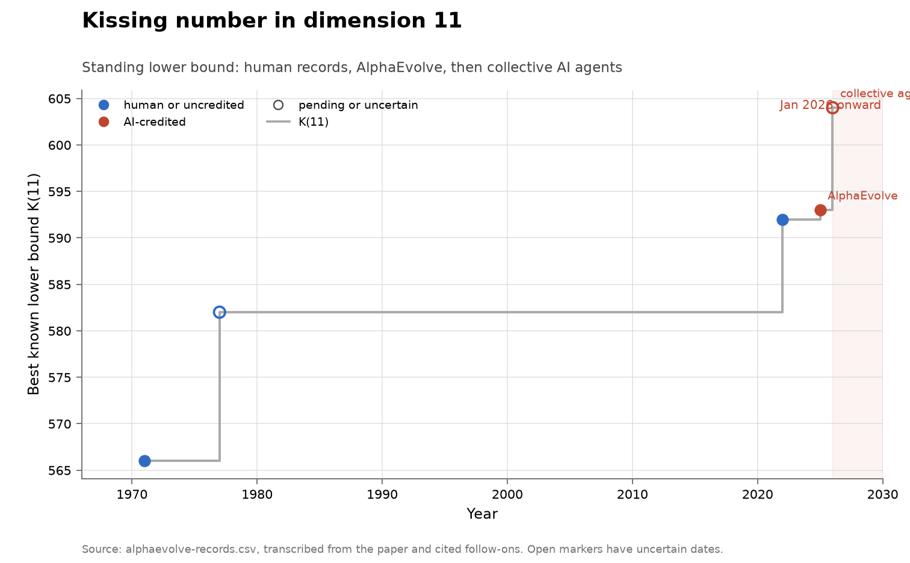

# Kissing number in dimension 11

**Domain:** mathematics
**Metric:** best known lower bound on the kissing number $K(11)$
**Coverage:** 1971–2026, five record steps
**Data:** [`../data/alphaevolve-records.csv`](../data/alphaevolve-records.csv), problem 6.8
**Upstream:** <https://cohn.mit.edu/kissing-numbers>, with per-step sources in the CSV's `ref` and `note` columns
**Verdict:** accelerating — a burst on one dimension of one problem, not a field-wide rate

## The problem

The kissing number $K(d)$ is the largest number of non-overlapping unit spheres
that can all touch one central unit sphere in $d$ dimensions. It is known exactly
in a handful of dimensions and bracketed in the rest, and dimension 11 is one of
the bracketed ones, so what is tracked here is the lower bound.

That makes it an unusually clean object. A lower bound is established by exhibiting
a configuration, and checking a configuration is cheap: you verify a finite list of
distances. So the record is a single integer, the ledger is public and maintained
by dimension, and a claim can be settled without expert reading. A "discovery" here
is a construction beating the standing bound.

It is a good instrument for a head-to-head and a poor one for a field. The good
part is a half-century of dated human steps on exactly the quantity an AI system
later improved, which is rare. The poor part is twofold: it is one dimension of one
problem family, and it is a finite construction with a computable score, which is
the precise shape of problem evolutionary search is best at. This is where AI
should show up first, so its showing up here is weak evidence about anywhere else.

## What the chart shows

Five steps. Leech and Sloane reached 566 in 1971; Best's constant-weight code gives
582, conventionally dated 1977; Ganzhinov's symmetric constructions reached 592 in
2022; AlphaEvolve improved that to 593 in 2025; and a collective AI-agent platform
reached 604 by 2026. The 1977 and 2026 markers are drawn open because their dates
are not pinned.

The shape is a 45-year plateau followed by three steps in four years, two of them
AI-set. That is the clearest AI-era burst on any mathematical quantity in this
collection.

Two things cut it down, and both are visible in the data. The step sizes are small
in relative terms: AlphaEvolve's is +1 on 592, a gain of 0.17%, and the agent
platform's is +11 on 593, or 1.85% — against +2.8% for the 1977 step and +1.7% for
2022. And the human response was not a retake: Ganzhinov's peer-reviewed
constructions beat AlphaEvolve in dimensions 10 and 14 while falling one short of
593 in dimension 11. So the quantity ended up contested between two kinds of AI
system rather than between AI and humans.

## How the chart was built

`alphaevolve_value_chart(["6.8"], ...)`, called from `math_charts()` in
[`../tools/make_figures.py`](../tools/make_figures.py), filters
`alphaevolve-records.csv` to rows whose `problem` is 6.8, whose `value` is
non-empty, and whose `is_record` is `yes`, sorts them by `year` then `step`, and
plots `value` against `year` as a step function.

Markers are colour-coded by who set the step, which is the figure's whole scoring
rule. `record_marker()` reads the `agent` column and draws red for anything
beginning `ai_` — here `ai_evolution` for AlphaEvolve and `ai_agents` for the
platform — and blue otherwise, and draws an unfilled marker when `date_certain` is
`no`. Two annotations are keyed to `step` values and label steps 3 and 4
"AlphaEvolve" and "collective agents". The line itself is grey, because the line
is the record and the colour belongs to the steps.

The per-step provenance lives in the CSV rather than in the figure. Each row's
`note` carries the sentence the value was transcribed from and `ref` carries the
source; `relative_gain_pct` is this repository's arithmetic over consecutive
values, and is where the percentages quoted above come from.

## What it cannot support

- **Two of the five dates are uncertain.** When 582 was first stated as the record
  is not pinned, and the within-2026 dates of the platform's 594 and 604 are not
  established, so the two open markers could move along the x-axis.
- **A lower bound is not the kissing number.** $K(11)$ itself is unknown, so the
  chart shows a record ladder and not convergence on a value: how much room remains
  is not measurable here.
- **Step size is not significance.** The AI steps are +1 and +11 on a bound near
  600; nothing in the series says whether a small integer gain on this quantity is
  a large or small mathematical result.
- **One dimension of one family.** The neighbouring dimensions moved differently
  and are not plotted, so this is not evidence about kissing numbers in general.
- **The 604 rests on a records table**, which credits a preprint; the intermediate
  594 is known only from secondary description, and neither has been independently
  checked here.
- **The single plotted quantity is selected for having an AI step.** It entered this
  collection through a set of problems an AI system was pointed at, so its shape
  cannot be generalized without the frame that
  [the finite-construction groups](math-alphaevolve-related-records.md) document.

## LLM contributions

Two of the five steps, and they are of different kinds. AlphaEvolve, an
evolutionary coding agent that mutates programs under an automated evaluator,
raised the bound from 592 to 593 in May 2025 [@novikov2025alphaevolve]. Cohn's
records table then listed 604 as of 2026-06-22, credited to a collective AI-agent
platform, with an intermediate 594 by the same route [@cohn2026kissing;
@bianchi2026collective].

The human contribution in between is worth stating exactly, because it has been
reported loosely. Ganzhinov's peer-reviewed work beat AlphaEvolve's bounds in
dimensions 10 and 14, and in dimension 11 his 2022 value of 592 was the record
AlphaEvolve improved on rather than a later result above it
[@aalto2025kissing]. So there is no case here of a human retaking the same
quantity, unlike the [sums-and-differences ladder](math-sums-autoconvolution.md),
where one did within months.

## Related literature

The record table by dimension is Cohn's [@cohn2026kissing], the 2025 step is the
AlphaEvolve white paper's [@novikov2025alphaevolve], the 2026 step is credited to a
collective-agent preprint [@bianchi2026collective], and the human comparison is the
press release covering Ganzhinov [@aalto2025kissing]. The wider assessment of what
evolutionary search does and does not reach — rediscovering known optima in most
cases and improving in several — is in Tao's account of the system's mathematics
paper [@tao2025exploration], and the ancestor result that set this line of work
going in December 2023 is FunSearch [@deepmind2023funsearch]. The two other
AlphaEvolve-adjacent series here are
[sums and autoconvolution](math-sums-autoconvolution.md) and
[the finite-construction groups](math-alphaevolve-related-records.md); the contrast
case with no AI step at all is [sphere packing](math-sphere-packing.md).
