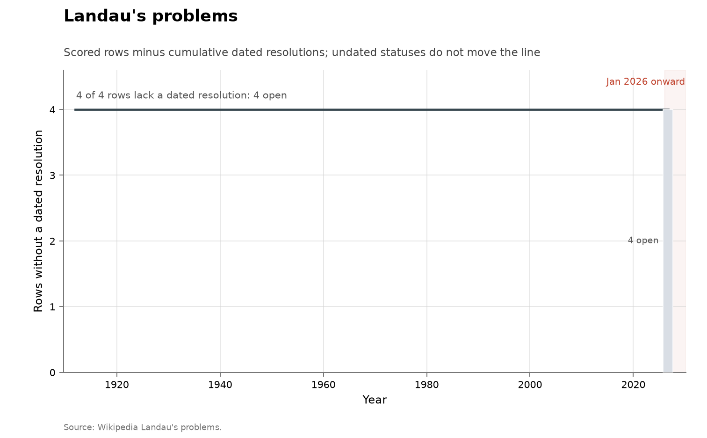

# Landau's problems

**Domain:** mathematics
**Role:** prestige ledger
**Metric:** dated resolutions per year across 4 scored rows
**Coverage:** list posed 1912; no dated resolution 1912–2026; statuses read 2026-08-14
**Data:** [`landau-problems.csv`](landau-problems.csv)
**Upstream:** <https://en.wikipedia.org/wiki/Landau%27s_problems>
**Verdict:** no acceleration — 0 resolutions in 2026; 0 dated resolutions over 1912–2025

## Definition

Edmund Landau named four problems about the primes at the 1912 International
Congress of Mathematicians: Goldbach's conjecture, the twin prime
conjecture, Legendre's conjecture that a prime lies between consecutive
squares, and the infinitude of primes of the form $n^2+1$. A "discovery" in
this series is a row moving to `resolved`, dated by the year a secondary
consensus account gives. The ledger has four rows, no subproblem splitting
and no contested classifications, and no row has ever moved. The upstream
page states the standing in one clause:

> "all four problems are unresolved"
> — Wikipedia, Landau's problems, "As of 2026" statement, read 2026-08-14

## Facts

- **rows:** 4 scored; 0 resolved with a dated year; 4 open
- **open rows:** goldbach, twin_primes, legendre, n2_plus_1
- **ai-attributed:** 0 of 4 scored rows

The collection-wide [cumulative index](../../CUMULATIVE.md) redraws the
ledger as rows remaining:

The register of non-open rows is empty: every row's status is `open`.

## Method

The rows are transcribed by hand from the consensus ledger named in the
`source` column, so there is no `fetch.py` in this folder. There is no
machine-readable upstream to rebuild from: the status of a famous conjecture
is a judgment in the literature rather than a feed.

[`figure.py`](figure.py) calls the shared `problem_list_chart()` in
[`../../lib/families.py`](../../lib/families.py), which keeps the rows whose
`status` is `resolved` with a non-empty `resolved_year` and counts
resolution events by year from the 1912 `list_year` to the present. That
event set is empty here, so the chart states that no row has a dated
resolution. No `ai_problem` argument is passed, because there is no such
row. The cumulative view is the shared `ledger_remaining_chart()`.
[`check.py`](check.py) recomputes the fact lines from the CSV.

## Limitations

- **no events.** A series with zero resolutions has no event rate to compare
  across periods, in either direction.
- **four rows.** The finest change the ledger can register is one quarter of
  the list.
- **binary statuses.** Partial progress moves no row: the upstream page as
  read 2026-08-14 records Zhang's 2013 bound of 70 million on prime gaps,
  since improved to 246, and Helfgott's 2013 proof of Goldbach's weak
  conjecture, and both rows remain open here.
- **overlap.** goldbach and twin_primes are jointly scored as row 8b of
  [Hilbert's list](../math-hilbert/README.md) [@wikipedia2026hilbert], so
  the two ledgers are not independent.
- **effort.** Resolution landmarks are not effort-adjusted discovery rates,
  and effort on the primes has risen over the century.

## AI attribution

No row in [`landau-problems.csv`](landau-problems.csv) carries a resolver or
an AI credit; all four rows are open. No AI credit appears on the Wikipedia
page the rows are scored from as of the 2026-08-14 read.

## Sources

- Wikipedia, Landau's problems
  (<https://en.wikipedia.org/wiki/Landau%27s_problems>) — the consensus
  ledger the four rows are transcribed from, quoted above for the four
  statuses; it has no bibliography entry here. It also states the
  bounded-gaps and weak-Goldbach facts in Limitations.
- [@wikipedia2026hilbert] — the Hilbert ledger holding the overlapping row
  8b.
- [@arxiv2026horizonmath] — a 2026 benchmark of over 100 predominantly
  unsolved problems chosen so that "verification is computationally
  efficient and simple"; frontier models score near 0% on it.
- [@sherry2021fast] — measured improvement rates across algorithm families,
  including multi-decade stationary stretches, with no AI involved.
- Sibling ledgers of the same instrument type:
  [Hilbert](../math-hilbert/README.md),
  [Thurston](../math-thurston/README.md), [Smale](../math-smale/README.md),
  [Millennium](../math-millennium/README.md) and
  [TOPP](../math-topp/README.md).
- [Erdős](../math-erdos/README.md) — a catalogue ledger over a different
  corpus, counting a different unit (catalogue problems with imputed
  solution years).
