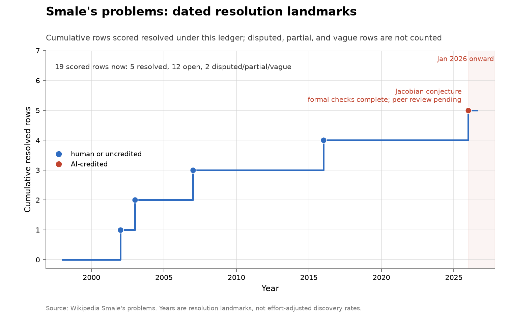

# Smale's problems

**Domain:** mathematics
**Metric:** cumulative ledger rows scored resolved, out of 19 scored rows
**Coverage:** 1998–2026, with dated resolutions running 2002–2026
**Data:** [`../data/famous-open-problem-lists.csv`](../data/famous-open-problem-lists.csv)
**Upstream:** <https://en.wikipedia.org/wiki/Smale%27s_problems>, with the 2026 row resting on the independent verifications at <https://zenodo.org/records/21514514> and <https://isa-afp.org/entries/Jacobian_Counterexample.html>
**Verdict:** inconclusive — one AI-attributed fall in 2026, and a single event cannot set a slope

## The problem

Smale's 1998 list of eighteen "problems for the next century" is the modern
successor to Hilbert's, assembled by one mathematician with a stated view of what
mattered. It is scored here for the same reason as the other prestige lists — it
is a ceiling check — and it earns its own document because it is the only one of
them with an AI-attributed fall.

A "discovery" in this series is a row moving to resolved. Nineteen rows are
scored rather than eighteen problems, because Smale 11 splits into two
subquestions that fell separately, and two rows are recorded as contested rather
than resolved or open: general equilibrium with price adjustments, and the limits
of intelligence.

The instrument warning that applies to [Hilbert](math-hilbert.md) applies here
too, and this list is where it bites in an interesting way. Prestige problems are
selected for depth, which correlates with expensive verification, so a near-zero
AI count on them says little about capability. The 2026 row is the exception that
shows the mechanism: what fell was not a proof but a counterexample, a finite
object whose validity can be machine-checked. That is the one shape of prestige
result the cheap-verification story predicts should be reachable.

## What the chart shows

Five resolutions in twenty-eight years, and the fifth is the interesting one.
Tucker settled that the Lorenz attractor is strange in 2002, by computer-assisted
proof; Perelman's Poincaré work is dated 2003; Kozlovski, Shen and van Strien
took one of the two Smale 11 subquestions in 2007; the average-case
polynomial-time solving of polynomial equations is dated 2016 to Lairez, building
on Beltrán and Pardo. Then in 2026 Levent Alpöge, working with Claude Fable 5,
produced a counterexample to the Jacobian conjecture, which the chart marks in
red and annotates "formal checks complete; peer review pending".

Of the nineteen scored rows, five are resolved, twelve are open, and two are
contested. The resolution is negative and partial: it settles dimension 3, and
hence every dimension at least 3, while dimension 2 remains open.

What cuts the reading down is arithmetic. One event in a series with five events
in twenty-eight years is entirely consistent with the pre-existing rate. The
chart shows that an AI-attributed fall on a prestige list is now possible; it
cannot show that such falls have become more frequent.

## How the chart was built

`problem_list_chart("smale", ..., ai_problem="16")`, called from `math_charts()`
in [`../tools/make_figures.py`](../tools/make_figures.py), filters
`famous-open-problem-lists.csv` on `list_id`, keeps rows with `status` equal to
`resolved` and a non-empty `resolved_year`, and draws the cumulative count as a
step function from the 1998 `list_year` to the present.

The `ai_problem` argument is the whole of the AI coding in this figure: the row
whose `problem_id` matches is drawn red and annotated with its `short_name` plus
the fixed caption about formal checks and pending peer review. Every other marker
is blue. There is no agent column in this CSV, so the attribution is a single
hand-set argument in the figure code rather than something derived from the data.

The scoring rule for that row differs from the rest of the ledger, deliberately
and visibly. The four earlier rows require a secondary-account consensus. Smale
16 is admitted because an explicit finite counterexample has been independently
kernel-checked in both Lean and Isabelle, while formal peer review remains
pending, and the row's `source` column says exactly that rather than naming the
Wikipedia ledger the others use.

## What it cannot support

- **One event is not a rate.** Five resolutions in twenty-eight years is a rate
  with which one more resolution is consistent. Nothing here separates a new
  regime from an ordinary arrival.
- **The 2026 row is scored on a different rule** from the other four — independent
  formal verification rather than consensus in the literature — so the fifth step
  is not exactly the same kind of event as the first four.
- **The problem is not wholly closed.** Dimension 2 of the Jacobian conjecture
  remains open, and the ledger row records a resolution in dimension at least 3.
- **Peer review is pending**, which is what the annotation on the chart says and
  what the verdict above rests on. Formal kernel checks bound the risk of an
  invalid certificate, not the risk that the statement checked is not the
  conjecture.
- **Rows overlap other lists.** Smale 1 is the Riemann hypothesis, Smale 3 is P
  versus NP, and Smale 13 is Hilbert's 16th, so this series is correlated with
  [Hilbert](math-hilbert.md) and [Millennium](math-millennium.md) rather than
  independent of them.
- **Resolution landmarks are not effort-adjusted discovery rates**, here as on
  every ledger in this collection.

## LLM contributions

One, and it is the only AI-attributed fall on any of the four prestige and corpus
ledgers scored here. In July 2026 Levent Alpöge, working with Claude Fable 5,
produced a counterexample to the Jacobian conjecture in dimension 3, and
therefore in every dimension at least 3; the determinant and the collision were
independently kernel-checked in Lean [@zenodo2026jacobian] and in Isabelle
[@afp2026jacobian], with peer review still pending. The division of labour is
worth naming: a domain specialist directed a frontier chat model, so this is not
an autonomy claim.

The reason it registered where nothing else has is structural rather than a matter
of difficulty. A counterexample is a finite object, and a finite object can be
checked by a machine. Every other prestige row on these lists would need a proof
read by experts. Read against the [Millennium](math-millennium.md) list, which
has not moved since 2003, and against [Hilbert](math-hilbert.md), which has not
moved since 1998, the Smale row suggests the reachable part of famous mathematics
is delimited by what can be certified rather than by how hard it is.

## Related literature

The four pre-2026 rows are transcribed from the standard ledger
[@wikipedia2026smale]; the 2026 row rests on two independent formal verifications
[@zenodo2026jacobian; @afp2026jacobian]. The same design principle — trade
generality for compiler-checkable output, because human review of natural-language
proofs is too expensive — is what the largest formal-proof-search evaluation on
open problems was built around [@deepmind2026nexus], and benchmark designers have
since made cheap verification an explicit selection rule
[@arxiv2026horizonmath]. The companion ledgers are [Hilbert](math-hilbert.md),
[Millennium](math-millennium.md) and [TOPP](math-topp.md), none of which records
an AI-attributed fall.
