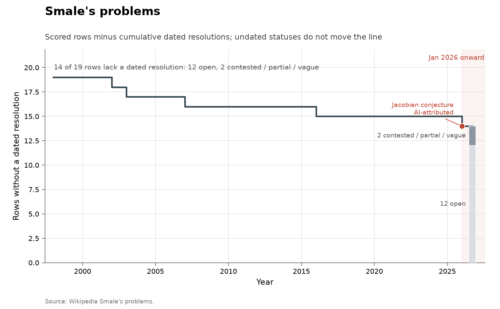

# Smale's problems

**Domain:** mathematics
**Role:** prestige ledger
**Metric:** dated resolutions per year across 19 scored rows
**Coverage:** list posed 1998; dated resolutions 2002–2026; statuses read 2026-08-14
**Data:** [`smale-problems.csv`](smale-problems.csv)
**Upstream:** <https://en.wikipedia.org/wiki/Smale%27s_problems>, with the 2026 row resting on the independent verifications at <https://zenodo.org/records/21514514> and <https://isa-afp.org/entries/Jacobian_Counterexample.html>
**Verdict:** inconclusive — 1 resolution in 2026 against 4 over 2002–2016; a series of 5 events sets no rate

## Definition

Steve Smale published a list of eighteen problems in 1998. This ledger
scores nineteen rows rather than eighteen problems, because Smale 11 splits
into two subquestions (11a, 11b) that stand separately, and two rows are
recorded as `contested` rather than resolved or open: general equilibrium
with price adjustments (8) and the limits of intelligence (18).

A "discovery" in this series is a row moving to `resolved`, dated by the
year of the resolving work. Rows 2, 11b, 14 and 17 are scored from the
secondary consensus account named in their `source` column. Row 16 is scored
on a different rule, stated in its register entry: an explicit finite
counterexample, independently kernel-checked in Lean and in Isabelle, with
peer review pending; its `source` column names those verifications rather
than the consensus ledger.

## Facts

- **rows:** 19 scored; 5 resolved with a dated year; 12 open; 2 contested
- **span:** dated resolutions 2002–2026
- **by-year:** 2002: 1 · 2003: 1 · 2007: 1 · 2016: 1 · 2026: 1
- **ai-attributed:** 1 of 5 dated resolutions
- **open rows:** 1, 3, 4, 5, 6, 7, 9, 10, 11a, 12, 13, 15

The collection-wide [cumulative index](../../CUMULATIVE.md) redraws the
ledger as rows remaining:

### 2 — Poincaré conjecture
- **status:** resolved
- **resolved:** 2003
- **resolver:** Perelman

> "Resolved. Result: Yes, Proved by Grigori Perelman using Ricci flow."
> — Wikipedia, Smale's problems, problem 2, read 2026-08-14 [@wikipedia2026smale]

### 8 — General equilibrium with price adjustments
- **status:** contested
- **resolved:**
- **resolver:**
- **notes:** Results exist; no consensus the problem is settled

### 11b — Smooth interval maps approximated by hyperbolic
- **status:** resolved
- **resolved:** 2007
- **resolver:** Kozlovski–Shen–van Strien
- **notes:** One of two subquestions of Smale 11

> "(b) Resolved. Proved by Kozlovski, Shen and van Strien."
> — Wikipedia, Smale's problems, problem 11, read 2026-08-14 [@wikipedia2026smale]

### 14 — Lorenz attractor is strange
- **status:** resolved
- **resolved:** 2002
- **resolver:** Tucker
- **notes:** Computer-assisted proof

> "Resolved. Result: Yes, solved by Warwick Tucker using a computer-assisted
> proof combined with normal form techniques."
> — Wikipedia, Smale's problems, problem 14, read 2026-08-14 [@wikipedia2026smale]

### 16 — Jacobian conjecture
- **status:** resolved
- **resolved:** 2026
- **resolver:** Levent Alpöge; Claude Fable 5
- **notes:** Negative resolution in dimension 3, hence all dimensions at
  least 3; independently kernel-checked in Lean and Isabelle; dimension 2
  remains open

> "A counterexample for N ≥ 3 was found by Anthropic employee Levent Alpöge
> using the LLM Claude Fable 5."
> — Wikipedia, Smale's problems, problem 16, read 2026-08-14 [@wikipedia2026smale]

The two independent formal verifications the row's `source` column rests on,
both read 2026-08-14:

> "An Independent Lean 4 Verification of the Alpöge–Fable Counterexample"
> — Zenodo record 21514514, record title, published 2026-07-23 [@zenodo2026jacobian]

> "Formal Verification of an Explicit Counterexample to the Jacobian
> Conjecture"
> — Archive of Formal Proofs, entry title, dated 2026-07-20 [@afp2026jacobian]

### 17 — Solving polynomial equations in average polynomial time
- **status:** resolved
- **resolved:** 2016
- **resolver:** Beltrán–Pardo; Lairez
- **notes:** Probabilistic algorithms from 2008; deterministic
  average-poly-time by Lairez 2016

> "Finally, P. Lairez found an alternative method to de-randomize the
> algorithm à la Beltrán-Pardo and thus found a deterministic algorithm
> which runs in average polynomial time."
> — Wikipedia, Smale's problems, problem 17, read 2026-08-14 [@wikipedia2026smale]

### 18 — Limits of intelligence
- **status:** contested
- **resolved:**
- **resolver:**
- **notes:** No consensus whether resolved

> "There is no consensus whether problem is resolved."
> — Wikipedia, Smale's problems, problem 18, read 2026-08-14 [@wikipedia2026smale]

## Method

The rows are hand-scored: the four pre-2026 resolved rows, the contested
rows and the open rows from the Wikipedia table named in their `source`
column, and row 16 from the two independent formal verifications named in
the header. There is no `fetch.py`; a correction means editing the CSV.

[`figure.py`](figure.py) calls the shared `problem_list_chart()` in
[`../../lib/families.py`](../../lib/families.py) with `ai_problem="16"`,
which keeps the rows whose `status` is `resolved` with a non-empty
`resolved_year` and counts resolution events by year from the 1998
`list_year` to the present. The `ai_problem` argument is the whole of the AI
coding in the figure: that row's event bar is drawn in the AI colour and
annotated with its `short_name` and the caption "formal checks complete;
peer review pending"; there is no agent column in the CSV, so the
attribution is a hand-set argument rather than something derived from the
data. The cumulative view is the shared `ledger_remaining_chart()`, with the
same argument. [`check.py`](check.py) recomputes the fact lines and the
register entries from the CSV.

## Limitations

- **sample size.** Five dated resolutions in 28 years; a single 2026 event
  cannot set a slope.
- **row 16 is scored on a different rule.** Independent formal verification
  rather than secondary-account consensus, so the fifth event is not the
  same kind of scoring decision as the first four.
- **row 16 is a partial negative resolution.** It settles dimension 3 and
  hence every dimension at least 3; dimension 2 remains open. The Isabelle
  entry states: "The development makes no claim about the two-dimensional
  conjecture" [@afp2026jacobian].
- **peer review pending.** Kernel checks verify the formal statements
  deposited; review that those statements capture the conjecture, and of the
  surrounding account, is still pending, which is what the figure's
  annotation states.
- **overlap.** Row 1 is the Riemann hypothesis (Hilbert row 8a, Millennium
  riemann), row 3 is P versus NP (Millennium p_vs_np), and row 13 is
  Hilbert's 16th, so this ledger is correlated with
  [Hilbert](../math-hilbert/README.md) and
  [Millennium](../math-millennium/README.md).
- **effort.** Resolution landmarks are not effort-adjusted discovery rates.

## AI attribution

One row. Problem 16 (Jacobian conjecture) is a 2026 negative resolution
whose `resolver` column reads "Levent Alpöge; Claude Fable 5". The Isabelle
verification records the announcement and the stated division of labour:

> "This entry gives an independent Isabelle/HOL verification of the explicit
> three-dimensional map announced by Levent Alpöge on July 20, 2026. The
> announcement credits Akhil Mathew with prompting the question and the AI
> system Claude Fable with work leading to the map; stable Lean and
> independent verification repositories appeared the same day."
> — Archive of Formal Proofs, Jacobian counterexample entry, abstract, 2026-07-20 [@afp2026jacobian]

The Lean verification states its own standing:

> "Status: independent formal verification of a third-party result — not a
> discovery claim"
> — Zenodo record 21514514, description, published 2026-07-23 [@zenodo2026jacobian]

No other row's status, `resolver` or `notes` carries an AI credit in the
ledger or on the Wikipedia table as of the 2026-08-14 read. Among the
problem-list ledgers in this collection, the
[Erdős top-10 subset](../math-erdos-top10/README.md) records one other
AI-attributed resolution (problem 90, 2026).

## Sources

- [@wikipedia2026smale] — the consensus ledger for every row except 16; the
  register quotes its per-problem status wording as read 2026-08-14.
- [@zenodo2026jacobian] — the independent Lean 4 verification of the row-16
  counterexample, Zenodo record 21514514, published 2026-07-23.
- [@afp2026jacobian] — the independent Isabelle verification of the same
  counterexample, Archive of Formal Proofs entry dated 2026-07-20, quoted
  for the announcement date, the credit wording and the dimension-2 scope.
- [@deepmind2026nexus] — formal proof search over open problems, reporting 9
  of 353 open Erdős problems resolved; a corpus-scale record of
  machine-checkable output in mathematics.
- [@arxiv2026horizonmath] — a 2026 benchmark of over 100 predominantly
  unsolved problems chosen so that "verification is computationally
  efficient and simple"; frontier models score near 0% on it.
- Sibling ledgers of the same instrument type:
  [Hilbert](../math-hilbert/README.md), [Landau](../math-landau/README.md),
  [Thurston](../math-thurston/README.md),
  [Millennium](../math-millennium/README.md) and
  [TOPP](../math-topp/README.md); among the newer lists,
  [Erdős top-10](../math-erdos-top10/README.md) and
  [Ben Green's list](../math-green/README.md).
