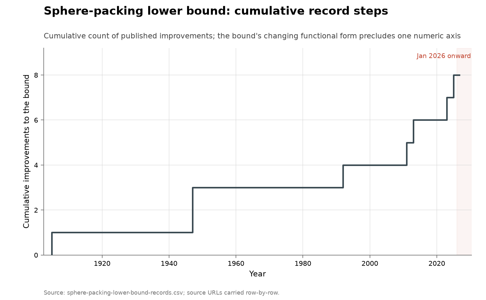

# Sphere-packing lower-bound ladder

**Domain:** mathematics
**Role:** control: no-AI baseline
**Metric:** cumulative improvements to the asymptotic lower bound on sphere-packing density in high dimension
**Coverage:** 1905–2025, eight recorded steps
**Data:** [`sphere-packing-lower-bound-records.csv`](sphere-packing-lower-bound-records.csv)
**Upstream:** per-row `source_url` values, chiefly the survey at <https://arxiv.org/abs/2606.13313>, with the two most recent steps at <https://arxiv.org/abs/2312.10026> and the Klartag preprint recorded in the same survey
**Verdict:** accelerating — 4 steps over 2011–2025 (2.7/decade) against 4 over 1905–2010 (0.4/decade); 0 steps dated 2026

## Definition

How densely can equal spheres be packed in dimension $d$ as $d$ grows? The
upper bounds and the lower bounds are separate literatures, and this series
is the lower bounds: each step exhibits or proves the existence of packings
at least as dense as some function of $d$. Saturation gives $2^{-d}$; every
recorded step is a factor on top of it.

The ladder, with the forms as the vendored rows record them. Minkowski–Hlawka
(1905, in Hlawka's general form 1943) gives
$\theta(d) \geq 2\zeta(d)\,2^{-d}$, a factor of about 2. Rogers (1947) gives
the first asymptotically growing improvement, $\theta(d) \geq c\,d\,2^{-d}$
with $c = 2/e$; Davenport and Rogers raise $c$ to 1.68 the same year, Ball
(1992) to 2, and Vance (2011) to $6/e$ for dimensions divisible by four.
Venkatesh (2013) gets the first super-linear factor, $d\log\log d$, but only
along a sparse sequence of dimensions. Campos, Jenssen, Michelen and
Sahasrabudhe (2023) prove $(1-o(1))\,d\log d\,2^{-(d+1)}$, the first
asymptotically growing improvement on Rogers valid for all $d$, after
seventy-six years. Klartag (2025) gains another whole power,
$c\,n^{2}2^{-n}$, by a new probabilistic method.

A "discovery" here is a published improvement to that form or to its
constant, one row of the vendored CSV.

## Facts

- **steps:** 8 recorded steps, 1905–2025
- **by-year:** 1905: 1 · 1947: 2 · 1992: 1 · 2011: 1 · 2013: 1 · 2023: 1 ·
  2025: 1
- **split:** 4 steps over 1905–2010 and 4 over 2011–2025; 3 steps in the 13
  years to 2025 against 1 in the 45 years to 1992
- **ai-attributed:** 0 of 8 steps

The collection-wide [cumulative index](../../CUMULATIVE.md) redraws this
series as its cumulative count of record steps over time:

## Method

There is no `fetch.py`. The ladder is transcribed by hand from a survey and
the primary papers it cites, since no upstream publishes it as a
machine-readable series; the CSV is edited directly and every row carries
its own `source_url`. [`check.py`](check.py) recomputes the fact lines from
the CSV.

[`figure.py`](figure.py) reads
[`sphere-packing-lower-bound-records.csv`](sphere-packing-lower-bound-records.csv),
plots the cumulative step index against `year` as a step function, and
annotates the `finder` for the rows whose year is one of 1905, 1947, 1992,
2013, 2023 or 2025. The bound changes functional form along the ladder —
$c\,d\,2^{-d}$ for the mid-century entries, then $d\log\log d$, then
$d\log d$, then $n^{2}$ — so no single scalar runs the length of the series,
and the figure counts steps rather than plotting a level; the
[finite-construction groups](../math-alphaevolve-records/README.md) are
counted rather than plotted for the same reason. The `constant_c` column
carries the mid-century constants and the `bound_asymptotic` column carries
each form in plain text.

Two consequences of the annotation rule are visible: both 1947 rows, Rogers
and Davenport–Rogers, sit at the same x position, so their annotations
overlap; and Vance's 2011 step carries no label because 2011 is not in the
annotation set. The figure records the set of per-row `source_url` values as
its source rather than naming a single upstream.

## Limitations

- **counts, not sizes.** A constant nudged from 1.68 to 2 and a gain of a
  whole power of $n$ are one unit each, so the visible slope is a frequency
  and not a rate of improvement.
- **forms are not comparable.** The constants are only comparable within the
  mid-century $c\,d\,2^{-d}$ family; across families there is no shared
  unit.
- **small sample.** Eight rows; the split into pre- and post-2011 halves is
  this repository's arithmetic over them.
- **not independently reconstructed.** The ladder is as the recent
  literature records it, and the 1947 and 1992 constants were not checked
  against those primaries.
- **qualified steps.** Vance's constant holds only for dimensions divisible
  by four, and Venkatesh's factor only along a sparse sequence of
  dimensions, so neither improves the bound for all $d$ in the way the 2023
  step does.
- **no denominator of effort.**
- **lower bounds only.** The upper bounds are a separate literature; no row
  here concerns them.

## AI attribution

No AI credit appears in `sphere-packing-lower-bound-records.csv` as of
2026-08-14: 0 of 8 steps names an AI system, and the `finder` column runs
from Minkowski (1905) to Klartag (2025), all named human authors. The 2023
and 2025 rows — the first asymptotically growing improvement on Rogers valid
for all $d$, and the further gain of a whole power of $n$ — are attributed
to named human papers in the rows' `source_url` values
[@campos2023sphere; @arxiv2026spherepacking].

One AI claim exists on the adjacent quantity. OpenAI's 2026-08-01 Astra
release of ten Lean-certified results includes, per the press account
cited:

> "the first improvement to the general upper bound on high-dimensional
> sphere-packing density since 1978"
> — Tech Times on the Astra release, 2026-08-02 [@openai2026astra]

Upper bounds on packing density are a different quantity from the
lower-bound ladder this series tracks: no row of the vendored CSV is
affected by the claim. Peer review of the release was not complete as of
2026-08-14.

## Sources

- [@arxiv2026spherepacking] — the survey most rows cite through
  `source_url`, recording the ladder's dates, finders and bound forms.
- [@campos2023sphere] — the 2023 step's preprint.
- [@openai2026astra] — press account of the 2026-08-01 Astra release behind
  the upper-bound claim quoted in AI attribution.
- [@sherry2021fast] — measured improvement rates across algorithm families;
  records arrive in bursts with long gaps.
- Sibling series:
  [analytic-number-theory exponents](../math-antedb/README.md), a
  century-scale bound series over an overlapping window, also with no
  AI-attributed step; the finite-construction series carrying AI steps are
  [the AlphaEvolve record sequences](../math-alphaevolve-records/README.md).
