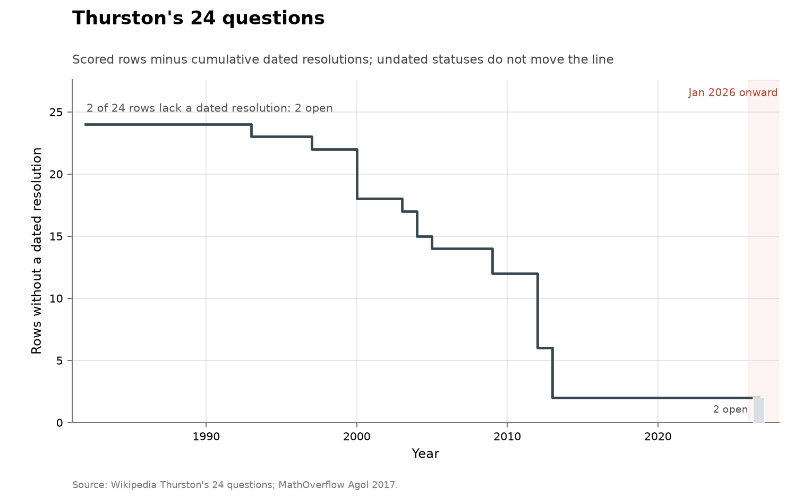

# Thurston's 24 questions

**Domain:** mathematics
**Role:** prestige ledger
**Metric:** dated resolutions per year across 24 scored rows
**Coverage:** list posed 1982; dated resolutions 1993–2013; statuses read 2026-08-14
**Data:** [`thurston-questions.csv`](thurston-questions.csv)
**Upstream:** <https://en.wikipedia.org/wiki/Thurston%27s_24_questions>, cross-checked against Agol's status note at <https://mathoverflow.net/questions/265493/thurstons-24-questions-all-settled>
**Verdict:** no acceleration — 0 resolutions in 2026 and 0 since 2013; 22 dated resolutions over 1993–2013

## Definition

William Thurston closed his 1982 survey of three-dimensional manifolds,
Kleinian groups and hyperbolic geometry with twenty-four questions. This
ledger scores each question as one row, with the status and year read from
the Wikipedia table named in the `source` column, cross-checked against
Agol's public status note. There is no subproblem splitting and no contested
classification: twenty-two rows are `resolved` and two are `open` (question
19, on arithmetic quotients of hyperbolic space, and question 23, on the
rational independence of hyperbolic volumes).

A "discovery" in this series is a row moving to `resolved`, dated by the
year the source account gives. Two dating conventions apply and are stated
in the rows' `notes`: where the source gives a span rather than a year, the
`resolved_year` is the end of the span (rows 4, 5 and 14), and the three
software questions (20–22) are dated at a conventional 2000 for work the
source places in the 1990s and 2000s.

## Facts

- **rows:** 24 scored; 22 resolved with a dated year; 2 open
- **span:** dated resolutions 1993–2013
- **by-year:** 1993: 1 · 1997: 1 · 2000: 4 · 2003: 1 · 2004: 2 · 2005: 1 ·
  2009: 2 · 2012: 6 · 2013: 4
- **ai-attributed:** 0 of 22 dated resolutions
- **open rows:** 19, 23

The collection-wide [cumulative index](../../CUMULATIVE.md) redraws the
ledger as rows remaining:

### 1 — Geometrization conjecture
- **status:** resolved
- **resolved:** 2003
- **resolver:** Perelman
- **notes:** Includes Poincaré as a special case

> "Solved by Grigori Perelman using Ricci flow with surgery."
> — Wikipedia, Thurston's 24 questions, question 1, read 2026-08-14

### 2 — Finite group actions isometric
- **status:** resolved
- **resolved:** 2009
- **resolver:** Meeks–Scott; Dinkelbach–Leeb

> "Solved by Meeks, Scott, Dinkelbach, and Leeb."
> — Wikipedia, Thurston's 24 questions, question 2, read 2026-08-14

### 3 — Orbifold geometrization
- **status:** resolved
- **resolved:** 2005
- **resolver:** Boileau–Leeb–Porti

> "Solved by Boileau, Leeb, and Porti."
> — Wikipedia, Thurston's 24 questions, question 3, read 2026-08-14

### 4 — Hyperbolic Dehn surgery global theory
- **status:** resolved
- **resolved:** 2013
- **resolver:** Agol; Lackenby; others
- **notes:** Wikipedia range 2000–2013; year is completion end

> "Resolved through work of Agol, Lackenby, and others."
> — Wikipedia, Thurston's 24 questions, question 4, read 2026-08-14

### 5 — Kleinian groups geometrically tame
- **status:** resolved
- **resolved:** 1993
- **resolver:** Bonahon; Canary
- **notes:** Wikipedia range 1986–1993; year is completion end

> "Solved through work of Bonahon and Canary."
> — Wikipedia, Thurston's 24 questions, question 5, read 2026-08-14

### 6 — Kleinian groups as limits of geometrically finite
- **status:** resolved
- **resolved:** 2012
- **resolver:** Namazi–Souto; Ohshika

> "Solved by Namazi-Souto and Ohshika"
> — Wikipedia, Thurston's 24 questions, question 6, read 2026-08-14

### 7 — Schottky groups and their limits
- **status:** resolved
- **resolved:** 2012
- **resolver:** Brock–Canary–Minsky

> "Resolved through work of Brock, Canary, and Minsky."
> — Wikipedia, Thurston's 24 questions, question 7, read 2026-08-14

### 8 — Limits of quasi-Fuchsian groups with accidental parabolics
- **status:** resolved
- **resolved:** 2000
- **resolver:** Anderson–Canary

> "Solved by Anderson and Canary."
> — Wikipedia, Thurston's 24 questions, question 8, read 2026-08-14

### 9 — Kleinian groups topologically tame
- **status:** resolved
- **resolved:** 2004
- **resolver:** Agol; Calegari–Gabai
- **notes:** Independent solutions

> "Solved independently by Agol and by Calegari-Gabai."
> — Wikipedia, Thurston's 24 questions, question 9, read 2026-08-14

### 10 — Ahlfors measure-zero problem
- **status:** resolved
- **resolved:** 2004
- **resolver:** Consequence of geometric tameness

> "Solved as consequence of geometric tameness."
> — Wikipedia, Thurston's 24 questions, question 10, read 2026-08-14

### 11 — Ending lamination conjecture
- **status:** resolved
- **resolved:** 2012
- **resolver:** Brock–Canary–Minsky

> "Solved by Brock, Canary, and Minsky."
> — Wikipedia, Thurston's 24 questions, question 11, read 2026-08-14

### 12 — Quasi-isometry type of Kleinian groups
- **status:** resolved
- **resolved:** 2012
- **resolver:** With ending lamination theorem

> "Solved with ending lamination theorem."
> — Wikipedia, Thurston's 24 questions, question 12, read 2026-08-14

### 13 — Limit sets of Hausdorff dimension < 2 geometrically finite
- **status:** resolved
- **resolved:** 1997
- **resolver:** Bishop–Jones

> "Solved by Bishop and Jones."
> — Wikipedia, Thurston's 24 questions, question 13, read 2026-08-14

### 14 — Cannon–Thurston maps
- **status:** resolved
- **resolved:** 2012
- **resolver:** Mahan Mj
- **notes:** Wikipedia range 2009–2012; year is completion end

> "Solved by Mahan Mj."
> — Wikipedia, Thurston's 24 questions, question 14, read 2026-08-14

### 15 — Residual separability of f.g. subgroups in f.g. Kleinian groups
- **status:** resolved
- **resolved:** 2013
- **resolver:** Agol (building on Wise)

> "Solved by Ian Agol, building on work of Wise."
> — Wikipedia, Thurston's 24 questions, question 15, read 2026-08-14

### 16 — Virtually Haken conjecture
- **status:** resolved
- **resolved:** 2012
- **resolver:** Agol

> "Solved by Ian Agol."
> — Wikipedia, Thurston's 24 questions, question 16, read 2026-08-14

### 17 — Finite cover with positive first Betti number
- **status:** resolved
- **resolved:** 2013
- **resolver:** Agol

> "Solved by Ian Agol."
> — Wikipedia, Thurston's 24 questions, question 17, read 2026-08-14

### 18 — Virtually fibered conjecture
- **status:** resolved
- **resolved:** 2013
- **resolver:** Agol

> "Solved by Ian Agol."
> — Wikipedia, Thurston's 24 questions, question 18, read 2026-08-14

### 20 — Software for surface diffeomorphisms / laminations
- **status:** resolved
- **resolved:** 2000
- **resolver:** SnapPea and successors
- **notes:** Software ask; Wikipedia counts as addressed (1990s–2000s)

> "Addressed through development of SnapPea and other software."
> — Wikipedia, Thurston's 24 questions, question 20, read 2026-08-14

### 21 — Software to compute hyperbolic structures
- **status:** resolved
- **resolved:** 2000
- **resolver:** SnapPea and successors
- **notes:** Software ask; Wikipedia counts as addressed (1990s–2000s)

> "Addressed through development of SnapPea and other software."
> — Wikipedia, Thurston's 24 questions, question 21, read 2026-08-14

### 22 — Software tabulating 3-manifold invariants
- **status:** resolved
- **resolved:** 2000
- **resolver:** SnapPea and successors
- **notes:** Software ask; Wikipedia counts as addressed (1990s–2000s)

> "Addressed through development of SnapPea and other software."
> — Wikipedia, Thurston's 24 questions, question 22, read 2026-08-14

### 24 — Hyperbolic structures at given Heegaard genus
- **status:** resolved
- **resolved:** 2009
- **resolver:** Namazi–Souto

> "Solved by Namazi and Souto."
> — Wikipedia, Thurston's 24 questions, question 24, read 2026-08-14

## Method

The rows are transcribed by hand from the consensus ledger named in the
`source` column, cross-checked against Agol's public status note, so there
is no `fetch.py` in this folder. There is no machine-readable upstream: the
status of a question in geometric topology is a judgment in the literature
rather than a feed. The two dating conventions — span ends for rows 4, 5 and
14, a conventional 2000 for the software rows 20–22 — are stated in the
Definition and carried in the rows' `notes`.

[`figure.py`](figure.py) calls the shared `problem_list_chart()` in
[`../../lib/families.py`](../../lib/families.py), which keeps the rows whose
`status` is `resolved` with a non-empty `resolved_year` and counts
resolution events by year from the 1982 `list_year` to the present. No
`ai_problem` argument is passed, because no row carries an AI credit. The
cumulative view is the shared `ledger_remaining_chart()`.
[`check.py`](check.py) recomputes the fact lines and the register entries
from the CSV.

## Limitations

- **effort.** Resolution landmarks are not effort-adjusted discovery rates;
  the 2012–2013 events rest on years of prior work the dates do not show.
- **span-end dates.** Rows 4, 5 and 14 compress a multi-year completion into
  its final year, which shifts those events later.
- **software rows.** Rows 20–22 are counted resolved against software rather
  than theorems, at a conventional year of 2000 for work spanning the 1990s
  and 2000s.
- **little room to move.** With 22 of 24 rows resolved, the series can
  register at most two further events.
- **one secondary ledger.** Every row is transcribed from a consensus
  account, cross-checked against one expert's public status note, rather
  than from independent review of the literature.
- **overlap.** Question 1 contains the Poincaré conjecture, the resolved row
  of the [Millennium](../math-millennium/README.md) ledger and Smale row 2,
  so these series are not independent.

## AI attribution

No row in [`thurston-questions.csv`](thurston-questions.csv) names an AI
system in its `resolver` or `notes` columns; the most recent dated
resolution is 2013. No AI credit appears in the Wikipedia table the rows are
scored from as of the 2026-08-14 read.

## Sources

- Wikipedia, Thurston's 24 questions
  (<https://en.wikipedia.org/wiki/Thurston%27s_24_questions>) — the
  consensus ledger every row is transcribed from; the register quotes its
  per-question status wording as read 2026-08-14. It has no bibliography
  entry here.
- Agol's status note
  (<https://mathoverflow.net/questions/265493/thurstons-24-questions-all-settled>)
  — the expert cross-check named in the `source` column; it has no
  bibliography entry here.
- [@sherry2021fast] — measured improvement rates across algorithm families,
  including clustered gains and multi-decade stationary stretches, with no
  AI involved.
- [@arxiv2026horizonmath] — a 2026 benchmark of over 100 predominantly
  unsolved problems chosen so that "verification is computationally
  efficient and simple"; frontier models score near 0% on it.
- [@deepmind2026nexus] — formal proof search over open problems, reporting 9
  of 353 open Erdős problems resolved.
- Sibling ledgers of the same instrument type:
  [Hilbert](../math-hilbert/README.md), [Landau](../math-landau/README.md),
  [Smale](../math-smale/README.md),
  [Millennium](../math-millennium/README.md) and
  [TOPP](../math-topp/README.md).
- [Erdős](../math-erdos/README.md) — a catalogue ledger over a different
  corpus, counting a different unit (catalogue problems with imputed
  solution years).
