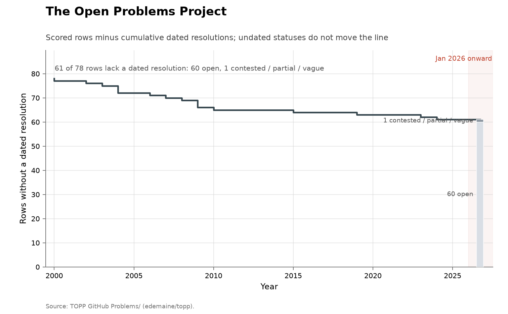

# The Open Problems Project

**Domain:** mathematics
**Role:** prestige ledger
**Metric:** dated resolutions per year across 78 scored rows
**Coverage:** list begun 2001; dated resolutions 2000–2024; statuses read 2026-08-14
**Data:** [`topp-problems.csv`](topp-problems.csv)
**Upstream:** <https://topp.openproblem.net/>, with the rows transcribed from the project's GitHub sources
**Verdict:** no acceleration — 0 resolutions in 2026 and 0 since 2024; 17 dated resolutions over 2000–2024

## Definition

The Open Problems Project is a maintained list of computational-geometry
problems begun in 2001 by Erik Demaine, Joseph Mitchell and Joseph O'Rourke
[@demaine2001topp]. Each entry carries a statement, a bibliography, and a
Status/Conjectures line the maintainers update when something happens.

A "discovery" in this series is an entry whose status line states solved,
settled or closed, dated by the year that line gives; where the maintainers
give a month, only the year is scored. The wording is the maintainers' own
rather than an independent consensus review, and it is qualified in places:
entry 12 is counted on the "Solved (in a certain sense)" quoted in its
register entry. One entry, 27 (hexahedral meshing), is scored `partial` on
its "Partially closed" status line and contributes no event.

## Facts

- **rows:** 78 scored; 17 resolved with a dated year; 60 open; 1 partial
- **span:** dated resolutions 2000–2024
- **by-year:** 2000: 1 · 2002: 1 · 2003: 1 · 2004: 3 · 2006: 1 · 2007: 1 ·
  2008: 1 · 2009: 3 · 2010: 1 · 2015: 1 · 2019: 1 · 2023: 1 · 2024: 1
- **ai-attributed:** 0 of 17 dated resolutions
- **earliest event:** 2000 (entry 18), predating the project's 2001 start

The collection-wide [cumulative index](../../CUMULATIVE.md) redraws the
ledger as rows remaining:

### 1 — Minimum Weight Triangulation
- **status:** resolved
- **resolved:** 2006
- **resolver:**

> "Just solved by Wolfgang Mulzer and Günter Rote, January 2006!"
> — topp.openproblem.net, problem 1, read 2026-08-14 [@demaine2001topp]

### 2 — Voronoi Diagram of Moving Points
- **status:** resolved
- **resolved:** 2015
- **resolver:**

> "Long conjectured to be nearly quadratic. Solved now: [Rub15]."
> — topp.openproblem.net, problem 2, read 2026-08-14 [@demaine2001topp]

### 12 — Dynamic Planar Convex Hull
- **status:** resolved
- **resolved:** 2002
- **resolver:**

> "Solved (in a certain sense) by Gerth Brodal and Riko Jacob in a FOCS 2002
> paper [BJ02]."
> — topp.openproblem.net, problem 12, read 2026-08-14 [@demaine2001topp]

### 14 — Binary Space Partition Size
- **status:** resolved
- **resolved:** 2009
- **resolver:** Csaba Tóth

> "Solved by Csaba Tóth [Tót09], [Tót11]."
> — topp.openproblem.net, problem 14, read 2026-08-14 [@demaine2001topp]

### 18 — Pushing Disks Together
- **status:** resolved
- **resolved:** 2000
- **resolver:**

> "Solved by K. Bezdek and R. Connelly. … (Update as of 3 Aug. 2000.)"
> — topp.openproblem.net, problem 18, read 2026-08-14 [@demaine2001topp]

### 20 — Minimum Stabbing Spanning Tree
- **status:** resolved
- **resolved:** 2003
- **resolver:**

> "Solved, October 2003: the problem is NP-complete."
> — topp.openproblem.net, problem 20, read 2026-08-14 [@demaine2001topp]

### 21 — Shortest Paths among Obstacles in 2D
- **status:** resolved
- **resolved:** 2023
- **resolver:**

> "Solved by Haitao Wang [Wan23] …"
> — topp.openproblem.net, problem 21, read 2026-08-14 [@demaine2001topp]

### 27 — Hexahedral Meshing
- **status:** partial
- **resolved:**
- **resolver:**
- **notes:** partial results; Partially closed, Fall 2006.

> "Partially closed, Fall 2006."
> — topp.openproblem.net, problem 27, read 2026-08-14 [@demaine2001topp]

### 32 — Bar-Magnet Polyhedra
- **status:** resolved
- **resolved:** 2004
- **resolver:** Bojan Mohar

> "Settled by Bojan Mohar, Apr. 2004."
> — topp.openproblem.net, problem 32, read 2026-08-14 [@demaine2001topp]

### 36 — Inplace Convex Hull of a Simple Polygonal Chain
- **status:** resolved
- **resolved:** 2004
- **resolver:**

> "Solved [BC04]."
> — topp.openproblem.net, problem 36, read 2026-08-14 [@demaine2001topp]

### 47 — Hinged Dissections
- **status:** resolved
- **resolved:** 2008
- **resolver:** Abbott et al.

> "Now settled: Hinged dissections exist [AAC+08]."
> — topp.openproblem.net, problem 47, read 2026-08-14 [@demaine2001topp]

### 48 — Bounded-Degree Minimum Euclidean Spanning Tree
- **status:** resolved
- **resolved:** 2009
- **resolver:**

> "Solved: Proved NP-hard in [FH09]."
> — topp.openproblem.net, problem 48, read 2026-08-14 [@demaine2001topp]

### 50 — Pointed Spanning Trees in Triangulations
- **status:** resolved
- **resolved:** 2004
- **resolver:** Aichholzer et al.

> "Settled negatively, January 2004."
> — topp.openproblem.net, problem 50, read 2026-08-14 [@demaine2001topp]

### 53 — Minimum-Turn Cycle Cover in Planar Grid Graphs
- **status:** resolved
- **resolved:** 2019
- **resolver:**

> "Solved: proved NP-hard by Fekete and Krupke [FK19]"
> — topp.openproblem.net, problem 53, read 2026-08-14 [@demaine2001topp]

### 56 — Packing Unit Squares in a Simple Polygon
- **status:** resolved
- **resolved:** 2024
- **resolver:**

> "Solved: proved NP-hard by Abrahamsen and Stade [AS24]."
> — topp.openproblem.net, problem 56, read 2026-08-14 [@demaine2001topp]

### 65 — Magic Configurations
- **status:** resolved
- **resolved:** 2007
- **resolver:** Abrego et al.

> "Settled positively, 2007: [ABK+08]"
> — topp.openproblem.net, problem 65, read 2026-08-14 [@demaine2001topp]

### 69 — Isoceles Planar Graph Drawing
- **status:** resolved
- **resolved:** 2010
- **resolver:** Frati

> "Settled negatively in 2010: [Fra10]."
> — topp.openproblem.net, problem 69, read 2026-08-14 [@demaine2001topp]

### 71 — Stretch-Factor for Points in Convex Position
- **status:** resolved
- **resolved:** 2009
- **resolver:**
- **notes:** Now closed: false; counterexample appeared in the 2009 CCCG
  proceedings.

> "Now closed: false. [This entry awaiting updating.]"
> — topp.openproblem.net, problem 71, read 2026-08-14 [@demaine2001topp]

## Method

The 78 rows were transcribed by hand from the project's GitHub problem
directory (edemaine/topp), and the `notes` column keeps the maintainers'
own status wording; the site publishes no machine-readable index, so there
is no `fetch.py`. All 78 status lines were re-read at topp.openproblem.net
on 2026-08-14 and match the ledger's statuses. One wording has moved since
transcription: entry 71's status line now reads the shorter form quoted in
its register entry, while the `notes` column keeps the transcribed
CCCG-counterexample wording; the status and year are unchanged.

[`figure.py`](figure.py) calls the shared `problem_list_chart()` in
[`../../lib/families.py`](../../lib/families.py), which keeps the rows whose
`status` is `resolved` with a non-empty `resolved_year` and draws annual
event bars from the earliest dated event to the present; the corner note
states how many of the 78 rows have dated resolutions. No `ai_problem`
argument is passed, because no entry credits an AI system. The cumulative
view is the shared `ledger_remaining_chart()`. [`check.py`](check.py)
recomputes the fact lines and the register entries from the CSV.

## Limitations

- **no entry-addition dates.** The 78 entries accumulated after 2001 and the
  ledger does not record when each was added, so this is a dated-resolution
  ledger and not a fixed-cohort solve rate.
- **one row predates the list.** Entry 18's 2000 resolution sits a year
  before the project's 2001 start, so the event timeline begins before the
  list itself.
- **maintainer language.** Statuses are the maintainers' own wording, not
  independent review, and some are qualified — entry 12 is counted on
  "Solved (in a certain sense)".
- **unmaintained entries look open.** An entry whose status line was never
  updated is indistinguishable here from an unsolved problem, so the 60-row
  open count is an upper bound on the genuinely open entries.
- **empty resolver fields.** Many status lines name a citation rather than a
  person, so several `resolver` fields are empty and the series cannot be
  split by finder.
- **effort.** Resolution landmarks are not effort-adjusted discovery rates;
  nothing records how much search each fall took.

## AI attribution

No status line among the 78 entries names an AI system or agent, as of the
2026-08-14 read of topp.openproblem.net, and no `resolver` or `notes` field
in [`topp-problems.csv`](topp-problems.csv) carries an AI credit. The two
most recent dated resolutions are human papers: Wang (2023, entry 21) and
Abrahamsen–Stade (2024, entry 56).

## Sources

- [@demaine2001topp] — the project itself: entries, bibliographies and
  status lines; the register quotes its status wording as read 2026-08-14.
- [@deepmind2026nexus] — formal proof search over open problems, reporting 9
  of 353 open Erdős problems resolved.
- [@arxiv2026horizonmath] — a 2026 benchmark of over 100 predominantly
  unsolved problems chosen so that "verification is computationally
  efficient and simple"; frontier models score near 0% on it.
- [@sherry2021fast] — measured improvement rates across algorithm families,
  including multi-decade stationary stretches, with no AI involved.
- Sibling ledgers of the same instrument type:
  [Hilbert](../math-hilbert/README.md), [Landau](../math-landau/README.md),
  [Thurston](../math-thurston/README.md), [Smale](../math-smale/README.md)
  and [Millennium](../math-millennium/README.md).
- [Erdős](../math-erdos/README.md) — a catalogue ledger over a different
  corpus, counting a different unit (catalogue problems with imputed
  solution years).
