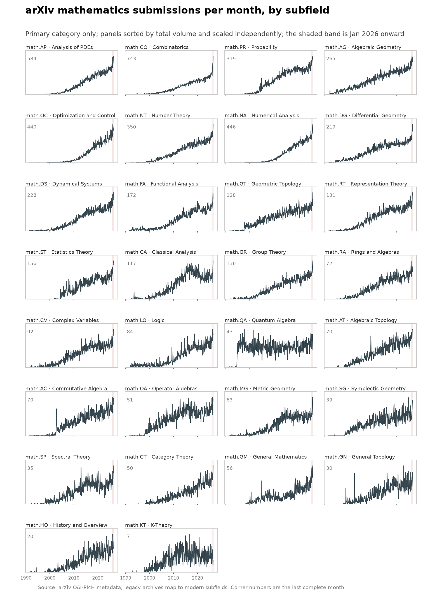
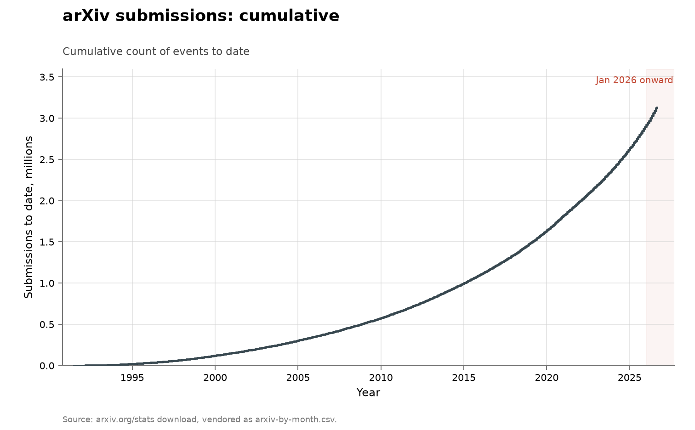

# arXiv submissions

- **Domain:** outside the three domains
- **Role:** contrast case: volume
- **Metric:** research output; preprints submitted to arXiv per month
- **Coverage:** 1991-07 to 2026-08, monthly, the last month partial at
the 2026-08-10 fetch
- **Data:** [`arxiv-by-month.csv`](arxiv-by-month.csv); per-category [`arxiv-categories-by-month.csv`](arxiv-categories-by-month.csv)
- **Upstream:** <https://arxiv.org/stats/monthly_submissions>, with per-category counts from <https://oaipmh.arxiv.org/oai>
- **Verdict:** accelerating — a 28,450 submissions/month mean over 2026-01 to 2026-07 against monthly means of 23,707 in 2025 and 20,336 in 2024

## Definition

arXiv is a preprint repository for physics, mathematics, computer science
and adjacent fields. It publishes its own count of submissions per month,
from the archive's opening in July 1991 onward, and its public metadata
records each paper's submission history and category labels.

An event in this series is one preprint submitted, counted in its
submission month; the total series is arXiv's published count. The
per-category file counts each paper once, in the month of its first
version's submission date, under its primary (first-listed) category;
categories are grouped to arXiv's own top level, and `math-ph` sits with
physics because arXiv puts it there. The last row of the monthly file is
the month in progress at fetch time. Neither file carries an authorship
field.

## Facts

- **span:** from 17,271 submissions in November 2022 (the month ChatGPT
  was released) to 29,687 in July 2026, the last complete month; 72% growth
- **2026 rate:** a 28,450 submissions/month mean over 2026-01 to 2026-07
  against monthly means of 23,707 in 2025 and 20,336 in 2024
- **computer science:** from 5,967 monthly submissions in November 2022 to
  12,409 in July 2026, and above physics every month since August 2023
- **physics and mathematics:** physics rose 41% from November 2022 to July
  2026; mathematics 66%, from 3,143 to 5,216
- **combinatorics:** math.CO reached 743 submissions in July 2026 against a
  2024 monthly average of 342
- **mathematics against 2024:** mathematics ran at 1.6 times its 2024
  monthly average in July 2026

The collection-wide [cumulative index](../../CUMULATIVE.md) redraws this
series as cumulative submissions to date:

## Method

[`fetch.py`](fetch.py) downloads arXiv's own monthly-submissions file and
keeps two columns. The raw download carries a `historical_delta` column,
nonzero only for corrections to 1991–1997, which is dropped.

The per-category file behind the two field charts is built by
[`fetch_categories.py`](fetch_categories.py), which is run by hand rather
than by `make fetch`. It counts each paper once, in the month of its first
version's submission date and under its primary (first-listed) category,
and it has two interchangeable inputs: arXiv's official metadata snapshot —
the ~5 GB `arxiv-metadata-oai-snapshot.json` distributed via Kaggle, which
needs a login to download and is kept beside this document but deliberately
not committed — and a no-credentials OAI-PMH harvest of the same metadata,
which walks about 2,400 resumption pages at the pace arXiv meters out and
takes the better part of a day. Both produce the same aggregation; papers
first submitted after the repository's snapshot date are dropped. A few
dozen migrated records carry v1 dates before arXiv opened in July 1991, and
the charts start at the launch month.

[`figure.py`](figure.py) draws the total series through
[`lib/families.py`](../../lib/families.py)'s shared volume shape: years on
the x-axis, the count on the y-axis, January 2026 onward shaded, an open
marker on a part period. The three volume folders draw through that one
shape. The series is drawn in slate rather than the blue used elsewhere for
human or uncredited finders because it has no authorship field. The field
grouping and the legacy-archive mapping — `alg-geom`, `q-alg`, `dg-ga` and
`funct-an` to their modern names, so the older panels keep their
early-1990s history — live at the top of `figure.py`, and an archive the
mapping does not know fails the build rather than landing in a silent
bucket. The subfield grid draws every `math.*` primary category, one panel
each, sorted by total volume and scaled independently.
[`check.py`](check.py) recomputes the fact lines from both CSVs.

## Limitations

- **no authorship field.** The files record months, categories and counts
  only; whether a human or a model wrote a paper is not recorded.
- **volume, not discovery.** The series counts artifacts submitted; the
  domain folders count results, and the two need not move together.
- **no denominator of effort.** Nothing here measures how many researchers
  were working, so output per unit of input cannot be separated from more
  input.
- **composition is invisible.** A rise is consistent with more short
  papers, more salami-slicing, or more of the same kind of work.
- **field mix is not held fixed.** arXiv's growth over 35 years includes
  whole disciplines joining the platform.
- **primary categories undercount interdisciplinary work.** Each paper
  counts once, under its first-listed category; cross-lists are ignored,
  and a shift in cross-listing habits moves no line here.
- **category labels are chosen.** Labels are the authors' and moderators'
  choices, and arXiv occasionally reclassifies old papers, which moves
  history on a refetch.

## AI attribution

The dataset carries no authorship field; no AI share can be computed from
it. [`arxiv-by-month.csv`](arxiv-by-month.csv) holds a month and a count per
row, and [`arxiv-categories-by-month.csv`](arxiv-categories-by-month.csv)
holds a month, a category and a count; no AI credit appears in either
vendored file or in arXiv's published monthly-submissions series as of the
2026-08 fetch.

## Sources

- <https://arxiv.org/stats/monthly_submissions> — the monthly totals in
  [`arxiv-by-month.csv`](arxiv-by-month.csv).
- <https://oaipmh.arxiv.org/oai> — the no-credentials harvest behind
  [`arxiv-categories-by-month.csv`](arxiv-categories-by-month.csv).
- [@nist2026cvegrowth] — NIST's report of 263% growth in CVE submissions
  between 2020 and 2025, with its enrichment of nearly 42,000 CVEs in 2025
  failing to keep pace; a submission count in the vulnerabilities domain,
  the same unit type as this series.
- [output-crossref](../output-crossref/README.md) and
  [output-github-pushes](../output-github-pushes/README.md) — the other two
  volume series, drawn through the same shared shape; they count DOI
  registrations and git pushes where this folder counts preprint
  submissions.
