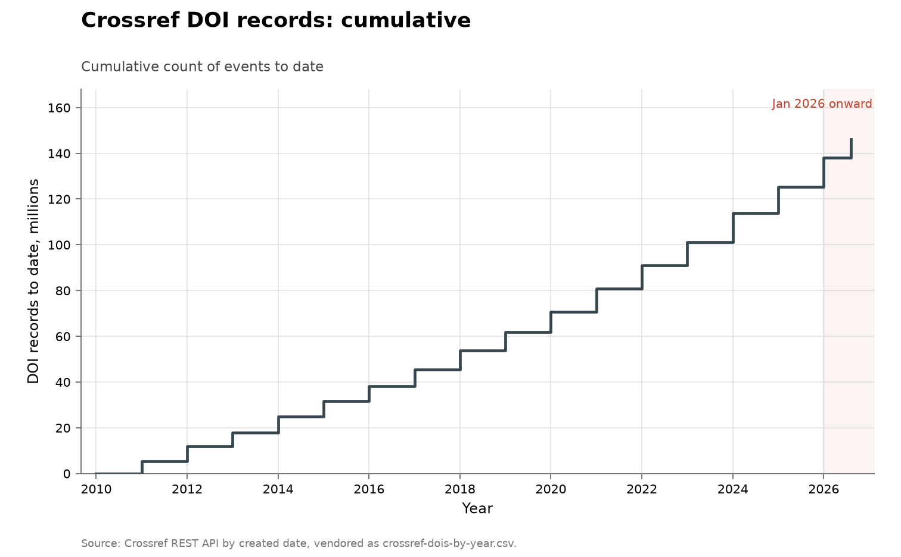

# DOI records deposited with Crossref

**Domain:** outside the three domains
**Metric:** formal publishing volume; DOI records deposited with Crossref per year, by created date
**Coverage:** 2010 to 2026, annual, the last year partial
**Data:** [`crossref-dois-by-year.csv`](crossref-dois-by-year.csv)
**Upstream:** <https://api.crossref.org/works>
**Verdict:** no acceleration

## The problem

This is the control on the other output-volume series. The rest of them rise,
and a rising curve through the agent era invites the reading that the agent era
produced it. Crossref is the series that shows what such a curve is worth on its
own: it counts registrations of formal publications, the most institutionally
conservative output anywhere in the collection, and it was climbing steeply long
before there was an agent era to explain it.

Like the rest of the volume folders it is a contrast case rather than a
discovery series. A deposited DOI is a record that something was published, not
a result, and nothing here says whether the work behind it was any good.

## What the chart shows

Deposits rose from 5.28 million records in 2010 to 12.80 million in 2025, up
143% over fifteen years, with no clean bend anywhere along the way. The rise is
not smooth: six of those fifteen year-on-year changes are falls, the most recent
of them in 2024, when deposits dropped to 11.31 million from 12.69 million in
2023 before recovering to a new high the year after.

That 2024 dip is the most instructive part of the series, because it cannot be
read as a fall in publishing. The count is by deposit date, so which year a
record lands in is a fact about when a publisher registered it.

The 2026 bar is drawn outlined and labelled a part year: the last row is the
year in progress at fetch time, year-to-date through 10 August 2026, and read as a
full year it would look like a collapse. Every figure in the chart's annotation
is computed from the CSV when the chart is drawn, so the annotation cannot
survive a refetch that changes the numbers.

The collection-wide [cumulative index](../../CUMULATIVE.md) redraws this series
as cumulative DOI records to date:

## How the chart was built

[`fetch.py`](fetch.py) makes one Crossref REST API request per year from 2010,
filtered to that year's created-date range and asking for `rows=0` so the
response is a count rather than the records themselves. The row for the current
year is marked year-to-date with the date it was fetched. The requests are
sequential with a sleep between them, which is what keeps a rebuild polite.

[`figure.py`](figure.py) draws the series through
[`lib/families.py`](../../lib/families.py)'s shared volume shape: years on the
x-axis, the count on the y-axis, 2026 shaded, the part year outlined rather than
filled. The three volume folders use that one shape so a difference in appearance
between any two of them is a difference in the data. It is drawn in slate rather
than the blue the other charts use for human or uncredited finders, because this
series has no authorship field at all.

## What it cannot support

- **Deposits are not publications.** Backfile deposits of old work land in
  whatever year they were registered, which is what makes the 2024 dip
  uninterpretable as a change in publishing.
- **No authorship labels.** The series does not record whether a human or a
  model wrote the work behind a record, so no AI share can be read off it.
- **Volume is not discovery.** These count artifacts registered. The domain
  folders count results, and the two need not move together.
- **Membership is not held fixed.** A deposit exists because a publisher who
  registers DOIs registered one, so the series cannot separate more work being
  published from more of publishing being registered with Crossref.
- **No denominator of effort.** Nothing here measures how many researchers were
  working, so output per unit of input cannot be separated from more input.

## LLM contributions

Nothing in this series is attributable to a model, by construction: it is a
count of registrations with no authorship field. The series is here for the
opposite reason to the others, and the absence works in its favour — the shape
that matters is the one predating any model at all.

The most that can be said about the agent era in this chart is that nothing
distinctive happens in it. The 2023 high, the 2024 fall and the 2025 recovery
are the same size as movements the series was already making in the 2010s.

## Related literature

The comparison this folder exists for is with its three siblings, which is why
[arXiv](../output-arxiv/README.md) names it as its own control.
[GitHub pushes](../output-github-pushes/README.md) bend upward; this one does
not, over a longer window than either of them. Set the whole group against
[curl](../cyber-curl/README.md), where a fixed codebase yields a step change in
disclosures, and against the mathematics folders such as
[the Erdős problems](../math-erdos/README.md), where the records barely move.
