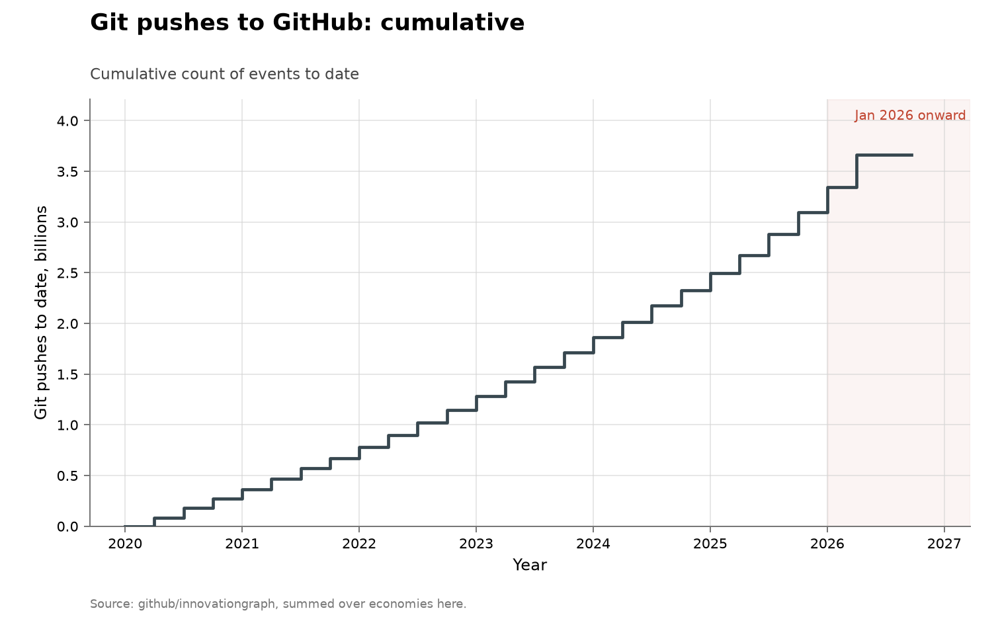

# Git pushes to GitHub

**Domain:** outside the three domains
**Role:** contrast case: volume
**Metric:** code output; git pushes to GitHub per quarter, summed over economies
**Coverage:** 2020-Q1 to 2026-Q1, quarterly
**Data:** [`github-innovationgraph-global.csv`](github-innovationgraph-global.csv)
**Upstream:** <https://github.com/github/innovationgraph>
**Verdict:** accelerating — 319.8 million pushes in 2026-Q1 against 246.8 million in 2025-Q4 and a 2025 quarterly mean of 212.2 million


## Definition

The GitHub Innovation Graph is GitHub's own quarterly data release: one file
per metric, one row per economy and quarter, covering git pushes,
repositories and developers. Economies below its 100-developer reporting
threshold are absent from the files, and the EU row is an aggregate that
repeats its member states.

An event in this series is one git push — an upload of one or more commits
— counted in its quarter. The global total is assembled here by summing the
per-economy files over economies with the EU aggregate row excluded, so its
pushes are not counted twice. The vendored CSV carries all three metrics
and a note recording the exclusion; the chart plots pushes. The dataset
carries no authorship field.

## Facts

- **chatgpt quarter:** 135.4 million in 2022-Q4 (the quarter ChatGPT was
  released)
- **recent quarters:** from 167.8 million in 2024-Q4 to 319.8 million in
  2026-Q1, 1.9 times in five quarters
- **growth split:** 2020-Q1 to 2022-Q4 adds 68%; 2022-Q4 to 2026-Q1 adds
  136%
- **2025 mean:** a 2025 quarterly mean of 212.2 million pushes

The collection-wide [cumulative index](../../CUMULATIVE.md) redraws this
series as cumulative git pushes to date:



## Method

[`fetch.py`](fetch.py) downloads the three per-economy Innovation Graph
files — pushes, repositories and developers — and sums each over economies
for every quarter. The EU row is an aggregate of its member states, about a
fifth of the total, so including it would count those pushes twice; it is
dropped, and the note column on every vendored row records the exclusion.
Upstream renamed the economy column from `iso2` to `iso2_code` in 2026.

[`check.py`](check.py) asserts that every vendored row records the
exclusion, that the quarters are contiguous, that the cumulative repository
and developer columns never fall, and that the README's printed figures
match the CSV. Run with `--upstream` it also re-sums the published files
and fails if any vendored quarter is not exactly the EU-free sum:

```sh
python3 problems/output-github-pushes/check.py --upstream
```

[`figure.py`](figure.py) draws the series through
[`lib/families.py`](../../lib/families.py)'s shared volume shape: years on
the x-axis, the count on the y-axis, January 2026 onward shaded. A marker
is drawn on each quarter, since the series is twenty-five points rather
than the hundreds the monthly series carry. The three volume folders draw
through that one shape. The series is drawn in slate rather than the blue
used elsewhere for human or uncredited finders because it has no authorship
field.

## Limitations

- **a push is an upload event.** An agent pushing, a CI job pushing, and a
  person committing more often are the same row, and nothing in the file
  separates them.
- **the global total is assembled here.** GitHub publishes per-economy
  files rather than a world total; economies below the 100-developer
  threshold are absent, so the sum slightly undercounts, and the EU
  exclusion is a choice made in [`fetch.py`](fetch.py) rather than
  something upstream marks.
- **no authorship field.** The file records counts per quarter only;
  whether a human or a model produced the commits is not recorded.
- **volume, not discovery.** The series counts artifacts produced; the
  domain folders count results, and the two need not move together.
- **the other columns are not a denominator of effort.** The repository and
  developer counts rise in every quarter here, including quarters in which
  pushes fell, so they behave like cumulative platform totals rather than
  counts of who was active.
- **composition is invisible.** A rise is consistent with smaller and more
  frequent commits, with more automation, or with more code being written.

## AI attribution

The dataset carries no authorship field; no AI share can be computed from
it. [`github-innovationgraph-global.csv`](github-innovationgraph-global.csv)
holds per-quarter totals of pushes, repositories and developers; no AI
credit appears in the Innovation Graph files as of the vendored 2026-Q1
release.

## Sources

- <https://github.com/github/innovationgraph> — the per-economy files the
  totals are summed from.
- [@hackerone2025autonomy] — HackerOne's platform self-report of a 210%
  rise in AI-attributed vulnerability reports; a count of reports submitted
  to one platform, the same unit type as this series.
- [output-arxiv](../output-arxiv/README.md) and
  [output-crossref](../output-crossref/README.md) — the other two volume
  series, drawn through the same shared shape; they count preprint
  submissions and DOI registrations where this folder counts push events.
