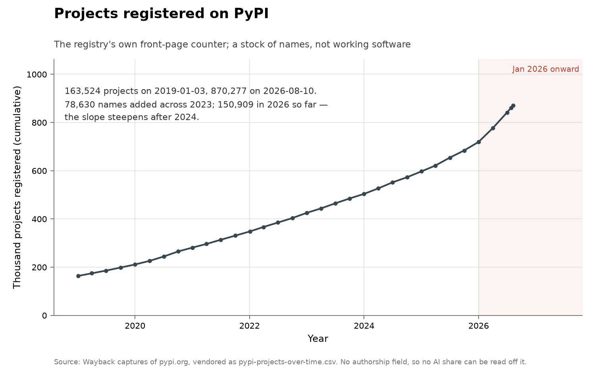

# Projects registered on PyPI

**Domain:** outside the three domains
**Metric:** code output; total projects registered on the Python Package Index, a stock rather than a flow
**Coverage:** 2019-01 to 2026-08, roughly quarterly readings of the front-page counter
**Data:** [`pypi-projects-over-time.csv`](pypi-projects-over-time.csv)
**Upstream:** <https://pypi.org/>
**Verdict:** accelerating — on volume, which is not discovery

## The problem

Does the volume of code output bend upward in the agent era? PyPI is the
cheapest published thing a Python project can become: registering a name costs
an upload, and the registry states its own total on its front page. If writing
software got faster, this is one of the places it should show.

Like the rest of the volume folders it is a contrast case, not a discovery
series, and it is the weakest artifact counted anywhere in the collection. A
registered project is a name in a registry. It is not working software, not
software anybody installs, and not a result.

It is also the only series here that is a stock rather than a flow. The counter
is a cumulative total, so it cannot fall and its level carries no information
about any particular year; only the slope does.

## What the chart shows

The counter stood at 163,524 projects on 3 January 2019 and 870,277 on 10 August
2026. The slope steepens after 2024: 78,630 names were added across 2023 and
150,909 in 2026 through that date, which is more than any complete
year in the series, 2025 included at 122,378.

Each marker is one dated reading rather than an interpolated month, so the
sampling is visible in the chart: the points are roughly quarterly and unevenly
spaced, because they are whatever dates the archive happened to keep. The
figures in the annotation are computed from the CSV when the chart is drawn, so
they cannot go stale if the readings are extended.

The final point is a live reading rather than an archived capture. It is drawn
like the others because it is not a partial period: a stock reading is complete
on the day it is taken.

## How the chart was built

There is no `fetch.py` in this folder and nothing here can be refetched. PyPI
publishes a current total only, so the history was collected by hand, from 31
dated Wayback captures of the front-page counter plus live readings taken on
28 July and 10 August 2026. Each row of the CSV carries the capture URL it was transcribed
from, so any reading can be checked against the page it came from. Extending the
series means finding another capture and adding a row by hand.

[`figure.py`](figure.py) draws the series through
[`lib/families.py`](../../lib/families.py)'s shared volume shape: years on the
x-axis, the count on the y-axis, January 2026 onward shaded, a marker on each
reading. The five volume folders use that one shape so a difference in
appearance between any two of them is a difference in the data. It is drawn in
slate rather than the blue the other charts use for human or uncredited finders,
because this series has no authorship field at all.

## What it cannot support

- **A registered project is a name**, not working or used software, and registry
  spam and name-squatting waves are not corrected for.
- **A stock hides its own composition.** Every reading contains everything
  registered before it, so the chart cannot say whether a steepening slope is
  more people publishing, the same people publishing more, or automated
  registration.
- **No authorship labels.** Nothing records whether a human or a model produced
  the package, so no AI share can be read off the series.
- **Volume is not discovery.** These count artifacts produced. The domain
  folders count results, and the two need not move together.
- **The sampling is irregular.** The readings are what the archive kept, at the
  capture dates rather than at period ends, so a rate computed between two
  adjacent points depends on where those points fall.
- **No denominator of effort.** Nothing here measures how many people were
  working, so output per unit of input cannot be separated from more input.

## LLM contributions

Nothing in this series is attributable to a model, by construction, and that is
worth stating plainly rather than leaving as an omission: it is a count of
registered names with no authorship field, so the steepening is consistent with
models writing the packages, with more people publishing more, or with both.

The timing is suggestive and no more. The slope picks up through 2025 and 2026,
which is the period in which coding assistants became ordinary, but a registry
whose entry cost is one upload is also the easiest of these series to inflate,
and spam and name-squatting waves are not corrected for anywhere in the data.

## Related literature

The comparison this folder exists for is with its four siblings.
[GitHub pushes](../output-github-pushes/README.md) is the other code-output
series and bends more sharply; [arXiv](../output-arxiv/README.md) is the
research-output analogue; [Stack Overflow](../output-stackoverflow/README.md)
runs the other way. [Crossref](../output-crossref/README.md) is the control on
all of them — formal publishing rose steeply through the same period with no
clean bend, so a rising volume curve is not by itself evidence of anything new.
Set the group against [curl](../cyber-curl/README.md), where a fixed codebase
yields a step change in disclosures, and against
[the Erdős problems](../math-erdos/README.md), where the records barely move.
